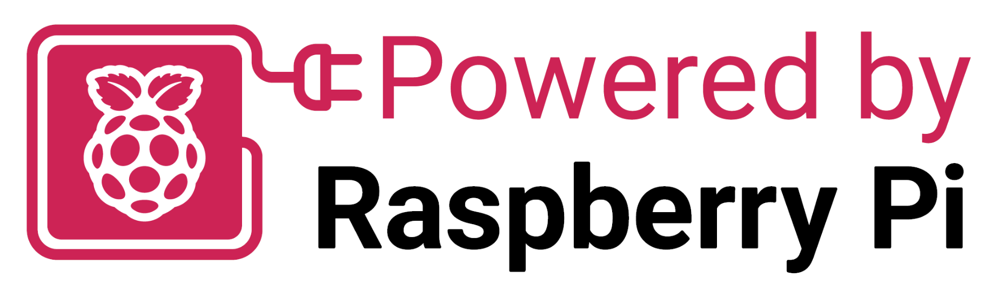

# Purdue Proton

<!-- !!! warning
    **This page is a work in progress.** -->

Purdue Proton is an educational RP2350B devboard with a detachable debug probe intended for use in embedded systems labs. 

## Features

- RP2350B microcontroller
    - 520 kB SRAM
    - QFN-80 package
- 16 MB quad SPI flash memory
- Debugger based on Raspberry Pi Debug Probe design
- USB-C connector on Proton board and debugger with ESD protection diodes
- External 12 MHz crystal produces 150 MHz with onboard PLL
- External 5V, 3.3V, and GND pins
- Power indicator LEDs
    - 5V is red
    - 3V3 is green
- 48 GPIO pins, external SWCLK/SWD pins
- Push buttons for USB boot and reset
- Two hardware-debounced push buttons connected to GP21 and GP26
- Four user LEDs connected to GP22 (red), GP23 (yellow), GP24 (green), GP25 (blue)

## Buy a Proton

*Purchase links will be made available once boards have been finalized.*

If you are not at Purdue, but would like to register your interest in purchasing one or more boards, please fill out [this form](https://forms.gle/XMFKNietPEQpbKfP8).

If you are at Purdue, please contact the [lab-coordinator-in-charge for ECE 36200](mailto:niraj@purdue.edu) to obtain a board.

## Schematics, Pinouts, and Datasheets

You can find the schematics, pinouts, and datasheets for the Purdue Proton [here](datasheets.md).

## Lab Experiments

Purdue Proton is used by embedded systems labs in ECE 36200 at Purdue University.  Their labs can be found [here](https://github.com/ece362-purdue/proton-labs).  The labs cover embedded programming with the Pico SDK in C utilizing the [PlatformIO IDE](https://platformio.org/platformio-ide).

## Powered by Raspberry Pi

Purdue Proton is part of the Powered by Pi scheme.  

Our certificate can be found [here](assets/purdue_university_proton_cert.pdf).
