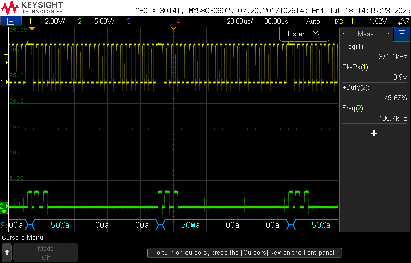

# I<sup>2</sup>C (Inter-Integrated Circuit) Lab

### Table of Contents
<br>

| Step | Description                                           |
|------|-------------------------------------------------------|
| 0.1  | Set up your environment                               |
| 1    | Read the datasheet                                    |
| 2    | Implement the I<sup>2</sup>C communication            |
| 3    | Implement an I<sup>2</sup>C command shell             |
<br>

> [!NOTE]
> This lab is not graded, but you may want to complete it to learn about I2C for your project if you need it.

## Instructional Objectives
- To understand the Inter-Integrated (I<sup>2</sup>C) Circuit packet format.
- To initialize and configure an Inter-Integrated (I<sup>2</sup>C) Circuit peripheral.
- To use the I<sup>2</sup>C peripheral to communicate with a device.

## Inter-Integrated Circuit (I<sup>2</sup>C)

> [!NOTE]
> The terms master and slave are described here so that you know what they mean in case you come across them in datasheets, including your RP2350 one.  They are **outdated** terms, and alternative terms for these signals now are as follows:
> 
> Primary/Root/Server/Local/Transmitter for master;  
> Secondary/Branch/Client/Remote/Receiver for slave;  
>
> We use both terms since the RP2350 datasheets still use the former, and we don't want you to be confused when you see it.

The I<sup>2</sup>C communication protocol is generally used for creating large buses that include more than a singular **primary** (master) device. All connected devices communicate on the same set of **two** wires, unlike SPI with 3:

- **Serial Clock Line (SCL)**: This is the line that carries the clock signal that synchronizes the data transfer between the primary and secondary devices.  The primary device generates the clock signal, and the secondary device synchronizes with it.
- **Serial Data Line (SDA)**: This is the line that carries the data between the devices. It is bidirectional, so it can be used to send and receive data.  The primary device requests data by sending the **address** of the secondary device being contacted, and the secondary device sends data back to the primary device in response to the primary device's request.

The concept of the address allows an I<sup>2</sup>C primary device to communicate with multiple secondary devices on the same bus.  The address is a unique identifier for each secondary device, and the primary device uses this address to select the secondary device it wants to communicate with.  The address is typically 7 bits long, but can be extended to 10 bits for more complex systems.  Typically, you'll find the address (and its length) in the datasheet for the device you're trying to communicate with.

Here is an example packet format for I<sup>2</sup>C as sent from the primary device to the secondary device:


The SDA line is unique in that either the primary or secondary device can **drive it high or low**.  This is because the SDA line is **open-drain**, meaning that it is pulled high by a resistor, and driven low by the device.  This allows multiple devices to share the same bus without causing a short circuit.  The SCL line is driven by the primary device, and the secondary device synchronizes with it.

The I<sup>2</sup>C protocol is also a **multi-master** protocol, meaning that any of the devices sharing the same I<sup>2</sup>C bus can be a primary device. The primary device is the one that initiates the communication, and the secondary device is the one that responds to the primary. The primary device is responsible for generating the clock signal, and the slave device is responsible for synchronizing with the clock signal.

## Step 0.1: Set up your environment

Make sure to clone the code repository from GitHub Classroom.  Keep in mind to add, commit and push any changes you make so that your work is accessible from a lab machine.  

Similar to previous labs, make sure to open your repository in VScode by clicking File > Open Folder (or Ctrl-K + Ctrl-O), and then selecting the newly cloned repository.  

**Unlike previous labs**, no autotest project is provided.  Instead, you should create your own command shell that you can use to invoke "read/write" functions to perform I2C transactions for you from a command line over UART.  If you have not yet seen it, instructions to write and implement a command shell are in the [UART lab](https://github.com/ece362-purdue/proton-labs/tree/main/lab7-uart/README.md).  In this lab, you are expected to have a working command shell to which you can add commands for I<sup>2</sup>C transactions.

## Step 0.2: Wiring your circuit

In your kit, you will find the 24AA32AF I2C EEPROM - it is a very small chip with 8 pins, likely on the black thermocol piece holding all your other chips.  This chip is  32Kbit (4KB) EEPROM that communicates over I<sup>2</sup>C, and can be used to store persistent data for your microcontroller that can survive your board being power-cycled or reset.  You will use this chip to read and write data to and from it using the I<sup>2</sup>C protocol - a common use case for projects that want to save and read persistent data.

At this point, your breadboard may be quite crowded.  We suggest placing the EEPROM to the left of your Proton's Debug Probe.  Another option from previous semesters, if you aren't using the keypad too much, is to place it **under** the keypad - the chip is small enough that it can actually fit under there.  

[Read the datasheet](https://ece362-purdue.github.io/proton-labs/assets/kit-components/24AA32AF.pdf) for the EEPROM, and wire up the chip to your Proton board as follows:

- Connect the A2, A1, A0 pins such that the I<sup>2</sup>C address of the EEPROM is 0b111.  A2 is the most significant bit.
- Connect the VCC pin to 3.3V.
- Connect the GND pin to GND.
- Connect the SDA pin to the I2C1 SDA pin on your Proton board.
- Connect the SCL pin to the I2C1 SCL pin on your Proton board.

For each of the SDA and SCL pins, attach a 2 kΩ pull-up resistor to 3.3V, which is unique to the speed we will be using.  (Why? See the datasheet for more info.)


## Step 1: Read the datasheet(s)

At this point, we expect you to read the datasheet for both the 24AA32AF EEPROM (linked above), the RP2350 microcontroller's implementation of [I2C](https://datasheets.raspberrypi.com/rp2350/rp2350-datasheet.pdf#section_i2c), and the [SDK functions](https://datasheets.raspberrypi.com/pico/raspberry-pi-pico-c-sdk.pdf#group_hardware_i2c) you can use.  You'll want to figure out:

- How to initialize the pins to be used for I<sup>2</sup>C.
- How to initialize the I<sup>2</sup>C peripheral.
- How to configure the I<sup>2</sup>C peripheral to communicate using 7-bit addressing mode.
- How to read and write data either by writing to the RP2350 I2C peripheral registers (not recommended for I2C specifically due to the complexity), or by using the SDK functions provided for I<sup>2</sup>C communication.
- How to identify the differences between a read/write operation when looking at the I<sup>2</sup>C packet format, and how to adapt the information from the 24AA32F datasheet to produce the same packet format.

For debugging, you'll want to learn how to use your MSO-X series [oscilloscope](docs/MSO_User_Manual.pdf) to verify that the I<sup>2</sup>C communication is working correctly by pressing the Serial button on your scope and configuring it for I2C mode.  Our recommendation is to loop your I2C communication infinitely so that you can see the communication happening on the oscilloscope.  You can also use an AD2/3 at home.


## Step 2: Implement the I<sup>2</sup>C communication

Implement the following functions as follows:

### 2.1 `init_i2c()`

This function should initialize the GPIO pins you will use for I<sup>2</sup>C communication.  Use the I2C_SDA and I2C_SCL defines at the top of the file so you don't have to remember what pins you had to use, but make sure that you are using pins that belong to the same I<sup>2</sup>C peripheral (there are two on the RP2350, I2C0 and I2C1).

Then, initialize the associated I<sup>2</sup>C peripheral using the SDK functions.  Set the clock speed to the one associated with Fast Mode.  You can use Standard Mode if you wish since the EEPROM supports it, but the EEPROM may need 10k pullups for that.  It may be that the pull-ups don't have to change between modes, but we recommend using 2kΩ pull-ups and Fast Mode.

> [!TIP]
> When you are supporting multiple I<sup>2</sup>C devices (e.g. certain joystick devices from Adafruit or the GPIO expander in your kit), you should ensure that all devices will support the same clock speed.  Standard Mode will work for every I2C device, but if you specify Fast Mode, ensure that all devices on the bus support it.  

You do not need to configure pull-ups within the code because you already added them to the EEPROM circuit.  You may see that the SDK examples do this, but in our opinion, it's best to have them externally for the sake of visibility, and so you can easily change the values if you determine you need a different one.

### 2.2 `eeprom_write()`

This function should take a 16-bit address (passed in as 16-bit `loc`) at which the EEPROM should store data, a pointer to a buffer of `data` to be written, and the length of the data to write. 

Take a look again at the I<sup>2</sup>C packet format below:


When we perform an I2C write operation, here is what shouldd happen:
- The first 7-bit address will be the 7-bit address of the EEPROM, which we have configured to be 0x50, or `0b 101 0000`.
- The write bit is **set**, which means that the least significant bit of the first byte is 0.
- If the EEPROM has been wired up correctly with all the address pins pulled low, it will **pull the SDA line low**, indicating an acknowledge (ACK) bit.  This is the purpose of the pull-up resistors you added earlier - they allow the EEPROM (or any secondary device) to safely pull the SDA line low.

Next comes the data to be transmitted.  In the unique case of the 24AA32AF EEPROM, the first two bytes of data are the address at which to write the data, followed by the data itself.  It's also possible to write no data at all, in which case only the two-byte address is sent.

The EEPROM takes two types of writes - a single byte write, where only one byte of data is sent, or a **page** write, which is 32 bytes of data sent in a single transaction.  


- The next 8 bits will the top half of `loc`.
- This is followed by another ACK bit from the EEPROM.
- The next 8 bits will be the bottom half of `loc`.
- A final ACK bit from the EEPROM is received.
- The data to be written, which is the length of `data` bytes, with ACKs in between as each byte is *acknowledged* by the EEPROM.
- A final STOP condition is sent by the primary device to indicate the end of the transaction.

Implement the function to transmit a packet in this manner, and call it in `main`.  This can be as simple as using the SDK function to do so, but make sure you verifying that the packet is being sent correctly, and that you are receiving ACKs from the EEPROM after each byte is sent.  Either use an oscilloscope (much more detailed), or the return value of the associated SDK function to verify that the EEPROM ACKed the packet (easier, but no other information about what signals were received).  The transmission below shows an example of how an ACK should look:



If the EEPROM is correctly acknowledging the write, the ACK packet is received, which is indicated as "a" in "50Wa 00a 00a".  The 50 is the EEPROM address, the W indicates a write, and the two 00s are the two bytes of address being sent.  If it's not being acknowledged, you'll see "~a", where the SDA line remains high instead of being pulled low.

### 2.3 `eeprom_read()`

Reading is a little *weirder* than writing, as we need to do a **zero-byte write** operation first to set the address to be read from, have the EEPROM acknowledge it, and then issue a read command to read out the data from that address.


The arguments given to you are the location to be read from, a pointer to a buffer to store the data read, and the length of the data to read.  The EEPROM can read up to 32 bytes in a single transaction, so you can also just use that as your maximum length. 

Therefore, in the same manner as earlier, do the following:

- Write 0 bytes of data to the EEPROM, specifying the address to read from.
- If successfully acknowledged, issue a read command to the EEPROM and store the received data in the provided buffer.

A successfully implemented `eeprom_read()` function will look like this in the scope:


### 2.4 Test writing and reading manually

To test both functions in `main`, add the following after the `init_i2c()` call:

```c
eeprom_write(0x20, "Hello, EEPROM!", 14);
char data[32];
eeprom_read(0x20, data, 32);
printf("Data read from EEPROM: %s\n", data);
```

The EEPROM has a linear addressing scheme, such that if you write to address 0x20, each of the characters will be stored at 0x20, 0x21... etc. until 0x40, if a 32 byte string was passed, which is the maximum length.  Therefore, when you are working with the EEPROM, you must ensure your writes and reads are aligned to 32 bytes (or multiples of 0x20) to avoid overwriting data in other "pages" of the EEPROM memory.  Here, we save a 14-byte string at address 0x20 (32).

Run this code, and you should ideally see the same data read back from the EEPROM as you wrote to it.  If you see garbage data, or nothing at all, one of the reasons may be that the data contains random data after what was written, so we recommend padding the original string with spaces to ensure that the read buffer doesn't contain garbage data that may affect the print out.  You can also use a debugger to step through and manually inspect the `data` buffer to see the raw data received.

## Step 3: Implement an I<sup>2</sup>C command shell 

You should already have a command shell implemented from the UART lab.  If you had not completed that step, go back and finish it.

In the file `uart.c`, copy in the following from lab 7, step 4/5:

- The `BUFSIZE`/`serbuf`/`seridx`/`newline_seen` variables.
- The `init_uart/init_uart_irq/uart_rx_handler/_read/_write` functions.

Back in `main.c`, copy in the `main` code you wrote for Lab 7 - Step 5 where you parsed a command and called one of the GPIO configuration functions.  Instead, you will parse the command and call one of the provided functions, `write()` or `read()`, based on the command received.  Here is an example of how your command shell should look when you have implemented the command parsing correctly.

```c
I2C Command Shell
Type 'write <addr> <data>' to write data to an address on the EEPROM.
Type 'read <addr>' to read from the specified address on the EEPROM.

> write 0 Hello world
Writing to address 0x0: Hello world                    

> read 0
String at address 0x0: Hello world                    

> write 10 Hello 2 world
Address 0x10 is not evenly divisible by 32 (0x20).  Your address must be a hexadecimal value.

> write 20 Hello 2 world
Writing to address 0x20: Hello 2 world                  

> read 0
String at address 0x0: Hello world                    

> read 20
String at address 0x20: Hello 2 world                  

> where's the bathroom?
Unknown command: where's
```

Use this command shell to quickly test your `eeprom_write()` and `eeprom_read()` functions at various addresses, with various strings.  Explore the limitations of your EEPROM, and update those functions to handle those errors gracefully.  This can come in extremely handy during projects, where you might want to quickly inspect the contents of an EEPROM when you are debugging your project's ability to save and restore high scores, sample data or other such persistent data.

## Things to watch out for while working with I<sup>2</sup>C

The key advantage to using I<sup>2</sup>C is that it allows multiple devices to share the same bus, but this also means that you need to be careful about how you manage the bus. Here are some things to watch out for:

- **Address Conflicts**: Ensure that no two devices on the bus have the same address. If two devices have the same address, they will both respond to the same command, leading to unpredictable behavior.  The EEPROM is one of those devices that allows you to change bits of the address by connecting the A2, A1 and A0 pins to VCC or GND.  If you have multiple EEPROMs, you can wire them up such that they have different addresses, and then use the command shell to read/write to each of them individually.  You can then chain multiple EEPROMs together, and read/write to them all using the same command shell.

- **Polling vs interrupts**: For some devices that need to notify your microcontroller that they are ready to communicate, you might consider using the "interrupt" function on that device to notify your RP2350 that it should send an I<sup>2</sup>C command to fetch that data.  Polling can be used, but it can lead to inefficient use of the bus, especially if the device is not ready to communicate.  Embedded systems are also supposed to consume as little power as possible, so using interrupts can help reduce power consumption by allowing the microcontroller to sleep until it is needed.  (Recall how we entered DORMANT mode until an external GPIO interrupt was received - that could be an excellent example here.)

- **Clock Stretching**: Some devices may use clock stretching to slow down the communication speed. This means that the device may hold the SCL line low to indicate that it is not ready to receive data yet.  This can lead to delays in communication, so be sure to handle this in your code.  Some Adafruit devices do this.