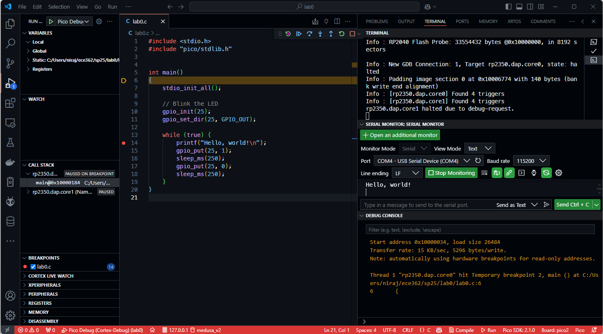

# Lab 0
## Setting up the Microcontroller

### Table of Contents
<br>

| Step | Description | Points |
|------|-------------|--------|
| 0 | Initialize your git repository | 0 |
| 1 | Place the Development Board on a Breadboard | 10 |
| 2 | Install VScode and the Pico Extension | 10 |
| 3 | Configure the Pico Extension for your board | 20 |
| 4 | First Flashes | 20 |
| 5 | Debugging and Printing | 20 |
| 6 | Set up and interact with a Serial Port | 10 |
| 7 | Run a command shell | 10 |
| &nbsp; | Total: | 100* |
<br>

\* - This lab is actually worth points - it is not a "free" lab!  Attendance and completion before lab 1 is required.

## Instructional Objectives
- To become familiar with the BHEE 162 laboratory, policies, lab stations, and equipment.
- To configure your GitHub account for use with GitHub Classroom and add SSH keys for easy access.
- To get hands-on experience with the Pico 2 microcontroller, its accompanying components, and the Pico Extension IDE in VScode that you will use all semester.

> [!CAUTION]
> HALT!  
>   
> This is an example of a note designed to get your attention. If you see this, read it carefully.  
>   
> **Make sure that you read this document in full. There are two ways in this lab to destroy your development board before you've even had a chance to use it.**  

## Welcome to ECE 36200!

In ECE362, you will learn fundamentals of microcontrollers, including their operation, and usage. In addition to the lecture portion of the course, students are expected to complete a series of lab experiments using a microcontroller and the supporting IDE.  

Computers and measurement equipment are provided in the course laboratory facilities to assist students in completing labs, however, **this course is designed to allow you to perform experiment exercises on their own computers at home or elsewhere, and we require that you make the most of this**.  The instructions provided in this lab document will guide you in setting up the microcontroller development environment used in ECE362 to provide a consistent user experience between home and the laboratory.

## Introduction

Lab 0 will have you set up your brand new Pico 2 microcontroller that you should have received at the beginning of lab.  If you have not yet received it, please ask a TA or lab coordinator.

If at any point you need help, you can add yourself to the lab queue via [QueUp](https://engineering.purdue.edu/~menon18/queup/?room=36200).

> [!IMPORTANT]
> In ECE 36200, labs are designed to be started **at home**, when the lab is released online.  This means that you must set up **both** your lab machine, and your personal computer, to do the labs.

## Lab Policies

> [!CAUTION]
> Please keep in mind the food-and-liquids policy of the lab, which is to bring absolutely no food or liquid with you to your lab sessions.  **Failure to follow this rule will result in a penalty for the lab currently running in that week.**  
>   
> This rule applies no matter what is happening in lab, be it your lab session or an open lab session.  If you must bring a bottle or other such container, please place it in the designated safe area for the lab.  If you must have food or drink, please step outside the lab to consume it.  **This rule is in place to protect the very expensive equipment in lab, and to ensure that the lab remains a safe and clean environment for everyone.**

> [!WARNING]
> Past semesters of students' breadboards have had numerous issues with tombstoned holes, which are holes that have been damaged by excessive pressure, typically from pushing in oscilloscope probes, which you may have done in prior classes.  If you have done this, or otherwise have had issues with your breadboard in the past, **we highly encourage you to replace it as soon as possible**.  Because the labs will build on each other, it will be extremely difficult for you to debug problems with your breadboard as you get to later labs.  A good replacement is the Makeronics breadboard (available for about $35 on Amazon).  
> 
> Debugging in this course can get very difficult with more complex circuits, so starting early is crucial to success in this course.  Do not put things off until the last minute - if you have breadboard issues, our recommendation is just to replace it, because **it will save you a lot of time and frustration in the long run**.

## Step 0: Initialize your git repository

In this course, you should use git to keep track of your code.  When you start work on a lab, you will **accept** a GitHub Classroom (abbreviated GHC) assignment that will give you your own private GitHub repository to work in.  You should work on each lab by backing up your work to this repository, allowing you to access it from either your personal machine or a lab machine.  In general, you'll follow these steps:

1. Starting at home, clone the newly created GHC repository to your local computer (which may be blank). 
2. Inside the cloned repository folder, create a project for your Pico 2 board using the relevant VScode extension.
3. For each step, follow the lab instructions to write code and test it on your Pico 2 board, and then add, commit and push your code to your repository.  The message must contain the step number you worked on.
    - Commits are how we will determine your effort on each lab assignment.  **You must commit your code for each lab to your respective git repository at each step of the lab, and not just one big commit at the end of the lab.** 
4. When you are done with the whole lab, submit your repository to Gradescope.  **You must submit your work to Gradescope before the beginning of your lab section next week.**
5. When you come to your lab section to get your work checked off, you can bring your personal machine, or you can clone your repository to a lab machine and show your work there.  **You must always show your work to a TA in lab or office hours to get credit for the lab**, unless you have been instructed otherwise.

To familiarize yourselves with git, keep this [cheat sheet](https://training.github.com/downloads/github-git-cheat-sheet.pdf) bookmarked.  After reading that, you should know how to:
- Create a new repository;
- Clone an existing repository to your computer;
- Add changes, commit them to your local repository, and push them to the remote repository;

Work for this class can be quite time-consuming, and so you need to **start your labs at home, finish as much as you can, and bring your work in to be checked off in lab**.  If you attempt to do the labs entirely in lab, you will have a very hard time completing them.  **Start early, and from home.**

Regardless of whether you are working on your own Windows/macOS/Linux computer or on a lab machine, you will be able to **clone** this repository to your own computer.  Make sure to do this on **all computers** on which you will be doing your lab.  

> [!TIP]
For speed and ease of use, we recommend learning to use SSH and public/private keys.  Generate your keys by following [this guide](https://docs.github.com/en/authentication/connecting-to-github-with-ssh/generating-a-new-ssh-key-and-adding-it-to-the-ssh-agent).  Once you have your key, read [this](https://docs.github.com/en/authentication/connecting-to-github-with-ssh/adding-a-new-ssh-key-to-your-github-account) to learn how to add keys to your account.
> 
> Another option is authenticating the GitHub Extension with VScode with your account, allowing you to clone private repositories.  This will allow you to clone repositories without needing to enter your username and password each time.  You can do this by following the instructions [here](https://code.visualstudio.com/docs/editor/github).

If you haven't already, accept the Lab 0 GitHub Classroom assignment, and clone the repository to your computer.  You should see a README.md file in the repository.  If you don't, you may have cloned the wrong repository.  Make sure to clone the repository that has the lab-0-intro-username format.

> [!TIP]
> The link to each lab is posted on Piazza along with the link to a corresponding GitHub Classroom assignment.  You should accept that assignment, and clone the repository to your computer/lab machine.  Your repository will be located at some URL that looks like https://github.com/ece362-purdue/lab-0-intro-username, where `username` is your GitHub username.  You will be committing your code to this repository for this lab.  Each lab will have their own repositories and lab manuals that will be posted ahead of time.
> 
> By default, the lab-0 repository should only have a README.  Make a change like adding your name to it or creating a new file, and then add, commit and push the change to your lab-0-intro-username repository.

For each step that follows, **always remember to commit and push before you stop working and need to head to lab.**  The most basic commands to do this are:

```bash
# make a simple change, like creating a file first.  And then run:
git add .
git commit -m "A descriptive commit message"
git push
```

If you are on Windows, it is possible to use PowerShell to do this.  If you are on macOS or Linux, you can use a terminal.  `cd` (change directory) to the downloaded folder, and run these commands.  Make sure to change the commit message to include the step number, and a brief description of what you did in that step.   Our intention here is to get you used to the command line and git.

> [!IMPORTANT]
> Create a new file called hello.txt in your repository, and add some text to it.  Commit and push this change to your repository.  Use a descriptive commit message, eg. "Step 0 commit".

## Step 1: Place the Development Board on a Breadboard

Open your ECE 362 lab kit and find the Pico 2 development board. It should look like the one in the image below.

<div class="center">
    
</div>

Your ECE Mini kit from prior courses has a large, four-panel breadboard similar to the one pictured below.  Place the devboard so that it is on the bottom of the second panel with the USB receptacle facing outward, shown below.

<div class="center">
    
</div>

Typically, a microcontroller will be a little hard to get into the holes, but you should not have to remove it once it’s in there. To prevent damage to the board, press down on both ends of the board at once. Do not apply force to anything else, as parts of the board are delicate and may become damaged. When inserting, make sure there are two columns on either side of the development board to leave room to plug in wires. 

Next, connect two wires: one from the 3V3(OUT) pin to the power rails, and one from the GND pins to the ground rails of your breadboard.  You can find the pinout for the Pico 2 here: https://datasheets.raspberrypi.com/pico/Pico-2-Pinout.pdf.  We'll use these in a second.

Take a pushbutton and place it at the end of the board.  Connect the bottom left pin to ground, and the bottom right pin to GPIO15.  This will be your reset button, and you can use it to reset your Pico 2 to the start of a program without having to unplug and replug it.

Connect your Pico 2 to your computer using the USB cable provided in your lab kit.  The Pico 2 will power on, and you should see a green LED blink on the board.  This indicates that the board is powered on and ready to go.  (If you borrowed it from another student, it may have another program on it, so don't worry if you see something else happening.)

> [!IMPORTANT]
> In ECE 36200, you will build upon the existing circuit on the breadboard for each lab, so **do not take parts off your breadboard when you are done with a lab** - including this one!
> 
> Show a TA your setup before moving on to the next step.  **Do not proceed until you have shown a TA your setup.**
> 
> For every lab, ensure that you have received your checkoffs by checking this page: https://engineering.purdue.edu/ece362/checkoff/

## Step 2: Install VScode and the Pico Extension

As mentioned above, these labs are entirely doable at home as they are in lab.  For applications that require looking at an oscilloscope, you may want to use an AD2 from the ECE shop in its place at home.  Make it a habit to look ahead at labs so that you know when you may need one.  

**In this lab**, we'll teach you how to install the Pico Extension for Visual Studio Code (VScode) that will allow you to write, compile, and debug code for your microcontroller.  We'll cover how to create a project from scratch, although in subsequent labs we'll provide you with the project.  We'll also show you how to use the debugger to step through your code, and how to use the serial monitor to interact with your microcontroller.

If you haven't already used it for a prior class, download Visual Studio Code (commonly referred to as VScode) from https://code.visualstudio.com/.  

Once you have downloaded and installed VScode, open it up and click on the Extensions icon on the left side of the window.  Search for the Pico Extension and install the Raspberry Pi Pico Extension.  Once you have installed the extension, reload the VScode window so that the extension starts setting itself up.  Once it's done, click the newly added the Pico Extension logo in the left sidebar.


If it shows the sidebar, it should be good to go!  If it doesn't, you may need to restart VScode.  If you still have issues, please ask a TA for help.

> [!IMPORTANT]
> Show your newly installed VScode and Pico Extension to a TA.  

## Step 3: Configure the Pico Extension for your board

In the Pico Extension sidebar that appears, click New C/C++ Project.  In the window that appears, do the following:

- Specify `lab0` as the name.
- Select `Pico 2` as the board.
- Set the project location to be `lab0` in your respective `lab-0-intro-username` repository.
    - This will allow you to commit and push your newly created project to be submitted.
- Tick the box for RISC-V architecture.
    - Feel free to try out assembly code from your lectures (when you get to it) on this board!
- Set the Pico SDK version to the highest value.
    - As of 2025, the extension is being constantly updated, so the highest version will change constantly.  v2 or higher supports the Pico 2.
- Under Stdio (standard I/O) support, tick `Console over UART`.
    - You should always select this feature when creating a new project, as it will allow you to use the serial monitor to interact with your microcontroller.
- Leave all the other options at their defaults.

Finally, click `Create`.  The extension will close, and you'll see a new window appear.  

The first time you create a project, it may take a while to set up the project, so **be patient**.  If it's slow, you can ensure it's working by watching the progress at the bottom of the VScode window where you created the project.  Once the new window appears, you can close the old window.  

If any errors appear, you may need to restart VScode, and/or try to reinstall the Pico extension.  If you still have issues, please ask a TA for help.

> [!IMPORTANT]
> Commit the newly created project and push it to your repository now.  Use a descriptive commit message, eg. Step 3 new project.

## Step 4: First Flashes

Now that we have a project, let's inspect the C code.  Open the `lab0.c` file.

We have some starter code that will initialize stdio (standard input/output) over UART, which will allow us to interact with the microcontroller using a serial monitor, and then print `Hello, world!` every second infinitely to the monitor.

The UART is an example of a **peripheral**, which is an independent subsystem of your microcontroller, separate from the microprocessor, that can be configured to autonomously perform some operation without the CPU's intervention.  In this case, the UART is configured to automatically send and receive data over a serial connection, which is a common way to communicate with a microcontroller.  By the end of the course, you will learn how to configure this yourself, but for now, we'll use the provided code.

Let's add some code that will also flash the onboard LED every second.  There is an LED on GPIO25 that we can use for this purpose.  After the `stdio_init_all` line, add the following code:

```c
    gpio_init(25);
    gpio_set_dir(25, GPIO_OUT);
```

And inside the `while` loop that prints `Hello, world!`, add the following underneath the `printf`:

```c
    gpio_put(25, 1);
    sleep_ms(250);
    gpio_put(25, 0);
    sleep_ms(250);
```

If you have your USB plugged into your Pico, disconnect it first, and then hold down the button labeled `BOOTSEL` on the board, and plug the USB back in.  This will put the Pico into a mode where it can be flashed.  If you're on Windows/macOS, you may see a pop-up appear saying there's a new drive.  This is normal, and is a way for you to drag UF2 files to flash the Pico with a new program.  However, we won't do that - we'll let VScode handle it for us.

Go to the Pico menu and click `Run Project (USB)`.  This will build your code using the CMake build system (not the same as `make`) and flash it to your microcontroller.  If you see a textbox appear asking about CMakeLists.txt, you can hit Escape to get rid of it.  You should now see your LED flash twice every second (just so you can tell it's different from the factory condition).

We'll figure out how to see the "Hello, world" in the next step (although with microcontrollers, a flashing LED is equivalent to a "Hello World").

> [!IMPORTANT]
> Commit all your code and push it to your repository now.  Use a descriptive commit message that mentions the step number.

## Step 5: Debugging and Printing

The USB cable that we just flashed the Pico with is only useful for providing power and flashing the Pico.  However, there are two critical things we need to be able to use ~~the Pico~~ any microcontroller to its fullest potential:

1. **Debugging** - the ability to step through code and inspect variables as the program runs on the microprocessor.

2. **Serial Communication** - the ability to send and receive data from the microcontroller to a computer.

In your kit, there is a second item called the Raspberry Pi Debug Probe that will help us with these things.  Go ahead and pull this out and wire it up as per the instructions [here](https://www.raspberrypi.com/documentation/microcontrollers/debug-probe.html) to your Pico, and plug it into your PC.

There are six important pins to connect on your Pico:
- GND (ground) to GND on the Debug Probe.
    - When you are interfacing two digital systems together, you must connect their grounds together to ensure that they have a common reference point.
- The TX pin of the Debug Probe to the RX pin of the Pico.
    - This is the transmit pin of the Debug Probe, which sends data to the Pico.  When you "type" into the Serial Monitor, the data is sent to the Debug Probe, which sends it to its UART TX pin, which is connected to the Pico's RX pin.
- The RX pin of the Debug Probe to the TX pin of the Pico.
    - This is the receive pin of the Debug Probe, which receives data from the Pico.  When the Pico sends data to the Debug Probe, it sends it to its UART RX pin, which is connected to the Pico's TX pin.
- SWDIO and SWCLK to the SWDIO and SWCLK pins on the Pico.
    - These are the Serial Wire Debug (SWD) pins, which are used to communicate with the microcontroller's debug interface.  This is how we will be able to step through code and inspect variables.  We can also use this to flash a new program to the Pico without having to hold down the BOOTSEL button.

Once you're all connected, go back to VScode and click `Flash Project (SWD)` option.  You should see a recompilation and flash process using OpenOCD, which is a tool that talks to the Debug Probe to send the program to be flashed to your Pico.  You should see something like this in the case of a successful flash:

```
Info : [rp2350.dap.core1] Examined RISC-V core
Info : [rp2350.dap.core1]  XLEN=32, misa=0x40901105
Info : [rp2350.dap.core1] Examination succeed
Info : starting gdb server for rp2350.dap.core0 on 3333
Info : Listening on port 3333 for gdb connections
** Programming Started **
Info : RP2040 Flash Probe: 33554432 bytes @0x10000000, in 8192 sectors

Info : Padding image section 2 at 0x10002264 with 156 bytes (bank write end alignment)
Warn : Adding extra erase range, 0x10002300 .. 0x10002fff       
** Programming Finished **
** Verify Started **
** Verified OK **
** Resetting Target **
shutdown command invoked
```

If you see this, you have successfully flashed your Pico with the new program, and you should see the LED flashing twice a second again.  

To set up the Serial Monitor, press Ctrl-Shift-P (or Cmd-Shift-P on a Mac) and type `Terminal: Focus on Serial Monitor View`.  You can also pull it up if you have a terminal open by looking for the "Serial Monitor" tab.  Open it, and click Start Monitoring.  You should see the "Hello, world!" message appear every half second.


Now, let's test debugging.  Before we just click Debug, we should make some changes to the CMakeLists.txt file in the project to ensure that all optimizations are turned off so that we can step through every line of our code without the compiler optimizing it away.  Open the `CMakeLists.txt` file in the project, and below the line that says `project(lab0 C CXX ASM)`, add the following lines:

```cmake
set(CMAKE_BUILD_TYPE Debug)
set(PICO_DEOPTIMIZED_DEBUG 1)
```

Next, set a breakpoint on the `printf` line by clicking in the left margin of the editor window - you'll see a red dot appear.  Then, click `Debug Project` in the Pico menu.  Select `Pico Debug (Cortex-Debug)` as the method of debugging.  This will start OpenOCD to connect through the Debug Probe and flash a program, but **not exit**, and start `gdb` to connect to the running OpenOCD process to control line-by-line debugging.  You should see the program stop at the first line of `main`.  Here is a picture of the window as you should see it:



There are a lot of things going on in Debug mode that you should understand:

- First, in the top right is a terminal with the OpenOCD process.  When you clicked Debug, it sent your compiled code to be flashed on to your Pico 2 through the Debug Probe.  Instead of "shutting down" as it did earlier, it is now "halted due to debug-request".  Your Pico 2 is dual-core, but your code will only run on one by default.
- The Debug Console shows output from `gdb`, which may be familiar to you from prior coding classes.  You have used `gdb` in the past to debug programs as you ran them on your own computer's CPU, but now you are using it to debug a program running on a completely separate computer - your microcontroller.  This is called "remote debugging".
- On the left sidebar, you have the `Variables` tab.  When you define variables, you can see their values here.  
- The `Call Stack` tab shows you the current function call stack.  This is useful for understanding how you got to where you are in your code.  In a dual-core configuration, you can see the call stack for both cores.
- The `Breakpoints` tab shows you all the breakpoints you have set in your code.  You can enable and disable them here.
- The `XPeripherals` tab (not `Peripherals`) shows you the state of the peripherals on your microcontroller.  As you start configuring them in next labs, we'll have you look here to see their state and understand how they work.

In the center-top of your window, you'll see a toolbar with the following buttons:

- `Reset device` - this will reset your microcontroller.  You can use this to restart your program from the beginning.
- `Continue` - this will continue running your program until the next breakpoint.
- `Pause` - this will pause your program if it's running.
- `Step over` - this will run the next line of code, but not step into any functions.
- `Step into` - this will run the next line of code, and step into any functions.
- `Step out` - this will run the rest of the current function and stop at the next line of the calling function.
- `Restart` - this will restart your program from the beginning, similar to `Reset device`.
- `Stop` - this will stop your program and disconnect the debugger, at which your Pico 2 will remain halted.

> [!IMPORTANT]
> Show your TA your working serial connection and debug mode.  Show that you can step over the `printf` lines and the LED output value change lines, and that you can see the Pico 2 LED turn on you step over the `gpio_put(25, 1)` line.  **Do not proceed until you have shown a TA your working debugger.**

## Step 7: Run a command shell

In your upcoming labs, you will include a code object that gets built along with your C code, typically called "autotest.o".  This provides (in other labs) an autotester that you can use to test individual functions and generate a confirmation code that you will submit with your code.  In this lab, it's simply a shell that executes some functions - just to get you familiar with how it works so you know how to use it for the following labs.  

In this step, we will have you add the autotest file to your the Pico Extension project.  In the other labs, we will provide you with the Pico Extension project with the autotester included.

Download the `autotest.o` file [here](../../../raw/main/lab0-intro/autotest.o) and place it in the root directory of your project, alongside the C file.

> [!NOTE]
> To clarify, this is not a real autotester.  It is not responsible for giving you any credit on the lab.  This is just provided to show you how you can use it in future labs.
> 
> Credit for this lab is granted by showing your TA that you have completed all steps in lab or office hours, by pushing your code to the GitHub repository, and submitting your GitHub repository to Gradescope.  **You must submit your work to Gradescope before the beginning of your lab section next week.**

To include the autotester in your project, open the `CMakeLists.txt` file in your project, and change the `add_executable` line as follows:

```cmake
add_executable(lab0 lab0.c ${CMAKE_CURRENT_SOURCE_DIR}/autotest.o)
```

You can also make a dynamic target that automatically includes any .o or .c files in the project directory as follows. 

```cmake
file(GLOB SOURCES ${CMAKE_CURRENT_SOURCE_DIR}/*.c ${CMAKE_CURRENT_SOURCE_DIR}/*.o)
add_executable(lab0 ${SOURCES})
```

Flash this to your microcontroller, and reopen the Serial Terminal as you did in the prior step.  You may see nothing at first - this is normal.  By the time you pull up the serial monitor after the microcontroller has been flashed, the autotester will have already printed text that you did not see.  To see this text, you can press the reset button on your microcontroller, and you should see a "command shell" appear.  

This "command shell" is where you will type commands to execute code on your microcontroller.  For the rest of your labs, we'll give you commands to test individual functions, but for now, type 'help' to see what commands are available.  You can type 'exit' to leave the shell.

By the end of the embedded systems labs, we'll give you instructions on how to write your own command shell.

> [!IMPORTANT]
> Show your TA your working autotester.
> Commit all your code and push it to your repository now.  Use a descriptive commit message that mentions the step number.  Show your TA that you have been pushing commits for each step.

## Sign Your Breadboard

If you haven't done so already, your TA will hand you a silver sharpie that so that you can write your username at the top of the breadboard.  They will then sign it themselves.  If the breadboard was used by someone else whose username is on it, cross out the previous username. 

## Submit your work to Gradescope

Submit your work to the Lab 0 assignment on Gradescope **before the beginning of your lab section next week**.  Ensure that your the Pico Extension code has been added and pushed in your GitHub repository.  

## Lab Station Clean-up

At this point, you are free to leave. Please make sure to close all windows, log out of the machine (click on your name on the top bar, and click Log Out, or similar), take all your belongings with you, and exit the lab. You must perform this clean-up procedure in every lab, or you will lose all points on the lab. 

> [!IMPORTANT]
> You must only leave after you have gotten your breadboard signed and you have cleaned up your station.  Do not leave behind plastic wrappers, breaboard wires, or any other trash as a result of setting up your breadboard in lab.  **Failure to clean up your station will result in a penalty for the lab currently running in that week.**
