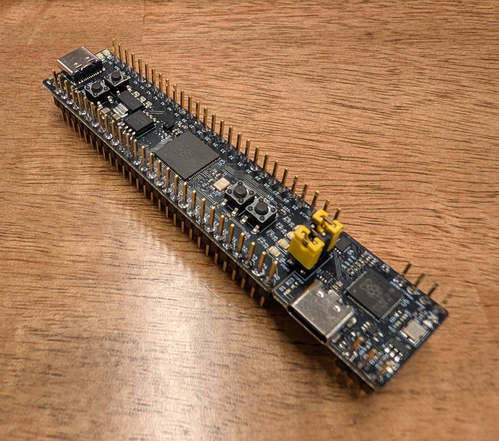

# Lab 0
## Setting up the Microcontroller

### Table of Contents
<br>

| Step | Description | Points |
|------|-------------|--------|
| 0 | Initialize your git repository for your lab at home | ** |
| 1 | Solder pin headers to your keypad | ** |
| 2 | Place the Development Board on a Breadboard | ** |
| 3 | Install VScode and PlatformIO | ** |
| 4 | Create a PlatformIO project | ** |
| 5 | Debugging microcontroller code in C | ** |
| 6 | Run a command shell | ** |
|   | Sign Your Breadboard | ** |
|   | Submit your work to Gradescope | ** |
|   | Clean up your lab station | ** |
| &nbsp; | Total: | 100* |
<br>

\* - This lab is actually worth points - it is not a "free" lab!  Completion before lab 1 is required.  
  
\*\* - These steps are provided to show you the order of the lab and do not have associated points.  To earn full credit for this lab, you must submit your work to Gradescope and have soldered pin headers to your keypad **before the beginning of your lab section for lab 1**.

## Instructional Objectives
- To become familiar with the BHEE 162 laboratory, policies, lab stations, and equipment.
- To configure your GitHub account for use with GitHub Classroom and add SSH keys for easy access.
- To get hands-on experience with the Proton development board, its accompanying components, and PlatformIO IDE in VScode that you will use all semester.

> [!CAUTION]
> HALT!  
>   
> This is an example of a note designed to get your attention. If you see this, read it carefully.  
>   
> This lab is intended to get you set up with the software you will use for the board, on both your home PC and your lab machine.  To reduce your time wasted on logistical issues, **start this lab at home, as soon as possible**.  At home, start at step 3 to set up PlatformIO on your own computer, and bring it with you to lab if possible to confirm that you can program your board with it.  While you are in lab, you will set up PlatformIO on the lab machines as well.
> 
> When you come into the lab, you'll be given the lab kit you purchased, including the Proton development board we'll use throughout this course.  You'll use the lab time to solder pin headers to your board, and while waiting for a soldering station to open up, work on the software setup on your lab machine.  
> 
> This may seem like a lot of work, but it helps you achieve two things:
> 
> 1. You will be able to work on the labs at home, and not just in lab.  This is a huge time saver, as you can work on the labs whenever you want, and not just during lab hours.
> 
> 2. You'll get the soldering done in lab 0 if you time it right, allowing you to start working on lab 1 from home.  Even if you don't manage to finish in lab, you can complete your soldering in the ECE shop during their open hours from 8:00 AM to 5:00 PM, Monday through Friday.

## Welcome to ECE 36200!

In ECE 36200, you will learn fundamentals of microcontrollers, including their operation, and usage. In addition to the lecture portion of the course, students are expected to complete a series of lab experiments and a course project using a microcontroller and the supporting IDE.  

Computers and measurement equipment are provided in the course laboratory facilities to assist students in completing labs, however, **this course is designed to allow you to perform experiment exercises on their own computers at home or elsewhere, and we require that you make the most of this**.  The instructions provided in this lab document will guide you in setting up the microcontroller development environment used in ECE 362 to provide a consistent user experience between home and the laboratory.

## Introduction

Lab 0 will have you set up your brand new Proton development board that you should have received at the beginning of lab.  If you have not yet received it, please ask a TA or lab coordinator.

If you are in-person in lab and at any point you need help, you can add yourself to the lab queue via [QueUp](https://engineering.purdue.edu/~menon18/queup/?room=36200).  TAs in lab monitor this queue and will come to the station number you provide.

> [!IMPORTANT]
> In ECE 36200, labs are designed to be started **at home**, when the lab is released online.  This means that you must set up **both** your lab machine, and your personal computer, to do the labs.

## Lab Policies

> [!CAUTION]
> Please keep in mind the food-and-liquids policy of the lab, which is to bring absolutely no food or liquid with you to your lab sessions.  **Failure to follow this rule will result in a penalty for the lab currently running in that week.**  
>   
> This rule applies no matter what is happening in lab, be it your lab session or an open lab session.  If you must bring a bottle or other such container, please place it in the designated safe area for the lab.  If you must have food or drink, please step outside the lab to consume it.  **This rule is in place to protect the very expensive equipment in lab, and to ensure that the lab remains a safe and clean environment for everyone.**

> [!WARNING]
> Past semesters of students' breadboards have had numerous issues with tombstoned holes, which are holes that have been damaged by excessive pressure, typically from pushing in oscilloscope probes, which you may have done in prior classes.  If you have done this, or otherwise have had issues with your breadboard in the past, **we highly encourage you to replace it as soon as possible**.  Because the labs will build on each other, it will be extremely difficult for you to debug problems with your breadboard as you get to later labs.  A good replacement is the Makeronics breadboard (available for about $35 on Amazon).  
> 
> Debugging in this course can get very difficult with more complex circuits, so starting early is crucial to success in this course.  Do not put things off until the last minute - if you have breadboard issues, our recommendation is just to replace it, because **it will save you a lot of time and frustration in the long run**.

## Step 0: Initialize your git repository for your lab at home

In this course, you are required to use `git` to keep track of your code.  When you start work on a lab, you will **accept** a GitHub Classroom (abbreviated GHC) assignment that will give you your own private GitHub repository to work in.  You should work on each lab by backing up your work to this repository, allowing you to access it from either your personal machine or a lab machine.  In general, you'll follow these steps:

1. Starting at home, clone the newly created GHC repository to your local computer (which may be blank). 
2. Inside the cloned repository folder, create a project for your Proton board using the relevant VScode extension.
3. For each step, follow the lab instructions to write code and test it on your Proton board, and then add, commit and push your code to your repository.  The message must contain the step number you worked on.
    - Commits are how we will determine your effort on each lab assignment.  **You must commit your code for each lab to your respective git repository at each step of the lab, and not just one big commit at the end of the lab.** 
4. When you are done with the whole lab, submit your repository to Gradescope.  **You must submit your work to Gradescope before the beginning of your lab section next week.**
5. When you come to your lab section to get your work checked off, you can bring your personal machine, or you can clone your repository to a lab machine and show your work there.  **You must always show your work to a TA in lab or office hours to get credit for the lab**, unless you have been instructed otherwise.

To familiarize yourselves with git, keep this [cheat sheet](https://training.github.com/downloads/github-git-cheat-sheet.pdf) bookmarked.  After reading that, you should know how to:
- Create a new repository;
- Clone an existing repository to your computer;
- Add changes, commit them to your local repository, and push them to the remote repository;

Work for this class can be quite time-consuming, and so you need to **start your labs at home, finish them or as much of them as you can, and bring your work in to be checked off in lab**.  If you attempt to do the labs entirely in lab, you will have a very hard time completing them.  **Start early, and from home.**

Regardless of whether you are working on your own Windows/macOS/Linux computer or on a lab machine, you will be able to **clone** this repository to your own computer.  Make sure to do this on **all computers** on which you will be doing your lab.  

> [!TIP]
For speed and ease of use, we recommend learning to use SSH and public/private keys.  Generate your keys by following [this guide](https://docs.github.com/en/authentication/connecting-to-github-with-ssh/generating-a-new-ssh-key-and-adding-it-to-the-ssh-agent).  Once you have your key, read [this](https://docs.github.com/en/authentication/connecting-to-github-with-ssh/adding-a-new-ssh-key-to-your-github-account) to learn how to add keys to your account.
> 
> Another option is authenticating the GitHub Extension with VScode with your account, allowing you to clone private repositories.  This will allow you to clone repositories without needing to enter your username and password each time.  You can do this by following the instructions [here](https://code.visualstudio.com/docs/editor/github).

If you haven't already, accept the Lab 0 GitHub Classroom assignment, and clone the repository to your computer.  You should see a README.md file in the repository.  If you don't, you may have cloned the wrong repository.  Make sure to clone the repository that has the lab-0-intro-username format.

> [!TIP]
> The link to each lab is posted on Piazza along with the link to a corresponding GitHub Classroom assignment.  You should accept that assignment, and clone the repository to your computer/lab machine.  Your repository will be located at some URL that looks like https://github.com/ece362-purdue/lab-0-intro-username, where `username` is your GitHub username.  You will be committing your code to this repository for this lab.  Each lab will have their own repositories and lab manuals that will be posted ahead of time.
> 
> By default, the lab-0 repository should only have a README.  Make a change like adding your name to it or creating a new file, and then add, commit and push the change to your lab-0-intro-username repository.

For each step that follows, **always remember to commit and push before you stop working and need to head to lab.**  The most basic commands to do this are:

```bash
# make a simple change, like creating a file first.  And then run:
git add .
git commit -m "A descriptive commit message"
git push
```

If you are on Windows, it is possible to use PowerShell to do this.  If you are on macOS or Linux, you can use a terminal.  `cd` (change directory) to the downloaded folder, and run these commands.  Make sure to change the commit message to include the step number, and a brief description of what you did in that step.   Our intention here is to get you used to the command line and git.

> [!IMPORTANT]
> Create a new file called hello.txt in your repository, and add some text to it.  Commit and push this change to your repository.  Use a descriptive commit message, eg. "Step 0 commit".

## Step 1: Solder pin headers to your keypad

**Soldering!?  In ECE 36200?  What is this, ECE 20008?**

No, this isn't a typo.  In ECE 36200, you will have multiple components in your kit that have no pin headers added.  One of our two reasons is to eliminate the labor cost associated in soldering those pin headers.  

The other reason is to start teaching you how to solder **before** you go into senior design.  When you are working with a microcontroller, there are numerous components that you will need to solder to your board, and forming the skillset necessary to soldering and desoldering components is a critical skill to have.  

In this lab, we are starting out with the most common component that you will need to solder - pin headers.  When you start doing projects, and you need to use external components that come on PCBs without headers, you will need to add them on before you can attach them to your breadboard, for both ECE 36200 and your senior design project.

<!-- Open [this page](soldering.md) in a new tab and follow the instructions.   -->  
   
> [!CAUTION]
> Soldering is a skill that takes time to learn.  If you have never soldered before, please ask a TA for help.  If you have soldered before, please still ask a TA for help.  We want to make sure that you are doing it correctly.

If you want to skip this step and solder your headers outside of lab because you have prior experience, you may do so, but make sure to get it done as soon as possible.  You will need to have your board in place on your breadboard, wired up, and running some test code before you start lab 1.

Your lab kit should contain your unsoldered keypad, which should look like this:

<div class="center">
    
</div>

You'll be soldering 8 pins to the middle 8 pads (leaving one pad on both sides of the keypad).  When your TA directs you to your soldering station either in the lab, or in the ECE shop, make sure that you see the following at your bench:

1. Small breadboard for placing your keypad on.
1. Fume hood.
1. Soldering iron.
1. Solder.
1. Flux pen.
1. Pin headers in a container.


Start by turning on your fume hood first.  **This is critical.**  

Turn on your soldering iron and let it heat up.  You'll know it's ready when the light starts blinking.

Take any one of the pin headers, and break off exactly 8 pins.  Do not dispose of headers if you make a mistake - we can always reuse those.  Simply throw those back in the container.

Place the **longer** side of those headers down into a breadboard, in the position indicated below.  The headers should sit firmly in the breadboard.


Take the flux pen, open it, and dab the tip on the keypad's metal pads.  Make sure to recap the pen.

Place the keypad's pads on the shorter side of the headers, which should be facing upwards.


Take the solder wire in one hand, and your soldering iron in the other.  Touch the soldering iron **first** to the first pad, and then move the wire to where the tip makes contact with the metal of the pad.  


Wait until the iron melts the solder, then remove the solder wire while keeping the iron in place.  Wait until the melted solder pools around the pad, filling the gap between the pin header and the pad.  Then, pull the iron back and let it cool.  Inspect the joint to ensure there are no issues.


Repeat this process for the other 7 pads, confirming each joint.  Once you're done, **ask a TA to confirm that your keypad looks fine**, and then you can move on to the next step.

## Step 2: Place the Development Board on a Breadboard

At this point, you should have also pulled out your Proton development board from your lab kit.  If they have not already been added, obtain three "shorting plugs" (shunt jumpers) from a TA, and place them on the headers separating the Proton board and the debugger, in order to hold the board together as shown below (the yellow/black/yellow plastic pieces in the image below):

<div class="center">
    
</div>

Before we put this joined Proton board on the breadboard, we're going to connect two wires on the breadboard from **GP0** and **GP1** to the **RX** and **TX** pins respectively on the Proton board.  The way we'll do this is by routing the wires **under** the board, since you won't need to move those wires once they're in place.  This will make future wiring much easier.

<div class="center">
    
</div>

Then, place the board over the wires, and press it down into the breadboard, taking care that the wires aren't coming out the sides.  

<div class="center">
    
</div>

Typically, boards like this will be a little hard to get into (and out of) a breadboard, but you should not have to remove it once it's in there for the rest of the course.  When reinserting your Proton board, be careful to push down on the buttons, and not the other delicate components on the board.  For the debugger, you may need to push down on the edges.  Be careful not to push down on the portion with no pins, as there is no support there and it may snap off the Proton board.

Next, connect two wires: one from each of the 3V3 pins to the power rails, and one from each of the GND pins to the ground rails of your breadboard, as well as the PGND pins on the debugger.  Use the labels on the pins, but if they're too small for you to read, you can also use this [pinout diagram](https://ece362-purdue.github.io/proton-labs/assets/Proton%20Pinout%20Diagram.pdf).

Plug in a USB-C cable from the **debugger** - not the Proton - to your computer.  If the red LED on it doesn't turn on, there are two possibilities:

- It is a brand new debugger with no program saved in flash, in which case it will appear like a flash drive on your computer labeled "RPI-RP2".  Download the latest **debugprobe.uf2** firmware [here](https://github.com/raspberrypi/debugprobe) from the Releases tab, and drag the file into the drive.  This will flash the firmware to the debugger, and the red LED should turn on indicating it was recognized by your computer.

- If no flash drive appears when you plug it in, you have a USB-C cable that is only capable of carrying power, not data.  This is common with a lot of cables.  Try a different USB-C cable, or try a different computer to confirm that it is the cable that is the issue.  If you are using a lab machine, make sure to use a USB port on the back of the machine, as the front ports may not be able to provide enough power to the debugger.

Once you've flashed the debugger (if applicable) and/or your debugger's red LED turns on, plug in a second USB-C cable into the Proton board.  You should always see the 5V red indicator and 3.3V green indicator LEDs on the Proton board turn on.  If they do not, immediately pull out the USB-C cable - **there could be a short with how you connected it to your breadboard, or in your solder joints**.  More likely than not, though, the LEDs are probably just damaged, but ask a TA to confirm.  

By default, your Proton should start flashing the LEDs in a Johnson Counter pattern.  If they do not turn on, but you see "RP2350" appear as a flash drive on your computer when it is connected, your board is still fine - it's just in bootloader mode.  You *could* drop in a UF2 file to flash it, but we don't have a compiled program just yet, so there's no need.  

You may also see a green LED in the middle of the board start flashing, in which case your board was already tested and confirmed as working, and you can ignore it.

> [!IMPORTANT]
> In ECE 36200, you will build upon the existing circuit on the breadboard for each lab, so **do not take parts off your breadboard when you are done with a lab** - including this one!
> 
> Show a TA your setup before moving on to the next step.  **Do not proceed until you have shown a TA your setup.**
> 
> For every lab, ensure that you have received your checkoffs by checking this page: https://engineering.purdue.edu/ece362/checkoff/

## Step 3: Install VScode and PlatformIO

> [!WARNING]
> Complete this step on both your personal machine and your lab computer!

The way microcontrollers work is by writing a C program, compiling it into a binary file to be run by the specific CPU core on the microcontroller, and then flashing/uploading that binary file into the **flash memory** on the microcontroller.  Every time your microcontroller powers on, whether by USB or through the 5V pins, it loads that program from flash memory.

The method of flashing can be different, however.  A newly fabricated board will obviously have no data in flash memory, which the microcontroller can detect.  If there's no data, the microcontroller will enter **bootloader mode**, allowing you to upload a new program.  However, to upload a new program, it can be tedious to put the microcontroller into boot mode and then upload a new program over and over again.

Therefore, we have the second part of your Proton board - the debugger.  The debugger is actually **another microcontroller** that is connected to the Proton board, electrically and digitally separate from the Proton.  The debugger allows us to tap into the microcontroller's **debug interface**, which gives us the option to flash a new program to the microcontroller without having to put it into boot mode.  This is done by connecting the debugger to the Proton board using the SWD and SWCLK pins, which you already connected using the shunt jumpers on the top of your board.  The debugger can also be used to step through code, inspect variables, and set breakpoints in your code.

> [!IMPORTANT]
> As mentioned above, these labs are entirely doable at home as they are in lab.  For applications that require looking at an oscilloscope, you may want to use an AD2 from the ECE shop in its place at home.  Make it a habit to look ahead at labs so that you know when you may need one.  
>
> Therefore, if you don't have your personal machine on you when you're in lab (i.e. a laptop), make sure to do this step again on it at home.  You must set up **two working environments** so that you can do your lab both at home and in lab.

In this step, we'll teach you how to install PlatformIO for Visual Studio Code (VScode) that will allow you to write, compile, and debug code for your microcontroller.  We'll cover how to create a project from scratch, although in subsequent labs we'll provide you with the project.  We'll also show you how to use the debugger to step through your code, and how to use the serial monitor to interact with your microcontroller.

If you haven't already used it for a prior class, download Visual Studio Code (commonly referred to as VScode) from https://code.visualstudio.com/.  

Once you have downloaded and installed VScode, open it up and click on the Extensions icon on the left side of the window.  Search for PlatformIO and install it.  Once you have installed the extension, reload the VScode window so that the extension starts setting itself up.  When a notice appears asking you to reload, click the button that says "Reload".  This will allow the extension to set itself up properly.

https://github.com/ece362-purdue/labs/assets/12859429/bc0f16c2-6bfb-4db2-a0a5-1b66a774d552

If it shows the sidebar, it should be good to go!  If it doesn't, you may need to restart VScode.  If you still have issues, please ask a TA for help.

> [!IMPORTANT]
> Show your newly installed VScode and PlatformIO to a TA.  

## Step 4: Create a PlatformIO project

As of April 2025, PlatformIO does not incorporate support for our specific microcontroller.  Instead, we've created our own plugin that you can use with PlatformIO.  We'll set that up in this step.

The purpose of using PlatformIO is to make it much easier to compile, upload and debug code on your microcontroller.  Since it is oriented towards embedded systems, it's got support for various other microcontrollers that you can use it for after 362.  It also integrates a few other tools, including a serial monitor that allows you to send and receive data from your microcontroller, and a debugger that allows you to step through your code and inspect variables as the program runs on the microcontroller.

Clone the `lab-0-intro-username` repository you created in Step 0 to your local machine.  In it, you should only have a README file that doesn't say anything particularly useful.  Create a new file called `platformio.ini`, and add the following to it:

```ini
[env:proton]
platform = https://github.com/norandomtechie/platform-raspberrypi.git#feature/proton-picosdk-support
board = proton
framework = picosdk
debug_tool = picoprobe
build_src_flags = -O0
upload_protocol = picoprobe
monitor_speed = 115200
```

Save it, and then open your folder in VScode.  The PlatformIO extension will see the configuration file you created, and automatically start setting up your tools for you.  Once all the different dialogs close and you see "Project initialized successfully".  

Create a new folder called `src` in the root of your project.  Inside that folder, create a new file called `main.c`.  This is where you will write your C code for the microcontroller.  When you create additional C files in this folder, they get automatically compiled with your project.

The flow of writing a program for your microcontroller will work as follows:

1. You write your code, including a `main` function, in C files within the `src` folder.

2. When you click Build/Upload, PlatformIO compiles your code into individual object files under `.pio/build/proton` using a compiler toolchain intended for your microcontroller.  In this first lab, we are using the ARM CPU core on the RP2350, so we'll use `arm-none-eabi-gcc`, instead of the regular `gcc` compiler you may be used to on your computer that may be familiar to you from ECE 264.

3. The compiled object files are then "linked" together into a single binary file at `.pio/build/proton/firmware.elf` that can be uploaded to the flash memory on your Proton board - this is separate from the actual RP2350 microcontroller.  The flash memory holds up to 16 MB (megabytes) of program data.

4. If you already clicked Upload/When you click Upload, PlatformIO uses a program called `openocd` to initiate a connection with the Debug Probe on your debugger, and pushes out the ELF file.  The shunt jumpers you added earlier connect the debug probe to the RP2350 microcontroller on the Proton board, allowing the ELF file to get sent to the microcontroller, which saves it in the flash memory chip.  The microcontroller restarts after the upload is complete, and starts running your uploaded program.

> [!IMPORTANT]
> Commit the newly created project and push it to your repository now.  Use a descriptive commit message, eg. Step 4 new project.

## Step 5: Debugging microcontroller code in C

We've now configured our project to use the Proton board.  Let's now write some code to test it out.

Add the following header includes at the top of `main.c`.  We'll use these later:

```c
#include <stdio.h>
#include "pico/stdlib.h"
```

Below that, write the following:

```c
int main() {
    // Configures our microcontroller to 
    // communicate over UART through the TX/RX pins
    stdio_init_all();

    // Initialize pins 22, 23, 24, 25 
    // (each 1 bit corresponds to a pin, hence 0xff << 22)
    gpio_init_mask(0xf << 22);
    // Set them all to outputs 
    gpio_set_dir_out_masked64(0xf << 22);

    for(;;) {
        // Turn on the LEDs successively
        for (int i = 0; i < 4; i++) {
            gpio_put(22 + i, true);
            sleep_ms(500);
        }

        // Turn off the LEDs successively
        for (int i = 0; i < 4; i++) {
            gpio_put(22 + i, false);    
            sleep_ms(500);
        }

        // Print "Hello, world!" to the serial monitor
        printf("Hello, world!\n");
    }
    
}
```

On most microcontrollers including ours, you must ensure that you always remain inside the `main` function.  This is to ensure that our program - which may configure peripherals that will run independently - does not exit, which may cause the peripherals to stop running.  The `for(;;)` loop is an infinite loop that will run until the microcontroller is powered off.  

There are two critical things we need to be able to use ~~the Proton~~ any microcontroller to its fullest potential:

**Debugging** - the ability to step through code and inspect registers and variables as the program runs on the microprocessor.

**Serial Communication** - the ability to send and receive text from the microcontroller to a computer with the help of a device called a **UART** (universal asynchronous receiver/transmitter) on each of the two devices communicating.

There are six important pins that we've already connected to the Proton board that help implement these two processes:

- GND (ground) to GND on the Proton debugger.
    - When you are interfacing two digital systems together, you must connect their grounds together to ensure that they have a common reference point.
    - You connected this when you put the shunt jumpers on the Proton board.
- The TX pin of the Proton debugger to the RX pin of the Proton.
    - This is the transmit pin of the Proton debugger, which sends data to the Proton.  When you "type" into the Serial Monitor, the data is sent to the Proton debugger, which sends it to its UART TX pin, which is connected to the Proton's RX pin.
- The RX pin of the Proton debugger to the TX pin of the Proton.
    - This is the receive pin of the Proton debugger, which receives data from the Proton.  When the Proton sends data to the Proton debugger, it sends it to its UART RX pin, which is connected to the Proton's TX pin.
- SWDIO and SWCLK to the SWDIO and SWCLK pins on the Proton.
    - These are the Serial Wire Debug (SWD) pins, which are used to communicate with the microcontroller's debug interface.  This is how we will be able to pause the microcontroller's CPU, step through code and inspect variables.  We can also use this to flash a new program to the Proton without having to hold down the BOOTSEL button.
    - You connected these when you put the shunt jumpers on the Proton board.

The process for uploading is as follows:
- The C code we just wrote needs to be compiled and linked into a binary file that the microcontroller can understand.  
- The binary file is then flashed/uploaded to the microcontroller's flash memory using the debugger.

In the PlatformIO menu, click on the "Build" button (the checkmark icon) to compile your code.  You should see a dialog appear showing all the various dependency files that are being compiled.  If you made syntax errors, they'll appear in this dialog.  If you see it end in something similar to the following, you are good to go:

```ini
RAM:   [          ]   4.0% (used 21060 bytes from 524288 bytes)
Flash: [          ]   0.1% (used 17416 bytes from 16773120 bytes)
Building .pio/build/proton/firmware.bin
============================== [SUCCESS] Took 0.53 seconds ==============================
 *  Terminal will be reused by tasks, press any key to close it. 
```

Follow its advice and press any key to close the terminal.  If you see errors, fix your code and try again.  If you see errors that you don't understand, please ask a TA for help.

The firmware.bin file is what gets uploaded to the Proton board.  To upload it, click the "Upload and Monitor" button (the right arrow icon) in the PlatformIO menu.  This will flash the binary file to the Proton board.  You should see a long dialog that ends in the following after a few seconds:

```
** Programming Finished **
** Verify Started **
** Verified OK **
** Resetting Target **
Warn : [rp2350.dap.core1] VECTRESET is not supported on this Cortex-M core, using SYSRESETREQ instead.
Warn : [rp2350.dap.core1] Set 'cortex_m reset_config sysresetreq'.
[rp2350.dap.core0] halted due to breakpoint, current mode: Thread 
xPSR: 0xf9000000 pc: 0x00000088 msp: 0xf0000000
[rp2350.dap.core1] halted due to debug-request, current mode: Thread 
xPSR: 0xf9000000 pc: 0x00000088 msp: 0xf0000000
shutdown command invoked
--- Terminal on COM3 | 115200 8-N-1
--- Available filters and text transformations: colorize, debug, default, direct, hexlify, log2file, nocontrol, printable, send_on_enter, time
--- More details at https://bit.ly/pio-monitor-filters
--- Quit: Ctrl+C | Menu: Ctrl+T | Help: Ctrl+T followed by Ctrl+H
Hello, World!
Hello, World!
Hello, World!
```

Don't worry about the warnings when uploading - they are normal.  As long as you don't see anything in red, you are in the clear.

If you see something that says "**Error: unable to find a matching CMSIS-DAP device**", make sure you've connected a USB-C cable to the debugger as well one to the Proton board.  The debugger is what allows you to flash the program to the Proton board.

If you see the four colored LEDs on the Proton board turn on and off in sequence, congratulations!  You've successfully flashed your first program to your Proton board.

At the same time, we also see the "Hello, world!" message appear in the **serial monitor**.  This is the output from the `printf` statement in our code.  The serial monitor is a tool that allows us to send and receive data from the microcontroller over the UART interface.  You can use it to send commands to your microcontroller, or to receive data from it.

A critical function to any microcontroller development environment is to be able to **reset** your code so that you can start it again from the beginning.  On our Proton board, this is achieved with the Reset pushbutton.  Your RP2350 can be reset by pressing this button which connects a pin called RUN on your RP2350 micro, to ground.  The active-low RUN signal will then cause the RP2350 to fully reset and start executing code from the boot ROM address (you can actually see this when we start debugging).  The same thing happens when you unplug and replug your Proton board - a **power-on reset** (POR) occurs in that case.


Try holding the Reset button - you'll see that the microcontroller doesn't run code until you let go of the button.  You might recall this behavior from ECE 270, where you had `rst`/reset ports in your submodules.  It's the exact same concept here!

Now, we're going to learn how to debug by **stepping through** our code, line by line, similar to how you debugged C in ECE 264.  Set a breakpoint on the `gpio_init_mask` line by clicking in the left margin of the editor window - you'll see a red dot appear.  Then, in the PlatformIO menu, move your cursor down to Quick Access and click Start Debugging.  Alternatively, you can press F5 (or Fn+F5, depending on your keyboard) to start debugging.  

This will open the Debug view, which starts at the `ldr r0, =BOOTROM_VTABLE_OFFSET` line in the boot assembly code for the RP2350 (you can safely close this `crt0.S` file), which jumps you to the `main` function.  Here is how it should look.


There are a lot of things going on in the debug view that you should understand:

- First, in the bottom right is a terminal with the OpenOCD process, printed in yellow and red.  When you clicked Start Debugging, the OpenOCD program sent your compiled code in binary format to be uploaded via the Proton debugger to the RP2350 microcontroller, which saves it into the onboard flash memory.  However, once uploaded, OpenOCD is not "shutting down" as when we uploaded a program earlier - instead, it is now "halted due to debug-request".  
    - This "Debug Console" also shows output from `gdb`, which may be familiar to you from prior coding classes.  You have used `gdb` in the past to debug programs as you ran them on your own computer's CPU, but now you are using it to debug a program running on a completely separate computer - your microcontroller.  This is called "remote debugging".
    - You can type in different `gdb` commands here to inspect variables, set breakpoints and control the execution of your program.  You may also find it more helpful to use VScode's interface to do this instead.
- On the left sidebar, you have the `Variables` tab.  When you define variables, you can see their values here.  They'll be separated into Local/Global/Static variables.
- The `Call Stack` tab shows you the current function call stack.  This is useful for understanding how you got to where you are in your code.  In a dual-core configuration, you can see the call stack for both cores.  Your code will only run on **core 0** by default until we tell it otherwise.
- The `Breakpoints` tab shows you all the breakpoints you have set in your code.  You can enable and disable them here.
- The `Peripherals` tab shows you the state of the peripherals on your microcontroller.  As you start configuring them in next labs, we'll have you look here to see their state and understand how they work.

In the center-top of your window, you'll see a toolbar with the following buttons:

- `Continue` - this will continue running your program until the next breakpoint.
- `Pause` - this will pause your program if it's running.
- `Step over` - this will run the next line of code, but not step into any functions.
- `Step into` - this will run the next line of code, and step into any functions.
- `Step out` - this will run the rest of the current function and stop at the next line of the calling function.
- `Restart` - this will restart your program from the beginning, similar to `Reset device`.
- `Stop` - this will stop your program and disconnect the debugger, at which your Proton will remain halted.

### How to use the debugger effectively

Click the `Step over` button (or press F10) to step over the `stdio_init_all` line.

Before you step over the `gpio_init_mask` line, expand the Peripherals view on the left sidebar, and click on the `SIO` peripheral, and expand the field labeled `gpio_oe`, which is the "GPIO Output Enable" status register, which tells us if a pin has been configured as an output.  By default, this may be at 0x00000000, indicating that no GPIO pins have been set as outputs.  Step over the line, and this value will now change to 0x03c00000.  If you turn this into its binary value, this is four 1s in a row starting at bit 22, indicating that pins 22, 23, 24 and 25 have been set as outputs.  Use the default calculator in Programming mode on your respective OS, or find an online base converter to inspect the individual bits of the value 0x03c00000 to confirm this.


This highlights a golden rule you should follow when doing your embedded labs:

**In embedded systems, the way to debug is not by using print statements - it is by inspecting the state of the peripheral registers and variables in your code using the debugger.**  

Go ahead and step over until you reach the first `gpio_put` lines.  You can even right click on the line number you want to reach and click "Run to Line".  Once again, go back to the Peripherals menu, and this time, expand SIO -> `gpio_out`, which is the "GPIO Output Value" register that tells us what the current output value of each GPIO pin is - a 1 indicates the pin is high, and a 0 indicates the pin is low.  You'll see that the value is 0x00000003, which indicates that pins 0 and 1 are high (because `stdio_init_all` configures them to be used for serial communication, so they are high by default) and no other pins are in use.  Step over the `gpio_put` line, and you'll see that the value changes, indicating that pin 22 is now high.  Keep stepping through and you can see how the value changes as each pin is turned on or off.  

As you step over the `printf` line, you should see the message "Hello, world!" appear in the serial monitor.  If it's closed, you can pull it up again while debugging by clicking the "Monitor" button in the PlatformIO menu, or using the Quick Access menu via Ctrl/Cmd-Shift-P and typing **Serial Monitor**.

> [!IMPORTANT]
> Show your TA that you can step through code and see the output on the serial monitor.  Demonstrate how you can inspect the state of the GPIO pins in the Peripherals view.
> 
> If you are having issues, please ask a TA for help.
> 
> If you had any changes, commit all your code and push it to your repository now.  Use a descriptive commit message that mentions the step number.  Show your TA that you have been pushing commits for each step.

## Step 6: Run a command shell

In your upcoming labs, you will include a code object that gets built along with your C code, typically called "autotest.o".  This provides (in other labs) an autotester that you can use to test individual functions and generate a confirmation code that you will submit with your code.  In this lab, it's simply a shell that executes some functions - just to get you familiar with how it works so you know how to use it for the following labs.  

In this step, we will have you add the autotest file to your PlatformIO project.  In the other labs, we will provide you with PlatformIO project with the autotester included.

Download the `autotest.o` file [here](../../../raw/main/lab0-intro/autotest.o) and place it in the `src` directory of your project, alongside the C file.

> [!NOTE]
> To clarify, this is not a real autotester.  It is not responsible for giving you any credit on this lab.  This is just provided to show you how you can use it in future labs.
> 
> Credit for this lab is granted by showing your TA that you have completed all steps in lab or office hours, by pushing your code to the GitHub repository, and submitting your GitHub repository to Gradescope.  **You must submit your work to Gradescope before the beginning of your lab section next week.**

To include the autotester in your project, open the `platformio.ini` file in your project, and add the following to `build_src_flags` as follows:

```ini
build_src_flags = -O0 -Wl,"$PROJECT_SRC_DIR/autotest.o"
```

In your `main.c` file, add `autotest();` as a new line underneath `stdio_init_all();`.  This will call the autotester function, which will run the autotester code.  

Flash this to your microcontroller, and reopen the Serial Terminal as you did in the prior step, either with "Upload" and "Monitor" or altogether with "Upload and Monitor".  You may see nothing at first - this is normal.  By the time you pull up the serial monitor after the microcontroller has been flashed, the autotester will have already printed text that you did not see.  To see this text, you can press the reset button on your microcontroller, and you should see a "command shell" appear.  

This "command shell" is where you will type commands to execute code on your microcontroller.  For the rest of your labs, we'll give you commands to test individual functions, but for now, type 'help' to see what commands are available.  You can type 'exit' to leave the shell.

By the end of the embedded systems labs, we'll give you instructions on how to write your own shell like this!

> [!IMPORTANT]
> Show your TA your working autotester.
> Commit all your code and push it to your repository now.  Use a descriptive commit message that mentions the step number.  Show your TA that you have been pushing commits for each step.

## Sign Your Breadboard

If you haven't done so already, your TA will hand you a silver sharpie that so that you can write your username at the top of the breadboard.  They will then sign it themselves.  If the breadboard was used by someone else whose username is on it, cross out the previous username. 

## Submit your work to Gradescope

Submit your work to the Lab 0 assignment on Gradescope **before the beginning of your lab section next week**.  Ensure that your PlatformIO code has been added and pushed in your GitHub repository.  

## Clean up your lab station and leave

At this point, you are free to leave. Please make sure to close all windows, log out of the machine (click on your name on the top bar, and click Log Out, or similar), take all your belongings with you, and exit the lab. You must perform this clean-up procedure in every lab, or you will lose all points on the lab. 

> [!IMPORTANT]
> You must only leave after you have gotten your breadboard signed and you have cleaned up your station.  Do not leave behind plastic wrappers, breadboard wires, or any other trash as a result of setting up your breadboard in lab.  **Failure to clean up your station will result in a penalty for the lab currently running in that week.**
