# Soldering pin headers to your Proton board

## Tools and materials needed
- Your brand new Purdue Proton board
- Two double-sided pin headers (both sides are almost the same in length)
- One single-sided pin header
- Your breadboard
- Soldering iron
- Solder
- Flux

> [!CAUTION]
> **Safety first!**
> - Ensure the soldering iron is turned OFF. 
> - Ensure the fume hood is turned ON so that it pulls fumes away from your face, and placed over your breadboard.
> - Ensure the soldering iron is in its holder.
> - If you have long hair, tie it back.
> - If you have long sleeves, roll them up.

If you are left-handed, a left-handed soldering station should also be available for you to use.  Ensure that the soldering iron is on **your left (dominant) side**, and the solder wire is on **your right (non-dominant) side**.  

## Watch the video below

[This video](https://www.youtube.com/watch?v=InZK5s4RVMw) shows a full walkthrough of the Proton board soldering process.

**Do not skip any parts of this video - it is critical that you understand and familiarize yourself with the process before you start soldering.**  

## Introduction

You should have your components in front of you, as shown below.

    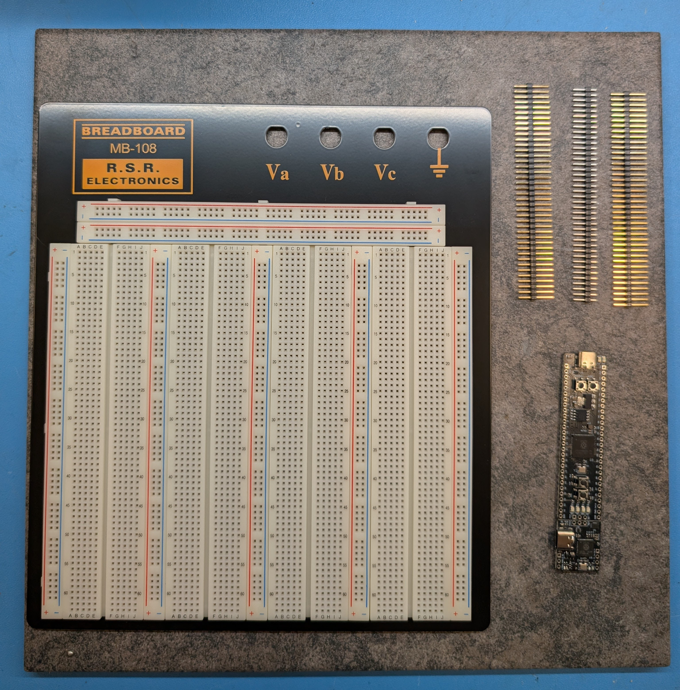

## Soldering the debug pins

Take the single-sided pin header and break it into **two 3-pin headers**.  These will be used to connect the debugger to the Proton board, using the 2x3 through-hole pads (the holes) on both sides of the line joining the Proton board and the debugger.

Take these two 3-pin headers, and place them into the Proton board in the 2x3 pin positions as shown below, but **upside down**, and insert the pins into the breadboard so that the board sits upside down on them.  This will allow us to more easily hold the board in place as we start soldering the 2x3 header.  The pictures below show how to do this.  Make sure the longer side goes in the breadboard, and the shorter side sticks up above the board, as shown in the last image.

    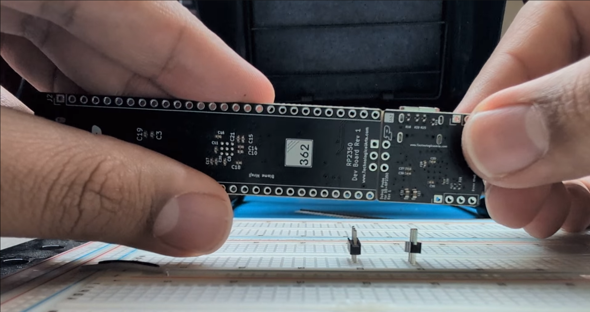
    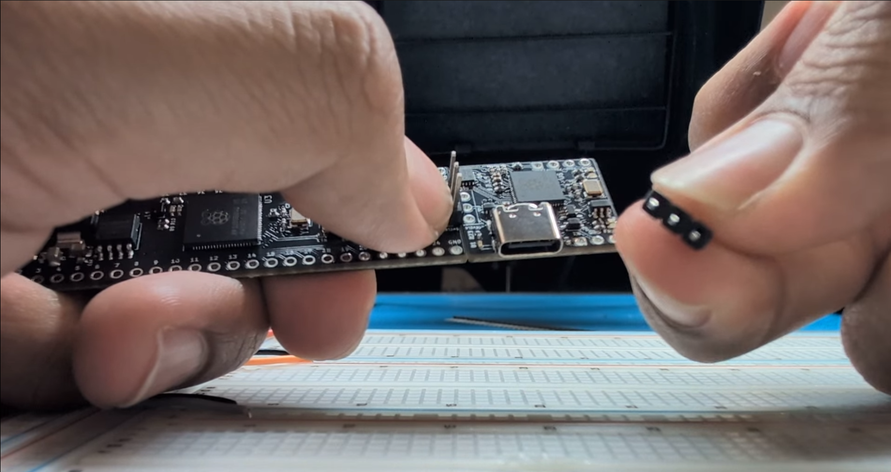
    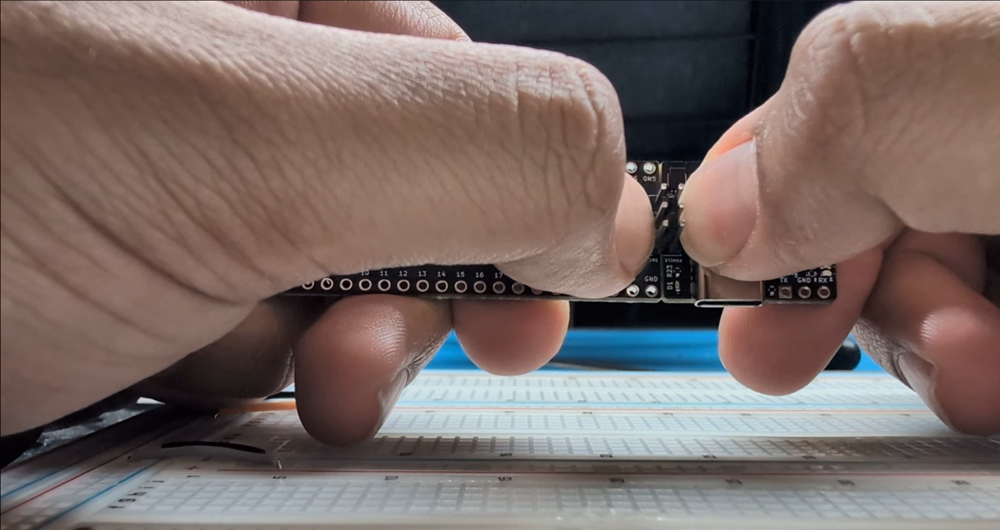
    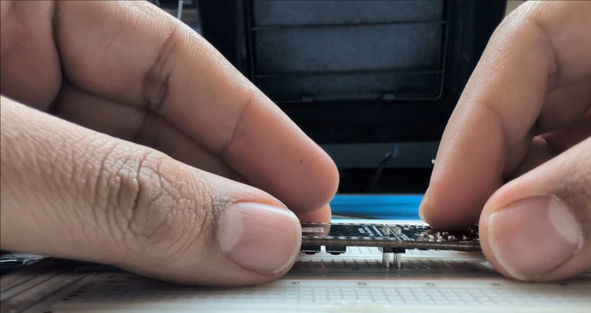
    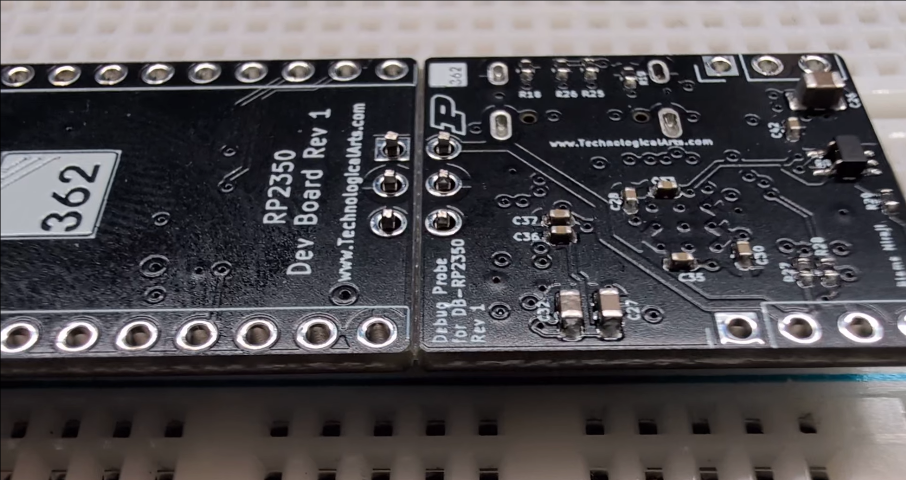

Now, let's get to soldering!  Grab your flux pen - it'll be a white pen with a yellow cap - pull off the cap, and dab the pins with flux as shown below.  The flux ensures proper heat dissipation and allows the melted solder to properly wet the PCB pads and the pins.  This is very important, as it will help the solder to flow properly and create a good connection between the pin and the pad.

    

> [!WARNING]
> At this point, have a TA come over to supervise your work.

Turn on the soldering iron, and wait until the temperature reaches 350 F, or the knob is turned to 75% and until the LED starts blinking (you may have a different kind of soldering iron).

Once the desired temperature has been reached, unspool some solder and hold the solder such that the end of it - which is going to be **heated to a very high temperature!** - is at least an inch away from your fingers.

    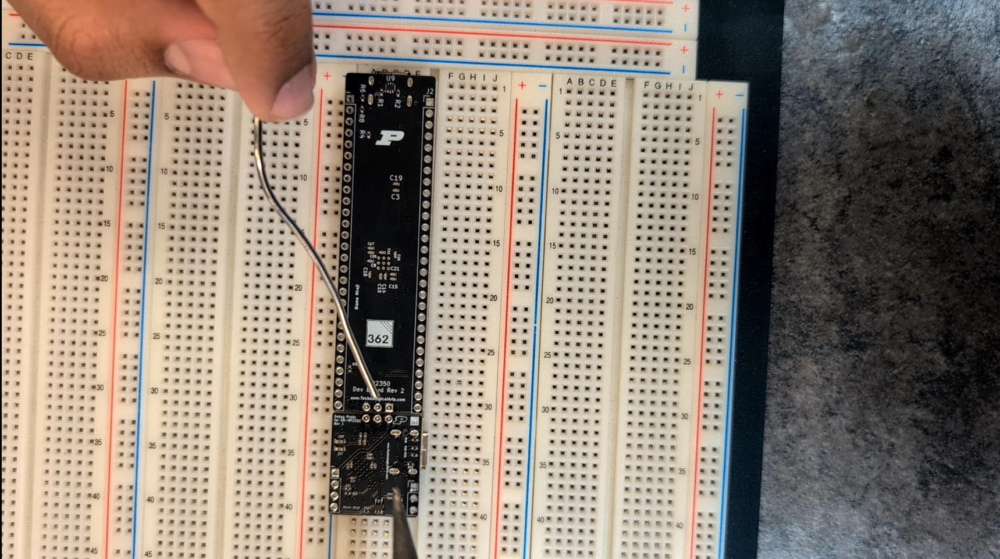

> [!WARNING]
**Read the paragraph below in full and watch the animation first before trying it.**

Touch the iron to the pin and the pad at the same time, wait for about one second to let it heat up, and then touch the solder in between the pin and the pad.  The solder will quickly melt, forming a connection between the pin and the pad, at which point you should pull back the solder and inspect the joint.  

    

Note how the solder "fills up" the gap between the pin and the pad.  

Compare your first soldering job against this diagram to determine if you used too much.  A bit more solder on the pin is fine as long as it won't bridge to another pin.  If you have a hole in the solder joint, you can reheat it and add more solder.

    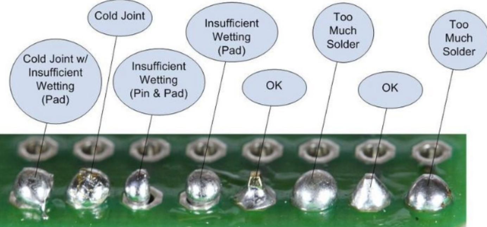

The first soldered pin is critical because at this stage, you can correct any mistakes such as the positioning of the board.  **If the pins are soldered at the wrong angle, you will find it very hard to connect jumpers between them later on.**  If you feel that your board is at an angle, have a TA confirm, hold only the iron to the soldered pin to heat it up, and when it melts, adjust the board, and take off the iron.

If the pins are okay, continue soldering the rest of the pins.  At the end, they should look like this:

    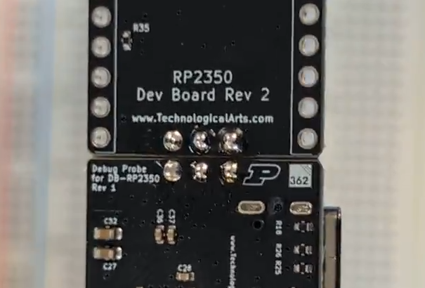
    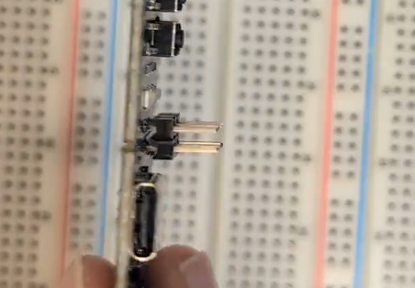

## Soldering the main headers

Take your board off the breadboard, and take the unbroken double-sided row header and break off 27 pins so that it goes in on the other side of the Proton board.  Use the board itself to help you properly count the pins.  Therefore, you should now have the following headers from the set of double-sided headers you received:

- One 4-pin header
    - This will be used as the debug and boot pins on the Proton debugger.
- One 3-pin header
    - This will be used as the UART pins on the Proton debugger.
- Two 27-pin headers 
    - These will go on the rest of the pins on the Proton board.

> [!TIP]
> If you accidentally break off fewer pins, you can still solder on the smaller piece and add the extra pins separately.
> 
> If you accidentally break off more, you can use a pair of pliers to break off the extra pins.  Just be careful not to break the header itself, as it will be difficult to solder on the board.

Place the headers into the breadboard in the positions indicated below.  You should insert it such that the slightly smaller side goes into the breadboard.  This way, we're using the breadboard to ensure proper alignment of the pins to your Proton board.

    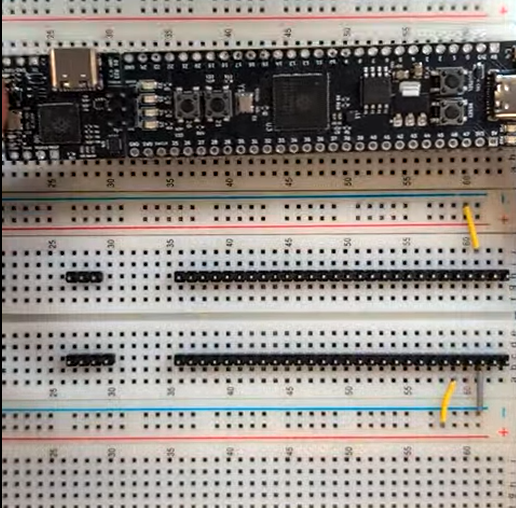

 

Now, put the board back on the pin headers we laid out on the breadboard.  As a reminder, it should go in the third (from the top) row of your breadboard, with the USB-C connector on the short side of the board facing outward, and the debugger USB-C connector facing towards the top of the breadboard, as shown below.

    

The board should sit flush against the pin headers, with all the pins going through the pads.  If it doesn't, take out the pin headers and fix the positioning accordingly.  

Next, apply flux to all the pads on the board with your pen.  You only need about a dab per pin, or until you see the flux liquid appear around the pad.  The easiest way is to drag across the outer boundaries of the pads for an even flux distribution, which is fine since we'll be holding the solder from the outside anyway.

Starting with the side furthest from you, solder the leftmost 5V pin, and the GND pin on the end of the devboard.

    
    

This method isn't quite necessary since we're using a breadboard, but it is good practice to solder the edge pins first to ensure that the pins are in the right position before you continue soldering the rest of the pins.  Look at the board from different angles to ensure that your board is still sitting flush, and that it is not raised at an angle.  If you make a mistake here, now is the time to fix it by re-soldering the two pins with your soldering iron.

Next, we're going to try **drag-soldering** the remaining pins on this side of the board.  Hold the solder line against all the pins, with the end on the rightmost pin, take your iron, and touch the solder to the first pin.  As soon as the solder melts, start moving your iron to the left, pausing to let the solder melt on to each pad before you continue.

*This animation is sped up 4x to reduce file size.  Don't worry if you're not this fast - we weren't!*

> [!CAUTION]
> During this process, pay very close attention to where the metal part of the iron is, where your fingers are, and where the solder is.  

    

Go ahead and do the same with the 4 pins on the debugger, and that should close up our first side of the board!

Flip your breadboard, and do the same thing with the other side, and the 3 pins on the debugger board.

By the end, your board should look like this.  If it does, **congratulations!**

    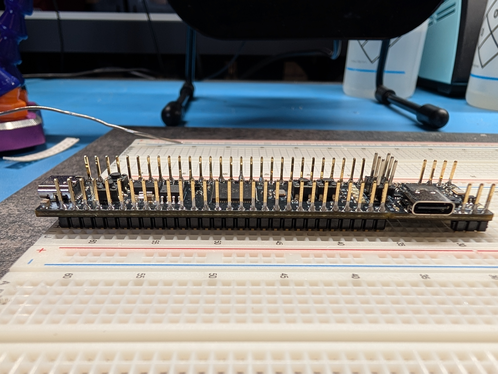

## Cleaning the board after soldering

Now, we need to take the board out of the breadboard to clean it - a difficult task owing to the large number of pins on the board!  You will only have to do this **once** throughout the course.  

Start by **see-sawing** the board out, which is to say that we'll slowly lift the board by its sides, while being extremely careful to not snap the board in the middle.  Look carefully at the line between the two standing pin headers, and you'll see that it appears lighter than the rest of the board - this is to offer you the ability to **snap off** the debugger portion and move it to another part of your breadboard, or to use the board with another type of debugger if you wish.  For the course, however, there is no need to snap off the debugger.

(Even if it does snap, it's not an issue, since we soldered on pin headers and can just connect them later.  But it's nice not to break it!)  

Then, slowly pull up on the board in the middle as shown below, using the black pin shrouds as anchors, which should pull out most of the pins and ensure that too much force is not applied on any one part of the board.

*2x speed to reduce file size.*

    

Spray the board with isopropyl alcohol, focusing on the soldered pins, and lightly scrub it with a metal brush.  This will remove the flux that we applied earlier, and any other contaminants that may have gotten on to the board during soldering.  The alcohol will evaporate quickly, so you don't need to worry about it damaging the board - but of course, give it at least 15 minutes before plugging it in.  If there's still some wetness to the board, take a tissue and dab it off - don't rub.

*2x speed to reduce file size.*

    

## Adding the shunt jumpers

Go ahead and put on the **shunt jumpers** on your board's debugger pins.  The purpose of this 2x3 pin header is to allow you access to the **debugging interface** on your microcontroller, a very common feature in embedded systems development.  When your product goes out into the real world, the debugger is not normally attached, but since our primary focus is **learning** embedded systems, the debugger is critical to understanding what your code is, which is why it's part of your Proton devboard.  Your shunt jumpers should go on between the devboard and debugger, like this:

    

By adding the shunt jumpers, you're connecting the debugger's SWCLK, GND and SWD pins to the pins of the same name on your devboard.  The SWCLK (Serial Wire CLock) and SWD (Serial Wire Data) pins are akin to `clock` and `data` signals that you should recall seeing from ECE 27000, and are used by your computer to communicate with the microcontroller on your board, allowing it to step through your code, set breakpoints, and inspect the values of variables in your code.  

The GND pin is used to ensure that the debugger and microcontroller are on the same ground reference, which is critical for proper communication.

## Admire your work!

Your board is now fully assembled.  Go back to the [lab0-intro](README.md) page to continue with the rest of the lab, and best of luck!
