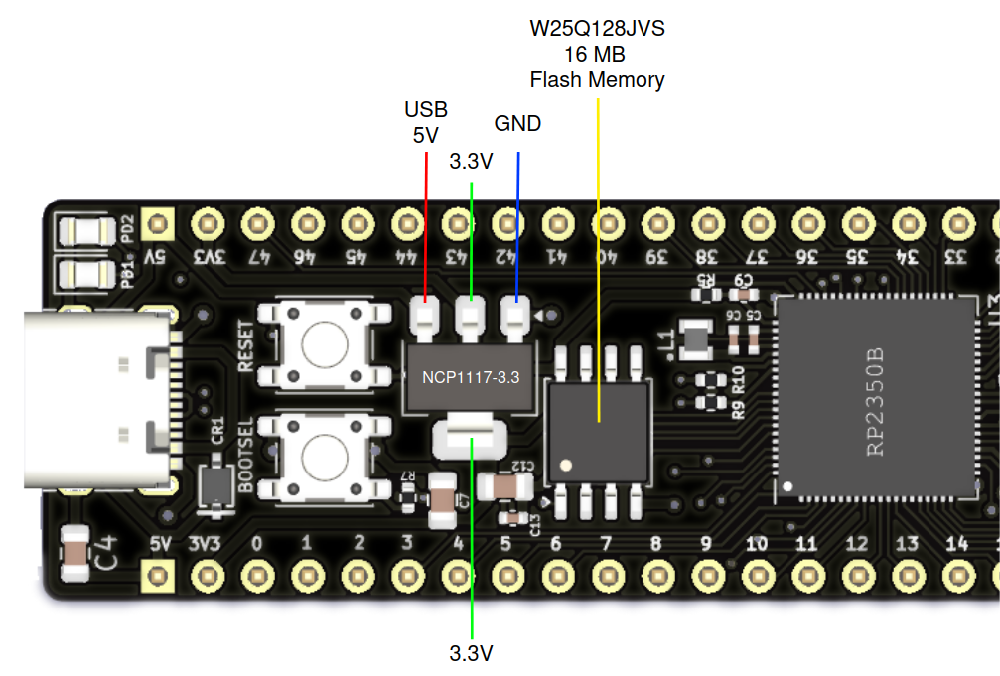
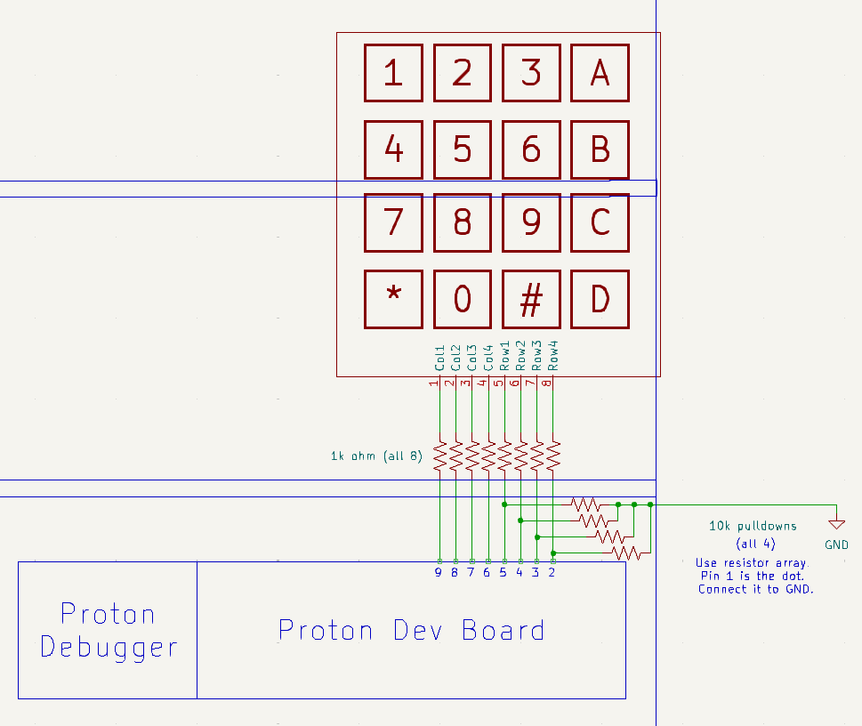
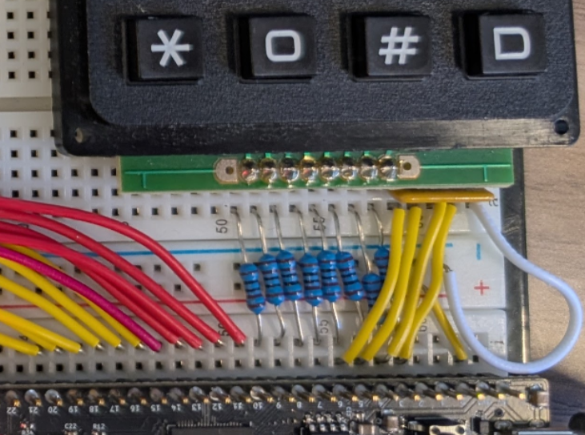

# Lab 1
## General Purpose I/O

### Table of Contents
<br>

| Step | Description | Points |
|------|-------------|--------|
| 0.1 | Set up your environment |   |
| 0.2 | Wire and organize your breadboard |   |
| 1 | Read the datasheet | 50* |
| 2 | Configure output pins for LEDs | 15 |
| 3 | Configure input pins for pushbuttons | 15 |
| 4 | Configure and poll a keypad | 20 |
| 5 | Confirm your checkoffs before leaving | * |
| &nbsp; | Total: | 100 |
<br>

\* - You must get your whole lab checked off before the end of your lab section to avoid a late penalty of 20%.

## Instructional Objectives
- To learn how to find relevant information in a microcontroller datasheet.
- To learn how to interface with LEDs, push buttons and a keypad using GPIO pins.
- To learn how to trigger code execution when an external event occurs.

> [!CAUTION]
> If you have not already soldered pin headers to your Proton board, please do it ASAP.  There is a step in this lab that requires you to put your Proton down on a breadboard.
> 
> Your breadboard should have been signed with a silver sharpie with your username and the signature of the TA.  If you have not yet done this, please notify a TA and get it signed as soon as possible.  **Failure to do so by lab 2 will result in a zero for the lab currently running in that week.**
> 
> Keep in mind the food-and-liquids policy of the lab, which is to bring absolutely no food or liquid with you to your lab sessions.  If you must bring it, keep it under the window in the back of BHEE 160.  **Failure to follow this rule will result in a lab penalty.** 
> 
> ECE 362 labs should be started at home, and checked off in lab.  **Do not wait to start your lab in your lab section, or you will not finish.**  You must be checked off for all steps in lab to receive full credit.

> [!NOTE]
If at any point you need to get checked off, or need to get help, you can add yourself to the [lab queue](https://engineering.purdue.edu/~menon18/queup/?room=36200).  **Bookmark this link in your lab machine browser.**

## How does your RP2350 microcontroller on the Proton board work?

The Proton board is, strictly speaking, not actually the microcontroller itself - it is a **development board** on which you have an RP2350B microcontroller, which is the black square chip in the center of your Proton board.  This chip is what holds your microcontroller's CPU cores and peripherals.  The 8-pin Winbond W25Q128JVS flash memory chip above the RP2350 is what receives and stores your program when you click "Upload" in VScode.  The 4-pin NCP1117 chip is a voltage regulator that takes the 5V input from your USB port, and converts it to 3.3V to use with the RP2350.  

When you press the button labeled Reset, or provide power to your board, the voltage regulator will power the RP2350 chip, which then reads the program from the Winbond flash memory and executes it.  That code can then be made to interact with the peripherals on the RP2350 chip, and for this lab in particular, configure and control the GPIO pins on the RP2350.



Therefore, when we want to understand the internals of the microcontroller we wish to work with, we want to look up datasheets for "RP2350", not "Proton", which is the *development board* that carries the RP2350.  A similar parallel would be the "Adafruit HUZZAH32" which carries an "ESP32" microcontroller.  

## General Purpose Input/Output (GPIO)

Your microcontroller ~~can be~~ is considered a fully functioning computer, much unlike the machine you happen to be reading this on.  A key difference is how your microcontroller interacts with the outside world.  Your laptop has a keyboard, mouse, and screen that allow you to interact with it.  Your microcontroller, however, has **GPIO pins** that allow it to interact with the outside world.  

In this experiment, you will learn how to connect and configure simple input devices (push buttons and keypad) and output devices (LEDs) to your Proton development board's GPIO pins. 

GPIO pins on any microcontroller can take on one of three functionalities:

1. The pin can be configured as an **input** that can **read** a voltage level from an external component.  This is useful for reading the state of a button, or the output of a sensor.

2. The pin can be configured as an **output** that can **drive** or output a voltage level to an external component.  This is useful for turning on an LED in series with a resistor, or engaging an actuator.

3. Or, the pin can be used for by another peripheral on your microcontroller entirely.  This is useful for allowing other peripherals on the microcontroller, such as UART, SPI, ADC/DAC, etc. to use the pin for their own purposes.

This lab will be the first time that you will write code that *configures* a peripheral.  The way setting up a microcontroller works is by writing some code that configures the **hardware registers** - sections of memory that control the behavior of the microcontroller's CPU core and/or its peripherals.  The RP2350 microcontroller on your Proton board has a set of hardware registers that control the behavior of the GPIO pins, and you will write code that configures these registers to control the behavior of the pins.

For the RP2350 specifically, the registers will look like this:

```c
peripheral_hw->registername
```

So the output of the GPIO pins, controlled by the SIO peripheral, is this 32-bit register:

```c
sio_hw->gpio_out
```

where each bit of the register corresponds to a different GPIO pin.  The GPIO pins are numbered from 0 to 47, but since registers are only 32 bits, `gpio_out` only corresponds to GP0 (least significant bit) to GP31 (most significant bit).  Therefore, bit 0 of the register corresponds to GPIO pin 0, bit 1 corresponds to GPIO pin 1, and so on.  For GPIOs higher than 31, there is the `sio_hw->gpio_hi_out` register.

> [!NOTE]
> *Why not just have one register for all 48 GPIO pins?*  
> OR *What does it mean to say that the RP2350 is a 32-bit microcontroller?*
> 
> The RP2350 CPU cores are **32-bit**, which means the largest register they can operate on in a single "cycle" is 32 bits.  You may see functions that imply they can change 64 bits of data at a time, but if you dive into it, it's just writing to two 32-bit registers, e.g. `gpio_put_all64`.

Nearly all of you are coming from ECE 270, where you wrote Verilog to implement hardware.  This course is a continuation of that, in that your microcontroller is the overall **top module** that instantiates the various peripherals as **submodules**.  Changing register values is just changing the values connected to the submodules' **ports** or **internal `logic` registers**.

When you flash your microcontroller with a program, the instructions executed by the CPU/top module in that program can be used to change the values of the registers in those peripherals/submodules.  This is how we will implement an **embedded system**.

Modifying all these registers directly can get tedious, so Raspberry Pi (in this case) provides a **Software Development Kit** (SDK) that provides functions that can be used to modify these registers.  

However, any good embedded systems engineer should understand how the SDK functions work at the register level, because the registers are the only effective way to debug our code when it doesn't work as expected - we saw this in lab 0 when looking at the `gpio_out` register, for example.  Therefore, for each lab, you can **look through** the SDK functions for the new peripheral you're learning about, but you must **dive** into the functions to see what registers they are modifying, and explain that to your TAs.

Back to GPIO - to configure a pin to act as an output to drive current to some external component like an LED, you will need to dive into those SDK functions, and write code that modifies specific registers in memory to do so.  

## Step 0.1: Set up your environment

Make sure to clone the code repository from GitHub Classroom.  Keep in mind to add, commit and push any changes you make so that your work is accessible from a lab machine. 

> [!CAUTION]
> **If you have not set up VScode with PlatformIO as described in Lab 0 on BOTH your physical machine and your lab machine, please do that now.**  
> 
> Having two working environments provides you the necessary redundancy to ensure you can still work in case one environment randomly stops working.  Use `git` to keep your work synced to GitHub whenever you finish a step, and seamlessly transition to the other machine when you have to do so.  
> 
> **Please do not assume a data catastrophe will not happen to you, because it absolutely can.  Commit and push often.**

In addition, a precompiled autotest object has been included in your template folder.  You can utilize it to test the subroutines (another word for functions).  To run the autotest, uncomment the `autotest()` call in the `main` function and click "Upload and Monitor".  Make sure that your debugger is connected via USB, that the shunt jumpers connecting the debugger to your Proton board are in place, and the the Proton board is also connected via USB.

We recommend leaving `autotest()` commented out until you actually need it - it adds about 20 KB of code to your program, which can take a long time to upload.  Uncomment it when you need to test a step, or need to generate a confirmation code to get checked off.

If you get a message asking you to **select** a serial port because there are multiple, you need to select the one that corresponds to your Debug Probe.  First, unplug the Debug Probe, try "Upload and Monitor" and note the ports that appear in the dropdown.  Then plug in the Debug Probe, and try "Upload and Monitor" again.  The new port that appears is your Debug Probe.  Select that port.

- If you are on Linux, the port will be `/dev/ttyACM0`.  
- If you are on Windows, the port will be `COMX`, where `X` is a number.  The Debug Probe will usually be the last port in the list.
- If you are on Mac, the port will be `/dev/cu.usbmodemXXXX` where `XXXX` is a number.  

If you don't see anything after the serial port connection is established, press the Reset pushbutton to see the introductory text from `autotest` - the text won't appear because VScode/PlatformIO wasn't ready when the text was printed from your Proton board.  Try typing something, and you should see the characters appear.  That should confirm the connection is working as intended.

Once you press the Reset button after the monitor appears, you should see a prompt similar to the following:

```text
GPIO Lab Test Suite
Type 'help' to learn commands.

> 
```

You can then type `help` to learn what commands you can use to test a certain subroutine.  You will use this to demo your implementation and wiring to the TAs.

> [!TIP]
> If you're getting tired of having to click through menus to click "Upload and Monitor", start getting used to **keyboard shortcuts**.  After you type it the first time, it's easier to press Ctrl-Shift-P and Enter to quickly rerun your last command.
> 
> You can also set up keyboard shortcuts to quickly run "Upload and Monitor" (usually Ctrl-Alt-U) or "Start Debugging" (usually F5).
> 
> Quirks like these make programming easier.  If you feel like a process is *arduous*, there is very likely an easier way to do it.  (This is an example of [Occam's Razor](https://en.wikipedia.org/wiki/Occam's_razor).)  Google should always be your first recourse, particularly the documentation for PlatformIO, VScode, and/or the Raspberry Pi docs.  If you can't find anything, ask a TA or your peers for these quick hacks to make yourself more productive.

## Step 0.2: Wire and organize your breadboard

In ECE 36200, unlike prior courses, you will build on the **same** circuit in each lab.  This allows you to build up a full development board that will help you more easily prototype designs with a variety of external components.  **Therefore, it is very important that you follow the layout we provide in the lab manual.**  This will make it easier for you to debug your circuit, and for your TAs to help you debug your circuit.  It will also ensure you have space for all your components as long as you follow the layout.  **TAs will not help with complex wiring if it does not follow the required layout.**

At this point, you should have only the Proton development board on your breadboard.  In this lab, we'll add the keypad in the row above the Proton board, making space for wiring.  See the diagram below.  





There are two sets of resistors in the schematic.  The 8 1k ohm resistors are used to limit the current through the keypad, so you don't accidentally damage the keypad.  

The 4 10k ohm resistors are implemented with the 5-pin yellow **resistor comb**, which allows us to easily add a resistor at every point on the breadboard, except for pin 1, which is connected to ground.  These are very useful for implementing a lot of **pull-down resistors** at once, which is a fix needed for a bug in the RP2350 that causes the ROW GPIO pins, configured as inputs, to float when they are not connected to anything.  Your resistor comb's pin 1 is identified by a black dot on the side of the comb.  

Use the pin numbers on your Proton board to determine which pins to connect the resistors to.  The picture above shows how best to connect the 5-pin resistor comb to your Proton board.  If you prefer another method, that's up to you.

## Step 1: Read the Datasheet

The first step to understanding any microcontroller is to **read the datasheet**.  This is a universal *first step* that we want you to remember for not just microcontrollers, but various parts that you will interface to in the future.  Every single lab will have this first step.

### 1.1 Do your research

Bookmark the [Proton datasheets page](https://ece362-purdue.github.io/proton-labs/datasheets/) to be your starting point, where we link the various Raspberry Pi pages that you will find helpful in understanding and utilizing the RP2350 microcontroller.

You can gain a basic introduction to your RP2350 chip by reading [Chapter 1: Introduction](https://datasheets.raspberrypi.com/rp2350/rp2350-datasheet.pdf#%5B%7B%22num%22%3A15%2C%22gen%22%3A0%7D%2C%7B%22name%22%3A%22XYZ%22%7D%2C115%2C841.89%2Cnull%5D).  If there are terms that you don't understand, look them up, or ask a TA.  You may have to scroll down to the next page.

Next, read [Chapter 9: GPIO](https://datasheets.raspberrypi.com/rp2350/rp2350-datasheet.pdf#%5B%7B%22num%22%3A587%2C%22gen%22%3A0%7D%2C%7B%22name%22%3A%22XYZ%22%7D%2C115%2C841.89%2Cnull%5D) as well as [Chapter 3.1.3: GPIO Control](https://datasheets.raspberrypi.com/rp2350/rp2350-datasheet.pdf#%5B%7B%22num%22%3A41%2C%22gen%22%3A0%7D%2C%7B%22name%22%3A%22XYZ%22%7D%2C115%2C707.498%2Cnull%5D) under SIO.

Under the Programmer's Model sections, identify functions that the Pico SDK provides, e.g. `gpio_init`.  Type `gpio_init(21);` into VScode inside the `init_inputs` function, and note how the editor highlights the function.  Now, if we were hobbyists, we would copy in the functions from the datasheet and call it a day.  But as learners in a 300-level computer engineering course, we do things a little differently.  If you want to be **effective** as an embedded systems engineer, you need to understand the register level at which your microcontroller operates.  In a nutshell - every function changes some hardware register in the microcontroller, causing a change in the behavior of either the CPU or the peripherals.  Understanding how those functions work is key to being able to debug your code at the register level when it doesn't work as expected.

So, what we're going to do is **dive** into what this function does.  When you hover your cursor over the function and VScode highlights it, that means that you can access the definition for it.  Hold down either the Ctrl/Cmd/Alt button and click on `gpio_init` to see where it is defined (you'll determine the right button if your cursor changes to the one you see when you click a hyperlink).  This takes you to the `gpio.c` file, where you'll see the code for `gpio_init`, and how it configures a pin to be an input, initializes the pin to a logic 0 (which is redundant for an input), and sets the function for the pin to be SIO.

The animation below shows how you can *nest-dive* into the functions that make up `gpio_init` as well, down to the register level.  

https://github.com/user-attachments/assets/081f1251-55cd-4d20-8b06-419479307833

See the animation above, and use that technique to dive into the three constituent functions of `gpio_init` to determine what registers are being modified, and note them down.  A register takes the form `peripheral->registername`, for example `sio_hw->gpio_in`.  Here, the peripheral that controls the GPIO pins is `sio_hw`, and `gpio_in` is the register that returns the high/low state of the GPIO pins, with each bit of the register indicating a different pin.

### 1.3 Answer these questions

Now that you've understood function diving, answer the questions below.  **You should find the answers only in the datasheet and the SDK, and not on any other website.**  We will ask you to show where you found your answers and how you arrived at them, so take notes on how to find your answers so that you can show your TA once you arrive in lab.

1. (12 points) What are the four `sio_hw` registers involved in setting the direction of a GPIO pin?  List two reasons for when one pair of registers should be used over the other.  Show your TA where you found this information after diving through the `gpio_init` function.  

2. (3 points) Give an example of a value for `mask` that would configure GP21 and GP26 as inputs, and which of the four registers it should be written to.  Note that `PICO_USE_GPIO_COPROCESSOR` is not defined and that the total number of GPIOs on the RP2350B is 48.

3. (5 points) What registers would you check to confirm if a GPIO pin numbered between 0 and 47 was already configured as an input or output?  Show your TA how you arrived at your answer.  (Hint: the registers above are write-only, so you can't read them back to check if pins were configured correctly.)

4. (5 points) What two pairs of registers are used to change the value of a GPIO pin numbered between 0 and 47 (i.e. high/low, logic 1/0)?  Show your TA how you arrived at your answer.

5. (5 points) What two pairs of registers can be used to read the value of a GPIO pin numbered between 0 and 47, regardless of whether it is configured as an input or output?  Show your TA how you arrived at your answer.

6. (15 points) Determine the SDK function that configures the GPIO pins to be associated with `GPIO_FUNC_SIO` which lets the GPIO pins be controlled using the registers above.  Within that function, explain to your TA which lines of code do the following:
    - Set input enable on, output disable off for a GPIO pin.
    - Set the function for a GPIO pin to SIO.  (What is the function number for SIO?)
    - Turn off the **isolation latch** for a GPIO pin, so that the SIO peripheral can control the pin.

7. (5 points) In the function that sets the function for a GPIO pin, there is code specifically for the RP2350 (`#if !PICO_RP2040`) that has the comment "// Remove pad isolation now that the correct peripheral is in control of the pad".  Read Section 9.7 to understand what a "pad" is, and why you need to remove the isolation latch.  Show the relevant paragraph to your TA and discuss it so you understand it.  

> [!TIP]  
> The registers you find should start with `sio_hw` or `io_bank0_hw`, which are the SDK-provided structs that define hardware registers that, in turn, control the GPIO pins.  (You can even *dive* into `sio_hw`/`io_bank0_hw` to see the memory addresses they are defined at, and compare that to your datasheet!)  
> 
> The C/C++ SDK documented [here](https://datasheets.raspberrypi.com/pico/raspberry-pi-pico-c-sdk.pdf) will give you the full list of available API functions that you can *dive* into.  E.g. for GPIO SDK functions, look under the `hardware_gpio` subsection in Section 4 > Hardware APIs.  Use Ctrl-F to jump to it faster.

> [!IMPORTANT]
> Show your answers for the questions asked above to your TA.  You must have **correct** answers to earn points for this step.  
> 
> You are **not allowed** to use AI/LLM to find these answers.  These questions are specifically designed to get you used to looking at the datasheet and SDK for information, and for *you* to understand the microcontroller's specific configuration.  AI becomes helpful when you first understand what you need to look for when you're using a second new microcontroller, and not the first time that you are learning how a microcontroller works, and sometimes not always - especially if the microcontroller is new enough that your favorite LLM hasn't been updated on how it works.

## Step 2: Configure output pins for LEDs

> [!CAUTION]
> We're now entering your first coding assignment, so we will mention this once again - **do not use AI/LLM tools to auto-generate this code**.  **If a TA observes you using Copilot/ChatGPT or similar tools in lab, you will be subject to academic dishonesty penalties and disciplinary action**.  
> 
> Aside from the fact that it is academically dishonest to lift code from another source, the purpose of the labs is to teach you how to use your microcontroller and understand it at its lowest level.  Copying code from someone else (a person or an LLM) is going to handicap your ability to parse, analyze and apply information from multiple sources - critical to implementing new designs and debugging them.
>
> In the short term, you should take this rule seriously because you will have a lab practical that asks you to write code for your board **without access to the Internet**.  If you use an LLM throughout the labs or collaborate with others, you will really struggle on the practical when you won't have access to it.

Implement the function `init_outputs` to configure GPIO pins 22, 23, 24, 25 (also called GP22, GP23, GP24, GP25) as outputs.  You do not need to change any other properties (slew rate, drive strength, etc).  Use the three functions you found in `gpio_init` to do this for each of the pins, or use your answers from above and write the code directly in terms of the registers you found.  (The latter method is more efficient than the other, but you can choose whichever you prefer.)

GP22-GP25 are the four user LEDs just beneath the "21" and "26" buttons on your Proton board, closer to the debugger.

In your `main` function, call `init_outputs`, and then start an infinite loop that does two things: 

1. Turn ON each LED from GP22-GP25 in sequence, with a 500 ms delay between each LED. 

2. Turn OFF each LED from GP22-GP25 in sequence, with a 500 ms delay between each LED. 

Does this sound too easy?  Here's the catch - **you need to do this without using any of the SDK functions except `sleep_ms`**.  It is actually easier to do so, and doesn't involve any loops.  Don't worry, we'll go back to the SDK functions in the next lab, but you may find that you prefer this method of directly modifying registers as an optimal technique.  

> [!TIP]
> Instead of using `gpio_put` for every one of the four LEDs, you can just write `0xF` by a certain offset to a certain register to turn on all four LEDs in one go, with no loops.
> 
> You can use the `sleep_ms` function to implement sleep.  What `sleep_ms` does is set a timer in the microcontroller that counts down from the specified number of milliseconds, and when it reaches 0, it **interrupts** the CPU (which enters a sleep state) and wakes it up.  You can dive into the function yourself to see how it works.

Your LEDs should turn on and off like a Johnson counter (animated to make it easier to see):


> [!IMPORTANT]
> Demonstrate to your TA that your code passes the `init_outputs` test in `autotest`, and that the LEDs turn on in sequence.  Answer their questions and show them your code.  
> 
> Commit all your code and push it to your repository now.  Use a descriptive commit message that mentions the step number.

## Step 3: Configure input pins for pushbuttons

Configuring inputs is mostly *symmetric* to how we configured outputs.  

> [!TIP]
> With your breadboard facing you such that the Proton board's USB is on the right, and the debugger's USB cable goes out to the top of your breadboard, the "left" pushbutton is the one connected to GP26, and the "right" pushbutton is the one connected to GP21.  You can also read the labels next to the buttons to confirm.

In `init_inputs`, write code to configure GP21 and GP26 as inputs.  This should look very similar to what you did above, with a few differences.  Keep in mind that there is no need to set the value of an input pin to 0 or 1 - it just reads the value of the pin.

In `main`, comment out the infinite loop you wrote earlier for `init_outputs`, but leave the call to the function uncommented.  Write below that function call.

Call `init_inputs` in your `main` function, and do the following to test your pushbuttons.  In an infinite loop:

1. If the pushbutton on GP21 is pressed, turn on all the LEDs (GP22-GP25).
2. **Otherwise**, if the pushbutton on GP26 is pressed, turn off all the LEDs (GP22-GP25).
3. Add a 10 ms sleep between each iteration of the loop.

As you did before, **you need to do this without using any of the SDK functions** except `sleep_ms`.  It is actually easier to do so, and doesn't involve any loops.

Upload your code and test it.  Pressing GP21 should turn on all the LEDs, and pressing GP26 should turn them all off.  If you press both buttons at the same time, the "21" button should take priority.

> [!IMPORTANT]
> Demonstrate the behavior described above to your TA, and show that you are passing the `init_inputs` test in autotest.  Answer their questions and show them your code.  
> 
> For full credit, your `init_inputs` function must not use any of the SDK functions (`gpio_init`, etc.) and must only directly modify registers.  
>
> Commit all your code and push it to your repository now.  Use a descriptive commit message that mentions the step number.

## Step 4: Configure and poll a keypad

The keypad is your most important key-entry mechanism that you'll likely encounter.  It's a matrix of rows and columns, where each keypress connects a row to a column.  With each lab, we'll improve on the code that will poll the keypad for button presses, but for this lab, we'll keep it simple and do it directly in the main C code.

**Double-check your keypad wiring from Step 0.2!**


Configure the following pins as follows in the function `init_keypad`:
- GP2, GP3, GP4, GP5 as inputs to the rows
- GP6, GP7, GP8, GP9 as outputs to the columns

After `init_inputs`, comment out the infinite while loop we added.  Call `init_keypad` in the `main` function, and then implement the following pseudocode below the `init_keypad` call:

```C
int COLS[] = {6, 7, 8, 9};  // COL4=GP6, COL3=GP7, COL2=GP8, COL1=GP9
int ROWS[] = {2, 3, 4, 5};  // ROW4=GP2, ROW3=GP3, ROW2=GP4, ROW1=GP5
while (true) {
    loop i = 0, 1, 2, 3 {
        set pin at COLS[i] to be 1
        sleep for 10 ms using "sleep_ms"
        read the value of the pin at ROWS[i]
        if pin at ROWS[i] is 0, turn OFF the corresponding LED (e.g. if i == 0, turn OFF GP25. if i == 3, turn OFF GP22)
        else, turn ON the corresponding LED
        turn off pin at COLS[i]
    }
}
```

Again, you need to do this without using any of the SDK functions except `sleep_ms`.  

Note the `sleep_ms` line - this is needed to ensure that when we drive a logic 1 to the pin, the current "settles" before we read the row pins, so that we can get a reliable reading.  However, this does mean that there is at least a 40 ms delay between two detections of the same keypress.  Try playing with the sleep duration to see how it affects your keypad's responsiveness.

Students often get confused at this step - if you'd like a visualization of what's supposed to happen when reading the keypad, here's a flowchart.  Each key on the diagonal should turn on one LED, and their associated positions are shown on the diagram:


So, holding 1 should turn on the LED at GP22 (red), holding 5 should turn on the LED at GP23 (yellow), holding 9 should turn on the LED at GP24 (green), and holding D should turn on the LED at GP25 (blue).  Holding multiple keys should turn on multiple corresponding LEDs.  If you press a key and the LED does not turn on, check your wiring and make sure that `init_outputs` is still being called in your `main` function.

> [!IMPORTANT]
> Demonstrate to your TA that your code passes the `init_keypad` test in `autotest`, and that pressing 1/5/9/D turns on the corresponding LEDs on your board.  Answer their questions and show them your code.  
> 
> For full credit, your `init_keypad` function must not use any of the SDK functions (`gpio_init`, etc.) and must only directly modify registers.  
> 
> Commit all your code and push it to your repository now.  Use a descriptive commit message that mentions the step number.  

## Step 5: Confirm your checkoffs before leaving

> [!CAUTION]
In ECE 362, you must do two things to achieve full credit on a lab:
1. **Demonstrate all steps you were able to complete to your TA**.  You are expected to verify that you got checked off here: https://engineering.purdue.edu/ece362/checkoff/  The last step is a penalty step and must have been given full credit to avoid a lab penalty.
2. Run `verify` in `autotest` to generate your confirmation code.  Make sure to first set your username in the `main.c` file.  Save the confirmation code ONLY into a new file called "confirmation.txt" in the root of your repository.  **Double-check that your confirmation code is accepted on Gradescope and that it gives you the points you earned**, **because we will not change scores** for missing or mistakenly-typed confirmation codes after the lab is due.

Failure to get checked off for all completed work (as per the confirmation code) will result in a 20% penalty.  Getting checked off is for necessary physical verification by your TAs that you did your work on your own breadboard.

Failure to submit a **valid** confirmation code, at least before the late penalty deadline, will result in a **zero**, regardless of what other work was uploaded.  Even if you did not finish by the end of your lab section, you **must** still submit a confirmation code once you are done with your lab to ensure you get credit for those steps, even when a late penalty will be added later.

In the event of a mismatch between checkoffs or the confirmation code, the lower of the two scores will be your lab score.  Therefore, if you checked off steps 1-3, and submitted a confirmation code for steps 1-4, you will only get points for steps 1-3.  This is especially important for physical checkoffs, so even if you are late on a lab, please make sure to get checked off in office hours after your lab section.

Once you have done both things, **call a TA to confirm that you can leave**.  They will ask you to check that you submitted your work and that your station is clean.  **Failure to do so will result in a penalty (cleanliness, late) for the lab currently running in that week.**  Once your TA confirms that you are good to leave, confirm your checkoffs, log out of the machine, and you will be free to leave.
