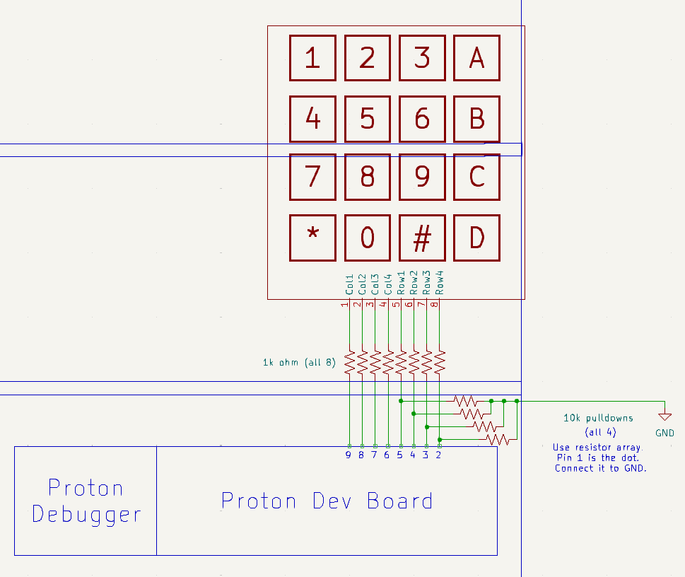
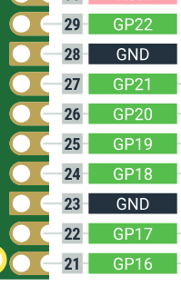
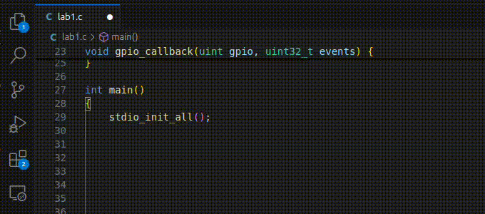

# Lab 1
## General Purpose I/O

### Table of Contents
<br>

| Step | Description | Points |
|------|-------------|--------|
| 0.1 | Set up your environment |   |
| 0.2 | Wire and organize your breadboard |   |
| 1 | Read the datasheet | 10 |
| 2 | Configure output pins for LEDs | 10 |
| 3 | Configure input pins for pushbuttons | 10 |
| 5 | Configure and poll a keypad | 20 |
| 7 | In-Lab Checkoff Step | 20* |
| &nbsp; | Total: | 100 |
<br>

\* - You must get your whole lab checked off before the end of your lab section to avoid a late penalty of 20%.

## Instructional Objectives
- To learn how to find relevant information in a microcontroller datasheet.
- To learn how to interface with LEDs, push buttons and a keypad using GPIO pins.
- To learn how to trigger code execution when an external event occurs.

> [!IMPORTANT]
> By now, your breadboard should have been signed with a silver sharpie with your username and the signature of the TA.  If you have not yet done this, please notify a TA and get it signed as soon as possible.  **Failure to do so by lab 2 will result in a zero for the lab currently running in that week.**
> 
> Keep in mind the food-and-liquids policy of the lab, which is to bring absolutely no food or liquid with you to your lab sessions.  If you must bring it, keep it under the window in the back of BHEE 160.  **Failure to follow this rule will result in a penalty.** 
> 
> Similar to 270, 362 labs should be started at home, and checked off in lab.  **Do not wait to start your lab in your lab section, or you will not finish.**  You must be checked off for all steps in lab to receive full credit.

> [!NOTE]
If at any point you need to get checked off, or need to get help, you can add yourself to the [lab queue](https://engineering.purdue.edu/~menon18/queup/?room=36200).  **Bookmark this link in your lab machine browser.**

## General Purpose Input/Output (GPIO)

In this experiment, you will learn how to connect simple input devices (push buttons and keypad) and output devices (LEDs) to your Pico 2 development board. 

The basic idea behind GPIO is to interface the microcontroller to external components.  The pins of your microcontroller are, first and foremost, GPIO pins, which means that they can take on one of three functionalities:

1. Input: The pin can **read** a voltage level from an external component.  This is useful for reading the state of a button, or the output of a sensor.

2. Output: The pin can **drive** a voltage level to an external component.  This is useful for turning on an LED in series with a resistor, or engaging an actuator.

3. Alternate Function: The pin can be used for a unique purpose that is not strictly input or output.  This is useful for allowing other peripherals on the microcontroller, such as UART, SPI, ADC/DAC, etc. to use the pin for their own purposes.

## Step 0.1: Set up your environment

Make sure to clone the code repository from GitHub Classroom.  Keep in mind to add, commit and push any changes you make so that your work is accessible from a lab machine. 

> [!CAUTION]
> **If you have not set up VScode with the Pico extension as described in Lab 0 on BOTH your physical machine and your lab machine, we strongly recommend that you do that now.  Having two working environments provides you the necessary redundancy to ensure you can still work in case one environment randomly stops working, and you can use `git` to back up your work and seamlessly transition to the other machine.  Please do not assume this will not happen to you, because it absolutely can.**

In addition, a precompiled autotest object has been incorporated into the template folder.  You can utilize it to test the subroutines (another word for functions). To do so, make sure you have connected the UART serial adapter and the STLink to the microcontroller. Then you will need to uncomment the line `autotest()` in the `main.c` file and start the debugging on System Workbench. After the debugger successfully launches, make sure it goes into the `autotest()`, and launch a serial connection to the microcontroller in a terminal by clicking "Upload and Monitor" in the PlatformIO tab (the same one in lab 0).  

If you are on Windows, take care to select the correct COM port in the Serial Monitor window.  

If you are on Linux (eg. a lab machine) and want to see the output in a separate window from VScode, you can also launch a serial connection in a separate window by clicking "Upload" only, and then typing `screen /dev/ttyACM0 115200` into a terminal.  To exit `screen`, press Ctrl-A, backslash (\\) and then 'y'.

If you don't see anything after the serial port connection is established, press the Reset pushbutton you wired in lab 0 to see the introductory text from `autotest`.  Try typing something, and you should see the characters appear.  That should confirm the connection is working as intended.

You should see a prompt similar to the following:

```text
GPIO Lab Test Suite for Pico 2
Type 'help' to learn commands.

> 
```

You can then type `help` to learn what commands you can use to test a certain subroutine.  You will use this to demo your implementation and wiring to the TAs.

> [!TIP]
> If you're getting tired of having to click through menus to click "Flash Project (SWD)", start getting used to **keyboard shortcuts**.  It's easier to press Ctrl-Shift-P and Enter to quickly rerun your last command.
> 
> Quirks like these make programming easier.  If you feel like a process is *arduous*, there is very likely an easier way to do it.  (This is an example of [Occam's Razor](https://en.wikipedia.org/wiki/Occam's_razor).)  Google should always be your first recourse.  If you can't find anything, ask a TA or your peers for these quick hacks to make yourself more productive.

## Step 0.2: Wire and organize your breadboard

In ECE 36200, unlike prior courses, you will build on the **same** circuit in each lab.  This allows you to build up a full development board that will help you more easily prototype designs with a variety of external components.  **Therefore, it is very important that you follow the layout we provide in the lab manual.**  This will make it easier for you to debug your circuit, and for your TAs to help you debug your circuit.  It will also ensure you have space for all your components as long as you follow the layout.  **TAs will not help with complex wiring if it does not follow the required layout.**

At this point, you should have only the Pico 2 development board and a reset pushbutton on your breadboard.  In this lab, we'll add two pushbuttons to the left of the reset button, LEDs on the lowest breadboard in series with current-limiting resistors, and the keypad towards the top of the breadboard.  This schematic shows the required layout for the lab:



To match the pin numbers on the schematic, the pinout for your Pico 2 can be found [here](https://datasheets.raspberrypi.com/pico/Pico-2-Pinout.pdf).  We **strongly recommend** you bookmark links like these for quicker access.  It is possible to create a bookmark folder in your browser and add links to datasheets, the lab manual, and other resources you use frequently.  This will save you time in the long run.

**Be careful as you match the pin numbers while wiring your circuit** - the numbers on the schematic are the GPIO numbers, **not** the physical pin numbers.  For example, when connecting the left pushbutton on the schematic to the Pico 2, you will connect it to GP20, not physical pin 20.  This is because in the code, the GPIO numbers are how we reference the pins.  There's also pins like RUN, VBUS, VSYS, GND that aren't GPIO pins, so you can't use them in your code.

> [!TIP]
> The original Pico 2 board from Raspberry Pi does not etch the pin numbers on the physical board, which is not great when you're ensuring the correct pins are connected.  If you take a closer look at the pins on the board, you'll notice that the GPIO pins have **circular castellations** whereas the ground pins have **square castellations**.  Use those to guide you by starting your pin counting from one of them rather than from the end so that it's less tedious.  The pinout diagram shows this as well:
> 
> 
> 
> Another idea is to tape small pieces of paper to the wires you connect with the pin number written on them, making future connections easier to make.

## Step 1: Read the Datasheet

The first step to understanding any microcontroller is to read the datasheet.  This is a universal *first step* that we want you to remember for not just microcontrollers, but various parts that you will interface to in the future.  

The Pico 2 board is, strictly speaking, not actually the microcontroller - it is a **development board** on which you have an RP2350A microcontroller, which is the black square chip in the center of your Pico 2 board.  This chip is what holds your microprocessor cores and peripherals.  The flash memory chip that sits above RP2350 is what receives and holds your program when you click "Flash Project" in VScode.  When you press the reset button, or provide power to your board, the RP2350 chip reads the program from this flash memory and executes it.  That code can then be made to interact with the peripherals on the RP2350 chip, and for this lab in particular, configure and control the GPIO pins on the RP2350, which are "broken out" to the physical pins you can see on your board.

Therefore, when we want to understand the internals of the microcontroller we wish to work with, we want to look up datasheets for "RP2350", not "Pico 2".  

The datasheet for the RP2350 microcontroller can be found [here](https://datasheets.raspberrypi.com/rp2350/rp2350-datasheet.pdf).  You can gain a basic introduction to your RP2350-based Pico 2 by reading [Chapter 1: Introduction](https://datasheets.raspberrypi.com/rp2350/rp2350-datasheet.pdf#%5B%7B%22num%22%3A15%2C%22gen%22%3A0%7D%2C%7B%22name%22%3A%22XYZ%22%7D%2C115%2C841.89%2Cnull%5D).

Next, read [Chapter 9: GPIO](https://datasheets.raspberrypi.com/rp2350/rp2350-datasheet.pdf#%5B%7B%22num%22%3A585%2C%22gen%22%3A0%7D%2C%7B%22name%22%3A%22XYZ%22%7D%2C115%2C841.89%2Cnull%5D) as well as [Chapter 3.1.3: GPIO Control](https://datasheets.raspberrypi.com/rp2350/rp2350-datasheet.pdf#%5B%7B%22num%22%3A41%2C%22gen%22%3A0%7D%2C%7B%22name%22%3A%22XYZ%22%7D%2C115%2C707.498%2Cnull%5D) under SIO.

You may also want to dive into the "convenience" functions that the Pico SDK provides.  In your C file, inside main, try writing `gpio_init` as an example.  VScode's autocomplete will kick in and tell you what this function does.  If you were using the Pico 2 as a hobbyist, you can call this function, let it configure your pins, and forget about it forever.  

However, we're computer engineers (or persons taking a 300-level computer engineering course)!  So, what we're going to do is **dive** into what this function does in terms of the hardware registers defined on RP2350.  When VScode highlights the function, that means that you can access the definition for it.  Hold down the Alt (or Option/Cmd on Mac) button and click on `gpio_init` to see where it is defined.  This takes you to the `gpio.c` file, where you'll see that `gpio_init` does three of the things we asked you to figure out above - set the direction of the pin, **put** the value 0 into it (which sets the pin's value to 0), and configures the pin's function to be SIO.  If you **dive** into those functions, you can see (hopefully) the very same C code you just came up with!  

The animation below shows how you can *dive* into the function to see what it does.  This is critical to understanding how your microcontroller, at the lowest possible level, does what you need it to do.



Now, based on your function diving work into `gpio_init` and the list of SIO registers relevant to GPIO control in 3.1.11, specify the registers you will need to configure the Bank 0 GPIO pins on the RP2350.  To initialize a pin, you have to do the following:

1. Configure the pin function to be SIO.  In C code, how do you set a specific GPIO pin as an SIO pin?
    - This one's a little complicated, so we'll just tell you where to look.  Type `gpio_set_function`, and *dive* into it to see what register it modifies to set the function of the pin.
2. Configure the pin as an input or output.  Depending on the purpose, you may have to write values in different registers, so specify both.  In C code, how do you set a specific GPIO pin as an input or output?
3. If the pin is an output, configure the pin to drive high or low.  Depending on the value, you may have to write values in different registers, so specify both.  In C code, how do you set a specific GPIO pin as an input or output?  In C code, how do you set a specific GPIO pin to drive high or low?
4. In C code, what register do you need to read to check the state of a specific pin?

Your answers should start with `sio_hw` or `io_bank0_hw`, which are the SDK-provided structs that define hardware registers that, in turn, control the GPIO pins.  (You can even *dive* into `sio_hw`/`io_bank0_hw` to see the memory addresses they are defined at, and compare that to your datasheet!)

> [!IMPORTANT]
> Show your C code for the questions asked above to your TA.  You must have **correct** answers to earn points for this step.  
> 
> Avoid the urge to ask others (AI/LLMs are included in "others") for answers.  These questions are specifically designed to get you used to looking at the datasheet for information, and for *you* to understand the microcontroller's specific configuration.

## Step 2: Configure output pins for LEDs

> [!WARNING]
> We're now entering your first coding assignment, so it is worth mentioning at this stage - **do not use AI/LLM tools to auto-generate this code**.  **If a TA catches you using Copilot/ChatGPT or similar tools in lab, you will be given an immediate zero on the spot**.  The purpose of the labs is to teach you how to use your microcontroller and understand it at its lowest level, and using one of these tools is tantamount to collaboration with another person, and will be treated as such.  
>
> Please take this rule seriously because you will have a lab practical that asks you to write code for your board **without access to the Internet**.
>
> You'll be allowed to use whatever you want on the course project, but for now, we need to make sure you are learning the material.

Implement the function `init_outputs` to configure GPIO pins 16, 17, 18 (also called GP16, GP17, GP18) as outputs.  You do not need to change any other properties (slew rate, drive strength, etc).  

The key requirement of this function is that you must not use the convenience functions `gpio_set_dir` or `gpio_init`.  Instead, your function must directly set and clear values in the corresponding registers that you determined above under the `sio_hw` struct.  What you should do instead is look at the definitions of those functions, and write your code in terms of the lowest level registers that they modify.  

An example - if we wanted to configure GP5 as an output, you would write code similar to the pseudocode below:

```C
sio -> output enable set register = 1 << 5; // Turn on the output enable for the pin
sio -> clear register = 1 << 5; // Initializes the pin to logic 0
iobank0 -> io control register[5] = (SIO function number) << (position of the bit that controls the function-select for bank0, gpio0 in iobank0)
```

This provides you a consistent format for how you should modify each register.  Some registers are **Write-Only**, so you would write a 1 to achieve some effect, but then you can't read what you previously put into that register.  For those registers, we directly assign the value without reading the prior value first.  All the registers referenced above are examples of Write-Only registers.

Adapt this code for pins 16, 17, 18 where you should have wired up to LEDs and resistors at this point, and call the function in `main`, followed by three lines to turn on each LED (in the same format as when you cleared them, but using a different register to **set** them).  Run "Flash Project (SWD)" from the Pico extension menu or by typing it into the command palette (Ctrl/Cmd-Shift-P), and check that the LEDs turn on.

You'll see that that didn't work!  Why is that?  If we dive again into `gpio_set_function`'s definition in `gpio.c`, we will see the line that sets the function of the pin, but perhaps you missed the line that says `hw_clear_bits...`.  This is an example of a weird quirk unique to the RP2350 that we have to work around, and is the reason that the manufacturer provides an SDK, so that we don't have to think about it.  Again, as engineers, it's worth thinking about, so look up "Pad Isolation Latches" in the RP2350 datasheet to see why this line is necessary, in particular, the note about "clearing the ISO bit".

Therefore, you should add one more line to your `init_outputs` function.  

```c
pads bank0 -> iso register[16] &= ~PADS_BANK0_GPIO0_ISO_BITS; // Clear the ISO bit for pin 16, do this for 17 and 18 as well
```

*Why didn't you just tell me this earlier?*  Your instructor made the same mistake while learning about the Pico 2, and this is a good example of what they had to do to debug their code when it didn't work as expected, which was to **use the SDK functions to find what was missing**, and then to **dive into the datasheet to understand why the missing line was necessary**.

Hopefully, this will make your LEDs turn on.  If they still don't, verify that your wiring is correct by testing it with the SDK functions, which should always work assuming correct wiring.  

```c
gpio_init(16);
gpio_set_dir(16, GPIO_OUT);
gpio_put(16, 1);    // repeat for 17,18
```

If it works, carefully compare your `init_outputs` function to the internal code for the SDK functions, and fix any differences.

If it still doesn't work, there's a wiring issue.  Check the polarity of your LEDs, whether your grounds are properly connected, and that the resistors are connected to the LEDs and the **correct** GPIO pins.

> [!IMPORTANT]
> Demonstrate to your TA that your code passes the `init_outputs` test in `autotest`.  Answer their questions and show them your code.  For full credit, your `init_outputs` function must not use any of the SDK functions (`gpio_init`, etc.) and must only directly modify registers.  Commit all your code and push it to your repository now.  Use a descriptive commit message that mentions the step number.

> [!NOTE]
> The eagle-eyed among you may notice that we ignored the `hw_write_masked` line after the comment "Set input enable on, output disable off" in `gpio_set_function` in our code.  Sometimes, we don't need everything that the SDK suggests, unless of course something goes wrong!  This was the sort of thing we determined was unnecessary by pure experimentation.
> 
> We can also tell this line is unnecessary because it enables the input circuitry for the pin, which we don't necessarily need.  However, we'll need this for the next step...

## Step 3: Configure input pins for pushbuttons

*Whew* that was a lot of work to configure outputs!  Thankfully, configuring inputs is mostly *symmetric* to how we configured outputs.  

The process for configuring GP20, which should be connected to the left pushbutton, with the SDK functions is as follows:

```c
gpio_init(20);
gpio_set_dir(20, GPIO_IN);
```

Duplicate your `init_outputs` function and rename it to `init_inputs`.  Modify it to configure GP20, GP21, and GP22 as inputs.  Your function should do the following for both GPIO pins:

```c
// Disable the output enable for the pin.
sio -> output enable clear register = 1 << GPIO_NUM; 
// Connect the pin to the SIO peripheral.
iobank0 -> io control register[GPIO_NUM] = (SIO function number) << (position of the bit that controls the function-select for bank0, gpio0 in iobank0)
```

In case you missed the note from the previous step, you need one additional line to set the IE bits in  figure out what register it modifies and assign the correct value to set the IE bits in the register corresponding to GP20 and 21.  The line will look something like this:

```c
```

> [!IMPORTANT]
> Demonstrate to your TA that your code passes the `init_outputs` test in `autotest`.  Answer their questions and show them your code.  For full credit, your `init_outputs` function must not use any of the SDK functions (`gpio_init`, etc.) and must only directly modify registers.  Commit all your code and push it to your repository now.  Use a descriptive commit message that mentions the step number.

## Step 4: Configure and poll a keypad

Complete the subroutine `keypad`. It will be called in an infinte loop. The subroutine should iterate through all the column pins (PC4-PC7), setting one high and the rest low on each iteration. In each iteration, it should check all the row input values (PC0-PC3). For each column, if a button in a certain row is pressed, a light should turn on, and when it is released, it should turn off. No two columns can use buttons on the same row (the simplest arrangement will be the diagonal **1, 5, 9, D** so that only buttons on this diagonal can turn on/off the LEDs) and no two columns can use the same LED. Pseudo-code for this function is provided below:


```C
void keypad(void){
    loop i = 1, 2, 3, 4 {
        set ith column to be 1 using GPIOC->ODR
        call nano_wait(1000000)
        read the row inputs PC0-PC3 using GPIOC->IDR & 0xF
        check the ith row value and set this to ith LED output pin using `setn`
    }
}
```

Notice the function `nano_wait` in the body of the function above. This is needed because if you were to press both the 7 and * key (for example), the light wouldn't turn on, even though with the code above, it should. This is because the microcontroller sets and checks the pins too quickly, not giving the driving column enough time to charge the row lines (think of an RC circuit)! With the call to `nano_wait` inserted in between the set and check, this issue is averted.  `nano_wait` is a function that takes in a number of nanoseconds to wait, and it is provided for you in the `autotest` object file.

In other words, just waste some time so that we can correctly read in the expected values.

Students often get confused at this step - if you'd like a visualization of what's supposed to happen when reading the keypad, here's a flowchart.  Each key on the diagonal should turn on one LED, and their associated positions are shown on the diagram:


So, holding 1 should turn on the LED at PB8, holding 5 should turn on the LED at PB9, etc.

> [!IMPORTANT]
> Demonstrate to your TA that your code passes the `keypad` test in `autotest`.  Commit all your code and push it to your repository now.  Use a descriptive commit message that mentions the step number.  

## Step 7: In-Lab Checkoff Step

> [!CAUTION]
> Run `verify` in `autotest` to generate your confirmation code.  Make sure to first set your username in the `main.c` file.  Save the confirmation code ONLY into a new file called "confirmation.txt" in the root of your repository.  
> Add, commit and push it to your remote repository, and submit your GitHub repository to the Lab 1 assignment on Gradescope.  The autograder will decode your confirmation code, and you will receive a score proportional to the tests you passed.  **You will not receive credit for this lab if you do not submit your confirmation code in your repository to Gradescope.**

> [!IMPORTANT]
> Please make sure to close all windows, log out of the machine (click on your name on the top bar, and click Log Out, or similar), take all your belongings with you, and **wait for a TA to confirm that you can leave.**.  They will ask you to check that you submitted your work, that you have logged out properly, and that your station is clean.  **Failure to do so will result in a penalty (cleanliness, late) for the lab currently running in that week.**
> If you did not manage to finish by the end of the lab, **you should still submit the confirmation code to Gradescope**.  We will later apply the late penalty on Brightspace.  Keep in mind that the late penalty period is only in effect from the time your lab section ends, to the beginning of your next lab section.  **After that, it is a zero on the lab.**
> If you have a case where your pre-deadline submission score is higher than your post-deadline submission score, we will take the higher of the two.  For example, if you got a 90 before the end of your lab section, but fixed your code and resubmitted to Gradescope after the deadline and got an 80, your score will be 90.  However, it is in your best interest to finish all work correctly, as code from some labs may be relied on in future labs.
