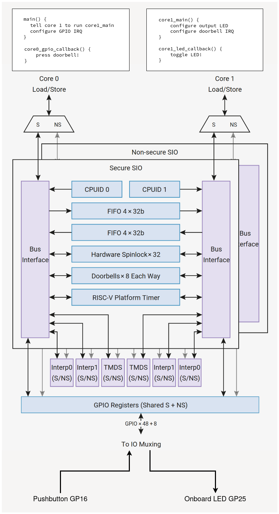

# Lab 2
## Interrupts

### Table of Contents
<br>

| Step | Description | Points |
|------|-------------|--------|
| 0.1 | Set up your environment |   |
| 0.2 | Read about interrupts |   |
| 1 | Read the datasheet | 30 |
| 2 | Configure external interrupts | 20 |
| 3 | Configure Platform Timer interrupts | 20 |
| 4 | Configure doorbell interrupts | 30 |
| 5 | In-Lab Checkoff Step | 20* |
| &nbsp; | Total: | 100 |
<br>

\* - You must get your whole lab checked off before the end of your lab section to avoid a late penalty of 20%.

### Introduction

A key concept in embedded systems is the need to process external stimuli, like a button press, or when a sensor detects a change in its environment.  However, the microcontroller may already be busy executing another long running task - maybe it's waiting on a second sensor, or its busy updating a large display.  This is actually a very common scenario you'll encounter when you start thinking about your course project - how do you get your microcontroller to do a lot of different things at the same time?  In this lab, we'll explore how to use **interrupts** to handle these situations.

An interrupt is a signal that is generated by the hardware or software when an event occurs that needs immediate attention.  Once it's **fired** from an interrupt source, say a rising edge on a GPIO pin, the interrupt signal arrives at the CPU, which - if the conditions are right and the correct bits are set - saves what it's doing, and executes a special function called an **interrupt service routine** (ISR).  

There's three types of interrupts we can explore that's common to most microcontrollers:

1. **External interrupts** are triggered by external hardware.  There are four kinds of interrupts - two level-triggered (logic 1 or logic 0), and two edge triggered (rising or falling edge).  
    - The difference between the two types is that level-triggered interrupts will keep firing as long as the right level is active, while edge-triggered interrupts will only fire once per "edge".  For our purposes, edge-triggered interrupts are more useful, e.g. to detect one button press at a time.  
    - You might use level-triggered interrupts in cases where a threshold is crossed, such as a joystick held to the right, so that you can move your displayed game character to the right for as long as the joystick remains there.

2. **Peripheral interrupts** are triggered by special events that occur on peripherals, such as timers, which can be configured to generate an interrupt when their internal counter reaches a certain value, among other possible events.
    - You might use a timer interrupt to periodically sample a sensor or update a display.
    - You might use a UART interrupt to signal that a new character has been received on a serial line, or that the transmission is complete and the UART is ready for a new character to be transmitted.

3. With the RP2350 microcontroller, we have a very interesting **third** type of interrupt: **doorbell interrupts**!  If you hadn't noticed, your Proton has two pairs of ARM and RISC-V CPU cores that you can use (only one pair can be active at any time), and this lab gives you an opportunity to explore how to use them.  Doorbell interrupts are a way for one CPU core to signal the other CPU core that it has something important to do, and the other core will stop what it's doing and execute the corresponding ISR.  This is a very powerful feature that you can use to offload tasks from one core to another, or to signal that a task is complete.

## Instructional Objectives
- To understand the concept of interrupts.
- To learn how to configure an external interrupt on the RP2350 microcontroller.
- To learn how to configure a platform timer interrupt on the RP2350 microcontroller.
- To learn how to configure a doorbell interrupt on the RP2350 microcontroller.

> [!IMPORTANT]
> Similar to 270, 362 labs should be started at home, and checked off in lab.  **Do not wait to start your lab in your lab section, or you will not finish.**  You must be **checked off for all steps in lab** to receive full credit.

### Step 0.1: Set up your environment

Make sure to clone the code repository from GitHub Classroom.  Keep in mind to add, commit and push any changes you make so that your work is accessible from a lab machine. 

Open the template in VScode and with your Debug Probe connected to your Proton, click "Upload and Monitor".  Open the Serial Monitor to see the output of your program, and press the Reset button so that it prints out again.  You should now see the following:

```text
Interrupts Lab Test Suite
Type 'help' to learn commands.

> 
```

You can then type `help` to learn what commands you can use to test a certain subroutine.  You will use this to demo your implementation and wiring to the TAs.

> [!IMPORTANT]
> For this lab, we'll use the ARM Cortex-M33 cores on the microcontroller, since it is a lot easier to work with.  Your project is already configured to do this.  This is important to note for step 2.

### Step 0.2: Read about interrupts

In this lab, it's helpful to have an understanding of the layout of the processor cores on your microcontroller.  The RP2350 has four CPU cores, of which only two are usable at one time, as shown in this diagram ([Figure 6, Chapter 3, RP2350 Datasheet](https://datasheets.raspberrypi.com/rp2350/rp2350-datasheet.pdf#%5B%7B%22num%22%3A37%2C%22gen%22%3A0%7D%2C%7B%22name%22%3A%22XYZ%22%7D%2C115%2C841.89%2Cnull%5D)):


You don't have to worry too much about the nitty-gritty terminology right now, but you can still make out **four CPU cores** in the middle block that say ARM/RISC-V/ARM/RISC-V.  Note how they go through muxes/multiplexers (which **selects** one of the two cores in each pair) which connects the **instruction and data memories** (two key parts of your uploaded program) to only two of the cores.  

The "chosen" cores are connected to the "Split" muxes below the block, which either fetches program data from memory, or performs an operation on the GPIO pins via the single-cycle IO (SIO) peripheral, depending on what instruction is being executed by that CPU core.  

The "System Bus" where the instructions and data come from is connected to (what's called) the ["bus fabric"](https://datasheets.raspberrypi.com/rp2350/rp2350-datasheet.pdf#%5B%7B%22num%22%3A27%2C%22gen%22%3A0%7D%2C%7B%22name%22%3A%22XYZ%22%7D%2C115%2C709.282%2Cnull%5D).  


The bus fabric that refers to the **main system bus** that connects all the peripherals and memory to the CPU cores (except the SIO, which we saw was connected to the Split mux, separate from the System Bus).  On every clock cycle, depending on the instructions they execute, the cores read or write to the bus fabric, which then carries those transmissions between the cores, peripherals and memory.  

For now, just keep in mind that when interrupts are fired, those signals reach the CPU cores, which, if they're configured to do so, stop what they're doing, save their state, **handle** the interrupt, and then return to what they were doing.  The **handling** typically is done by a regular function called an **interrupt service routine** or ISR.

```c
void init_gpio_example() {
    // setup code to call gpio_isr_example every time some interrupt occurs
}

void gpio_isr_example() {
    // First line: Always *acknowledge* the interrupt!

    // this function is NEVER called by you/the programmer.
    // it gets called by the CPU when the interrupt occurs.
}
```

The top block in the diagram is the **debugging interface**, that allows a debug host (e.g. the debugger you connected to the SWCLK and SWD pins of your Proton board) to control the CPU core's behavior while it's executing a program.  Chapter 3 tells us that the debugger allows you to:

- Run, halt and reset the cores
- Inspect internal core state such as registers
- Access memory from the core’s point of view
- Load code onto the device and run it

As for interrupts, we see a bus called "System Interrupts" that connects to all the cores through the IRQ (Interrupt ReQuests).  This is how interrupts reach the CPU cores, causing main program execution to halt and the ISR to run.  

So, what interrupts are available?  Scroll down to [Section 3.2](https://datasheets.raspberrypi.com/rp2350/rp2350-datasheet.pdf#%5B%7B%22num%22%3A85%2C%22gen%22%3A0%7D%2C%7B%22name%22%3A%22XYZ%22%7D%2C115%2C361.924%2Cnull%5D), and you'll see two of the types we'll use in this lab:

- "Cross-core FIFO interrupts: SIO_IRQ_FIFO and SIO_IRQ_FIFO_NS (Section 3.1.5)"
    - Also called "mailboxes", these are used to send ordered messages between the two cores.
    - We'll use this in Step 4.
- "Cross-core doorbell interrupts: SIO_IRQ_BELL and SIO_IRQ_BELL_NS (Section 3.1.6)"
    - These are used to signal the other core that it has *something* to do, but doesn't necessarily have to be ordered or contain other data like the mailbox interrupt.
    - We will use these in Step 4.
- "GPIO interrupts: IO_IRQ_BANK0, IRQ_IO_BANK0_NS, IO_IRQ_QSPI, IO_IRQ_QSPI_NS (Section 9.5)"
    - When an **external** (GPIO pin) interrupt occurs, the GPIO pins can be configured to generate an interrupt signal that can be sent to the CPU cores, which are also configured to handle those interrupts.
    - If an ISR is called, it is very important to **acknowledge** the interrupt, otherwise it will keep firing over and over again, even if the interrupt condition is no longer true.
    - We'll use this in Step 2.

### Step 1: Read the datasheet

Make sure you did the reading in Step 0.2, and then read the following sections of the RP2350 datasheet and answer the questions underneath.  **Be prepared to show your TA where you found the answer, and do not use anything other than the SDK functions or the datasheet to answer these questions.** (3 points each)

> [!TIP]
> If you are on Chrome, these links might not take you directly to the chapter number, so use Ctrl-F to search for the chapter number in the datasheet.  These links were generated from Firefox, so it should still work there.

[Chapter 3.2: Interrupts](https://datasheets.raspberrypi.com/rp2350/rp2350-datasheet.pdf#%5B%7B%22num%22%3A85%2C%22gen%22%3A0%7D%2C%7B%22name%22%3A%22XYZ%22%7D%2C115%2C361.924%2Cnull%5D)

1. To enable interrupts from a specific source, we need to know the IRQ number.  What is the IRQ number for the non-secure GPIO interrupts from Bank 0?
2. What is/are the IRQ number(s) for the non-secure cross-core doorbell interrupt(s)?  Are there different IRQ numbers for both active cores?
3. Is it possible for one interrupt handler to **interrupt** another interrupt handler?  How do the cores know which interrupt handler is allowed to interrupt another one, i.e. which registers specify this order on the ARM and RISC-V cores?

[Chapter 9.5: GPIO Interrupts](https://datasheets.raspberrypi.com/rp2350/rp2350-datasheet.pdf#%5B%7B%22num%22%3A594%2C%22gen%22%3A0%7D%2C%7B%22name%22%3A%22XYZ%22%7D%2C115%2C564.608%2Cnull%5D)

4. What are the four types of interrupts that can be generated from a GPIO pin?
5. If you want to run a function every time a GPIO pin level crosses from low to high, but **not** when it is already high, which of the four types of interrupts should you implement a callback for?
6. If you want to run a function for as long as a GPIO pin remains at a logic high, which of the four types of interrupts should you implement a callback for?
7. What is the name of the register in which we should **acknowledge** the interrupt?
    - If you don't do this as the first line of your ISR, the interrupt will keep firing over and over again, even if the interrupt condition is no longer true.

[Chapter 3.1.6: Doorbells](https://datasheets.raspberrypi.com/rp2350/rp2350-datasheet.pdf#%5B%7B%22num%22%3A45%2C%22gen%22%3A0%7D%2C%7B%22name%22%3A%22XYZ%22%7D%2C115%2C147.15%2Cnull%5D)

7. Which register should you write to to trigger the opposite core's doorbell non-secure interrupt?
8. Could a processor core ring its own doorbell?  

You'll notice that there's not any information about **configuring** or **enabling** an interrupt before we can use it, like we did with GPIO pins in the previous lab.  We don't know this yet by just looking at the datasheet, so we'll have to wait until the corresponding step here to find out.  Datasheets can be weird like that...

[Chapter 6.5.3: DORMANT State](https://datasheets.raspberrypi.com/rp2350/rp2350-datasheet.pdf#%5B%7B%22num%22%3A489%2C%22gen%22%3A0%7D%2C%7B%22name%22%3A%22XYZ%22%7D%2C115%2C223.738%2Cnull%5D)

9. The best use case for interrupts is to wake the CPU from a low power state when an event occurs, to minimize power consumption.  As explained in that section, the DORMANT power state of the RP2350 turns off nearly everything on the microcontroller until an external interrupt occurs.  What register should you write to in order to enter the DORMANT state, and what value should we write?  
    - Hint: We are using the crystal oscillator for the clock source.
    - Hint: The function `_go_dormant` described in [6.5.6.2. DORMANT](https://datasheets.raspberrypi.com/rp2350/rp2350-datasheet.pdf#%5B%7B%22num%22%3A491%2C%22gen%22%3A0%7D%2C%7B%22name%22%3A%22XYZ%22%7D%2C115%2C438.442%2Cnull%5D) of the datasheet calls a function that writes to this register.  Find that function (you may have to go to the code example linked) that does this and see what register it writes to, what value is written, and note the loop it runs before it returns.  
        - That loop ensures the crystal and PLL (and therefore your clock frequency) are stable before re-entering your code.
10. To enable waking from the DORMANT state by a **specific** GPIO pin interrupt, what register do you need to write to?  

> [!NOTE]
> *Why use the "Dormant" state over the regular "Sleep" state?*
> 
> In "Sleep", the clocks are still running to various peripherals (especially ones that could receive communication from another device, which we'll get to in later labs), and the CPU is still running, but the CPU is halted.  In the "Dormant" state, the clocks are stopped to all peripherals, and the CPU is halted.  
> 
> When we start implementing external interrupts, the only thing we're expecting to change is a GPIO pin, so it's safe to turn off all clocks.  This is especially useful for battery-powered devices, where you want to save as much power as possible.
> 
> However, for the doorbell interrupts, we still need an active clock signal since the CPU cores still need that to function, so we'll use the "Sleep" state in that case!  

> [!IMPORTANT]
> Show your answers for the questions asked above to your TA.  You must have **correct** answers to earn points for this step.  
> 
> Avoid the urge to ask others (AI/LLMs are included in "others") for answers.  These questions are specifically designed to get you used to looking at the datasheet for information, and for *you* to understand the microcontroller's specific configuration.

### Step 2: Configure external interrupts on pushbuttons

> [!NOTE]
> At this stage, make sure your Debug Probe is connected to the debug and UART pins of your Proton board, which you should already have in place from lab 1.  If wired and configured correctly, and you have autotest uncommented, you should see text appear in the Serial Monitor when you click "Upload and Monitor".  If the text doesn't appear, press the Reset button and check again.

In this step, you will configure an external interrupt on your Proton board that will wake our microcontroller from the DORMANT state.  We'll configure it so that when you press GP21, the microcontroller will enter the DORMANT state, and pressing GP26 will wake it up from that state.
We'll also configure the interrupt to toggle the green LED on GP25 on and off.

Copy in the `init_inputs` and `init_outputs` functions you implemented in lab 1 so that the GPIO pins for the pushbuttons and user LEDs are configured correctly.  There are already function calls for them in `main`.

After `init_keypad();` in `main`, there is a call to `init_gpio_irq`, which we'll implement as instructed below, along with a few other functions.  You can use either the SDK functions or directly write to registers.

1. First, turn on GP22-GP25 (the user LEDs) so that they are all on when the program starts.  This is done in `init_outputs()`, which is already called in `main`.  This is how we'll know if the microcontroller is in the DORMANT state or not.
2. Configure GP21 such that when a **rising edge** occurs on it, the function `gp21_isr` is called.  
    - `gp21_isr`, when called, should **acknowledge the interrupt**, turn off all user LEDs GP22-GP25, and enter the DORMANT state.
    - At this stage, your RP2350 will not respond to any other stimulus (other than GP26) until it wakes up.  **This includes being able to upload code, because your crystal oscillator is now turned off!**  If you need to get out of this state and GP26 isn't working, press the Reset button, which will restart the microcontroller, and subsequently the oscillator.
3. Configure GP26 to wake the microcontroller from the DORMANT state on a rising edge, and to execute `gp26_isr` on the falling edge (yes, you can do both on the same pin!).  You should not have to set the callback ISR when entering DORMANT mode.
    - We've found that using the SDK function `gpio_set_irq_enabled_with_callback` does not work when you're also trying to wake from DORMANT sleep.  Use `gpio_add_raw_irq_handler` and `gpio_set_irq_enabled` instead - make sure you call them in the right order.
    - `gp26_isr` should **acknowledge two interrupts** - the DORMANT wake event, and the regular rising edge interrupt - and turn on GP22-GP25.

So, in all, you should have implemented the following functions:
1. `init_gpio_irq` - configure GP21 and GP26 as described above and turn GP22-GP25 on.
2. `gp21_isr` - acknowledge the interrupt, turn off all user LEDs GP22-GP25, and enter the DORMANT state.
3. `gp26_isr` - acknowledge the DORMANT wake event and the rising edge interrupt, and turn on GP22-GP25.

> [!TIP]
> If you're unsure what functions to use, use the [C/C++ SDK functions](https://datasheets.raspberrypi.com/pico/raspberry-pi-pico-c-sdk.pdf).  Search for GPIO and/or IRQ functions.
> 
> Entering DORMANT mode is a bit tricky.  If you haven't figured that out already, go back to question 9 to see what function you need to do this.  It's one function call that puts your crystal oscillator into DORMANT mode.

> [!CAUTION]
> We're having you configure a pushbutton to **enter** the DORMANT state so that by default when your microcontroller powers on, it doesn't immediately enter the DORMANT state.  Remember that by entering this state, we're turning off all clocks by turning off the crystal oscillator XOSC, so the microcontroller will not execute any code until the external interrupt occurs!
> 
> If you notice that **uploading code to your microcontroller suddenly stops working** while you are working on this step, it may be that the microcontroller is in the DORMANT state.  If this happens, force the Proton board into BOOTSEL mode by holding down BOOTSEL, pressing RESET, and then letting go of BOOTSEL.  This puts the RP2350 into bootloader mode, allowing you to upload a new program again.
>
> These errors are usually indicated by OpenOCD failures while running Upload and Monitor, e.g. `openocd init failed` or `openocd: Failed to connect to target`.  If you see this, try the above steps to get back into BOOTSEL mode.

After the `init_gpio_irq` call in `main`, you'll see an infinite loop that prints out "Hello world" every second.  This is an example of some "work" that the CPU is normally doing while it's not in the DORMANT state.

Click "Upload and Monitor", and wait until you see "Hello world" printed out every second.  If it doesn't print, ensure the UART pins are still connected correctly from lab 0 and 1.  Ideally, you should route those connecting wires **underneath** your Proton board, as there is no reason to remove them.

Pressing GP21 on your breadboard should cause the Proton to enter the dormant state, execute the ISR, and turn off all user LEDs.

Pressing GP26 should cause the Proton to wake up from the dormant state, execute the ISR, and turn on all user LEDs.  If you press GP21 again, it should turn off all user LEDs and you can restart the process. 

> [!TIP]
> You can even measure the current draw of your Proton board when you do this!  
> 
> To do this, unplug the USB cable from your Proton board, configure a power supply to output 5V, connect the positive lead to the 5V pin and the negative lead to the GND pin, and turn on the supply.  You should be able to see the board start up at around 27 mA.  Pressing GP21 should cause the current draw to drop to around 6-7 mA, and pressing GP26 should cause the current draw to go back up to around 27 mA.  This is a great way to see how much power your microcontroller is using when it's in the DORMANT state (assuming you don't have too many other things drawing power!)

> [!IMPORTANT]
> Show your implementation to your TA, including the LED turning on and off when you press the pushbutton, and the debugger being able to exit the dormant state when you click Pause.  
> 
> Show that you pass the `gpio` test in the test suite by typing `gpio` in the Serial Monitor.
> 
> You must have a **working** implementation to earn **all** points for this step.  Answer their questions about the code you wrote.  One of those questions will be how you found the function needed to toggle the pin.
> 
> Commit all your code and push it to your repository now.  Use a descriptive commit message that mentions the step number.

### Step 3: Configure external interrupts on the keypad

Copy in the `init_keypad` function you implemented in lab 1 so that the GPIO pins for the keypad are configured correctly.  

You may recall from the last lab that we implemented a loop to poll the keypad for a keypress.  We did this by selecting a column pin, driving it to a logic high, and then checking the row pins to see if any of them were pulled low.

In this step, we'll make use of interrupts to tell us if the row pins instead of continuously watching the register!  We'll still use the loop to drive the column pins, but we'll make that its own interrupt in the next lab, when we figure out timers.

In the function `init_keypad_irq`:

1. Add the `keypad_isr` function as the ISR to execute when an interrupt occurs on GPIO pins 2 through 5.  This way, when a particular column pin is driven and a button is pressed, the row pin will be pulled high, calling this ISR.  You'll want to use the `gpio_add_raw_irq_handler_masked` function to do it for all four pins at once.

2. Enable the interrupt for GPIO pins 2 through 5 using `gpio_set_irq_enabled` on a rising edge trigger.  Unfortunately, there's no "mask" function (that we could find) to enable all four pins at once, so you might want to utilize a loop or just call the function four times.

To implement the ISR, we need to keep in mind that `keypad_isr` could get called for any button press (and row pin going high), so we need to know two things to figure out the button:

1. Which column pin is currently being driven high?
    - The function `drive_column` needs to be implemented to do this.  In this function, drive high the pin indicated by the value of the global variable `col`, and drive all other column pins low.  For example if `col` is 0, drive GP6 high and GP7, GP8, GP9 low.  After doing so, increment `col` by 1.  If `col` is 3, set `col` back to 0.  Sleep for 25 milliseconds to allow the row pins to settle before checking them.  This is important to ensure we have enough time to let the current reach the row pins if a button was pressed.
    - The value of `col` will therefore tell us which column is active.

2. Which row pin is currently being pulled high?
    - We know that the ISR will get called if **any** of the row pins go high (GP2-GP5).  But how do we know which pin triggered the ISR?  
    - Look in the C/C++ SDK documentation for a function that would tell you the **current interrupt status for a given GPIO pin**.  This function will return a bitmask of the current set of events currently pending for the GPIO pin (since we have not yet **acknowledged** the interrupt, as we did in Step 2).  
    - In the ISR, check the interrupt status for all the row pins.  If we find one that has a pending event, we know that that is the row pin that was pressed.  Using this knowledge of `col` and the pressed row pin, we can now determine which key was pressed.  
    - The global variable `keymap` is an array of the key values for each button.  Use the row and column numbers to calculate the correct index, put the value of the key in the global variable `key`, and print it out to the Serial Monitor with `printf`.  

Upload and monitor in PlatformIO.  Hopefully, pressing a button on your keypad should print out that key on your Serial Monitor.

> [!IMPORTANT]
> Show your TA that pressing a button on your keypad prints it out on the Serial Monitor within 25 milliseconds of pressing it.  
> 
> Show that you pass the `keypad` test in the test suite by typing `keypad` in the Serial Monitor.
> 
> You must have a **working** implementation to earn **all** points for this step.  Answer their questions about the code you wrote.  One of those questions will be how you found the function needed to toggle the pin.
> 
> Commit all your code and push it to your repository now.  Use a descriptive commit message that mentions the step number.

### Step 4: Configure doorbell interrupts

> [!WARNING]
> Multi-core programming may not be covered in lecture.  If there are any doubts as to how this works, ask your **lab** instructor to clarify them.

Now for the fun part!  We're going to offload the column driving function to the second core on your Proton, while having the first core keep track of whether a button was pressed or released.  This is perhaps far too simplistic, but as computation scales, you may find it useful to dedicate one core to handling computation and the other to handling all the external stimuli/responses.  

Your Proton has a total of four cores, two ARM-based, and two RISC-V-based.  ARM and RISC-V are examples of **instruction set architectures**, or different formats of machine code.  That means that ARM cores can't execute RISC-V programs, and vice-versa.  

> At the time of writing (May 2025), we have not yet built in support for compiling to RISC-V in PlatformIO.  If this is really needed, you can use the [Pico SDK](https://github.com/raspberrypi/pico-sdk) directly from Raspberry Pi.

On the Proton specifically, the ARM cores carry a lot more functionality like floating-point computations and security features at the cost of having to license the instruction set from ARM, while the RISC-V cores are free and open source (you can even see the Verilog used to make them [here](https://github.com/Wren6991/Hazard3)) and are meant more for academic experimentation.  For the embedded labs, we'll just use the default ARM cores to simplify things.

In this step, we'll do the following on the two cores:
- Core 0 will set up core 1, and 



This diagram shows the various interaction methods between the cores on the bus fabric, so that the CPU cores can access things like:
- Their own and each other's CPUID (typically just 0 and 1)
- 4x32-byte FIFO queue for each core to pass messages.
- 32 hardware spinlocks for each core to lock shared resources in memory.
- 8 doorbell interrupts "each way" for the cores to signal the other core to do something.
- The RISC-V Platform Timer we configured in Step 3.

The "Secure/Non-Secure SIO" refers to the ability to have secure and non-secure memory regions on the Proton, where "secured" code has access to the secure peripherals and memory regions, and the non-secure world has access to the rest.  We won't worry about this for the most part - we're only using the Non-Secure SIO anyway.  

At the top, each core **loads** the same instructions from memory, so our code needs to tell the individual cores to do different things.  [Section 5.3](https://datasheets.raspberrypi.com/rp2350/rp2350-datasheet.pdf#%5B%7B%22num%22%3A377%2C%22gen%22%3A0%7D%2C%7B%22name%22%3A%22XYZ%22%7D%2C115%2C511.598%2Cnull%5D) describes how the non-primary second core can be started with a different block of code.

Comment out `init_timer_irq` and complete the following functions as follows:

- `init_gpio_doorbell_irq` - does exactly the same thing as `init_gpio_irq`, except it adds `core0_gpio_callback` as the ISR.
- `core0_gpio_callback` - triggers a doorbell interrupt on the opposite core.  You have to assign a specific value to a certain register that we discussed in Step 1 to "raise an interrupt on the opposite core".
- `core1_main` - this is the main function for the second core.  In it:
    - Configure GP25 as an output as you did earlier (make sure not to do it in the core 0 `main` as well!).
    - Add `core1_led_callback` as the ISR for when a doorbell interrupt occurs.  The IRQ number for the doorbell interrupt is the same as the one you found in Step 1.  Don't forget to enable the interrupt as well!
    - Add the infinite loop from `main` that executes the `wfi` instruction and sleeps 1 ms after waking.
- `core1_led_callback` - when the doorbell interrupt fires, toggle the LED on GP25.

In `main` which runs on core 0, call `init_gpio_doorbell_irq`, and then use the `multicore_launch_core1` function to start `core1_main` on core 1.  Flash your program to your Proton, and press the left pushbutton on your breadboard.  If the LED has already turned on, it may be that the interrupt fired immediately, so press the button again to see the LED toggle on and off... which won't work!  

Try pressing Reset to see if that fixes it, and that should properly recognize the pushbutton at a logic 0, so when you press the Right pushbutton, it turns on the LED, but it doesn't seem to turn off!  Notice, however, that is slightly dimmer than usual... that is a hint that your callback function is being called over and over again, even though we're not pressing a pushbutton.  Why is that?

If we look back at the datasheet under [Section 3.1.6: Doorbells](https://datasheets.raspberrypi.com/rp2350/rp2350-datasheet.pdf#%5B%7B%22num%22%3A44%2C%22gen%22%3A0%7D%2C%7B%22name%22%3A%22XYZ%22%7D%2C115%2C147.15%2Cnull%5D), we see that in order to raise a doorbell interrupt, we write to an OUT_SET register, but it seems that we missed that the opposite core also needs to write the same value to an IN_CLR register!  Add this line to `core1_led_callback`, and you should now be able to toggle the LED on and off with the left pushbutton.  (You may have to press Reset after flashing over SWD for this to work properly).

Congratulations on running your first multi-core interruptible embedded program!

> [!IMPORTANT]
> Show your implementation to your TA.  Show the LED turning on and off when you press the left pushbutton, and the LED turning on when you press the right pushbutton.  
> 
> Show your TA that your code runs on different cores by starting the debugger with a breakpoint in `core1_led_callback`, and show that the function is being executed by core 1 in the Call Stack view in the debugger. 
>
> Show that you pass the `doorbell` test in the test suite by typing `doorbell` in the Serial Monitor.
> 
> You must have a **working** implementation to earn **all** points for this step.  Answer their questions about the code you wrote.  One of those questions will be how you found the function needed to toggle the pin.
> 
> Commit all your code and push it to your repository now.  Use a descriptive commit message that mentions the step number.

### Step 5: In-Lab Checkoff Step

> [!CAUTION]
> Make sure you got checked off here: https://engineering.purdue.edu/ece362/checkoff/
> 
> Make sure to upload your confirmation code and verify that it is accepted by Gradescope.  You will know it is accepted if you get the points from Gradescope.
> 
> Before you leave, make sure your station is clean and that you have gathered your belongings, and then call a TA to confirm that you can leave.  Confirm that you have received your checkoffs, that your confirmation code was accepted on Gradescope before logging out and leaving for the day.
