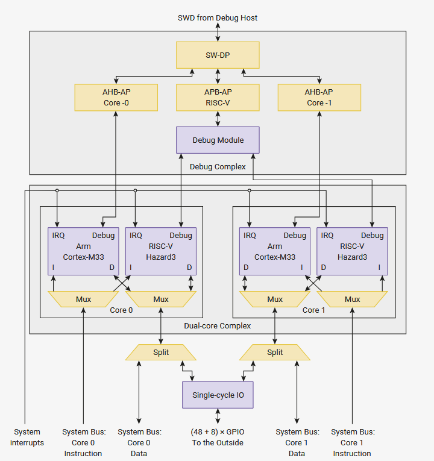
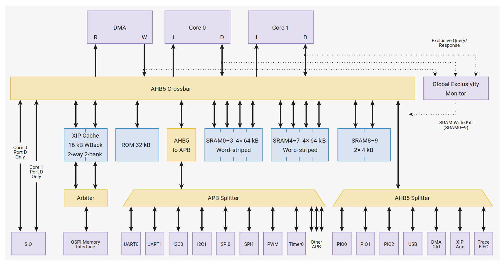
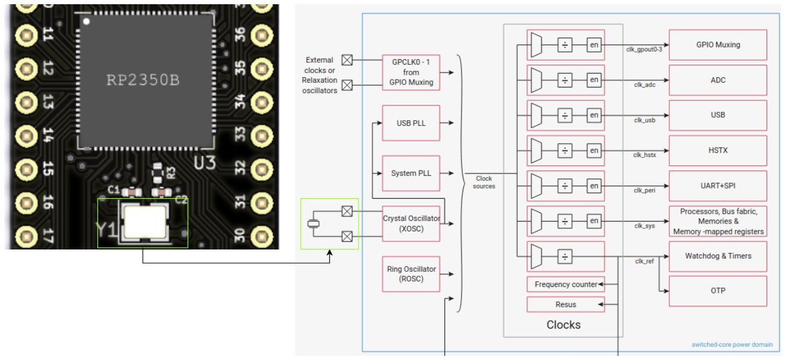
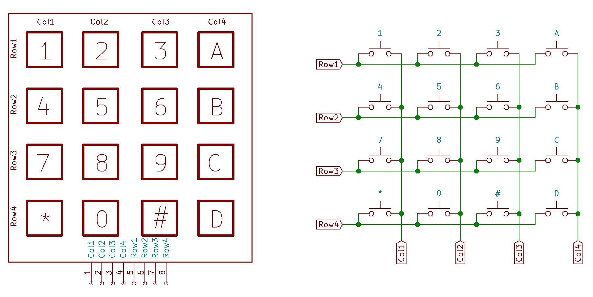
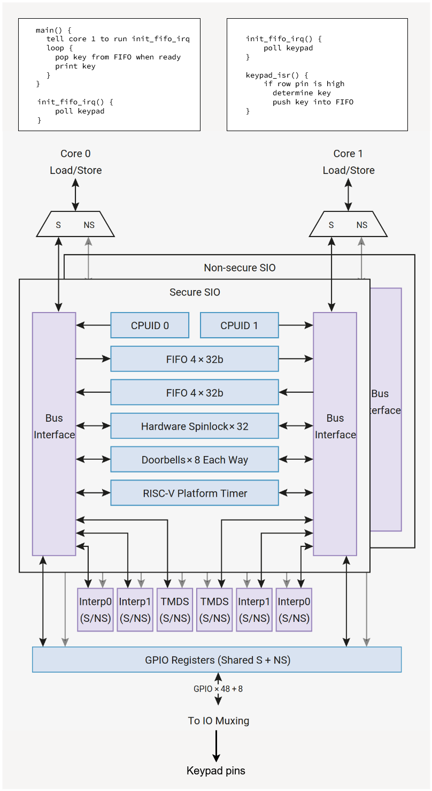
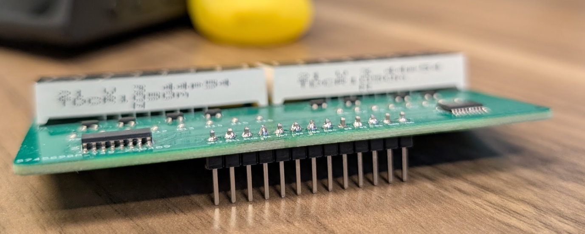

# Lab 2
## Interrupts

### Table of Contents
<br>

| Step | Description | Points |
|------|-------------|--------|
| 0.1 | Set up your environment |   |
| 0.2 | Read about interrupts |   |
| 1 | Read the datasheet | 30 |
| 2 | Configure external interrupts from pushbuttons | 20 |
| 3 | Configure external interrupts from the keypad | 30 |
| 4 | Configure mailbox FIFO interrupts between processor cores | 20 |
| 5 | Solder pin headers on to your 7-segment display card |   |
| 6 | Confirm your checkoffs before leaving | * |
| &nbsp; | Total: | 100 |
<br>

\* - You must get your whole lab checked off before the end of your lab section to avoid a late penalty of 20%.

## Instructional Objectives
- To understand the concept of interrupts.
- To learn how to configure an external interrupt on the RP2350 microcontroller.
- To learn how to configure a platform timer interrupt on the RP2350 microcontroller.
- To learn how to configure a inter-processor FIFO interrupt on the RP2350 microcontroller.

### Introduction

A key concept in embedded systems is the need to process external stimuli, like a button press, or when a sensor detects a change in its environment.  However, the microcontroller may already be busy executing another long running task - maybe it's waiting on a second sensor, or its busy updating a large display.  This is actually a very common scenario you'll encounter when you start thinking about your course project - how do you get your microcontroller to do a lot of different things at the same time?  In this lab, we'll explore how to use **interrupts** to handle these situations.

An interrupt is a signal that is generated by the hardware or software when an event occurs that needs immediate attention.  Once it's **fired** from an interrupt source, say a rising edge on a GPIO pin, the interrupt signal arrives at the CPU, which - if the conditions are right and the correct bits are set - saves what it's doing, and executes a special function called an **interrupt service routine** (ISR), also called an **interrupt handler**.  

There's three types of interrupts we can explore that's common to most microcontrollers:

1. **External interrupts** are triggered by external hardware.  There are four kinds of interrupts - two level-triggered (logic 1 or logic 0), and two edge triggered (rising or falling edge).  
    - The difference between the two types is that level-triggered interrupts will keep firing as long as the right level is active, while edge-triggered interrupts will only fire once per "edge".  For our purposes, edge-triggered interrupts are more useful, e.g. to detect one button press at a time.  
    - You might use level-triggered interrupts in cases where a threshold is crossed, such as a joystick held to the right, so that you can move your displayed game character to the right for as long as the joystick remains there.

2. **Peripheral interrupts** are triggered by special events that occur on peripherals, such as timers, which can be configured to generate an interrupt when their internal counter reaches a certain value, among other possible events.
    - You might use a timer interrupt to periodically sample a sensor or update a display.
    - You might use a UART interrupt to signal that a new character has been received on a serial line, or that the transmission is complete and the UART is ready for a new character to be transmitted.

3. With the RP2350 microcontroller, we have a very interesting **third** type of interrupt: **multicore interrupts**!  If you hadn't noticed, your Proton has two pairs of ARM and RISC-V CPU cores that you can use (only one pair can be active at any time), and this lab will give you an opportunity to use them.  Multicore interrupts are a way for one CPU core to send messages/notifications to the other CPU core, which will stop what it is doing and handle that message appropriately.  In this lab, we'll utilize the hardware FIFO queues between the two cores, allowing them to push and pop messages to each other.
    - You might use the multicore FIFO interrupt to send data that takes a long time to compute, e.g. the Fast Fourier Transform of audio signal(s) sampled on GPIO pin(s), to the other core so that it can incorporate the received data into a "image framebuffer" that is being continuously displayed on a screen, like an audio visualizer.

> [!IMPORTANT]
> Similar to 270, 362 labs should be started at home, and checked off in lab.  **Do not wait to start your lab in your lab section, or you will not finish.**  You must be **checked off for all steps in lab** to receive full credit.

### Step 0.1: Set up your environment

Make sure to clone the code repository from GitHub Classroom.  Keep in mind to add, commit and push any changes you make so that your work is accessible from a lab machine. 

Open the template in VScode and with your Debug Probe connected to your Proton, click "Upload and Monitor".  Open the Serial Monitor to see the output of your program, and press the Reset button so that it prints out again.  You should now see the following:

```text
Interrupts Lab Test Suite
Type 'help' to learn commands.

> 
```

You can then type `help` to learn what commands you can use to test a certain subroutine.  You will use this to demo your implementation and wiring to the TAs.

If the text doesn't appear when you click "Upload and Monitor", ensure that `autotest()` is uncommented in `main.c`.

### Step 0.2: Read about interrupts

In this lab, it's helpful to have an understanding of the layout of the processor cores on your microcontroller.  The RP2350 has four CPU cores, of which only two are usable at one time, as shown in this diagram ([Figure 6, Chapter 3, RP2350 Datasheet](https://datasheets.raspberrypi.com/rp2350/rp2350-datasheet.pdf#%5B%7B%22num%22%3A37%2C%22gen%22%3A0%7D%2C%7B%22name%22%3A%22XYZ%22%7D%2C115%2C841.89%2Cnull%5D)):



You don't have to worry too much about the nitty-gritty terminology right now, but you can still make out **four CPU cores** in the middle block that say ARM/RISC-V/ARM/RISC-V.  Note how they go through muxes/multiplexers (which **selects** one of the two cores in each pair) which connects the **instruction and data memories** (populated with data from your uploaded program) to only two of the cores.  

The "chosen" cores are connected to the "Split" muxes below the block, which either fetches program data from memory, or performs an operation on the GPIO pins via the single-cycle IO (SIO) peripheral, depending on what instruction is being executed by that CPU core.  

The "System Bus" where the instructions and data come from is connected to (what's called) the ["bus fabric"](https://datasheets.raspberrypi.com/rp2350/rp2350-datasheet.pdf#%5B%7B%22num%22%3A27%2C%22gen%22%3A0%7D%2C%7B%22name%22%3A%22XYZ%22%7D%2C115%2C709.282%2Cnull%5D).  



The bus fabric that refers to the **main system bus** that connects all the peripherals and memory to the CPU cores (except the SIO, which we saw was connected to the Split mux, separate from the System Bus).  On every clock cycle, depending on the instructions they execute, the cores read or write to the bus fabric, which then carries those transmissions between the cores, peripherals and memory.  

For now, just keep in mind that when interrupts are fired, those signals reach the CPU cores, which, if they're configured to do so, stop what they're doing, save their state, **handle** the interrupt, and then return to what they were doing.  The **handling** typically is done by a regular function called an **interrupt service routine** or ISR.

```c
void init_gpio_example() {
    // setup code to call gpio_isr_example every time some interrupt occurs
}

void gpio_isr_example() {
    // First line: Always *acknowledge* the interrupt!

    // this function is NEVER called by you/the programmer.
    // it gets called by the CPU when the interrupt occurs.
}
```

The top block in the diagram is the **debugging interface**, that allows a "debug host" (the Debug Probe you connected to the SWCLK and SWD pins of your Proton board) to control the CPU core's behavior while it's executing a program.  Chapter 3 tells us that the debugger allows you to:

- Run, halt and reset the cores
- Inspect internal core state such as registers
- Access memory from the core’s point of view
- Load code onto the device and run it

In fact, when we click the Pause/Step Over buttons while debugging in VScode, that action is sent to the Debug Probe, which then sends an **interrupt** to the CPU core to stop what it's doing, allowing the Debug Probe to read the frozen state of the CPU cores, including registers and memory.  **This is how embedded debugging works!**

As for interrupts, we see a bus called "System Interrupts" that connects to all the cores through the IRQ (Interrupt ReQuests).  This is how interrupts reach the CPU cores, causing main program execution to halt and the ISR to run.  

So, what interrupts are available?  Scroll down to [Section 3.2](https://datasheets.raspberrypi.com/rp2350/rp2350-datasheet.pdf#%5B%7B%22num%22%3A85%2C%22gen%22%3A0%7D%2C%7B%22name%22%3A%22XYZ%22%7D%2C115%2C361.924%2Cnull%5D), and you'll see two of the types we'll use in this lab:

- "Cross-core FIFO interrupts: SIO_IRQ_FIFO and SIO_IRQ_FIFO_NS (Section 3.1.5)"
    - Also called "mailboxes", these are used to send ordered messages from one CPU core to the other.
    - We'll use this in Step 4.
- "GPIO interrupts: IO_IRQ_BANK0, IO_IRQ_BANK0_NS, IO_IRQ_QSPI, IO_IRQ_QSPI_NS (Section 9.5)"
    - When an **external** (GPIO pin) interrupt occurs, the GPIO pins can be configured to generate an interrupt signal that can be sent to the CPU cores, which are also configured to handle those interrupts.
    - If an ISR is called, it is very important to **acknowledge** the interrupt, otherwise it will keep firing over and over again, even if the interrupt condition is no longer true.
    - We'll use this in Step 2.

### Step 1: Read the datasheet

> [!NOTE]
> Your RP2350 has 4 CPU cores, of which only 2 cores can be active at any given time.  Two of these cores are ARM Cortex-M33s, which implement the **ARMv8-M Thumb 2 instruction set**, and the other two implement the **RISC-V instruction set**.  The instruction set merely dictates what types of assembly instructions are available, but as we progress through the embedded labs using C programming, the choice of instruction set will not matter much.
> 
> For the embedded labs, we'll stick with the ARM cores.

Make sure you did the reading in Step 0.2, and then read the following sections of the RP2350 datasheet and answer the questions underneath.  **Be prepared to show your TA where you found the answer, and do not use anything other than the SDK functions or the datasheet to answer these questions.** (3 points each, unless otherwise specified)

> [!TIP]
> If you are on Chrome, these links might not take you directly to the chapter number, so use Ctrl-F to search for the chapter number in the datasheet.  These links were generated from Firefox, so it should still work there.

[Chapter 3.2: Interrupts](https://datasheets.raspberrypi.com/rp2350/rp2350-datasheet.pdf#interrupts)

1. To enable interrupts from a specific source, we need to know the IRQ number.  What is the IRQ number for the non-secure GPIO interrupts from Bank 0?
2. Is it possible for one interrupt handler to **interrupt**, or **pre-empt**, another interrupt handler?  How do the cores know which interrupt handler is allowed to interrupt another one, i.e. which registers specify this order on the ARM and RISC-V cores?

[Chapter 9.5: GPIO Interrupts](https://datasheets.raspberrypi.com/rp2350/rp2350-datasheet.pdf#section_gpio_interrupts)

3. What are the four types of interrupts that can be generated from a GPIO pin?
4. If you want to run a function every time a GPIO pin level crosses from low to high, but **not** again when it is already high, which of the four types of interrupts should you implement a callback for?
5. If you want to run a function for as long as a GPIO pin remains at a logic high, which of the four types of interrupts should you implement a callback for?
6. What is the name of the register in which we should **acknowledge** a GPIO pin interrupt by writing a specific value to it?
    - If you don't do this as the first line of your ISR, the interrupt will keep firing over and over again, even if the interrupt condition is no longer true.

[Chapter 3.1.5: Inter-processor FIFOs (Mailboxes)](https://datasheets.raspberrypi.com/rp2350/rp2350-datasheet.pdf#section_sio_fifos)

7. What kind of data structure is the mailbox FIFO on the RP2350?  You might recall this from a previous course (or look it up if you forgot).  
8. How many `char` values could one mailbox hold?
    - For context, each `char` datum is 8 bits wide.
    - Hint: This is a trick question.  Think about how the FIFO will store a value when you push it, and how much space each value will actually take.

You'll notice that there's not any information about **configuring** or **enabling** an interrupt before we can use it to trigger a call to an interrupt handler, like we did with GPIO pins in the previous lab.  We don't know this yet by just looking at the datasheet, so we'll have to wait until the corresponding step here to find out.  Datasheets can be weird like that...

[Chapter 6.5.3: DORMANT State](https://datasheets.raspberrypi.com/rp2350/rp2350-datasheet.pdf#section-power-dormant)

9. (3 points) The best use case for interrupts is to wake the CPU from a low power state when an event occurs, to minimize power consumption.  As explained in that section, the DORMANT power state of the RP2350 turns off nearly everything on the microcontroller (by turning off one critical component) until an external interrupt occurs.  What register should you write to in order to enter the DORMANT state, and what value should we write?  
    - Hint: We are using the crystal oscillator for the clock source.
    - Hint: The function `_go_dormant` described in [6.5.6.2. DORMANT](https://datasheets.raspberrypi.com/rp2350/rp2350-datasheet.pdf#power-dormant-example) of the datasheet calls a function that writes to this register.  Find that code for that function by trying to call it in your code template, diving into the function, and seeing what register it writes to and what value is written, before entering a `while` loop that ensures the crystal oscillator, and therefore your clock frequency, are stable before returning to your code.
10. (3 points) To enable waking from the DORMANT state by a **specific** GPIO pin interrupt, what register do you need to write to?  

> [!NOTE]
> *How is the "Dormant" state different from the regular "Sleep" state?*
> 
> In "Sleep", the clocks are still running to various peripherals (especially ones that could receive communication from another device, which we'll get to in later labs), and the CPU is still running, but the CPU is halted.  In the "Dormant" state, the clocks are stopped to all peripherals, and the CPU is halted.  This drops the power consumption to a minimum, but it also means that the CPU won't respond to any interrupts until it wakes up again.  This is why we need to configure an external interrupt to wake the CPU from the DORMANT state.
> 
> This works by turning off the crystal oscillator (XOSC), which is attached to pins XOSC_IN and XOSC_OUT on the RP2350 chip, as shown below.  The diagram below, from [Section 8: Clocks](https://datasheets.raspberrypi.com/rp2350/rp2350-datasheet.pdf#%5B%7B%22num%22%3A513%2C%22gen%22%3A0%7D%2C%7B%22name%22%3A%22XYZ%22%7D%2C115%2C841.89%2Cnull%5D), shows us how the chip **derives** different clock frequencies from the crystal oscillator.
> 
> When we start implementing external interrupts, the only thing we're expecting to change is a GPIO pin, so it's safe to turn off all clocks.  This is especially useful for battery-powered devices, where you want to save as much power as possible.



> [!IMPORTANT]
> Show your answers for the questions asked above to your TA.  You must have **correct** answers to earn points for this step.  
> 
> Avoid the urge to ask others (AI/LLMs are included in "others") for answers.  These questions are specifically designed to get you used to looking at the datasheet for information, and for *you* to understand the microcontroller's specific configuration.

### Step 2: Configure external interrupts from pushbuttons

> [!NOTE]
> At this stage, make sure your Debug Probe is connected to the debug and UART pins of your Proton board, which you should already have in place from lab 1.  If wired and configured correctly, and you have autotest uncommented, you should see text appear in the Serial Monitor when you click "Upload and Monitor".  If the text doesn't appear, press the Reset button and check again.

In this step, you will configure an external interrupt on your Proton board that will wake our microcontroller from the DORMANT state.  We'll configure it so that when you press GP21, the microcontroller will enter the DORMANT state, and pressing GP26 will wake it up from that state.
We'll also configure the interrupt to toggle the green LED on GP25 on and off.

Uncomment the `#define STEP1` line at the top of `main.c`, and ensure that `#define STEP2` and `#define STEP3` are still commented out.  

Copy in the `init_inputs` and `init_outputs` functions you implemented in lab 1 so that the GPIO pins for the pushbuttons and user LEDs are configured correctly.  There are already function calls for them in `main`.

Next, implement `init_gpio_irq` as instructed below, along with a few other functions.  You can use either the SDK functions or directly write to registers.

1. First, turn on GP22-GP25 (the user LEDs) so that they are all on when the program starts.  You don't have to configure the pins - you did that already in `init_outputs()`, which is called for you in `main`.  This is how we'll know if the microcontroller is in the DORMANT state or not.
2. Configure GP21 and GP26 such that when a **rising edge** occurs on either pin, the function `gpio_isr` is called.  Use the function `gpio_add_raw_irq_handler_masked` to add the handler for both pins at once, and don't forget to enable the GPIO IRQ for both pins, as well the BANK0 IRQ interrupt.
3. Configure GP26 to wake the microcontroller from the DORMANT state in addition to triggering the interrupt handled by `gpio_isr`. You can configure a pin for multiple functions simultaneously.
    - Your `gpio_isr` function should properly check which pin triggered the interrupt before performing the appropriate actions.

In `gpio_isr`:
- You should **identify which pin triggered the interrupt** using the pending events register (via the SDK function `gpio_get_irq_event_mask`).
    - If GP21 triggered the interrupt, acknowledge it, turn off all user LEDs GP22-GP25, and enter the DORMANT state.
    - If GP26 triggered the interrupt, acknowledge the rising edge event, then turn on GP22-GP25.
    - Once the GP21 functionality is implemented and you press GP21, your RP2350 will not respond to any other stimulus (other than GP26) until it wakes up. **This includes being able to upload code, because your crystal oscillator is now turned off!** If you need to get out of this state and GP26 isn't working, press the Reset button, which will restart the oscillator, and subsequently the microcontroller.

In summary, you should implement the following functions:
1. `init_gpio_irq` - configure GP21 and GP26 as described above and turn GP22-GP25 on.
2. `gpio_isr` - This single ISR will handle interrupts from both GP21 and GP26. It should:
    - Identify which pin triggered the interrupt (check the pending events register)
    - If GP21: acknowledge the interrupt, turn off all user LEDs GP22-GP25, and enter DORMANT state
    - If GP26: acknowledge both the DORMANT wake event and the rising edge interrupt, then turn on GP22-GP25

> [!TIP]
> If you're unsure what functions to use, use the [C/C++ SDK functions](https://datasheets.raspberrypi.com/pico/raspberry-pi-pico-c-sdk.pdf).  Search for GPIO and/or IRQ functions.
> 
> Entering DORMANT mode is a bit tricky.  If you haven't figured that out already, go back to question 9 to see what function you need to do this.  It's one function call that puts your crystal oscillator into DORMANT mode.

> [!CAUTION]
> We're having you configure a pushbutton to **enter** the DORMANT state so that by default when your microcontroller powers on, it doesn't immediately enter the DORMANT state.  Remember that by entering this state, we're turning off all clocks by turning off the crystal oscillator XOSC, so the microcontroller will not execute any code until the external interrupt occurs!
> 
> If you notice that **uploading code to your microcontroller suddenly stops working** while you are working on this step, it may be that the microcontroller is in the DORMANT state.  If this happens, force the Proton board into BOOTSEL mode by holding down BOOTSEL, pressing RESET, and then letting go of BOOTSEL.  This puts the RP2350 into bootloader mode, allowing you to upload a new program again.
>
> These errors are usually indicated by OpenOCD failures while running Upload and Monitor, e.g. `openocd init failed` or `openocd: Failed to connect to target`.  If you see this, try the above steps to get back into BOOTSEL mode.

After the `init_gpio_irq` call in `main` underneath the `#ifdef STEP1` stanza, you'll see an infinite loop that prints out "Hello world" every second.  This is an example of some "work" that the CPU is normally doing while it's not in the DORMANT state.

Run "Upload and Monitor", and wait until you see "Hello world" printed out every second.  If it doesn't print, ensure the UART pins are still connected correctly from lab 0 and 1.  Ideally, you should route those connecting wires **underneath** your Proton board, as there is no reason to remove them.

Pressing GP21 on your breadboard should cause the Proton to enter the dormant state, execute the ISR, and turn off all user LEDs.

Pressing GP26 should cause the Proton to wake up from the dormant state, execute the ISR, and turn on all user LEDs, and start printing "Hello world" again.  If you press GP21 again, it should turn off all user LEDs and you can restart the process. 

> [!IMPORTANT]
> Show your implementation to your TA, including the LED turning on and off when you press the corresponding pushbuttons.  
> 
> Show that you pass the `gpio` test in the test suite by typing `gpio` in the Serial Monitor.  **If you run the test, do not use `exit` to return to the rest of `main`** - the autotest is unable to remove the handler once it's been added. 
> 
> You must have a **working** implementation to earn **all** points for this step.  Answer their questions about the code you wrote.  One of those questions will be how you found the function needed to toggle the pin.
> 
> Commit all your code and push it to your repository now.  Use a descriptive commit message that mentions the step number.

> [!TIP]
> You can even measure the current draw of your Proton board when you do this!  
> 
> To do this, unplug the USB cable from your Proton board, configure a power supply to output 5V, connect the positive lead to the 5V pin and the negative lead to the GND pin, and turn on the supply.  You should be able to see the board start up at around 27 mA (each LED draws only about 1 mA).  Pressing GP21 should cause the current draw to drop to around 6-7 mA, and pressing GP26 should cause the current draw to go back up to around 27 mA.  This is a great way to see how much power your microcontroller is using when it's in the DORMANT state (assuming you don't have too many other things drawing power!)

### Step 3: Configure external interrupts from the keypad

Copy in the `init_keypad` function you implemented in lab 1 so that the GPIO pins for the keypad are configured correctly.  

Here's the keypad wiring again for reference:



Uncomment the `#define STEP2` line at the top of `main.c`, and ensure that `#define STEP1` and `#define STEP3` are commented out.  

You may recall from the last lab that we implemented a loop to poll the keypad for a keypress.  We did this by selecting a column pin, driving it to a logic high, and then checking the row pins to see if any of them were pulled low.

In this step, we'll make use of interrupts to tell us if the row pins instead of continuously watching the register!  We'll still use the loop to drive the column pins, but we'll make that its own interrupt in the next lab, when we figure out timers.

In the function `init_keypad_irq`:

1. Add the `keypad_isr` function as the ISR to execute when an interrupt occurs on GPIO pins 2 through 5.  This way, when a particular column pin is driven and a button is pressed, the row pin will be pulled high, calling this ISR.  You'll want to use the `gpio_add_raw_irq_handler_masked` function to do it for all four pins at once.

2. Acknowledge **spurious interrupts** by reading the interrupt status register for the row pins and clearing any pending interrupts.  Find the function that does this for specific GPIO pins, dive into it to identify the register being modified, and modify the register yourself within the `init_keypad_irq` function.

3. Enable the interrupt for GPIO pins 2 through 5 using `gpio_set_irq_enabled` on a rising edge trigger, but **do not use this function directly**.  You'll need to dive into it to understand how it works, and then copy the register-level code.  We strongly encourage you to use a loop, with the counter variable indexing into the various registers.
    - A hint for the next step: take note of, and add, the code that chooses a register based on what processor core you are using.  This is important for ensuring the correct processor core is notified when an interrupt occurs!

To implement the ISR, we need to keep in mind that `keypad_isr` could get called for any button press (and row pin going high), so we need to know two things to figure out what button was just pressed:

1. Which column pin is currently being driven high?
    - The function `drive_column` needs to be implemented to do this.  In this function, drive high the pin indicated by the value of the global variable `col`, and drive all other column pins low.  For example if `col` is 0, drive GP6 high and GP7, GP8, GP9 low.  After doing so, sleep for 25 milliseconds **first**, and increment `col` by 1.  If `col` is 3, set `col` back to 0.  
    - The sleep is important to ensure we have enough time to let the current flow from the driven column pin into the row pins if a button is pressed.
    - The value of `col` will therefore tell us which column is active.

2. Which row pin is currently being pulled high?
    - We know that the ISR will get called if **any** of the row pins go high (GP2-GP5).  But how do we know which pin triggered the ISR?  
    - Look in the C/C++ SDK documentation for a function that would tell you the **current interrupt status for a given GPIO pin**.  This function will return a bitmask of the current set of events currently pending for the GPIO pin (since we have not yet **acknowledged** the interrupt, as we did in Step 2).  
    - In the ISR, check the interrupt status for all the row pins.  If we find one that has a pending event, we know that that is the row pin that was pressed.  Using this knowledge of `col` and the pressed row pin, we can now determine which key was pressed.  
    - The global variable `keymap` is an array of the key values for each button.  Use the row and column numbers to calculate the correct index, put the value of the key in the global variable `key`, and print it out to the Serial Monitor with `printf`.  

In summary, you should implement the following functions:
1. `init_keypad_irq` - configure the GPIO pins 2 through 5 to trigger an interrupt on a rising edge, and call `keypad_isr` when that happens. 
2. `drive_column` - drive the column pin indicated by the global variable `col` high and all other column pins low.  Sleep for 25 milliseconds.  Increment `col` mod 4 after driving the pin.
3. `keypad_isr` - acknowledge the interrupt, check if a rising edge has occurred on any of the row pins, and for each row pin that was high, print out the corresponding key that was pressed.

Upload and monitor in PlatformIO.  Hopefully, pressing a button on your keypad should print out that key on your Serial Monitor.

> [!IMPORTANT]
> Show your TA that pressing a button on your keypad prints it out on the Serial Monitor within 25 milliseconds of pressing it.  
> 
> Show that you pass the `keypad` test in the test suite by typing `keypad` in the Serial Monitor.
> 
> You must have a **working** implementation to earn **all** points for this step.  Answer their questions about the code you wrote.  One of those questions will be how you found the function needed to toggle the pin.
> 
> Commit all your code and push it to your repository now.  Use a descriptive commit message that mentions the step number.

### Step 4: Configure mailbox FIFO interrupts between processor cores

> [!WARNING]
> Multi-core programming may not be covered in-depth in lecture, but the process below to get you started should account for that.  If there are any doubts as to how this works, ask your lab instructor to clarify them.

Now for the fun part!  We're going to offload the column pin driving to poll the keypad to the second core on your RP2350, and have it notify the first core when a key is pressed, letting it use that information without having it also check the keypad!  This is a simplistic example of how you can dedicate one core to handling computation while receiving messages from the other core, which handles all external stimuli/responses.  

Your Proton's RP2350 microcontroller has a total of four cores, two ARM-based, and two RISC-V-based.  ARM and RISC-V are examples of **instruction set architectures**, or different formats of machine code.  That means that ARM cores can't execute RISC-V programs, and vice-versa.  

> At the time of writing (May 2025), we have not yet built in support for compiling to RISC-V in PlatformIO.  If you really need this for some reason, like the project, you can use the [Pico SDK](https://github.com/raspberrypi/pico-sdk) directly from Raspberry Pi.

On the Proton specifically, the ARM cores carry a lot more functionality like floating-point computations and security features at the cost of having to license the instruction set from ARM, while the RISC-V cores are free and open source (you can even see the Verilog used to make them [here](https://github.com/Wren6991/Hazard3)) and are meant more for academic experimentation.  For the embedded labs, we'll just use the default ARM cores to simplify things.

In this step, we're going to do the following:

1. Core 0, the "main" core, will configure core 1 to set up the column driving and keypad interrupts.  When it receives a message from core 1 with a key press, it will print out that event (for the time being).

2. Core 1, when it starts, will handle the column driving and keypad interrupts, and send a message to core 0 when a key is pressed.  It will also be responsible for driving the column pins high and low.

The diagram below shows the interaction between the keypad GPIO pins, the two cores, and the FIFO interrupts.  The code at the top shows which cores will execute which functions, although all the functions belong to the same uploaded program.  



The "Secure/Non-Secure SIO" refers to the ability to have secure and non-secure memory regions on the Proton, where "secured" code has access to the secure peripherals and memory regions, and the non-secure world has access to the rest.  We won't worry about this for the most part - we're only using the Non-Secure SIO anyway.  

[Section 5.3](https://datasheets.raspberrypi.com/rp2350/rp2350-datasheet.pdf#%5B%7B%22num%22%3A378%2C%22gen%22%3A0%7D%2C%7B%22name%22%3A%22XYZ%22%7D%2C115%2C511.598%2Cnull%5D) describes how the processor core is started.  In this section, you'll want to identify three key SDK functions.

1. Which function is used to start the second core with a specific function that acts as the `main` function for that core?
2. Which function is used to send a message to the second core?
3. Which function is used to receive a message from the second core?

Make sure to comment out the `#define STEP1` and `#define STEP2` lines at the top of `main.c`, and uncomment the `#define STEP3` line. 

In `keypad_isr`, add the following stanza to replace the `printf` statement that prints the key value:

```c
#ifdef STEP3
    // TODO: add the function to push the key value into the mailbox FIFO 
#else
    printf("Pressed: %c\n", key);
#endif
```

Under `main`, scroll down to the STEP3 stanza, and replace the `// TODO` comments with the respective functions in order to: 

1. Launch the function `init_fifo_irq` on core 1.  Core 1 will then execute this function as its main function.

2. Pop a value from the multicore FIFO queue and store it in the global variable `key`.  The function you use should **block** until an element appears in the FIFO queue.  The next line should then print that received value to the Serial Monitor.  Since the function is blocking, it will wait until core 1 sends a message before continuing.  This is how we can synchronize the two cores.

Next, implement `init_fifo_irq` to run the exact same code as the STEP2 stanza - call `init_keypad_irq` and in an infinite loop, call `drive_column`.  Thus, we move the keypad polling code to core 1, letting core 0 handle the printing of the key value when it's received.

Upload and monitor your code.  You should see the same output as before, but now the keypad polling is being done on core 1, while core 0 is waiting for key presses from core 1 and printing them out as it receives them.

Congratulations on writing and running your first dual-core interruptible embedded program!

> [!IMPORTANT]
> Show your TA that your code runs on different cores by starting the debugger with a breakpoint in `drive_column`, and show that the function is being executed by core 1 in the Call Stack view in the debugger.  
>
> Show that you pass the (not very comprenhensive) `fifo` test in the test suite by typing `fifo` in the Serial Monitor.  Due to issues with properly resetting core 1, you may have to reset the microcontroller before running the test.  Therefore, before you run `verify` to generate a confirmation code, make sure to reset the microcontroller by pressing the Reset button on the Proton board first.
> 
> Confirmation code generation can take a while, so be patient.  If it takes more than 2 minutes, try resetting the microcontroller again and running the test suite again, or contact course staff as soon as possible.
> 
> You must have a **working** implementation to earn **all** points for this step.  Answer their questions about the code you wrote.  One of those questions will be how you found the function needed to toggle the pin.
> 
> Commit all your code and push it to your repository now.  Use a descriptive commit message that mentions the step number.

### Step 5: Solder pin headers on to your 7-segment display card

> [!NOTE]
> This step is just to prepare for lab 3.  You don't have to do anything with the 7-segment display card for lab 2.
> If you already soldered the pin headers on or it already came soldered on, you can skip this step.

If you haven't already, solder pin headers onto your 7-segment display card.  You can use the same technique as you did for the keypad in lab 0.  Make sure to use the single-sided pin headers, with the long end going into your breadboard.



Make sure to use a breadboard to ensure proper alignment!  Similar to how you soldered your Proton development board, use a breadboard to first hold the pin headers in place, put the 7-segment display card on top, and then solder the pins to the display.  You'll have to place the display card at the top left of your breadboard, so soldering it in place there would be ideal.

You can either use the lab soldering stations to do this, or the ones in the ECE Shop.

### Step 6: Confirm your checkoffs before leaving

> [!CAUTION]
> Make sure you got checked off here: https://engineering.purdue.edu/ece362/checkoff/
> 
> Make sure to upload your confirmation code and verify that it is accepted by Gradescope.  You will know it is accepted if you get the points from Gradescope.
> 
> Before you leave, make sure your station is clean and that you have gathered your belongings, and then call a TA to confirm that you can leave.  Confirm that you have received your checkoffs and that your confirmation code was accepted on Gradescope before logging out and leaving for the day.
