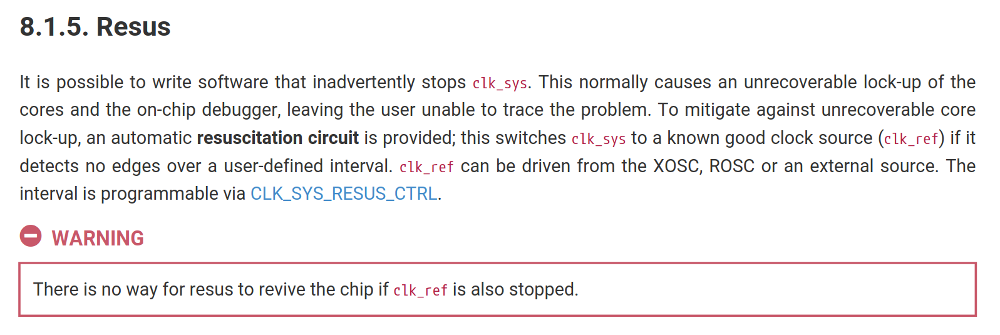

# *Properly* entering and exiting the DORMANT state

In Spring 2026, we discovered that more Proton boards than usual had trouble waking up from DORMANT mode.  **You do not need to have had this issue yourself to read this document and add the relevant lines of code - you should still do it regardless.**

The issue was simply a matter of us not reading the datasheet carefully - and so we have written this document to emphasize the importance of re-reading the datasheet every now and then (!), explain the background behind the issue, and to give you the code that properly enters and exits DORMANT mode.

## What were we doing in Step 1?

The purpose of Step 1 was to configure GP21 to put the RP2350 into an extreme low-power state called DORMANT mode.  In this mode, all clocks to the microcontroller's cores and peripherals were disabled by turning off the clock source, which is the crystal oscillator in the case of our Proton board.


## What was the expected behavior?

Once your program was uploaded, "Hello world" would be printed every second to your serial monitor.  When GP21 was pressed, the RP2350 would turn off the user LEDs GP22-GP25, and enter DORMANT mode.  During this time, the RP2350 would not respond to any interrupts on any pins except GP26 being pressed.

When GP26 was pressed, the RP2350 would wake, and turn the LEDs back on, and continue to print "Hello world" in a loop to a serial monitor.

## What actually happened?

When GP26 was pressed by some students, the RP2350 would turn the LEDs on, but "Hello world" would no longer print.  If you used the debugger to see what state the microcontroller was in, you would see that a "Hard Fault" had occurred.  (This is evidenced by looking at the Call Stack and seeing that the RP2350 was continually looping in a function called `isr_hardfault`.  This typically occurs when you make an invalid memory access, or execute some code that would have been impossible for the RP2350 to handle.)

## How did we debug this?

The first thing we did was to look back at our example code from Raspberry Pi for how they implemented DORMANT mode.  When we designed the lab experiment, our goal was to find the absolute minimum code that worked to keep things simple.  Our goal at the time was to ensure that the RP2350 could enter and exit DORMANT mode reliably, without any unexpected behavior or crashes, and it did - up to this point.

When we re-evaluated the [code](https://github.com/raspberrypi/pico-playground/blob/master/sleep/hello_dormant/hello_dormant_gpio.c) Raspberry Pi had used, we saw some code that we had missed that did the following:

1. Before entering DORMANT mode, Raspberry Pi's example code changed the source of the system clock to be the crystal oscillator directly, instead of the System PLL.
    - You'll learn this in lab 3, but suffice it to say that your RP2350 has a system clock frequency of 150 MHz that is generated by a System PLL (see diagram above), which in turn is clocked by the 12 MHz crystal oscillator.  
    - This effectively removes the System PLL from the equation, and connects the clock for the processor and bus fabric to the crystal oscillator directly.

2. They entered DORMANT mode and waited for a rising edge trigger to wake the microcontroller, and waited for the XOSC to become stable again.

3. Upon waking, the function that initializes PLLs and other clocks was called to restore the original system clock configuration, restoring the original system clock frequency.  They also called `stdio_uart_init` again to ensure the UART was re-initialized with the updated frequency.  (In our case, this is so that you can continue to see "Hello world" to print.)

## What do I have to do to fix this?

Add the following includes at the top of the file:

```c
#include "hardware/regs/clocks.h"
#include "hardware/clocks.h"
#include "pico/runtime_init.h"
```

The following goes within the block of code that executes when GP21 is pressed, in `gpio_isr`:

```c
// BEFORE we enter DORMANT:
// We change the system clock source from the System PLL to the crystal oscillator **directly**.
// The system clock frequency changes from 150 MHz from the PLL to XOSC_HZ, which is 12 MHz.
clock_configure(clk_sys,
    CLOCKS_CLK_SYS_CTRL_SRC_VALUE_CLK_REF,  // Clock source is the crystal oscillator, no PLLs
    0,                                      // Using glitchless mux (see 8.1.3.2 Multiplexers)
    XOSC_HZ,                                // What is the frequency of new clock source?   
    XOSC_HZ                                 // What frequency do we want clk_sys to be?
);

// TODO: Enter DORMANT mode here and wait for XOSC to become stable (your existing code):


// The following lines execute immediately after XOSC has become stable.

// Reset the sleep enable register so peripherals and other hardware can be used.
clocks_hw->sleep_en0 |= ~(0u);
clocks_hw->sleep_en1 |= ~(0u);

// Reinitialize all clocks.  This function gets called when we power on/reset the 
// microcontroller for the first time (hence the word "runtime").
runtime_init_clocks();

// UART needs to be reinitialised with the new clock frequencies for stable output
// UART signals are timing-specific, so knowing the correct frequency is crucial.
stdio_uart_init();
```

Hopefully, that should allow you to resume printing "Hello world" when you wake up from DORMANT, and be able to enter and exit DORMANT multiple times.  

## Why didn't you just update the instructions and save my time reading this?

If we gave you the answer directly, you would have had no idea about the importance of understanding the code you write.  The process of figuring things out is just as important as the solution itself.

Problems like this also often occur due to a misunderstanding of crucial components such as the clock tree, which we take for granted.  It is a very carefully designed piece of the architecture that ensures all peripherals are clocked correctly, and messing about with it can lead to unexpected behavior.

There are features we don't have much time to explore, such as **resus**, which is a feature of the RP2350 to restore the original clock configuration in case clocks were accidentally turned off.  It doesn't work for us in this lab, however, since we are turning off `clk_ref`, which is the crystal oscillator.  It's still worth keeping in mind for projects where you need to change clock sources dynamically, e.g. for low-power projects such as smartwatches, environmental monitors, and IoT devices where lower clock frequencies mean lower power dissipation, so that you have some way of determining whether you are changing clocks correctly.

