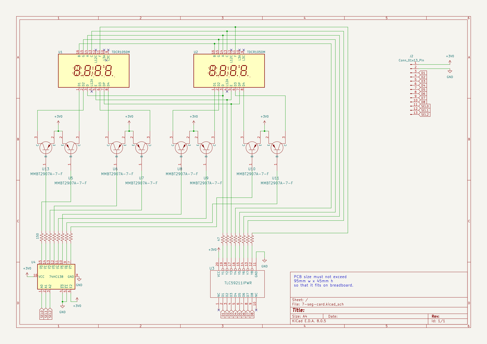
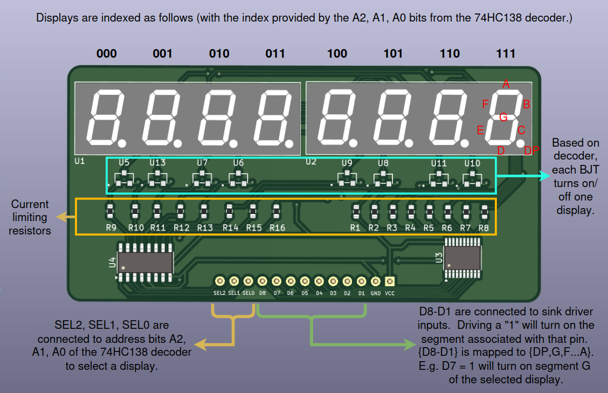

# Lab 3
## Timers

### Table of Contents
<br>

| Step | Description | Points |
|------|-------------|--------|
| 0.1 | Set up your environment |   |
| 0.2 | Wire and organize your breadboard |   |
| 1 | Read the datasheet | 40 |
| 2 | Implement keypad scanning | 30 |
| 3 | Use the multiplexed display | 30 |
| 4 | Play a game |  |
| 5 | Confirm your checkoffs before leaving | * |
| &nbsp; | Total: | 100 |
<br>

\* - You must get your whole lab checked off before the end of your lab section to avoid a late penalty of 20%.

### Instructional Objectives

- To understand and correctly utilize the clock tree of the RP2350 microcontroller.
- To understand how to use the GPIO pins and a timer to interface with a keypad.
- To understand how to use the GPIO pins and a timer to interface with eight multiplexed 7-segment displays.
- To understand how to use a timer to implement a scrolling display in tandem with keypad scanning and display control.

### Step 0.1: Set up your environment

Make sure to clone the code repository from GitHub Classroom.  Keep in mind to add, commit and push any changes you make so that your work is accessible from a lab machine. 

Open the template in VScode and with your Debug Probe connected to your Proton, click "Upload and Monitor".  Open the Serial Monitor to see the output of your program, and press the Reset button so that it prints out again.  You should now see the following:

```text
Timers Lab Test Suite
Type 'help' to learn commands.

> 
```

You can then type `help` to learn what commands you can use to test a certain subroutine.  You will use this to demo your implementation and wiring to the TAs.

If the text doesn't appear when you click "Upload and Monitor", ensure that `autotest()` is uncommented in `main.c`.

### Step 0.2: Wire and organize your breadboard

In this lab, we're going to add the 7-segment parallel driver card PCB that is in your kit.  This "card" was designed for you by your instructor to help alleviate wiring issues in the past from when students wired this up themselves on the breadboard, and to create space for new components in the future.  The schematic for this card is shown below, but **do not wire this up!**  We have a lot of background to get through first as to how this works:



The eight TDCR1050M seven-segment displays should be familiar to you from ECE 270 - you had these on the FPGA board that you used.  However, unlike 270, you will not directly drive each individual pin on the display - that would require 64 I/O pins that we do not have!  


Instead, we introduce a 74HC138 (another chip familiar to you from 270) 3-to-8 active-low decoder, whose outputs are all high except for the one specified by the three select pins.  

We also introduce a TLC59211PWR chip, which is called a sink driver.  The sink driver has eight outputs, each one connected to the cathode of the segments or decimal points on each seven-segment display.  A sink driver is a device that is capable of sinking (connecting to ground) a connection with a large current flow. 47Ω limiting resistors will be placed in between the sink driver and each cathode to prevent too much current from flowing through each segment.  Conveniently, the sink driver will sink current through an output pin when its corresponding input pin is high. In this way, it acts as an open-drain inverter, since a sink driver cannot push an output pin high. Using the sink driver, a logic high applied to the driver will cause the particular segment to illuminate, which is how you would like to think about it. 


The MMBT2907A BJTs in the middle of the decoder and sink driver chips provide power to the **common anode** of each of the displays, but only if the corresponding Base pin is turned off to allow current to flow from the Emitter through to the Collector pin (similar to Gate/Source/Drain in a MOSFET).  Note that all Base pins are connected to the outputs of the 74HC138 decoder - this is how we can control which display is active at any given time.

Therefore, the decoder controls **which display we want to turn on**, and the sink driver controls **the segments and decimal point of the selected display**.  At any given time, only one display can be turned on and have its segments lit up.  This concept of selecting which display to turn on is also called **multiplexing**.

Thus, we've reduced the need for 64 I/O pins to 3 select pins of the 74HC138, and 8 pins of the TLC59211PWR, for a total of 11 I/O pins.  We now have a much more manageable number of pins to control the displays.

Now that we've understood how this works, connect SEL2, SEL1, SEL0 to GP20, GP19, GP18 - these are the three address pins of the 74HC138 decoder.  

Connect D8-D1 to GP17-GP10, respectively.  These are the eight data pins of the TLC59211PWR sink driver.  Finally, connect VCC and GND to power and ground.



> [!IMPORTANT]
> Run `check_wiring` in the autotest console to check your wiring.  If you have any issues, carefully check your wiring and identify missing power/ground connections, or miswired connections.

### Step 1: Read the datasheet

Now that we're all wired up, let's get started understanding how clocks work on the RP2350.

*Clocks?  I thought this was about timers?*

Yes, but you have no way of running *anything*, much less timers, without clocks.  Microcontrollers generally implement a **clock tree**, which is a set of clock sources and dividers that allow you to generate a wide variety of clock frequencies for different peripherals.  The RP2350 is no exception.

We discuss clocks *now* because it is important to understand how a timer *ticks* - literally.  Your RP2350 takes in a 12 MHz clock from a crystal oscillator, and then increases that to 150 MHz using a phase-locked loop (PLL).  This is the clock that the CPU cores use to execute instructions.  However, different peripherals, even different timers, may require different clock frequencies, and so the RP2350's' clock tree job is to produce those varied clocks.


The source clocks that the RP2350 can use and derive different frequencies from can be identified on the left side of the diagram above:
- GPCLK0-1: These are GPIO pins that you can use as clock inputs or outputs on your RP2350.
    - This is very useful for prototyping an oscillator that will be used by another chip.  You can use a function generator to generate a clock signal, and then use it to test your code on a custom board with a different microcontroller or even another RP2350, if you choose to make one for senior design (or for fun!).
- USB PLL: PLLs, or **phase-locked loops**, are a useful type of circuit that multiply/divide that frequency of an input clock by a certain factor.  In the case of the USB PLL, it takes the 12 MHz crystal oscillator as an input, and multiplies it by 4 to get a 48 MHz clock.
- System PLL: This PLL multiplies the 12 MHz crystal oscillator by 125 with the VCO (Voltage-Controlled Oscillator), and then divides that by 10, to give you a 150 MHz clock.
    - Your CPU cores will use this clock frequency while executing the instructions from your code.
    - Why not leave it at 1.5 GHz?  [This StackOverflow post](https://electronics.stackexchange.com/questions/351512/why-do-micro-controllers-run-100s-mhz-whilst-cpus-run-ghz) explains it best.  Most of the time, it's about bringing down power consumption.
- Crystal Oscillator (XOSC): This is a 12 MHz crystal oscillator that is used as a reference clock for the PLLs, and can also be used directly as a reference clock for the onboard peripherals.
- Low Power Oscillator (LPOSC): This is a 32 kHz oscillator that is used for low-power or low-frequency applications.  Typically, you want to make this as accurate as possible, so a 32.768 kHz crystal would be more ideal.
    - We don't have this on our board, but it's possible to add one later on if you want to use the RP2350 in a low-power application with a need for more accurate timing, e.g. alarm clocks.

The very helpful RP2350 also adds a feature called "resus", short for *resuscitation*, that restarts the clocks if you are debugging your code and the clocks accidentally stop.

From these various **clock sources**, we derive the following clocks for use by peripherals:
- `clk_gpout0-3`: These are the clocks that are output on the GPCLK0-3 pins.  You can use these to drive external peripherals, or to test your code on a custom board.
- `clk_adc`: This is the clock that the ADC peripheral uses to sample the analog input pins.  Typically, it is the 48 MHz clock from the USB PLL, but it can be divided down to a lower frequency if needed.
- `clk_sys`: This is the 150 MHz clock that the CPU cores use to execute instructions.
- `clk_peri`: This can be anywhere between 12-150 MHz, and is used by the peripherals on the RP2350. 
- `clk_hstx`: This is the clock that the High-Speed Serial Transmit peripheral uses to transmit data over GPIO pins at a high data rate.  It is typically 150 MHz.
- `clk_ref`: This is the reference clock that the PLLs use to generate their output clocks, that go to **timers**.  It is typically the 12 MHz crystal oscillator.
- `tick`: This is a 1 MHz clock that is used by the AON timer to generate its own clock signals.  
- `clk_pow`: This is the clock that the power management unit uses to manage the power states of the RP2350.  It is typically 32 kHz from the LPOSC.

Read [Section 8.1: Clock Overview](https://datasheets.raspberrypi.com/rp2350/rp2350-datasheet.pdf#%5B%7B%22num%22%3A513%2C%22gen%22%3A0%7D%2C%7B%22name%22%3A%22XYZ%22%7D%2C115%2C709.282%2Cnull%5D) for more details.

Now, for the timers.  On the RP2350, we have the following ones:

1. RISC-V Platform Timer: It is a 64-bit timer whose value is accessible through `MTIME`, and is compared against `MTIMECMP` to generate an interrupt.  By default, it uses the `tick` clock as a prescaled input to generate its own clock signal.

2. Always-on (AON) Timer: This is a 32-bit timer that is always on regardless of power states, and is connected to the LPOSC to save power.  Since it is always on, it is useful for generating interrupts at a very low frequency, such as once per second, to check if the RP2350 should wake up from a low-power state.  We'll leave this alone for now, but you can read [Section 12.10](https://datasheets.raspberrypi.com/rp2350/rp2350-datasheet.pdf#%5B%7B%22num%22%3A1197%2C%22gen%22%3A0%7D%2C%7B%22name%22%3A%22XYZ%22%7D%2C115%2C250.994%2Cnull%5D) in the datasheet.

3. Watchdog Timer: This is a 32-bit timer that is used to reset the RP2350 if it gets stuck in a loop or otherwise becomes unresponsive.  We'll leave this alone for now, but you can read [Section 12.9](https://datasheets.raspberrypi.com/rp2350/rp2350-datasheet.pdf#%5B%7B%22num%22%3A1193%2C%22gen%22%3A0%7D%2C%7B%22name%22%3A%22XYZ%22%7D%2C115%2C585.608%2Cnull%5D) in the datasheet.

4. SysTick Timers: This is a 24-bit timer that also counts from either the `tick` signal or the system reference clock.  This is a timer that comes as part of the ARM cores, and can't be used by the RISC-V ones, but it's available for you to use if you need another timer in a pinch.  [Section 3.7 - Cortex-M33](https://datasheets.raspberrypi.com/rp2350/rp2350-datasheet.pdf#%5B%7B%22num%22%3A126%2C%22gen%22%3A0%7D%2C%7B%22name%22%3A%22XYZ%22%7D%2C115%2C266.20836%2Cnull%5D) describes the SysTick timer as part of the ARM specification, and in more detail.  

4. System Timers: These are two 64-bit timers (TIMER0 and TIMER1) that are used to generate **alarms** at a certain frequency (just consider them interrupts).  They are connected to the `tick` clock by default (which is at 1 MHz assuming a cycle count of 12), with an option to change to the system clock source to get a higher frequency.

The system timers can be considered **general-purpose timers**, because the interrupts that they generate can be used to run any type of custom handlers that you provide.  There are up to 4 alarms that can be set on each timer, and each alarm can be set to generate an interrupt at a different frequency.  

An alarm triggers when the configured counter value for that alarm is reached by the timer's own counter, which increments with every rising edge of its clock source.  Therefore, you need to set the alarm counter value to a sum of the **current** timer value and the number of *ticks* you want to wait before the alarm triggers.  

Now for questions.  Review how the 7-segment display works above, and answer the following assuming you have concatenated {SEL2, SEL1, SEL0, D8, D7, D6, D5, D4, D3, D2, D1} into a single 11-bit **bus**:

1. (5 points) What value would you assign to the bus to display "0" on the 4th seven-segment display (addressed as 3)?
2. (5 points) What value would you assign to the bus to display "5" on the 8th seven-segment display (addressed as 7)?
3. (5 points) If the bus was assigned the value 11'b00100000111, which display would be lit up, and what digit would be shown on the selected display?
4. (5 points) If the bus was assigned the value 11'b10101100110, which display would be lit up, and what digit would be shown on the selected display?

Read [Section 12.8 - System Timers](https://datasheets.raspberrypi.com/rp2350/rp2350-datasheet.pdf#%5B%7B%22num%22%3A1182%2C%22gen%22%3A0%7D%2C%7B%22name%22%3A%22XYZ%22%7D%2C115%2C415.326%2Cnull%5D) and answer the following questions:

5. (2 points) Assuming default settings, what is one "tick" in real time?  After one tick, the counter in the timer increments by 1.

6. (3 points) What is the default **tick source** for timers TIMER0 and TIMER1?

7. (5 points) What is the furthest point in time, in minutes, that the alarms can be set to generate an interrupt?

8. (5 points) What are the three steps to enable an alarm on a particular timer?  What line of code would you write to clear/set a bit for the first step?

9. (5 points) What needs to be done to clear a latched interrupt (i.e. acknowledge a timer interrupt) so that it does not fire again?
    - *Why is this important?*  Recall that if you don't do this, the interrupt will keep firing, executing the handler over and over again, and you will not be able to return to the main program.

> [!IMPORTANT]
> Show your answers for the questions asked above to your TA.  You must have **correct** answers to earn points for this step.  
> 
> Avoid the urge to ask others (AI/LLMs are included in "others") for answers.  These questions are specifically designed to get you used to looking at the datasheet for information, and for *you* to understand the microcontroller's specific configuration.

### Step 2: Implement keypad scanning

Now that you understand the clock tree and the timers, let's get started on the keypad scanning.  You've already done keypad scanning in labs 1 and 2, but in those labs, we had to implement scanning code in the `main` loop of the program, with delays in between each scan.  This is not ideal, because we could be using the CPU for other computationally-intensive tasks.

In this step, we'll also take this opportunity to "package" up our keypad scanning code once it's written.  We can then reuse it in future labs, and make it easier for us to reuse the same keypad scanning code in future RP2350 projects.  To do this step, you'll implement all your work in `keypad.c`.

From lab 2, copy in the functions `drive_column` and `keypad_isr`.  Rename `drive_column` to `keypad_drive_column` so that it won't conflict with any future code that may drive another kind of column.  

When you move on to a new lab, you'll be expected to include those files from the previous lab in your project yourself, so take care to implement this properly!

We're also going to significantly change how we read the keypad, moving away from the loop with sleep that we had in the last lab.  Instead, we'll implement two timer alarms that will fire every 20 milliseconds, offset from each other by 10 milliseconds.  

The offset implements the "delay" we had last lab, but now we can use that delay to do other things in the meantime, such as triggering another interrupt to update a display or read sensors.

The two alarms will do the following:
- One will drive the columns of the keypad, driving only one column at a time.
- The other will read the rows of the keypad, and do one of two things:
    - If a key was pressed for the first time, we will update a global 16-element array `state` that keeps track of the current key pressed, and push the event into a global queue struct `kev`.
    - If a key was released for the first time, we will update `state` to reflect that as well, and push the event into a global queue struct `kev`.

Two things to explain from that:
- You have a 16-element array of `bool` elements called `state`.  This corresponds to the `keymap` character array that translates the row and column pins to characters.  In `state`, if an element is `true`, it means that the corresponding key is currently pressed, and vice-versa if it is `false`.  You will update this `state` array in `keypad_isr`.
    - Find the definition in `keypad.c` itself.

- To track button presses AND releases as they happen, we provide you with a global FIFO queue called `kev` (Key EVents) with push and pop functions `key_push` and `key_pop` respectively.  We define these as "events".  When an event occurs, we push a 9-bit value with `key_push` that contains the pressed state of the key and the value of the key pressed.  Therefore:
    - When the button 8 is pressed, the value 9'b100111000 is pushed into the queue.  The 9th bit is 1, indicating "button pressed", and bits 8 through 0 8'b00111000 indicate the [ASCII number](https://www.ascii-code.com/) for "8", which is 56.
    - When the button 4 is released, the value 9'b000110100 is pushed into the queue.  The 9th bit is 0, indicating "button released", and bits 8 through 0 8'b00110100 indicate the [ASCII number](https://www.ascii-code.com/) for "4", which is 52.
    - You can see the definitions for these variables and functions in `queue.h`, which is provided to you.

Now that we have a basic understanding of how to do this, in `keypad.c`, implement the following functions:

#### 2.1. `keypad_init_pins`  

This function initializes the GPIO pins for the keypad.  It should set GP6-GP9 as outputs (for driving the columns) and GP2-GP5 as inputs (for reading the rows).  It should initialize the column pins to 0.  This should do the same thing as `init_keypad` from labs 1 and 2.

#### 2.2. `keypad_init_timer`  

In this function, initialize TIMER0 to fire alarm 0 after 1 second and call `keypad_drive_column`, and enable that interrupt.  Then, initialize TIMER0 to fire alarm 1 after 1.10 seconds to call `keypad_isr`, and enable that interrupt as well.  
- One hard requirement that we have for how you set the handler is that you set it as the exclusive handler, not a shared handler.  This is needed for your autotester to properly identify the handler.
- Look for the Programmer's Model section and/or the C/C++ SDK if you need help figuring out how to do this.

> [!NOTE]
> *Why 1.10 seconds?*
> 
> Notice that we're no longer using a sleep function when we do it this way.  Instead of one loop that drives the column, sleeps, and reads rows, we're having the timer trigger two alarms 0.1 seconds apart - one alarm responsible for driving the column, and the other for reading the rows.  This creates a "space" of 0.1 ms where the CPU can work on something else instead of sleeping (as one ought to make it do when working with embedded systems...)!

#### 2.3. `keypad_read_rows`  

This is a one-liner.  Return a single 4-bit value of the current state of GP2-GP5, which are the row pins.  For example, if GP3,GP4 is high but GP2,GP5 are low, then the return value of this function must be 6 (or 4'b0110).

#### 2.4. `keypad_drive_column`  

We're going to change this a little bit from what we had in lab 2.
- First, make sure to acknowledge the interrupt for ALARM0 on TIMER0.
- Increment the value of `col` first.  
    - We initialized `col` to -1 to account for this so that we scan COL3 (GP6) first.
    - Ensure that `col` wraps around to 0 after 3 - your columns pins are from GP6 to GP9.
- With the newly changed value of `col`, drive the selected column GPIO pin high, and drive all others low.
    - You can do this in a single statement with the SIO `gpio_togl` register, which atomically toggles GPIO pins in a single write.  Remember that if statements, for loops, etc. add a lot of unnecessary instruction execution to interrupt handlers, and you want to keep those short n' sweet!  Handlers should do their job quickly and return to the main program as soon as possible.
- Finally, set the timer's counter to trigger ALARM0 again in 12.5 ms, implementing a repeating alarm.

#### 2.5. `keypad_isr`  

We're going to change this a lot.  In the last lab, we used interrupts on each row pin.  However, that may not be very effective when we want to press buttons across multiple columns.  With this two-alarm approach, we can get pretty close.  
- First, acknowledge the interrupt for ALARM1 on TIMER0.  
- Get the current row pin values by calling `keypad_read_rows`.  
- For each of the row pins that are high, indicating that a button is pressed, check if the corresponding bit in `state` is low (indicating that the button was not pressed before).  If it is low, then we have a new key press.  
    - If so, set the corresponding bit in `state` to high.  
        - Calculate the index as the same offset you use to index into `keymap`, which gives you the character corresponding to each row and column, and whose value is `"DCBA#9630852*741"`.  See the diagram below to recall the mapping of the row and column pins to the `keymap` array.  
    - Push the event into the `kev` queue using `key_push`.  The "event" must be a 9-bit value containing the pressed state (1) and the ASCII value of the key pressed.  The 1-bit pressed state is the 9th bit, and the ASCII value is the lower 8 bits.  For example, if the key pressed was "5", then the value pushed into the queue should be `9'b100110101`, which is 5 in ASCII (53) with the "pressed" bit set to 1.  (Note how we account for 9 bits by making the argument type for `key_push` 16 bits with `uint16_t`.)  
- For each of the row pins that are low, indicating that a button is released, check if the corresponding bit in `state` is high (indicating that the button was pressed before).  If it is high, then we have a key release.  
    - If so, set the corresponding bit in `state` to low.    
    - Push the event into `kev`.  For example, if the key released was "5", then the value pushed into the queue should be `9'b000110101`, which is 5 in ASCII (53) with the "pressed" bit set to 0.  
- Make sure to reset ALARM1 so that the timer will fire it again in 12.5 ms, implementing a repeating alarm.

Here's the keypad pinout again to help you visualize the connections.  You should have GP9 to GP2 connected to COL1 to ROW4 respectively.


Uncomment the STEP2 stanza in `main.c`, and run your code with `autotest` commented out.  The code in `main` will call your initialization functions for the keypad GPIO pins, and the two alarms on TIMER0.  Press a button on the keypad, and you should see "Pressed: %c", where "%c" is the character corresponding to the key pressed, printed on the Serial Monitor.  If you release the button, you should see "Released: %c" printed instead.

With this method of keypad polling, we should be able to press multiple buttons, as long as they are not on the same row.  This is one disadvantage of having a multiplexed keypad, but it is a trade-off we make to reduce the number of GPIO pins used.  If you press two buttons on the same row, you might have unpredictable behavior, so just work around that in future applications.

> [!IMPORTANT]
> Show your working keypad polling to your TA to earn points for this step.  Demonstrate a key press and release and how it displays those messages on the Serial Monitor.  If you have any issues, ask your TA for help.
> 
> Uncomment `autotest` and run `keypad` in the autotest console to check for any errors.
> 
> Commit all your code and push it to your repository now.  Use a descriptive commit message that mentions the step number.

When you need to use the keypad in future labs, you will be expected to copy in `keypad.c` and `queue.h` into that lab's repository (if it doesn't already exist, or if you need to fill in the functions), and call the initialization functions as we demonstrated for you in `main.c`, using `key_pop` to wait on key events from the keypad.

### Step 3: Use the multiplexed display

Now, let's get started on the display.  You should understand by now that to display a value on any of the eight 7-segment displays, we need to push out an 11-bit value to the shift registers, of which:

1. The top three bits are the select lines for the 74HC138 3-to-8 decoder to select one of the eight digits, and;
2. The bottom eight bits are the decimal point and seven segments of the chosen digit display.

To see the multiplexing effect again in real time, run `check_wiring` on the autotest object you were provided.  

In this step, we'll implement an alarm on TIMER1 that will fire every 3 milliseconds to display a message on the 7-segment displays.  Open the file `display.c`, and you'll see that we've provided you with some important variables:

1. `msg` - An array of 8 characters that will hold the seven-segment representation of the characters to display.  Initially, it contains the seven-segment representation of "01234567", which is what we will display first.

2. `font` - An array whose indices correspond to the ASCII values of characters, and whose values are the seven-segment representation of those characters.  For example, `font['0']` is the seven-segment representation of "0", which is `8'b01101111`.  You can use this array to convert ASCII values to their seven-segment representation.  The actual values are in `font.S`, which is provided to you.

3. `index` - A global integer that keeps track of which 7-segment display to show a value on.  When we configure our timer interrupt to fire every 3 milliseconds to display some value on a specific digit, this variable will be incremented until 7, at which point it will wrap around to 0.  This way, we can cycle through all eight displays. 

With these variables, go ahead and implement the following functions in `display.c`:

#### 3.1: `display_init_pins`  
Initialize pins GP10-GP20 as outputs.  GP20-GP18 are connected to the select lines for the 74HC138 decoder which chooses one of the eight displays, and GP17-GP10 will be the data lines for the TLC59211PWR sink driver, connected to the seven-segment pins shared between all eight displays.  Here is a full explanation of how your 7-segment display card works.


#### 3.2: `display_init_timer`  
Initialize TIMER1 to fire ALARM0 after 3 milliseconds, at which point the interrupt will call `display_isr` when triggered.  Make sure to enable the interrupt for ALARM0 on TIMER1.  Again, set `display_isr` as the exclusive handler, not a shared handler.  This is needed for your autotester to properly identify the handler.

#### 3.3: `display_print`  
This takes an array of "key-events" from the keypad, transforms them into the seven-segment representation, and stores them in the local `msg` character array.  We'll push the characters out to the display from `msg`, hence the transformation.  

This function should be similar to the `display_char_print` we've provided you, which takes a regular string of characters and displays that on the 7-segment display.  You just need to add in the transformation for the decimal point.

Recall from Step 2 that a key-event is a 9-bit value with the pressed state in the 9th bit and the ASCII value of the key pressed in the lower 8 bits.  So, if we have the following key-events passed to `display_print`:

```
9'b100110101  // "5" pressed
9'b000110101  // "5" released
... // 6 more key-events
```

Then the values in `msg` would be as follows:

```
8'b11101101  // 7-segment representation of "5" with decimal point on
8'b01101101  // 7-segment representation of "5" with decimal point off
... // 6 more characters
```

You can use the global `font` array to convert ASCII values to the seven-segment representation.

#### 3.4: `display_isr`  
This is where the magic happens!  In this function, do the following:
- Acknowledge the interrupt for ALARM0 on TIMER1.
- Set the value of GP20-GP10 to a new 10-bit value where the provided global variable `index` is used to select the seven-segment display to turn on, and the value of `msg[index]` is used to determine which segments to light up.  `msg` is an array of 8 characters that initially contains the seven-segment representation of "01234567" - you can see this at the top of the file.
- Increment `index` by 1, and wrap around to 0 after 7.  (Can you do this without an if statement or modulus?  Hint: think in binary.)
- Make TIMER1 ALARM0 fire the interrupt again in 3 milliseconds.

Now, look back at `main.c`.  Uncomment the `STEP3` define at the top of the file while commenting out the STEP2 one, and run your code with `autotest` commented out.  We've given you code that calls the keypad and display initialization functions, and then calls `display_print` with the `kev` queue to display the characters pressed on the keypad.

Until you press buttons on the keypad, you should see the display cycling through the characters in `msg`, which is initially "01234567".  Press **and hold** a button, and you'll see the display clear, and the pressed button value appear with the decimal point lit up on the rightmost digit.  Let go of the button, and the same digit will appear, but with the decimal point off.  The display will shift left as you press more buttons.

Try holding down multiple buttons (not in the same row) and note how you can see the display reflect exactly the characters pressed, as well as the same release events in the same order that you perform them!

> [!IMPORTANT]
> Show your working keypad and display to your TA to earn points for this step.  You must have the display cycling through the characters in `message`, and the decimal point shifting through each digit every 0.25 seconds.  If you have any issues, ask your TA for help.
> 
> Uncomment `autotest` and run `display` in the autotest console to check for any errors.
> 
> Commit all your code and push it to your repository now.  Use a descriptive commit message that mentions the step number.

### Step 4: (Optional) Play a game

That was a long lab, so you deserve a game after all that hard work!  

Comment out the `STEP3` define in `main.c`, and uncomment the `STEP4` define.  This will call the `game()` function that will allow you to play a game that may be familiar to you from ECE 270.  As a reminder, here's the instructions:

- Your lunar lander starts at 4500 ft above the moon with 800 units of gas.
- Press A for altitude, B for gas, and D to view velocity.  0-9 changes thrust.
- The lander immediately starts picking up speed due to gravity, so its velocity will decrease (entering negative values) as it falls.
- Press "0" to let it pick up a velocity of around -100 ft/s, then press "5".
- Wait until altitude reaches 1800 ft to set the thrust to 9 to counteract the velocity.
- Wait until the velocity reaches -10 ft/s, then press "5", and wait until the altitude reaches 0 to safely land (which will say "LANDED").

Keep in mind that button presses will be registered very slowly since it is in the same interrupt handler as the quantity updation, so be patient!

> [!IMPORTANT]
> Nothing to demonstrate for this step.

### Step 5: Confirm your checkoffs before leaving

> [!CAUTION]
> Make sure you got checked off here: https://engineering.purdue.edu/ece362/checkoff/
> 
> Make sure to upload your confirmation code and verify that it is accepted by Gradescope.  You will know it is accepted if you get the points from Gradescope.
> 
> Before you leave, make sure your station is clean and that you have gathered your belongings, and then call a TA to confirm that you can leave.  Confirm that you have received your checkoffs and that your confirmation code was accepted on Gradescope before logging out and leaving for the day.
