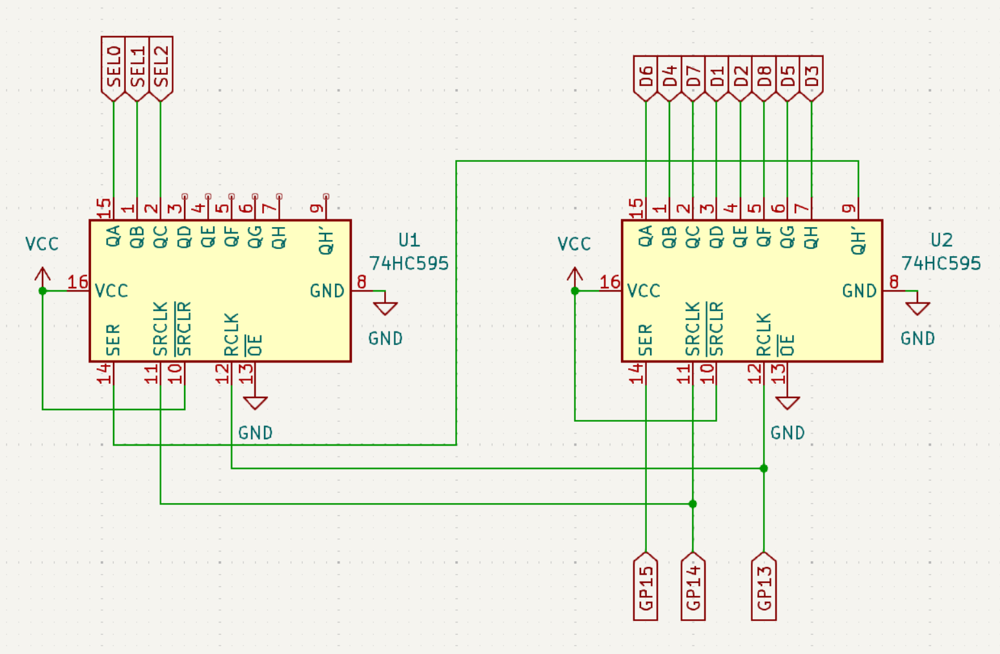

# Lab 3
## Timers

### Table of Contents
<br>

| Step | Description | Points |
|------|-------------|--------|
| 0.1 | Set up your environment |   |
| 0.2 | Wire and organize your breadboard |   |
| 1 | Read the datasheet | 20 |
| 2 | Implement keypad scanning | 30 |
| 2.1 | 
| 3 | Use a multiplexed display | 10 |
| 4 | Create a scrolling display | 10 |
| 5 | In-Lab Checkoff Step | 20* |
| &nbsp; | Total: | 100 |
<br>

\* - You must get your whole lab checked off before the end of your lab section to avoid a late penalty of 20%.

### Instructional Objectives

- To understand the clock tree of the Pico 2 and how to use it to generate accurate timing.
- To understand how to use the GPIO pins and a timer to interface with a keypad.
- To understand how to use the GPIO pins and a timer to interface with eight multiplexed 7-segment displays.
- To understand how to use a timer to implement a scrolling display in tandem with keypad scanning and display control.

### Step 0.1: Set up your environment

Make sure to clone the code repository from GitHub Classroom.  Keep in mind to add, commit and push any changes you make so that your work is accessible from a lab machine. 

Open the template in VScode and with your Debug Probe connected to your Pico 2, click "Flash Project (SWD)".  Open the Serial Monitor to see the output of your program, and press the Reset button so that it prints out again.  You should now see the following:

```text
Timers Lab Test Suite for Pico 2
Type 'help' to learn commands.

> 
```

You can then type `help` to learn what commands you can use to test a certain subroutine.  You will use this to demo your implementation and wiring to the TAs.

### Step 0.2: Wire and organize your breadboard

In this lab, we're going to add the 7-segment parallel driver card that is in your kit.  This was designed for you by your instructor to help alleviate wiring issues in the past from when students wired this up themselves on the breadboard, and to create space for new components in the future.  The schematic for this card is shown below, but **do not wire this up!**  We have a lot of background to get through first as to how this works:


The eight TDCR1050M seven-segment displays should be familiar to you from ECE 270 - you had these on the FPGA board that you used.  However, unlike 270, you will not directly drive each individual pin on the display - that would require 64 I/O pins that we do not have!  


Instead, we introduce a 74HC138 (another chip familiar to you from 270) 3-to-8 active-low decoder, whose outputs are all high except for the one specified by the three select pins.  

We also introduce a TLC59211PWR chip, which is called a sink driver.  The sink driver has eight outputs, each one connected to the cathode of the segments or decimal points on each seven-segment display.  A sink driver is a device that is capable of sinking (connecting to ground) a connection with a large current flow. 47Ω limiting resistors will be placed in between the sink driver and each cathode to prevent too much current from flowing through each segment.  Conveniently, the sink driver will sink current through an output pin when its corresponding input pin is high. In this way, it acts as an open-drain inverter, since a sink driver cannot push an output pin high. Using the sink driver, a logic high applied to the driver will cause the particular segment to illuminate, which is how you would like to think about it. 


The BJTs in the middle of the decoder and sink driver chips, and the seven-segment displays provide power to the common anode of each of the displays, but only if the corresponding Base pin is turned off to allow current to flow from the Emitter through to the Collector pin.  Note that all Base pins are connected to the outputs of the 74HC138 decoder - this is how we can control which display is active at any given time.

Therefore, the decoder controls **which display we want to turn on**, and the sink driver controls **the segments and decimal point of the selected display**.  At any given time, only one display can be turned on and have its segments lit up.  This concept of selecting which display to turn on is also called **multiplexing**.

Thus, we've reduced the need for 64 I/O pins to 3 select pins of the 74HC138, and 8 pins of the TLC59211PWR, for a total of 11 I/O pins.  This is a much more manageable number of pins to control the displays... until you look at the Pico 2, and you wonder how you're going to do future labs with what you have left!  That means we need to add one more level of abstraction to the display control - shift registers.

Recall from ECE 270 that a **shift register** is a set of flip-flops that are connected in series, so that when a rising edge of the common clock occurs, the values of the flip-flops appear to **shift** by 1 to the left.  

If we combine the 11 pins on the seven-segment displays as **bits**, we get an 11-bit value.  If we use a shift register to contain these 11 bits, we can control the display with only 3 pins - a **data pin**, a **clock pin**, and an **enable pin**.  The data pin is used to set the value of the 11 bits, the clock pin is used to shift the bits into the shift register, and the enable pin is used to allow the shift register to *shift*.  This is how we can control the display with only 3 pins.

In your lab kit, you have two 74HC595 shift registers, which are 8-bit shift registers with enables.  You can cascade them together to create a 16-bit shift register, which is enough to control the 11 bits of the seven-segment displays.  The pins QH-QA together form the 8-bit output of the shift register (with QH being MSB and QA being LSB), and on every rising edge of SRCLK, the bit on SER is shifted into QA, with all other bits being shifted into the next bit (QA goes to QB, QB goes to QC, etc).  In our case, the bit getting shifted out of the last bit (QH) of one shift register, goes into the first bit (QA) on the other shift register. 

Use the diagram below to wire up the two shift registers between the parallel driver card and the Pico 2 pins GP13-GP15:



Our suggested placement is to put the parallel driver card on the top left of the board, and the shift registers on the breadboard panel directly below the parallel driver card.  

**Note the seemingly random connections between QA-QH to the D8-D1 pins** of your parallel driver card - this is a mistake on the card that carried over from prior versions of these labs, when students used to manually wire up the displays, 74HC138, and TLC59211 chips.  While the wiring may seem tedious to do, this is to allow you to assign segments DP-G-F-E-D-C-B-A, in that order, to the 8 bits of the rightmost shift register.  The 3 select lines SEL2,SEL1,SEL0 form the bottom 3 bits of the left shift register, allowing you to easily concatenate the values as a single 11-bit value `{SEL2,SEL1,SEL0,D8,D7,D6,D5,D4,D3,D2,D1}`.  

Therefore, to control the display, we'll pad the 11-bit value with 5 zeroes to create a 16-bit value, which we will "clock in" to the shift registers using GP13-GP15.  (This should be familiar from 270 - we're just doing it in C, and not Verilog, now!)

Now that you understand the background, go ahead and do the following:

1. Place the parallel driver card on the top left of your breadboard.
2. Place the two 74HC595 shift registers on the breadboard panel directly below the parallel driver card.
3. Connect the parallel driver card to the shift registers as shown in the diagram above.  (The wiring will get a little bit messy, but that's okay.  Expect messy wiring sometimes with more complex components!)
4. Wire the shift registers up to power and ground where needed.
5. Connect the shift registers to your Pico 2 at the corresponding pins.

> [!IMPORTANT]
> Run `check_wiring` in the autotest console to check your wiring.  If you have any issues, carefully check your wiring and identify missing power/ground connections, or miswired connections.

### Step 1: Read the datasheet

Now that we're all wired up, let's get started understanding how clocks work on the Pico 2.

*Clocks?  I thought this was about timers?*

Yes, but you have no way of running *anything*, much less timers, without clocks.  Microcontrollers generally implement a **clock tree**, which is a set of clock sources and dividers that allow you to generate a wide variety of clock frequencies for different peripherals.  The Pico 2 is no exception.


The source clocks that the Pico 2 can use can be identified on the left side of the diagram above:
- GPCLK0-1: These are GPIO pins that you can use as clock inputs or outputs on your Pico 2.
    - This is very useful for prototyping.  You can use a function generator to generate a clock signal, and then use it to test your code on a custom board with the RP2350 chip, if you choose to make one for senior design.
- USB PLL: PLLs, or **phase-locked loops**, are a useful type of circuit that multiply/divide that frequency of an input clock by a certain factor.  In the case of the USB PLL, it takes the 12 MHz crystal oscillator as an input, and multiplies it by 4 to get a 48 MHz clock.
- System PLL: This PLL *effectively* multiples the 12 MHz crystal oscillator by 125 (due to the VCO, Voltage-Controlled Oscillator), and then divides by 10, to get a 150 MHz clock.
    - Your CPU cores will use this clock frequency while executing the instructions from your code.
- Crystal Oscillator (XOSC): This is a 12 MHz crystal oscillator that is used as a reference clock for the PLLs, and can also be used directly as a reference clock for the onboard peripherals.
- Low Power Oscillator (LPOSC): This is a 32 kHz oscillator that is used for low-power or low-frequency applications.  Typically, you want to make this as accurate as possible, so a 32.768 kHz crystal would be more ideal.

From these various **clock sources**, we derive the following clocks for use by peripherals:
- `clk_gpout0-3`: These are the clocks that are output on the GPCLK0-3 pins.  You can use these to drive external peripherals, or to test your code on a custom board.
- `clk_adc`: This is the clock that the ADC peripheral uses to sample the analog input pins.  Typically, it is the 48 MHz clock from the USB PLL, but it can be divided down to a lower frequency if needed.
- `clk_sys`: This is the 150 MHz clock that the CPU cores use to execute instructions.
- `clk_peri`: This can be anywhere between 12-150 MHz, and is used by the peripherals on the Pico 2. 
- `clk_hstx`: This is the clock that the High-Speed Serial Transmit peripheral uses to transmit data over GPIO pins at a high data rate.  It is typically 150 MHz.
- `clk_ref`: This is the reference clock that the PLLs use to generate their output clocks, that go to **timers**.  It is typically the 12 MHz crystal oscillator.
- `tick`: This is a 1 MHz clock that is used by the AON timer to generate their own clock signals.  You used this last lab as a prescaled (12 MHz -> 1 MHz) clock input to the RISC-V Platform Timer.
- `clk_pow`: This is the clock that the power management unit uses to manage the power states of the Pico 2.  It is typically 32 kHz from the LPOSC.

Read [Section 8.1: Clock Overview](https://datasheets.raspberrypi.com/rp2350/rp2350-datasheet.pdf#%5B%7B%22num%22%3A512%2C%22gen%22%3A0%7D%2C%7B%22name%22%3A%22XYZ%22%7D%2C115%2C709.282%2Cnull%5D) for more details.

Now, for the timers.  On the Pico 2, we have the following ones:

1. RISC-V Platform Timer: We used this last lab to generate a 1 Hz clock signal.  It is a 64-bit timer whose value is accessible through `MTIME`, and is compared against `MTIMECMP` to generate an interrupt.  By default, it uses the `tick` clock as a prescaled input to generate its own clock signal.

2. Always-on (AON) Timer: This is a 32-bit timer that is always on regardless of power states, and is connected to the LPOSC to save power.  Since it is always on, it is useful for generating interrupts at a very low frequency, such as once per second, to check if the Pico 2 should wake up from a low-power state.  We'll leave this alone for now, but you can read [Section 12.10](https://datasheets.raspberrypi.com/rp2350/rp2350-datasheet.pdf#%5B%7B%22num%22%3A1194%2C%22gen%22%3A0%7D%2C%7B%22name%22%3A%22XYZ%22%7D%2C115%2C250.994%2Cnull%5D) in the datasheet.

3. Watchdog Timer: This is a 32-bit timer that is used to reset the Pico 2 if it gets stuck in a loop or otherwise becomes unresponsive.  We'll leave this alone for now, but you can read [Section 12.9](https://datasheets.raspberrypi.com/rp2350/rp2350-datasheet.pdf#%5B%7B%22num%22%3A1190%2C%22gen%22%3A0%7D%2C%7B%22name%22%3A%22XYZ%22%7D%2C115%2C585.608%2Cnull%5D) in the datasheet.

4. SysTick Timers: This is a 24-bit timer that also counts from either the `tick` signal or the system reference clock.  This would be considered the "ARM Platform Timer", but since it is not usable by the RISC-V cores, and because it has far less bits to count, we won't use them (although you are encouraged to use these when you use the ARM cores if you need more timers).  [Section 3.7 - Cortex-M33](https://datasheets.raspberrypi.com/rp2350/rp2350-datasheet.pdf#%5B%7B%22num%22%3A125%2C%22gen%22%3A0%7D%2C%7B%22name%22%3A%22XYZ%22%7D%2C115%2C339.11468%2Cnull%5D) describes the SysTick timer as part of the ARM specification, and in more detail.  

4. System Timers: These are two 64-bit timers (TIMER0 and TIMER1) that are used to generate **alarms** at a certain frequency (just consider them interrupts).  They are connected to the `tick` clock by default (which is at 1 MHz assuming a cycle count of 12), with an option to change to the system clock source.

The system timers can be considered **general-purpose timers**, because the interrupts that they generate can be used to run any type of custom handlers that you provide.  However, unlike the Platform Timer, there are up to 4 alarms that can be set on each timer, and each alarm can be set to generate an interrupt at a certain frequency.  

Read [Section 12.8 - System Timers](https://datasheets.raspberrypi.com/rp2350/rp2350-datasheet.pdf#%5B%7B%22num%22%3A1179%2C%22gen%22%3A0%7D%2C%7B%22name%22%3A%22XYZ%22%7D%2C115%2C302.622%2Cnull%5D) and answer the following questions:

1. What is the default **clock source** for timers TIMER0 and TIMER1? (i.e. what is the input clock to the tick generator?)

2. What are the three steps to enable an alarm on a particular timer?  What line of code would you write to clear/set a bit for the first step?

3. What needs to be done to clear a latched interrupt (i.e. acknowledge a timer interrupt) so that it does not fire again?

4. What is the furthest point in time, in minutes, that the alarms can be set to generate an interrupt? 

> [!IMPORTANT]
> Show your answers for the questions asked above to your TA.  You must have **correct** answers to earn points for this step.  
> 
> Avoid the urge to ask others (AI/LLMs are included in "others") for answers.  These questions are specifically designed to get you used to looking at the datasheet for information, and for *you* to understand the microcontroller's specific configuration.

### Step 2: Implement keypad scanning

Now that you understand the clock tree and the timers, let's get started on the keypad scanning.  You've already read from the keypad in lab 1 (If you haven't wired this up, go back to lab 1), but in that lab, we implemented the scanning code in the `main` loop of the program, with delays in between each scan.  This is not ideal, because we could be using the CPU for other computationally-intensive tasks.

Therefore, for this step, we'll use a timer to do this instead, and interrupt the CPU instead when it has to scan next.  First, though, we need to create some keypad handling functions.

### 2.1 - `drive_column`: Update the keypad column being scanned

Implement the function `drive_column(int c)` that updates the column of the keypad that has a logic high applied to it.  You'll want to use the `gpio_set` and `gpio_clr` registers under the SIO subsystem to make this easier, instead of writing a loop which wastes valuable CPU time.

```C
void drive_column(int c) {
    c = least 2 bits of c (use AND operator)
    first clear the COL4-COL1 pins
    then set ONE of the COL4-COL1 pins corresponding to the column `c`
}
```

**The keypad columns are scanned from right-to-left, where the rightmost column is COL1 and the leftmost column is COL4. Rows are interpreted from bottom-to-top.**

### 2.2 - `read_rows`: Read the row values

Implement the following function to examine the **GPIO input register** and return the 4-bit reading of the rows of the keypad.  Make sure to **shift** the value appropriately - the permitted range of values from this function is between 0b0000 and 0b1111, inclusive.

```C
int read_rows() {
    return the 4-bit reading of the row GPIO pins
}
```

### 2.3 - `rows_to_key`: Translate row of a column to a key

Implement the following function that examines the rows reading for a particular column and turns it into a character.  Remember that only the lower two bits of the `col` determine the column.  We want to turn the row/column combination into a number and then use that number as the offset into an array called the `keymap_arr` that is initialized for you in `main.c`.

**The keypad columns are scanned from right-to-left, where the rightmost column is column 0 and the leftmost column is column 3. Rows are interpreted from bottom-to-top.**

```
Buttons:                 Offsets:
+---+---+---+---+        +---+---+---+---+
| 1 | 2 | 3 | A |        | f | b | 7 | 3 |
+---+---+---+---+        +---+---+---+---+
| 4 | 5 | 6 | B |        | e | a | 6 | 2 |
+---+---+---+---+        +---+---+---+---+
| 7 | 8 | 9 | C |        | d | 9 | 5 | 1 |
+---+---+---+---+        +---+---+---+---+
| * | 0 | # | D |        | c | 8 | 4 | 0 |
+---+---+---+---+        +---+---+---+---+
```


For instance, if the '8' button is pressed, the number for that button should be 0x9 (an offset of one from the start of column 2: 2\*4 + 1 = 9). When the '\*' button is pressed, the offset should be 12 (hexadcimal 0xc) since it is in column 3, row 0 (3*4 + 0 = 12).

The function to implement is: 

```C
char rows_to_key(int rows) {
    // Note `rows` will be the 4 bit value from read_rows that indicates 1 for a row if a button was pressed.
    compute the offset of the button being pressed right now from `rows` and `col` (start checking from the lowest row)
    lookup `c` in the `keymap_arr` indexed by the offset
    return c;
}
```

This part can be a little confusing to get.  What it comes down to is that the value of "rows" is **not** just the index of the row.  You need to find the relationship between them, so consider what "rows" is indicating here.  

One hint: Think about what the `read_rows` function returns.  How does the value returned determine what row is being asserted?  What happens if no buttons were pressed?

Another hint: The keymap array is indexed by the calculated offset of the button being pressed.  Take a look at font.S to see what the arrangement of the keymap is to get a better idea of how the offset should be calculated.

### 2.4 - `handle_key`: Do something for a particular key

Implement the following function that decides what to do for a key passed as an argument. The function to implement is: 

```C
void handle_key(char key) {
    if key == 'A'/'B'/'D', set mode to key
    else if key is a digit, set thrust to the represented value of key, i.e. if key == '1', thrust = 1, not '1'
}
```

> [!IMPORTANT]
> Demonstrate to your TA that your code passes the `drive_column`, `read_rows`, `rows_to_key` and `handle_key` tests.  Commit all your code and push it to your repository now.  Use a descriptive commit message that mentions the step number.  

Implement `init_keypad_timer` to configure TIMER0 to generate an interrupt on ALARM0 every 1 ms.  An interrupt every millisecond may sound like too many until you remember how fast the clock is, making key scanning the least intensive operation the CPU has to handle.  When the interrupt signal fires, it should invoke `keypad_timer_isr`.

In `keypad_timer_isr`, implement the keypad scanning logic you used in lab 1, but modify it such that you check all the rows when a column is driven high, instead of the matching row.  If a row is matched, then instead of turning on an LED, 

The diagram for the keypad is provided again below so that you know what rows are associated with what buttons for a particular column.  

One change is needed - instead of turning on an LED when a row is pressed with its corresponding column, as you did in lab 1, you should instead set a bit in a global variable `keypad_state` to indicate that a key is pressed.  The bit should be set to 1 if the key is pressed, and 0 if it is not. 

**The keypad columns are scanned from right-to-left, where the rightmost column is column 0 and the leftmost column is column 3. Rows are interpreted from bottom-to-top.**

```
Buttons:                 Offsets:
+---+---+---+---+        +---+---+---+---+
| 1 | 2 | 3 | A |        | f | b | 7 | 3 |
+---+---+---+---+        +---+---+---+---+
| 4 | 5 | 6 | B |        | e | a | 6 | 2 |
+---+---+---+---+        +---+---+---+---+
| 7 | 8 | 9 | C |        | d | 9 | 5 | 1 |
+---+---+---+---+        +---+---+---+---+
| * | 0 | # | D |        | c | 8 | 4 | 0 |
+---+---+---+---+        +---+---+---+---+
```

