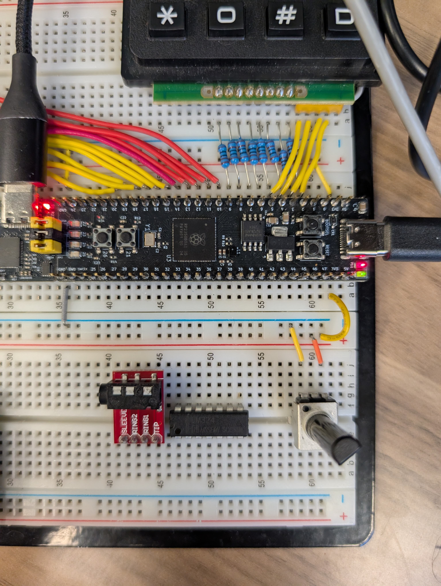

# Lab 4
## ADC and DMA

### Table of Contents
<br>

| Step | Description | Points |
|------|-------------|--------|
| 0.1 | Set up your environment |   |
| 0.2 | Wire and organize your breadboard |   |
| 1 | Read the datasheet | 25 |
| 2 | Perform a single-shot sample conversion | 20 |
| 3 | Perform free-running sample conversions | 20 |
| 4 | Configure the DMA to automate ADC sample conversions | 35 |
| 5 | Confirm your checkoffs before leaving | * |
| &nbsp; | Total: | 100 |
<br>

\* - You must get your whole lab checked off before the end of your lab section to avoid a late penalty of 20%.

### Instructional Objectives

- To understand the purpose of an analog-to-digital converter (ADC) and how it works.
- To explore the uses of an ADC and how to configure and read from it.
- To understand the purpose of direct memory access (DMA) and how it works.
- To utilize DMA to perform analog-to-digital conversions automatically and transfer data to memory.

### Step 0.1: Set up your environment

Make sure to clone the code repository from GitHub Classroom.  Keep in mind to add, commit and push any changes you make so that your work is accessible from a lab machine. 

Open the template in VScode and with your Debug Probe connected to your Proton, click "Upload and Monitor".  Open the Serial Monitor to see the output of your program, and press the Reset button so that it prints out again.  You should now see the following:

```text
ADC & DMA Lab Test Suite
Type 'help' to learn commands.

> 
```

You can then type `help` to learn what commands you can use to test a certain subroutine.  You will use this to demo your implementation and wiring to the TAs.

If the text doesn't appear when you click "Upload and Monitor", ensure that `autotest()` is uncommented in `main.c`.

### Step 0.2: Wire and organize your breadboard

For this lab, obtain a **potentiometer** from the ECE shop if you don't already have one, and place it on your breadboard right underneath the "head" of the Proton board, where the BOOTSEL and RESET buttons are located.  Place it as close to the edge of the breadboard as possible, as we will put in more components **to the left** of the potentiometer later.  Here's a picture:



Wire it as follows:
- Wire the left pin to ground.
- Wire the right pin to 3.3V.
- Wire the center pin to the pin associated with Channel 5 of the ADC.  

To find the pin that can be used with ADC's Channel 5, we need to look at the pinout for the RP2350 chip in its datasheet, which we can find on this page [here](https://datasheets.raspberrypi.com/rp2350/rp2350-datasheet.pdf#%5B%7B%22num%22%3A19%2C%22gen%22%3A0%7D%2C%7B%22name%22%3A%22XYZ%22%7D%2C115%2C406.15356%2Cnull%5D).  Look for the GPIO number that would be most likely associated with Channel 5 of the ADC, find it on your Proton board, and connect that to the output of your potentiometer.

Normally, we find the function associated with GPIO functions in the **GPIO Functions Table** that's just below this page, but for some reason the ADC isn't listed there, so we use the chip pinout instead.  (Here's an example of a thing that *should* be documented here, but just isn't, requiring you to look around the datasheet to find it.  Another place to find it would be the ADC peripheral description further down in the datasheet.)  You might want to keep this in mind when you're looking up pins for other peripherals like SPI, PWM, I2C etc. as opposed to the ADC.

### Step 1: Read the datasheet

The ADC, or analog-to-digital converter, is a peripheral with a very simple mandate.  It takes the voltage on an associated GPIO pin, ideally within the range between 0 (zero) and VCC (typically 3.3V), and converts it into a digital value that can be processed by code flashed on the microcontroller.  An ADC has a number of bits used to represent that digital value, and on the Pico 2, it has 12 bits, meaning that it can represent a voltage in 2^12 = 4096 discrete steps.  The higher the number of bits, the higher the precision of the voltage reading.

To understand how the Pico 2's specific ADC works, start by reading [Section 12.4. ADC and Temperature Sensor](https://datasheets.raspberrypi.com/rp2350/rp2350-datasheet.pdf#%5B%7B%22num%22%3A1066%2C%22gen%22%3A0%7D%2C%7B%22name%22%3A%22XYZ%22%7D%2C115%2C270.17%2Cnull%5D).  You'll see that the ADC is a single peripheral capable of selecting and reading from multiple channels, which in turn are connected to specific GPIO pins or an internal temperature sensor on the board.  You can sample one channel entirely, or do a **round-robin method** where you cycle through each one, reading their samples, in free-running sampling mode.  

Reading a lot of samples very quickly allows you to capture a waveform, for example, or at slower speeds, to measure the voltage of a battery over time.

Read about the ADC in the datasheet, find helpful SDK functions related to the ADC, and answer the following questions:

1. How many samples can the ADC read per second?  What is the frequency of the ADC clock that supports this sampling rate?

2. How many ADC channels are available on your RP2350?  Our Proton board uses the RP2350B specifically, which is the QFN-80 package.

3. What ADC register's bits do you have to write to in order to select a particular channel for sampling?  What bits should you write to to start a conversion?  Where should you read the result from?

4. What ADC register's bits do you have to read from to determine if a conversion has completed?  Why is it important to know this?

5. How many bits does the ADC use to represent one sample?  What is the maximum value that can be represented by this many bits?

The possibility of multiple samples coming out from the ADC presents a unique problem - if we have samples coming out of the ADC at a high rate, we can't keep interrupting the CPU to manually move the samples to a memory location.  Enter Direct Memory Access, or DMA.

DMA is a very unique peripheral in that **it doesn't interface to anything external to the microcontroller**.  Its only purpose is to facilitate autonomous data transfer between three pairs of sources:

- **From memory to memory**
    - If you have very large amounts of data that can take up a lot of CPU time to copy, you can use DMA to move data from one memory location to another without the CPU needing to do anything, especially if the source updates at intervals and you need to keep the two regions in sync.  This is useful for large buffers or arrays.
- **From memory to peripheral**
    - Once you have part of your picture in RAM, you can use DMA to send it to a display peripheral, like an LCD screen, by using a peripheral to do so, while mem-to-mem DMA starts transferring the next chunk of data to transmit.
- **From peripheral to memory**
    - And finally, this is what we'll use - when the ADC starts generating samples, we can use DMA to move those samples into memory, where we can process them in batches later, if we wish.

Read [Section 12.6: DMA](https://datasheets.raspberrypi.com/rp2350/rp2350-datasheet.pdf#%5B%7B%22num%22%3A1092%2C%22gen%22%3A0%7D%2C%7B%22name%22%3A%22XYZ%22%7D%2C115%2C308.622%2Cnull%5D) and answer the following questions:

1. What registers need to be written to to **configure** a DMA channel for transfer?  Could you use the same DMA channel to repeatedly transfer data, or would you need to reconfigure it each time?  If a repeated transfer is possible, what register bits need to be modified?

2. How do you **trigger**, or start, a DMA transfer given a configured DMA channel?

3. We can configure a DMA channel to **request** data from the ADC when it is ready to perform the transfer.  What is the associated Data Request (DREQ) number for the ADC?  
- The concept of a DREQ number is similar to that of an interrupt number (IRQ) - they both specify the **sources** of events that can trigger a DMA transfer, or an interrupt.

> [!IMPORTANT]
> Show your answers for the questions asked above to your TA.  You must have **correct** answers to earn points for this step.  
> 
> Avoid the urge to ask others (AI/LLMs are included in "others") for answers.  

### Step 2: Perform a single-shot sample conversion

> [!IMPORTANT]
> Going forward, you will need to answer questions about how you arrived at your code before you can receive a checkoff for each step, in addition to answering questions in step 1.  
> 
> Therefore, **keep track of the sources you used to find the answers**, and keep in mind that the only acceptable sources are the RP2350 datasheets, SDK functions, or register manipulations found as a result of diving into those functions.

Use the Hardware APIs documentation (detailed in the Raspberry Pi Pico extension menu) to configure the ADC to **perform a single-shot conversion** on ADC Channel 5.  You'll need to appropriately configure the pin associated with the channel, which can be done with functions in the ADC Hardware API as well, but you will be asked to explain what registers they modify, so keep track of those.

Implement the functon `init_adc` in your code file, and call it in `main` to configure the ADC on Channel 5.

Implement the function `read_adc` that will **start** a single-shot conversion, wait for the ADC to be ready again, and then return the ADC result.

If not already uncommented, uncomment the STEP2 define at the top of the `main.c` file to run the portion of `main` relevant to this step.  In `main`,  we call both these functions for you, read the result, print it to the console, and sleep for 100 ms before calling `read_adc` again.  Upload and monitor your code, and turning the potentiometer should show a value between 0 and 4095 printed to the console.  (Remember to comment out the call to `autotest()` in `main` so that you can see the output.)

Once it works, based on your code and the function implementations, answer the following questions:

2.1: What register(s) did you change to configure a GPIO pin to be used as an ADC input?
2.2: What register(s) did you change to configure the ADC to use Channel 5 for sampling? 
2.3: What bit did you set to start a single-shot conversion?  What bit did you check to see if the conversion was complete and the ADC was ready again?

Note that for the ADC values to print out to the console, we're only using a carriage return (`\r`) to overwrite the previous value, followed by a **flush** of the standard output stream, `stdout`.  This is done to avoid printing a new line every time, which would make the output unreadable.  We'll tackle this more in the UART lab.

> [!IMPORTANT]
> Show your TA that turning the potentiometer varies the value printed to your Serial Monitor within the range 0-4095.  (If it's a bit lower than 4095, that's okay - the potentiometer or breadboard connections may not be perfect.)
> 
> In `autotest`, show that your functions pass the `singleshot` test case.
> 
> Also show your TA the answers to the questions asked above.  You must have **correct** answers to earn points for this step.
> 
> Commit all your code and push it to your repository now.  Use a descriptive commit message that mentions the step number.

### Step 3: Perform free-running sample conversions

Now, let's start taking away the work from the CPU.  We'll now configure the ADC to **automatically** perform a new conversion every time a conversion finishes, saving the result into a certain register, which we'll read from in a loop.  This eliminates the need to tell the ADC to do a conversion every time in our loop, and lets us focus on simply copying the data out of the register.  This is very useful for when you need to sample a fast-changing signal (like a waveform) at a significantly higher rate, rather than just reading a potentiometer value.

Implement the function `init_adc_freerun` in your `main.c` to configure the GPIO pin for ADC Channel 5 accordingly (similar to what you did before) and start freerunning conversions on the ADC **after** enabling it.

Comment out the STEP2 define at the top of `main.c` and uncomment the STEP3 define. In your `main` function, `init_adc_freerun` will be called, and an infinite loop will print out the value from the ADC's value register continuously, with a 100ms sleep in between prints.

Once it works, based on your code and the function implementations, answer the following questions:

3.2. What register bits did you have to set/clear to configure the ADC for **free-running conversions**?  What action was performed just after configuring the ADC before control returned from the function?

3.3. How many cycles does it take for the ADC to perform a conversion in free-running mode?  How many samples per second can the ADC produce in this mode, assuming a default clock frequency of 48 MHz?

> [!IMPORTANT]
> Show your TA that turning the potentiometer varies the value printed to your Serial Monitor within the range 0-4095.  
> 
> In `autotest`, show that your function passes the `freerun` test case.
> 
> Also show your TA the answers to the questions asked above.  You must have **correct** answers to earn points for this step.
> 
> Commit all your code and push it to your repository now.  Use a descriptive commit message that mentions the step number.

### Step 4: Configure the DMA to automate ADC sample conversions

> [!NOTE]
> For this step, you'll need to copy in the `display.c` file you created in lab 3, utilizing the timer-based display functions you created there.
> 
> Once you've done this, comment out the STEP3 define at the top of `main.c`, and uncomment STEP4.

Now, let's take away even more work from the CPU.  We'll configure the DMA to automatically transfer the ADC's sample data, now being automatically generated in free-running mode to a memory location.  

This method is very useful for when you do need to sample at a high rate, but you don't want to consume CPU time waiting to check that a new ADC sample is ready, reading it, and then doing something with it.  This may seem small now, but when you have to create a larger sophisicated project that needs to do more things, you'll appreciate any ways to offload work from the CPU.

Understanding DMA can quite confusing, especially given how large the API functions can get, so we'll explain what needs to be done here manually.  This requires that you directly modify peripheral registers, e.g. `adc_hw` for ADC and `dma_hw->ch[0]` for Channel 0 of the DMA.

In the function `init_adc_dma`, do the following:

1. First call `init_dma`.  We'll fill in this function later.
2. Call `init_adc_freerun` to configure the ADC for free-running mode, as well as the GPIO pin we used previously as the ADC input.
3. Enable the ADC FIFO to store the generated samples.
4. Configure the ADC to send out a DREQ signal whenever a new sample is ready in the FIFO.  The DREQ signal will tell the DMA that the data is ready to be copied.

Next, in the function `init_dma`, do the following:

1. Configure DMA Channel 0 to read from the ADC FIFO and write to the variable `adc_fifo_out`.  You'll need to pass the addresses of both these variables to the `read_addr` and `write_addr` fields of the DMA channel 0 configuration.

2. Set the transfer count, or `TRANS_COUNT`, to the arithmetic OR of two values:
    - The mode value that tells the DMA to re-trigger itself infinitely, which is 1.  You'll need to left-shift it to the correct position for the `MODE` field of the `TRANS_COUNT` field of the DMA channel 0 configuration.
    - The number of data packets you want to transfer, which is 1, which you should write to the `COUNT` field of `TRANS_COUNT`.  We'll tell the channel later how big **one** data packet is in terms of bits.

3. Initialize the control trigger register of the DMA to zero.  This is a concept called the **null trigger**, and is required to ensure we don't accidentally start the DMA transfer before we're ready.  **Create a `uint32_t` variable** called `temp`, and to it, OR in the following:
    - Specify the data size of the packet as a **half-word**.  The ADC only outputs 12-bit samples, so you'll need to set the `DATA_SIZE` field of the `temp` variable to 1.
        - This means you left-shift the value 1 by the correct number of bits that would correspond to the `DATA_SIZE` field of the DMA channel 0 configuration, but you assign it to `temp` first.
    - Specify the ADC DREQ signal as the TREQ trigger.  You can find the DREQ numbers under Section 12.6.4, or use `DREQ_ADC`.  Don't forget to left-shift it by the correct number of bits for the `TREQ_SEL` field of the DMA channel 0 configuration.
    - Finally, set the EN bit.  (Once more - do not do this directly in the DMA channel 0 configuration register - do it in the `temp` variable first!)

4. Write the `temp` variable to the `dma_hw->ch[0].ctrl_trig` register.  This action causes the DMA channel to start transferring samples to the `adc_fifo_out` variable.  The purpose of `_trig` is to indicate that the DMA channel is now ready to be **triggered** by the DREQ signal from the ADC.

*Why don't we just directly read `adc_hw->fifo` in the DMA channel?*  The very act of *reading* the `fifo` register tells the ADC that a sample has been read, and it will then start filling the FIFO with the next sample.  This is why we need to use the DREQ signal to tell the DMA that the ADC has a new sample ready to be read, rather than us needing to add a loop in our `main` function to wait until a new sample is ready.  It's all about small optimizations!

In `main`, just after where you called `display_init_timer`, note the call to `init_adc_dma`.  In an infinite loop, we've calculated `(adc_fifo_out * 3.3) / 4095.0`.  This scales the 12-bit ADC value, saved by the DMA, to a voltage value between 0 and 3.3V.  

We use the `snprintf` function to convert that floating-point value to a string, and then call `display_char_print` with it to have it be rendered on the seven-segment display.  A wait time of 100 ms is used to avoid overwhelming the display with updates, which would make it unreadable.

Hopefully, you should now have a very simple voltmeter on your breadboard!


Answer the following questions with regards to your code:

1. What register bits did you have to write to to enable the ADC FIFO?  

2. What register bits did you have to write to to configure the ADC to send out a DREQ signal whenever a new sample is ready in the FIFO?  Why is it important to use the DREQ signal to trigger the DMA transfer?

3. What specific register bits did you have to write to to configure DMA Channel 0 to read from the ADC FIFO and write to the variable `adc_fifo_out`?

If it doesn't work:

1. Make sure you copied in the required functions into `display.c` file from lab 3.
2. Debug and check the appropriate registers to see if they are set correctly.

> [!IMPORTANT]
> Show your TA that turning the potentiometer varies the value displayed on the seven segment display within the range 0.000000 to 3.300000.  It may be lower than 3.3 and higher than 0.0, which is fine.  Show them the code you wrote, and that it passes the `adc_dma` test case.
> 
> Also show your TA the answers to the questions asked above.  You must have **correct** answers to earn points for this step.
> 
> Commit all your code and push it to your repository now.  Use a descriptive commit message that mentions the step number.

### Step 5: Confirm your checkoffs before leaving

> [!CAUTION]
> Make sure you got checked off here: https://engineering.purdue.edu/ece362/checkoff/
> 
> Make sure to upload your confirmation code and verify that it is accepted by Gradescope.  You will know it is accepted if you get the points from Gradescope.
> 
> Before you leave, make sure your station is clean and that you have gathered your belongings, and then call a TA to confirm that you can leave.  Confirm that you have received your checkoffs and that your confirmation code was accepted on Gradescope before logging out and leaving for the day.
