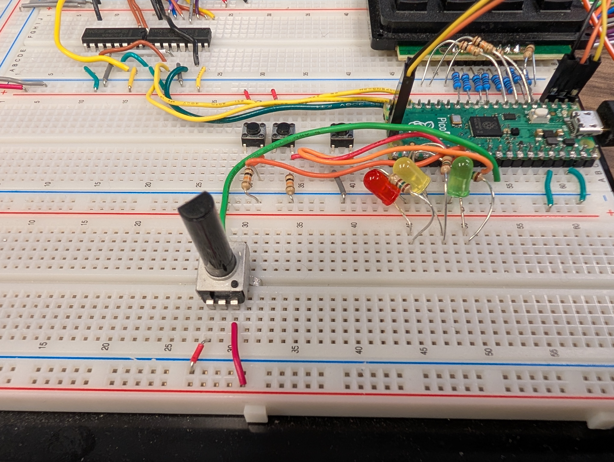

# Lab 4
## ADC and DMA

### Table of Contents
<br>

| Step | Description | Points |
|------|-------------|--------|
| 0.1 | Set up your environment |   |
| 0.2 | Wire and organize your breadboard |   |
| 1 | Read the datasheet | 25 |
| 2 | Perform a single-shot sample conversion | 20 |
| 3 | Perform free-running sample conversions | 20 |
| 4 | Configure DMA-automated sample conversions | 35 |
| 5 | In-Lab Checkoff Step | 20* |
| &nbsp; | Total: | 100 |
<br>

\* - You must get your whole lab checked off before the end of your lab section to avoid a late penalty of 20%.

### Instructional Objectives

- To understand the purpose of an analog-to-digital converter (ADC) and how it works.
- To explore the uses of an ADC and how to configure and read from it.
- To understand the purpose of direct memory access (DMA) and how it works.
- To utilize DMA to perform analog-to-digital conversions automatically and transfer data to memory.

### Step 0.1: Set up your environment

Make sure to clone the code repository from GitHub Classroom.  Keep in mind to add, commit and push any changes you make so that your work is accessible from a lab machine. 

Open the template in VScode and with your Debug Probe connected to your Pico 2, click "Flash Project (SWD)".  Open the Serial Monitor to see the output of your program, and press the Reset button so that it prints out again.  You should now see the following:

```text
ADC/DMA Lab Test Suite for Pico 2
Type 'help' to learn commands.

> 
```

You can then type `help` to learn what commands you can use to test a certain subroutine.  You will use this to demo your implementation and wiring to the TAs.

### Step 0.2: Wire and organize your breadboard

For this lab, obtain a **potentiometer** from the ECE shop if you don't already have one, and wire it as follows:
- Wire the left pin to ground.
- Wire the right pin to 3.3V.
- Wire the center pin to the pin associated with Channel 0 of the ADC.  You can find this in the Pinout diagram for the Pico 2 (which you should have bookmarked by now!)

The best placement for the potentiometer is in the left-center of the breadboard, on the panel below your Pico 2, to the left of the LEDs you wired up in lab 1.   You need to make space for future components on the sides of it, hence the weird placement.



### Step 1: Read the datasheet

The ADC, or analog-to-digital converter, is a peripheral with a very simple mandate.  It takes the voltage on an associated GPIO pin, ideally within the range between 0 (zero) and VCC (typically 3.3V), and converts it into a digital value that can be processed by code flashed on the microcontroller.  An ADC has a number of bits used to represent that digital value, and on the Pico 2, it has 12 bits, meaning that it can represent a voltage in 2^12 = 4096 discrete steps.  The higher the number of bits, the higher the precision of the voltage reading.

To understand how the Pico 2's specific ADC works, start by reading [Section 12.4. ADC and Temperature Sensor](https://datasheets.raspberrypi.com/rp2350/rp2350-datasheet.pdf#%5B%7B%22num%22%3A1064%2C%22gen%22%3A0%7D%2C%7B%22name%22%3A%22XYZ%22%7D%2C115%2C270.17%2Cnull%5D).  You'll see that the ADC is a single peripheral capable of selecting and reading from multiple channels, which in turn are connected to specific GPIO pins or an internal temperature sensor on the board.  You can sample one channel entirely, or do a **round-robin method** where you cycle through each one, reading their samples, in free-running sampling mode.  

Reading a lot of samples very quickly allows you to capture a waveform, for example, or at slower speeds, to measure the voltage of a battery over time.

Read about the ADC in the datasheet, and answer the following questions:

1. What is the nominal clock speed for the ADC?  How many clock cycles does it take to sample from a channel?  Therefore, how much time does it take for the ADC to produce one sample?

2. How many ADC channels are available on your Pico 2?  (You'll need to identify which microcontroller package is used - it's the QFN-60 RP2350A package, which is the cheaper and smaller version relative to the QFN-80 RP2350B).

3. What ADC register's bits do you have to write to to select a particular channel for sampling?  What bits should you write to to start a conversion?  Where should you read the result from?

4. What ADC register's bits do you have to read from to determine if a conversion has completed?  Why is it important to know this?

The possibility of multiple samples coming out from the ADC presents a unique problem - if we have samples coming out of the ADC at a high rate, we can't keep interrupting the CPU to manually move the samples to a memory location.  Enter Direct Memory Access, or DMA.

DMA is a very unique peripheral in that it doesn't interface to anything external to the microcontroller.  Its only purpose is to facilitate autonomous data transfer between three pairs of sources:

- **From memory to memory**
    - If you have a large image saved in flash memory, and you want to copy portions of it into RAM, DMA would be very helpful while you set up external peripherals to display the image to a screen, for example.
- **From memory to peripheral**
    - Once you have part of your image in RAM, you can use DMA to send it to a display peripheral, like an LCD screen, by using a peripheral to do so, while mem-to-mem DMA starts transferring the next chunk of data to transmit.
- **From peripheral to memory**
    - And finally, this is what we'll use - when the ADC starts generating samples, we can use DMA to move those samples into memory, where we can process them in batches later, if we wish.

Read [Section 12.6: DMA](https://datasheets.raspberrypi.com/rp2350/rp2350-datasheet.pdf#%5B%7B%22num%22%3A1092%2C%22gen%22%3A0%7D%2C%7B%22name%22%3A%22XYZ%22%7D%2C115%2C308.622%2Cnull%5D) and answer the following questions:

1. What registers need to be written to to **configure** a DMA channel for transfer?  Could you use the same DMA channel to repeatedly transfer data, or would you need to reconfigure it each time?  If a repeated transfer is possible, what register bits need to be modified?

2. How do you **trigger**, or start, a DMA transfer given a configured DMA channel?

3. We can configure a DMA channel to **request** data from the ADC when it is ready to perform the transfer.  What is the associated Data Request number for the ADC?  

> [!IMPORTANT]
> Show your answers for the questions asked above to your TA.  You must have **correct** answers to earn points for this step.  
> 
> Avoid the urge to ask others (AI/LLMs are included in "others") for answers.  

### Step 2: Perform a single-shot sample conversion

Use the Hardware APIs documentation (detailed in the Raspberry Pi Pico extension menu) to configure the ADC to **perform a single-shot conversion** on Channel 0.  You'll need to appropriately configure the pin associated with the channel, which can be done with functions in the ADC Hardware API as well.  Don't forget to dive into the functions with Ctrl/Cmd-Click or Alt/Opt-Click to understand what registers they modify - we will ask you this when you need to get checked off!

Implement the functon `init_adc` in your code file, and call it in `main` to configure the ADC on Channel 0.

Then, test it in `main`.  Call `init_adc`, and then start an infinite loop where you start a single-shot conversion using the START_ONCE bit in the `cs` register, wait for it to complete by checking that the READY bit is asserted (indicating a new conversion can start), and then read the ADC's result register to obtain the resulting conversion value.  (You may also use a certain function from the API to do this for you all at once, but don't forget to dive into it and see what it does.)  After reading the result, print it to the console, and sleep for 100 ms before starting the next conversion.

Based on your code and the function implementations, answer the following questions:

2.2. What register bits did you have to write to to turn on the ADC?  What action was performed just after turning on the ADC before control returned from the function?

2.3. What digital functions, if any, were enabled on the pin associated with Channel 0?  

2.4. What register bits did you have to write to to select the associated input with the ADC?

2.5. In the function you may have called to read from the ADC within the infinite loop, show your TA the lines that correspond to the registers and bit fields you found in Step 1 with regards to A) starting a conversion, B) waiting for it to complete, and C) reading the result.

> [!IMPORTANT]
> Show your TA that turning the potentiometer varies the value printed to your Serial Monitor within the range 0-4095.  (If it's a bit lower than 4095, that's okay - the potentiometer or breadboard connections may not be perfect.)  Show them the code you wrote, and that it passes the `singleshot` test case.
> 
> Also show your TA the answers to the questions asked above.  You must have **correct** answers to earn points for this step.
> 
> Commit all your code and push it to your repository now.  Use a descriptive commit message that mentions the step number.

### Step 3: Perform free-running sample conversions

Now, let's start taking away the work from the CPU.  We'll now configure the ADC to automatically performs a new conversion periodically, saving the result into a specific register, which we'll read from in a loop.  This eliminates the need to tell the ADC to do a conversion every time in our loop, and lets us focus on simply copying the data out of the register.  This is very useful for when you need to sample a fast-changing signal (like a waveform) at a significantly higher rate, rather than just reading a potentiometer value.

Implement the function `init_adc_freerun` in your code file, and call it in `main` to configure the ADC to perform free-running conversions on Channel 0.  Make sure to comment out the earlier call to `init_adc` (so you'll have to copy over the pin initialization code to this new init function).

Next, in your `main` function, start an infinite loop where you read from the ADC's value register.  Print the value to the console, and sleep for 100 ms before reading the next value.

Based on your code and the function implementations, answer the following questions:

3.2. What register bits did you have to write to to configure the ADC for **free-running conversions**?  What action was performed just after configuring the ADC before control returned from the function?

3.3. How many cycles does it take for the ADC to perform a conversion in free-running mode?  How many samples per second can the ADC produce in this mode, assuming a default clock frequency of 48 MHz?


> [!IMPORTANT]
> Show your TA that turning the potentiometer varies the value printed to your Serial Monitor within the range 0-4095.  Show them the code you wrote, and that it passes the `freerun` test case.
> 
> Also show your TA the answers to the questions asked above.  You must have **correct** answers to earn points for this step.
> 
> Commit all your code and push it to your repository now.  Use a descriptive commit message that mentions the step number.

### Step 4: Configure DMA-automated sample conversions

> [!NOTE]
> For this step, you'll need two functions from lab 3: `seg7_timer_isr` and `init_7seg_timer`.  Copy them into your lab 4 code file, and in a new section of `main`, call `init_7seg_timer`.  You implemented this function in lab 3 to automatically "print" a message variable to the 7-segment display on your breadboard.

Now, let's take away even more work from the CPU.  We'll configure the DMA to automatically transfer the ADC's sample data, now being automatically generated in free-running mode to a memory location.  

This method is very useful for when you do need to sample at a high rate, but you don't want to consume CPU time waiting to check that a new ADC sample is ready, reading it, and then doing something with it.  This may seem small now, but when you have to create a larger sophisicated project that needs to do more things, you'll appreciate any ways to offload work from the CPU.

Understanding DMA can quite confusing, especially given how large the API functions can get, so we'll explain what needs to be done here manually.  This requires that you directly modify peripheral registers, e.g. `adc_hw` for ADC and `dma_hw->ch[0]` for Channel 0 of the DMA.

In the function `init_adc_dma`, do the following:

1. First call `init_dma`.  We'll fill in this function later.
2. Call `init_adc_freerun` to configure the ADC for free-running mode, and GP26 as the ADC input.
3. Enable the ADC FIFO. 
4. Configure the ADC to send out a DREQ signal whenever a new sample is ready in the FIFO.  The DREQ signal will tell the DMA that the data is ready to be copied.

Next, in the function `init_dma`, do the following:

1. Configure DMA Channel 0 to read from the ADC FIFO and write to the variable `adc_fifo_out`.  You'll need to pass the addresses of both these variables to the `read_addr` and `write_addr` fields of the DMA channel 0 configuration.

2. Set the transfer count, or TRANS_COUNT, to the arithmetic OR of two values:
    - The mode value that tells the DMA to re-trigger itself infinitely, which is 1.  You'll need to left-shift it to the correct position for the MODE field of the TRANS_COUNT field of the DMA channel 0 configuration.
    - The number of data packets you want to transfer, which is 1.  We'll tell the channel later how big **one** data packet is in terms of bits.

3. Initialize the control trigger register of the DMA to zero.  This is a concept called the **null trigger**, and is required to ensure we don't accidentally start the DMA transfer before we're ready.  Next, create a `uint32_t` variable called `temp`, and to it, OR in the following:
    - Specify the data size of the packet as a **half-word**.  The ADC only outputs 12-bit samples, so you'll need to set the `DATA_SIZE` field of the `temp` variable to 1.
        - This means you left-shift the value 1 by the correct number of bits that would correspond to the `DATA_SIZE` field of the DMA channel 0 configuration, but you assign it to `temp` first.
    - Specify the ADC DREQ signal as the TREQ trigger.  You can find the DREQ numbers under Section 12.6.4, or use `DREQ_ADC`.  Don't forget to left-shift it by the correct number of bits for the `TREQ_SEL` field of the DMA channel 0 configuration.
    - Finally, set the EN bit.  (Once more - do not do this directly in the DMA channel 0 configuration register - do it in the `temp` variable first!)

4. Write the `temp` variable to the `dma_hw->ch[0].ctrl_trig` register.  This action causes the DMA channel to start transferring samples to the `adc_fifo_out` variable.

*Why don't we just directly read `adc_hw->fifo` in the DMA channel?*  The very act of *reading* the `fifo` register tells the ADC that a sample has been read, and it will then start filling the FIFO with the next sample.  This is why we need to use the DREQ signal to tell the DMA that the ADC has a new sample ready to be read, rather than us needing to add a loop in our `main` function to wait until a new sample is ready.  It's all about small optimizations!

In `main`, just after where you called `init_7seg_timer`, make a second call to `init_adc_dma`.  Then, in an infinite loop, call the function `printfloat`, which has been provided in `support.c`, with the parameter value `(adc_fifo_out * 3.3) / 4095.0`.  This scales the 12-bit ADC value to a voltage between 0 and 3.3V.  You can also use the provided `printfloat` function to print the value of `adc_fifo_out` to the console.  We recommend adding a delay of 250 ms in between `printfloat` calls so that you can more easily read the values on the 7-segment display - remember, the conversions will still happen as fast as possible.

Hopefully, you should now have a very simple voltmeter on your breadboard!


Answer the following questions with regards to your code:

1. What register bits did you have to write to to enable the ADC FIFO?  

2. What register bits did you have to write to to configure the ADC to send out a DREQ signal whenever a new sample is ready in the FIFO?  Why is it important to use the DREQ signal to trigger the DMA transfer?

3. What specific register bits did you have to write to to configure DMA Channel 0 to read from the ADC FIFO and write to the variable `adc_fifo_out`?

> [!IMPORTANT]
> Show your TA that turning the potentiometer varies the value displayed on the seven segment display within the range 0.000000 to 3.300000.  Show them the code you wrote, and that it passes the `dma_adc` test case.
> 
> Also show your TA the answers to the questions asked above.  You must have **correct** answers to earn points for this step.
> 
> Commit all your code and push it to your repository now.  Use a descriptive commit message that mentions the step number.

### Step 5: In-Lab Checkoff Step

> [!CAUTION]
> Make sure you got checked off here: https://engineering.purdue.edu/ece362/checkoff/
> 
> Make sure to upload your confirmation code and verify that it is accepted by Gradescope.  You will know it is accepted if you get the points from Gradescope.
> 
> Before you leave, make sure your station is clean and that you have gathered your belongings, and then call a TA to confirm that you can leave.  Confirm that you have received your checkoffs, that your confirmation code was accepted on Gradescope before logging out and leaving for the day.