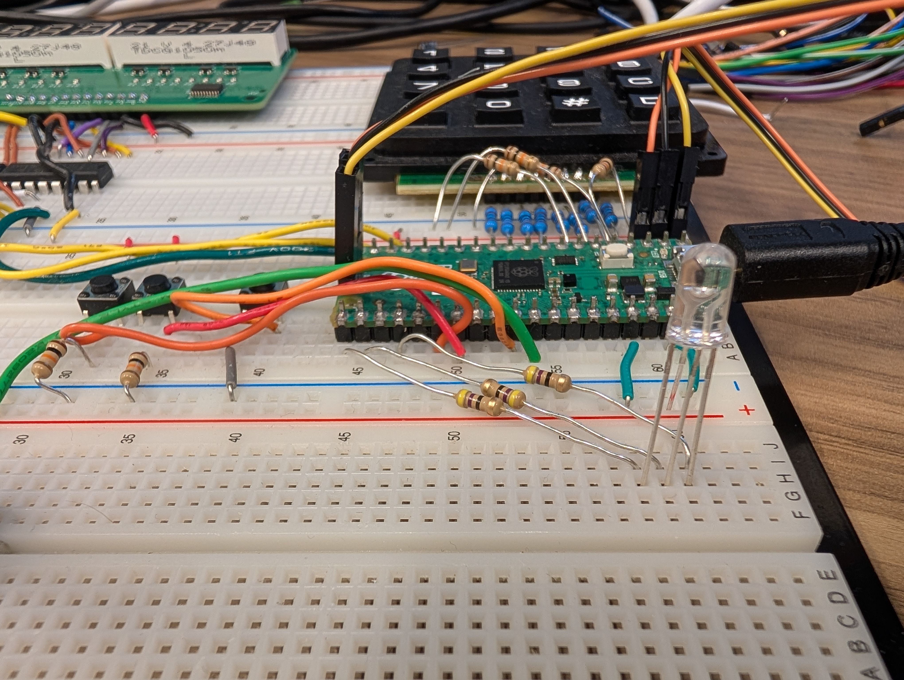
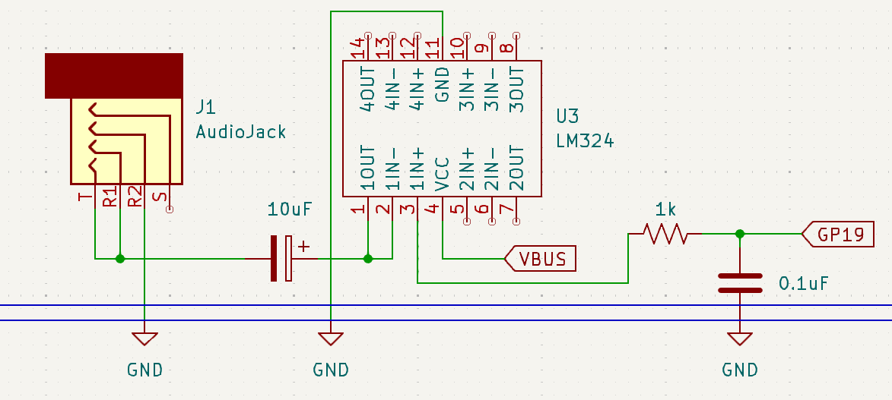
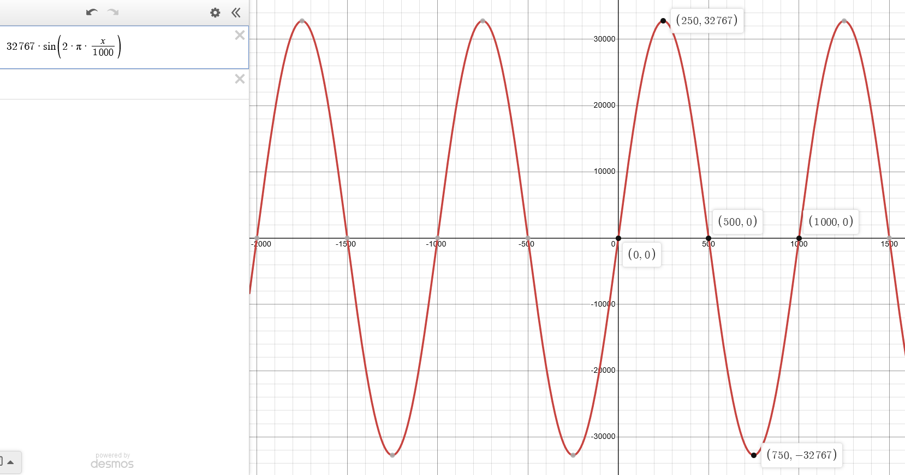
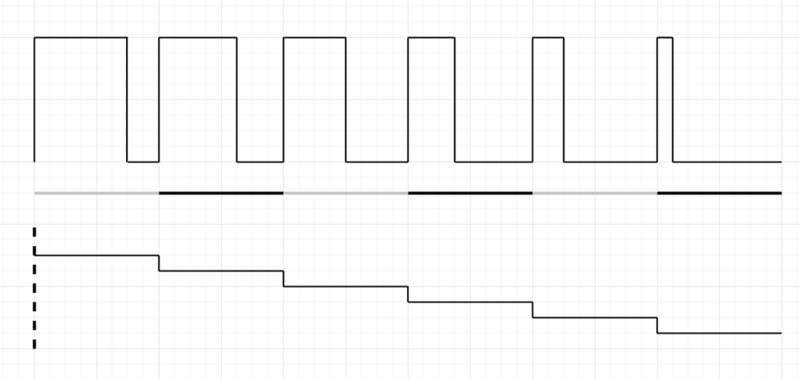

# Lab 5
## PWM

### Table of Contents
<br>

| Step | Description | Points |
|------|-------------|--------|
| 0.1 | Set up your environment |   |
| 0.2 | Wire and organize your breadboard |   |
| 1 | Read the datasheet | 30 |
| 2 | Implement a static duty cycle PWM signal | 20 |
| 3 | Implement a variable duty cycle PWM signal | 20 |
| 4 | Convert PWM to an audio signal | 30 |
| 5 | (Optional) Play with a drum machine |   |
| 5 | In-Lab Checkoff Step | 20* |
| &nbsp; | Total: | 100 |
<br>

\* - You must get your whole lab checked off before the end of your lab section to avoid a late penalty of 20%.

### Instructional Objectives

- To understand what pulse-width modulation (PWM) is and how it is used.
- To understand how to use the PWM peripheral on the Pico 2.
- To implement static and varying duty cycle PWM signals.
- To convert a PWM signal to an audio signal using the LM324 op-amp and a capacitor.

### Step 0.1: Set up your environment

Make sure to clone the code repository from GitHub Classroom.  Keep in mind to add, commit and push any changes you make so that your work is accessible from a lab machine. 

Open the template in VScode and with your Debug Probe connected to your Pico 2, click "Flash Project (SWD)".  Open the Serial Monitor to see the output of your program, and press the Reset button so that it prints out again.  You should now see the following:

```text
PWM Lab Test Suite for Pico 2
Type 'help' to learn commands.

> 
```

You can then type `help` to learn what commands you can use to test a certain subroutine.  You will use this to demo your implementation and wiring to the TAs.

### Step 0.2: Wire and organize your breadboard

In your kit, you should find the following items:

- A common anode RGB LED;
- 3 47 ohm resistors;
    - If you are missing these, just pick them up from the ECE shop.;
- An LM324 op-amp;
- A 10uF capacitor, and;
- A 3.5mm TRRS audio jack for plugging in headphones into your breadboard.

Start with the RGB LED.  First, you can remove the red/green/yellow LEDs you had since lab 1, since we'll replace them with the single RGB LED.  You can wire the LED up by placing it just underneath the Pico 2 as shown below, with the **longer** anode pin connected to the 3.3V power rail, and the **shorter** cathode pins connected via the 47 ohm resistors to GP16, GP17 and GP18.  The order does not matter as long as you remember which pin is which color (which you'll find out in step 2).  The picture below shows where you should place the RGB LED.



> [!TIP]
> The RGB LED can get pretty bright when the board is powered and you have not yet written any code, which may be difficult on your eyes for long periods of time.  You can use a napkin or a piece of cardboard to block the light from the LED if it is too bright, or simply disconnect it until you finish writing some code.

Next, we'll place the LM324 op-amp and TRRS jack to the **left** of the potentiometer for use with GP19, our fourth PWM output.  We'll use the right side of the potentiometer for the OLED display in your kit in the next lab.  The LM324 is a quad op-amp, but we'll only use one of the op-amps for this lab.  The TRRS jack is used to plug in headphones to listen to the audio signal generated by the LM324.  The TRRS jack has 4 pins, but we'll only use 3 of them.  


Now, wire up the LM324 and the TRRS jack to your Pico 2 as shown in this schematic.



> [!CAUTION]
> Note that the VCC of the LM324 is NOT connected to 3.3V, but it is connected to `VBUS` pin of your Pico 2 which is the 5V source from the USB port connected to your Pico 2.  **DO NOT MIX THESE UP!**  The LM324 needs to operate at 5V which is why we are using `VBUS`.  

### Step 1: Read the datasheet

PWM, or pulse-width modulation, is a way to create an approximate analog signal by rapidly oscillating a digital signal between logic high and low.  The resulting signal can be used to control motors, LEDs, and other devices that require a signal with varying voltages.  The Pico 2 has a PWM peripheral that can be used to generate PWM signals on any of the GPIO pins.  

On some microcontrollers, there is a specific peripheral called the DAC (digital-to-analog converter) that can be used for the same purpose.  However, since RP2350 doesn't have a DAC, we'll have to make do with the DAC, an LM324 amplifier, and a capacitor to "smooth out" the PWM signal to an audio signal.

To understand how this wave is created, read **Overview** and **Programmer's Model** in [Section 12.5. PWM](https://datasheets.raspberrypi.com/rp2350/rp2350-datasheet.pdf#%5B%7B%22num%22%3A1074%2C%22gen%22%3A0%7D%2C%7B%22name%22%3A%22XYZ%22%7D%2C115%2C146.034%2Cnull%5D) and answer the following questions.

1. How many **distinct** PWM outputs are there, i.e. what is the maximum number of PWM signals that can be generated simultaneously, regardless of GPIO pins?  Why can't you generate a PWM signal per GPIO pin?  (Reminder: you are using an RP2350A on your Pico 2, which only has GPIO0 through GPIO29.)

2. What is the name of the counter register whose value is compared against by the PWM slice?  

3. What is the name of the counter register that is incremented by the PWM slice?  

4. What is the name given to the value that the PWM slice compares against the counter register, when the PWM signal is high?

5. What would the values of the two registers have to be to generate a 50% duty cycle PWM signal?  What about 0% and 100%?

6. What is the maximum value that the PWM counter can reach?

7. Is it possible to modify the duty cycle value in the middle of counting?  Why or why not?

> [!IMPORTANT]
> Show your answers for the questions asked above to your TA.  You must have **correct** answers to earn points for this step.  
> 
> Avoid the urge to ask others (AI/LLMs are included in "others") for answers.  

### Step 2: Implement a static duty cycle PWM signal

In this step, you will implement a static duty cycle PWM signal.  Implement the function `init_pwm_static`, which takes two arguments, `period` and `duty_cycle`.  When you configure the PWM slice associated with each pin, the slice will have a counter that counts up to `period`.  When that counter value is **lower** than `duty_cycle`, the PWM output will be low.  Therefore, the function must:

1. Configure pins 16, 17, 18 as PWM outputs.
    - We'll do 19 in step 4.
2. Set the period of the PWM signal to 10000.
3. Set the clock divider value to be 150.  This divides down the system clock frequency to 1 MHz for the PWM only, which is important for the next step.  For most things, you don't typically need such a high clock rate.
4. For each of the pins, set the duty cycle to the value passed in `duty_cycle`.for
5. Enable the PWM signals for all pins.

In `main`, call this function with a duty cycle of 50% and test it.  You should see the RGB LED light up with a white color, but it should be dimmer than when you had just connected the RGB LED without any code.  Test some other duty cycles to see how the brightness changes.  You should see that a **higher** duty cycle will reduce the brightness of the LED.

Answer the following questions:

1. What PWM register and bits are being assigned the value of `period`?
2. What PWM register and bits are being assigned the value of `duty_cycle`?
3. What PWM register and bit is modified to enable the PWM counting?
4. At what point during the counting is the output of the PWM signal high?  When is it low?  Give your answer in terms of the values of the three aforementioned registers.
5. A **higher** duty cycle reducing the brightness of the LED can sound counterintuitive.  Why does this happen?  (Hint: it has nothing to do with your Pico 2 or the PWM peripheral.)

> [!IMPORTANT]
> Show your TA multiple duty cycles with your RGB LED to demonstrate that you have implemented the function correctly.  Show them the code you wrote, and that it passes the `static` test case.
> 
> Commit all your code and push it to your repository now.  Use a descriptive commit message that mentions the step number.

### Step 3: Implement a variable duty cycle PWM signal

In this step, let's create a **breathing light** - what we would call the "Hello world" of PWM signals.  To do this, we need to vary the duty cycle at timed intervals so that the RGB LED, starting from full brightness, fades and turns off, and then brightens back to full brightness, and does this by rotating through the colors red, green, and blue.

However, currently, the PWM counter is running at the system clock speed, which is 150 MHz.  To slow it way down, we have three sets of values to change:

1. The PWM peripheral has an internal clock divider, which we can use to divide it by 150, which allows the counting to proceed at 1 MHz.

2. The wrapping register we modified earlier to contain the counting period can be set to **10000**, which will allow the PWM signal to wrap around every 10,000 cycles, making the effective clock frequency 100 Hz.

3. We'll increment and decrement the duty cycle value by 1% of the period for each tick of the divided frequency above, giving us an effective range of 100, resulting in a final frequency of 1 Hz in which the RGB LED either fades to darkness, **or** ramps up to full brightness.  Therefore, our LED will **breathe in and breathe out** every 2 seconds (zero to one to zero).

How we implement point 3 is very important.  Even though the PWM peripheral does not arbitrarily allow us to change the duty cycle in the middle of counting, we can do it in an appropriate way by changing the duty cycle in an **interrupt handler**.  The handler is called when the PWM slice's counter wraps back around to 0, which is the perfect point in time to change the duty cycle, as the next count from 0 to the period value will compare against the **new** duty cycle value.

The RP2350 datasheet visualizes this for you as follows:


Notice that at every **T** interval (equal to the period you set), the duty cycle (stored in the counter compare level register, indicated as blue) is changed.  This is the point where the interrupt handler would be called.

When we do successive changes to the duty cycle this way, it's possible to output **waveforms** via PWM. like sine waves and other audio samples.  For now, we'll just implement a simple breathing light, but we'll see this effect when we do audio in the next step.

Implement `init_pwm_irq` to do the following.  You can assume the pins and general PWM configuration are already set up from `init_pwm_static`.

1. Within the PWM peripheral, enable interrupts for slice 0.  (We'll update both slices from the same handler, so there is no need to enable it for slice 1.)

2. Set `pwm_breathing` as the exclusive handler when slice 0's counter wraps around to 0.  You can find the numbers associated with the PWM interrupt in the datasheet, `hardware_irq` in the Hardware API, or by looking at the `pwm.h` header file.

3. Enable interrupts for the aforementioned PWM slice 0 interrupt.

4. Obtain the current period for PWM slice 0 via the appropriate register, and store it in a new variable called `current_period`.

5. Set the global variable `duty_cycle` to 99, the highest value, and `dir` to 1, so that when the interrupt triggers, it will turn OFF the LEDs and slowly ramp up to full brightness.

6. Set the duty cycles of the three RGB LED PWM outputs to be equal to `current_period`.

Next, implement the interrupt handler `pwm_breathing`, which takes no arguments, to do the following, given two global variables called `duty_cycle` and `dir`:

```c
// acknowledge the interrupt by writing a specific value to the appropriate PWM interrupt register

// if dir is 0 and duty_cycle is 99, increment color modulo 3

// if duty cycle is 99 and dir is 0, set dir to 1
// else if duty cycle is 0 and dir is 1, set dir to 0

// if dir is 0, increment duty cycle by 1
// else, decrement duty cycle by 1

// set the chosen color's duty cycle to the ratio of the current duty cycle to the current period of the PWM signal (divide by 99, multiply by period value)
```

In `main`, change the call to `init_pwm_static` to have a duty cycle of 0% with the same period of 10000 cycles, call `init_pwm_irq`, and then start an infinite loop where that calls `asm volatile ("wfi");`, letting the PWM interrupts wake the CPU when the PWM slice 0 counter wraps around to 0.  You should now see the colors rotate through red, green, and blue, each color fading in and out every 2 seconds!


Answer the following questions:

1. What peripheral would be helpful in automating this further, so that the duty cycle updates can be made by copying them from a memory location, rather than updating them from an interrupt handler?  

2. What was the interrupt number associated with PWM slice 0's counter wrapping around to 0?

3. What register did you write to to acknowledge the interrupt?  What value did you have to write to properly acknowledge the interrupt?

> [!IMPORTANT]
> Show your TA multiple duty cycles with your RGB LED to demonstrate that you have implemented the function correctly.  Show them the code you wrote, and that it passes the `static` test case.
> 
> Commit all your code and push it to your repository now.  Use a descriptive commit message that mentions the step number.

### Step 4: Convert PWM to an audio signal

Now to **hear** your PWM signal!  We'll start by producing a sine wave at 440 Hz (the music students among you may recognize this as the A4 note.)

We'll use GP19 for this purpose, so make sure it is connected through a 1k resistor to pin 3 of your LM324 IC.

We pre-generate the sine wave for you in a global `wavetable` array, defined in `support.c`.  We'll use DMA to copy the values from the `wavetable` to the PWM slice's duty cycle register, one by one, which will effectively output the sine wave if the PWM slice is configured to wrap around at a rate of 440 Hz.  Here's a visualization of what our `wavetable` will look like after we initialize it.



So using our PWM peripheral, we'll output a **discrete** portion of this waveform by outputting a PWM sample that, when averaged out, will look like that portion of the waveform.  Here's how that occurs:



So if we do it enough times, at a specific frequency so that N samples are put out every second, we can output our sine wave at that frequency.  The way we'll do it is by having a fixed 20 kHz PWM output frequency, but changing the rate at which we change samples so that we have an effectively lower frequency, whatever we choose and as long as it's lower than 20 KHz.  You don't have to figure all this out, but the code is provided to you in `support.c` via `set_freq` and the code we'll give you for `pwm_audio_handler`.

Next, implement `init_pwm_audio` to do the following:

1. Configure pin 19 as a PWM output.
2. Set the corresponding PWM slice's clock divider value to be 150, so we get a 1 MHz clock.
3. Set the **period** of the PWM signal to be the division of the **frequency of the clock after division above**, by the sampling rate `RATE` defined at the top of the file.  This gives you the 20 KHz frequency we discussed earlier.
4. Initialize the duty cycle to 0, and enable the PWM channel.
5. Call `init_wavetable` with no arguments.  This sets up our sine wave in memory.
6. Similar to what you did in the previous step, enable IRQ in the PWM peripheral.
7. Set `pwm_audio_handler` as the exclusive handler for when the appropriate slice's counter register wraps around to 0.  You can find the interrupt numbers in the datasheet, hardware API, or in `pwm.h`.
8. Enable the interrupt for that same interrupt number.

In `pwm_audio_handler`, do the following:

1. Acknowledge the corresponding interrupt.
2. Increment `offset0` by `step0`.  
3. If `offset0` is more than/equal to `N << 16`, subtract `N << 16` from it.
4. Set `wavetable[offset0 >> 16]` as the new duty cycle for the PWM channel on GP19.

This *offset magic* is how we implement a lower frequency, which we'll work out when we call this in `main`.  Go back there, comment out the caller code for step 2, and then:

1. Call `init_pwm_audio`.
2. Call `set_freq` with the float value 440.00, to set up a frequency of 440.00 Hz.
    - If you look at the code for `set_freq`, you'll see that the global variable `step0` is set to `(440 * 1000 / 20000) * (1 << 16)`, which is 