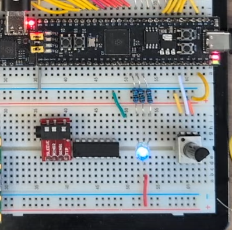
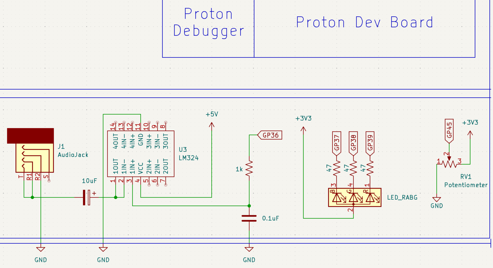
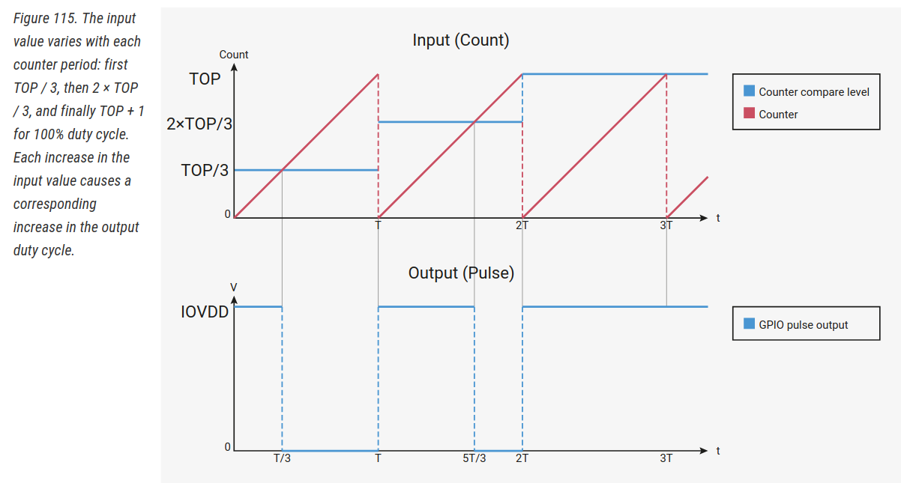
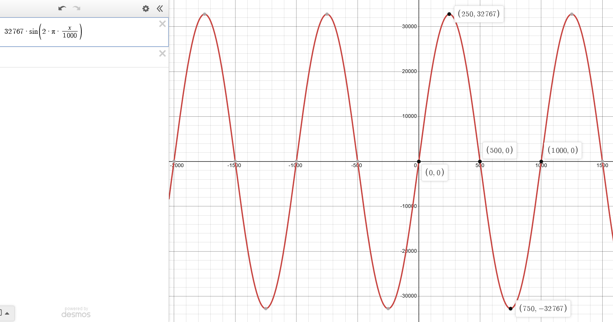
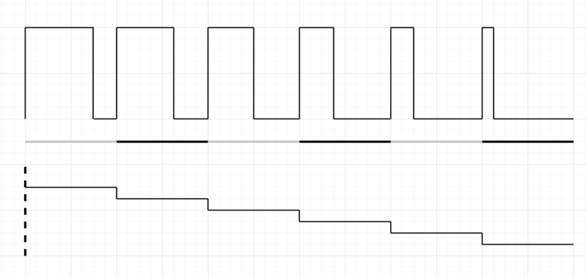
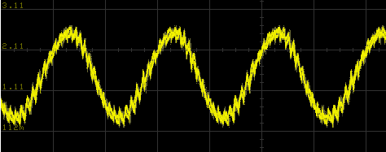
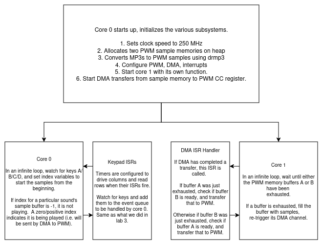

# Lab 5
## PWM

### Table of Contents
<br>

| Step | Description | Points |
|------|-------------|--------|
| 0.1 | Set up your environment |   |
| 0.2 | Wire and organize your breadboard |   |
| 1 | Read the datasheet | 30 |
| 2 | Implement a static duty cycle PWM signal | 25 |
| 3 | Implement a variable duty cycle PWM signal | 15 |
| 4 | Convert PWM to an audio signal | 30 |
| 5 | Confirm your checkoffs before leaving | * |
| &nbsp; | Total: | 100 |
<br>

\* - You must get your whole lab checked off before the end of your lab section to avoid a late penalty of 20%.

### Instructional Objectives

- To understand what pulse-width modulation (PWM) is and how it is used.
- To understand how to configure and use the PWM peripheral on the RP2350.
- To implement static and varying duty cycle PWM signals.
- To convert a PWM signal to an audio signal using the LM324 op-amp and a capacitor.

### Step 0.1: Set up your environment

Make sure to clone the code repository from GitHub Classroom.  Keep in mind to add, commit and push any changes you make so that your work is accessible from a lab machine. 

Open the template in VScode and with your Debug Probe connected to your Proton, click "Upload and Monitor".  Open the Serial Monitor to see the output of your program, and press the Reset button so that it prints out again.  You should now see the following:

```text
PWM Lab Test Suite
Type 'help' to learn commands.

> 
```

You can then type `help` to learn what commands you can use to test a certain subroutine.  You will use this to demo your implementation and wiring to the TAs.

If the text doesn't appear when you click "Upload and Monitor", ensure that `autotest()` is uncommented in `main.c`.

### Step 0.2: Wire and organize your breadboard

In your kit, you should find the following items:

- An RGB LED;
    - Either common cathode or common anode is fine, but we have different instructions for both, so **pay attention**.
- 1 1k resistor and 1 0.1uF capacitor to form a low-pass filter;
- 3 47 ohm resistors;
    - If you are missing these, just pick them up from the ECE shop.
- An LM324 op-amp;
- A 10uF capacitor to form a high-pass filter to adjust the audio signal's DC offset, and;
- A 3.5mm TRRS audio jack for plugging in headphones into your breadboard.

Start with the RGB LED.  You can wire the RGB LED up by placing it just underneath the Proton board as shown below, to the left of the potentiometer from lab 4, with the **longer** anode pin connected to the 3.3V power rail, and the **shorter** cathode pins connected via the 47 ohm resistors to GP37, GP38 and GP39.  The order of colors does not matter as long as you remember which pin is which color (which you'll find out in step 2).  

> [!CAUTION]
> If you have a common cathode RGB LED, connect the **longer** pin to the **ground** rail of your breadboard, and the **shorter** pins to the GPIO pins.  Use a multimeter's continuity mode to check which RGB LED you have. 

Next, we'll place the LM324 op-amp and TRRS jack to the **left** of the potentiometer for use with GP36, our fourth PWM output.  We'll use the right side of the potentiometer for the OLED display in your kit in the next lab.  The LM324 is a quad op-amp, but we'll only use one of the op-amps for this lab.  The TRRS jack is used to plug in headphones to listen to the audio signal generated by the LM324.  The TRRS jack has 4 pins, but we'll only use 3 of them.  



> [!TIP]
> The RGB LED can get pretty bright when the board is powered and you have not yet written any code, which may be difficult on your eyes for long periods of time.  You can use a napkin or a piece of cardboard to block the light from the LED if it is too bright, or simply disconnect it until you finish writing some code.

Now, wire up the LM324 and the TRRS jack to your Proton board as shown in this schematic.



> [!CAUTION]
> Note that the VCC of the LM324 is NOT connected to 3.3V, but it is connected to `5V` pin of your Proton board which is the 5V source from the USB port connected to your Proton.  
> 
> **DO NOT MIX THESE UP! Shorting 3.3V and 5V may destroy your board.**  
> 
> The LM324 needs to operate at 5V!  

### Step 1: Read the datasheet

PWM, or pulse-width modulation, is a way to create an approximate analog signal by rapidly oscillating a digital signal between logic high and low.  The resulting signal can be used to control motors, LEDs, and other devices that require a signal with varying voltages.  The RP2350 has a PWM peripheral that can be used to generate PWM signals on any of the GPIO pins.  

On some microcontrollers, there is a specific peripheral called the DAC (digital-to-analog converter) that can be used for the same purpose.  However, since RP2350 doesn't have a DAC, we'll have to make do with the PWM, an LM324 amplifier, and a capacitor to "smooth out" the PWM signal to an analog signal.

To understand how this wave is created, read **Overview**, **Programmer's Model** including **12.5.2.1. Pulse Width Modulation** in [Section 12.5. PWM](https://datasheets.raspberrypi.com/rp2350/rp2350-datasheet.pdf#section_pwm) and answer the following questions.  

1. (5 points) How many **distinct** PWM outputs are there, i.e. what is the maximum number of PWM signals that can be generated simultaneously, regardless of GPIO pins?  Why can't you generate a PWM signal per GPIO pin?  (Reminder: you are using an RP2350B on your Proton board, which has GPIO0 through GPIO47.)  
  
2. (5 points) What is the name of the register that contains the highest counting period for each specific PWM "slice"?   
  
3. (5 points) What is the name of the PWM's free-running counter that holds the "current value", or the value that is incremented by the PWM slice, which wraps around to 0 when it reaches the value of the register in question 2?  (Hint: use the SDK function `pwm_get_counter` to figure this out, as the register name is not clear from the datasheet.)  See the graphs in 12.5.2.1 in the datasheet to help visualize this.  

4. (5 points) What is the name of the register that holds the "input value", the value compared against the free-running counter register above?  When the "current value" reaches the "input value", the PWM output is toggled.  See the graphs in 12.5.2.1 in the datasheet to help visualize this.

5. (5 points) What would the values of the two registers in questions 2 and 3 have to be to generate a 50% duty cycle PWM signal?  What about 0% and 100%?

6. (2 points) What is the maximum value that the PWM counter can reach?

7. (3 points) Is it possible to modify the duty cycle value in the middle of counting?  Why or why not?

> [!IMPORTANT]
> Show your answers for the questions asked above to your TA.  You must have **correct** answers to earn points for this step.  
> 
> Avoid the urge to ask others (AI/LLMs are included in "others") for answers.  

### Step 2: Implement a static duty cycle PWM signal

> [!CAUTION]
> Copy in both `display.c` from lab 4 and `keypad.c` from lab 3.  We'll use the keypad to control the duty cycle of the PWM signal in this lab, and the display to show the current duty cycle value.   

In this step, you will implement a static duty cycle PWM signal, which means we'll generate a PWM signal that maintains a constant voltage, corresponding to the unchanged duty cycle value.  So if our duty cycle is 50%, the PWM signal will remain high for 50% of the time and low for the other 50%.

Implement the function `init_pwm_static`, which takes two arguments, `period` and `duty_cycle`.  When you configure the PWM slice associated with each pin, the slice will have a counter that counts up to `period`.  When that counter value is **lower** than `duty_cycle`, the PWM output will be low.  Therefore, the function must:

1. Configure pins 37, 38, 39 as PWM outputs.
    - PWM outputs are configured different from GPIO outputs, so the SIO is not involved.
    - For each of the steps below, identify the slice number and channel whose properties you need to change.
2. Set the corresponding PWM slice's clock divider value to be 150.  This divides down the system clock frequency to 1 MHz for the PWM only, which is important for the next step.  For most things, you don't typically need such a high clock rate.
3. Set the wrapping counter value of the pin's corresponding PWM slice to the value passed in `period` minus 1.  This is done by writing to the appropriate PWM register.
    - The period is the maximum value that the PWM counter can reach before it wraps around to 0.
    - Since it starts from 0, the maximum value should be `period - 1`.
4. For each of the pins, set the corresponding PWM channel's duty cycle to the value passed in `duty_cycle`.
    - The duty cycle is the value that the PWM counter compares against to determine whether the PWM output is high or low.
5. Enable the PWM signals for all pins.

In `main`, we've written up some code for you that will allow you to specify the duty cycle for the RGB LED PWM.  At startup, you should see the RGB LED light up with a white color, but it should be a bit dimmer than when you had just connected the RGB LED without any code.  Use the keypad to input a new duty cycle, and pressing the `#` key to confirm the new duty cycle, which will call your `init_pwm_static` function with the new duty cycle and control the brightness of your RGB LED.

If you have a common anode RGB LED, changing the duty cycle to a lower value will make the LED brighter, and a higher value will make it dimmer.

If you have a common cathode RGB LED, changing the duty cycle to a lower value will make the LED dimmer, and a higher value will make it brighter.

Answer the following questions:

1. What PWM register and bits are being assigned the value of `period`?
2. What PWM register and bits are being assigned the value of `duty_cycle`?
3. What PWM register and bit is modified to enable the PWM counting?
4. At what point during the counting is the output of the PWM signal high?  When is it low?  Give your answer in terms of the values of the three aforementioned registers.
5. A **higher** duty cycle reducing the brightness of a common anode LED can sound counterintuitive.  Why does this happen?  (Hint: it has nothing to do with your Proton board or the RP2350 PWM peripheral.)

> [!IMPORTANT]
> Show your TA multiple duty cycles with your RGB LED to demonstrate that you have implemented the function correctly.  Show them the code you wrote, and that it passes the `static` test case.
> 
> Commit all your code and push it to your repository now.  Use a descriptive commit message that mentions the step number.

### Step 3: Implement a variable duty cycle PWM signal

In this step, we'll create a **breathing light** - what we would call the "Hello world" of PWM signals.  To do this, we need to vary the duty cycle at timed intervals so that the RGB LED, starting from full brightness, fades and turns off, and then brightens back to full brightness.  We'll also do this in a way that rotates through the colors - red, green, and blue.

Let's recap what we did before:

1. The PWM peripheral has an internal clock divider, which we can use to divide it by 150, which allows the counting to proceed at 1 MHz.

2. The wrapping register we modified earlier to contain the counting period was set to **100**, which will allow the PWM signal to wrap around every 100 cycles, making the effective clock frequency 1 MHz / 100 = 10 kHz.  

3. We set the duty cycle to 50, which means that the PWM signal was high for 50% of the time and low for the other 50%.  This gives us a static duty cycle PWM signal that is half the period, or 5 kHz.

However, in this step, we'll increment and decrement the duty cycle value by 1% of the period for each tick of the divided frequency above, giving us an effective range of 100, resulting in a final frequency of 1 Hz in which the RGB LED either fades to darkness, **or** ramps up to full brightness.  Therefore, our LED will **breathe in and breathe out** every 2 seconds (zero to one to zero).

Although the RP2350 allows you to do so (read 12.5.2.3. Double Buffering), it's generally advised not to change the duty cycle in the middle of counting.  So, we have to do it in an appropriate way by changing the duty cycle in an **interrupt handler**.  The handler is called when the PWM slice's counter wraps back around to 0, which is the perfect point in time to change the duty cycle, as the next count from 0 to the period value will compare against the **new** duty cycle value.

**If you attempt to update it in the middle**, you may cause the PWM signal to flicker, as the counter may be comparing against the old duty cycle value while you are trying to change it.  This is why we use an interrupt handler to change the duty cycle at the right time.  This may not seem like a problem with changing the brightness of an RGB LED, but it can be a problem with more complex signals, like audio.

When you're configuring interrupts for PWM, make sure to use the WRAP0 source.  WRAP1 is perfectly fine, but autotest will check for the former.

The RP2350 datasheet visualizes the effect of these duty cycle changes for you as follows:



Notice that at every **T** interval (equal to the period you set), the duty cycle (stored in the counter compare level register, indicated as blue) is changed.  This is the point where the interrupt handler would be called.

When we do successive changes to the duty cycle this way, it's possible to output **waveforms** via PWM, like sine waves and other audio samples.  For now, we'll just implement a simple breathing light, but we'll see this effect when we do audio in the next step.

Implement `init_pwm_irq` to do the following.  You can assume the pins and general PWM configuration are already set up from `init_pwm_static`.

1. Within the PWM peripheral registers, enable interrupts for the PWM slice associated with GP37, associated with the **first** PWM wrap interrupt (there are two - pick the one that says "WRAP0", so that we can check it with the autotest).  We'll update both slices from the same handler, so there is no need to enable it for the different slice associated with GP38 and GP39.

2. Set `pwm_breathing` as the exclusive handler when the PWM slice associated with GP37's counter wraps around to 0.  You can find the numbers associated with the PWM interrupt in the datasheet, `hardware_irq` in the Hardware API, or by looking at the `pwm.h` header file.  You may use the appropriate SDK function to do this.

3. Enable interrupts for the aforementioned PWM the PWM slice associated with GP37 interrupt.

4. Obtain the current period for PWM the PWM slice associated with GP37 via the appropriate register, and store it in a new variable called `current_period`.

5. Set the global variable `duty_cycle` to 100, the highest percentage of the duty cycle it can be, and `dir` to 1, so that when the interrupt triggers, it will turn OFF the LEDs and slowly ramp up to full brightness.

6. Set the duty cycles of the three RGB LED PWM outputs to be equal to `current_period` so that they all start out at the same duty cycle.

Next, implement the interrupt handler `pwm_breathing`, which takes no arguments, to do the following, given two global variables called `duty_cycle` and `dir`:

```c
// acknowledge the interrupt by writing a specific value to the appropriate PWM interrupt register

// if dir is 0 and duty_cycle is 100, increment color modulo 3

// if duty_cycle is 100 and dir is 0, set dir to 1
// else if duty_cycle is 0 and dir is 1, set dir to 0

// if dir is 0, increment duty_cycle by 1
// else, decrement duty_cycle by 1

// set the chosen color's duty cycle to the ratio of the current duty_cycle to the current period of the PWM signal (multiply by period value, divide by 100)
```

In `main`, we've called `init_pwm_static` with a period of 10000 cycles this time.  

We also call `init_pwm_irq` which you should have implemented to configure interrupts for the PWM slice that corresponds to GP37, and then start an infinite loop where that calls `asm volatile ("wfi");`, letting the PWM interrupts wake the CPU when the PWM the PWM slice associated with GP37 counter wraps around to 0.  You should now see the colors rotate through red, green, and blue, each color fading in and out every 2 seconds!

Therefore:

1. Our PWM peripheral will count at 1 MHz thanks to the clock divider of 150.

2. We've set our period to 10000, which means the PWM signal will wrap around every 10 ms, giving us an effective frequency of 100 Hz.

3. The interrupt handler will be triggered every 100 Hz, during which it changes the duty cycle once.  Therefore, going from 100% to 0% or vice-versa takes 1 whole second.

The combination of clock divider, period, and duty cycle updates is **how you can control the frequency of the output PWM signal**.  Your RGB LED should now be rotating through colors, fading in and out every second, like a breathing light.


Answer the following questions:

1. What peripheral would be helpful in automating this further, so that the duty cycle updates can be made by copying them from a memory location, rather than updating them from an interrupt handler?  

2. What was the interrupt number of the PWM WRAP IRQ that you used?

3. What register did you write to to acknowledge the interrupt?  What value did you have to write to properly acknowledge the interrupt?

> [!IMPORTANT]
> Show your TA the breathing RGB LED to demonstrate that you have implemented the function correctly.  Show them the code you wrote, and that it passes the `variable` test case (it will only check that the IRQ was properly enabled, and will not check duty cycles or that `pwm_breathing` was implemented properly).
> 
> Commit all your code and push it to your repository now.  Use a descriptive commit message that mentions the step number.

### Step 4: Audio with PWM

Now to **hear** your PWM signal!  We'll start by producing a sine wave at 440 Hz (the musical students among you may recognize this as the A4 note.)

We'll use GP36 for this purpose, so make sure it is connected to pin 3 of your LM324 IC.

We pre-generate the sine wave for you in a global `wavetable` array, defined in `support.c`.  We'll use DMA to copy the values from the `wavetable` to the PWM slice's duty cycle register, one by one, which will effectively output the sine wave if the PWM slice is configured to wrap around at a rate of 440 Hz.  Here's a visualization of what our `wavetable` will look like after we initialize it.



The formula we'll use will be shifted up by 16384, as PWM duty cycles must always be positive.  

So using our PWM peripheral, we'll output a **discrete** portion of this waveform by outputting a PWM sample that, when averaged out, will look like that portion of the waveform.  Here's how that occurs:



So if we do it enough times, at a specific frequency so that N samples are put out every second, we can output our sine wave at that frequency.  The way we'll do it is by having **a fixed 20 kHz PWM output frequency**, but changing the rate at which we change samples so that we have an effectively lower frequency, whatever we choose and as long as it's lower than 20 KHz.  You don't have to figure all this out, but the code is provided to you in `support.c` via `set_freq` and `init_wavetable`, as well as the code we'll give you for `pwm_audio_handler`.  However, if you would like to build an audio application for your project, you might want to pay extra attention!

Implement `init_pwm_audio` to do the following:

1. Configure pin 36 as a PWM output.
2. Set the corresponding PWM slice's clock divider value to be 150, so we get a 1 MHz clock.
3. Set the **period** of the PWM signal to be the **frequency of the clock after division above** in Hz divided by the sampling rate `RATE`, which is defined for you in `support.h`, **minus 1**.  This gives you the 20 KHz frequency we discussed earlier.  (Don't forget to subtract 1 - remember that the counter starts at 0!)
4. Initialize the duty cycle to 0.
5. Call `init_wavetable` with no arguments.  This sets up our sine wave in memory.
6. Similar to what you did in the previous step, enable IRQ in the PWM peripheral.
7. Set `pwm_audio_handler` as the exclusive handler for when the appropriate slice's counter register wraps around to 0.  You can find the interrupt numbers in the datasheet, hardware API, or in `pwm.h`.
8. Enable the interrupt associated with your chosen PWM interrupt number.
9. Enable the PWM slice.

In `pwm_audio_handler`, do the following:

1. Acknowledge the corresponding interrupt.
2. Increment `offset0` by `step0`.  
3. Increment `offset1` by `step1`.  
4. If `offset0` is more than/equal to `N << 16`, subtract `N << 16` from it.
5. If `offset1` is more than/equal to `N << 16`, subtract `N << 16` from it.
6. Create a new variable called `samp`, initialized to the sum of `wavetable[offset0 >> 16] + wavetable[offset1 >> 16]`.  
7. Divide `samp` by 2 to ensure no audio clipping occurs when we add two samples together.
8. Scale `samp` to the range of the PWM duty cycle by multiplying it by the period value of the PWM slice, and then dividing it by `1 << 16`.  This is done to ensure that `samp` is within the range of the PWM slice's period.
9. Write the value of `samp` to the PWM slice's duty cycle register.

> [!NOTE]
> *Why are there two steps and offsets used to index into the wavetable?*
> 
> The code we've given you allows you to mix two sine waves together, both having different frequencies.  The `set_freq` function lets you set up the waveform on either one of the two "channels", with its own frequency.  See `main` for how this is set up.

This *offset magic* is how we implement a lower frequency sine wave from the 20 KHz PWM signal.  

In `main`, we have done the following for you:

1. Call `init_pwm_audio`.
2. Call `set_freq` with the float value 440.00, to set up a frequency of 440.00 Hz.
3. Implement a frequency entry loop that waits for you to type in a new frequency, and calls `set_freq` with that value.  Pressing 'A' will set the Channel 1 frequency, and pressing 'B' will set the Channel 2 frequency.  You can also type in floating point numbers like 418.512 Hz, with the asterisk as the decimal point.

Ideally, you should hear a 440 Hz sine wave.  To verify the frequency, connect an oscilloscope to GP36 and measure the frequency on the scope, and the waveform should look like this.



This "thickness" is due to the 20 kHz PWM noise that is always either pushing the capacitor higher or pulling it lower.  If you're still getting a square wave, ensure you have connected the 0.1 uF capacitor between the PWM output and ground from Step 0.2.

If you would like to listen to it, plug in a pair of headphones into the TRRS jack, or connect a speaker.  If you don't have a pair, or if the volume is too low, you could also connect an aux cord back into a microphone input on your computer if possible and "monitor" this microphone. (on [Windows](https://www.supportyourtech.com/tech/how-to-turn-on-mic-monitoring-in-windows-11-a-step-by-step-guide/), [macOS](https://www.guidingtech.com/55703/ive-monitor-mic-input-mac/)).

On the lab machines, you should be able to plug in an 3.5mm aux cord between your breadboard and the PC (borrow one from a TA or the ECE Shop), select "Microphone" when the dialog appears on your lab machine, and run `~ece362/bin/play-sound` in a terminal to hear the microphone audio echoed back to the speaker. 

> [!IMPORTANT]
> Show your TA the sine wave on the oscilloscope, and demonstrate that you can change the frequency of the sine wave by changing the argument to `set_freq`.  Show them the code you wrote, and that it passes the `audio` test case.
>
> Commit all your code and push it to your repository now.  Use a descriptive commit message that mentions the step number.

### Step 5: (Optional) Play with a drum machine

Comment out all the `STEP` defines and uncomment the `DRUM_MACHINE` define.  This, very simply, calls the `drum_machine` function in `main`.  (The code for this function is hidden because we want you to be able to write code at this complexity level for the project, and we can't just give it away!)  This function requires that you have working keypad and display functions from lab 3, and won't depend on the code you wrote in this lab.

Once uploaded, use the following buttons to try out the following sounds:

A = kick  
B = snare  
C = hi-hat  
D = snare  

Pressing a button will play the corresponding sound.  You can also press multiple buttons at once to play multiple sounds at once. 

In this lab thus far, we've given you the code for a very simple 8-bit audio application.  This drum machine, however, implements a radically different architecture that shows you the possibilities of high-quality audio synthesis without having to purchase too many external components.  The audio that you're hearing is at a 44100 Hz sample rate, 64KB bitrate, 16-bit depth, and was encoded as MP3 files to save space on the flash memory (with some loss of quality).

Making such a large jump in audio quality requires that we outsource as much as possible.  The following is helpful to consider:

1. DMA is your friend when it comes to transferring large amounts of data between memory regions and/or peripherals without having to execute code on the CPU.  As you saw in `pwm_audio_handler`, all you really need to do to play audio is transfer samples from an array to the PWM CC register.  That process can be automated with DMA if you properly set up the buffers with audio samples beforehand.
    - In the drum machine example, we pre-allocate memory for PWM samples for each of the four sounds, allowing us to easily switch between them without having to re-read the saved MP3 data from flash over and over again (which can be slow compared to reading it from RAM).

2. You have a second core available for offloading any repetitive tasks that do require CPU processing and need to be handled in an infinite loop.  Consider that currently, we are using an ISR to directly update the PWM CC register.  This is fine for simple audio like a sine wave at a fixed frequency, but in this drum machine, high-quality audio takes a lot more time to be processed, particularly the conversion of samples from MP3 to PCM, and the mixing of audio samples, and restarting the DMA channels to transfer the mixed samples to the PWM register.  Not to mention, we're also polling the keypad watching for key presses, and try to handle them as soon as possible to ensure low latency between when a key is pressed and when its corresponding sound is heard.  
    - In our implementation, core 0 is responsible for polling the keypad.  This ensures that the key handling ISR does not conflict with audio mixing and synthesis.  Delays can cause little "burps" in the audio that gets sent out, as the DMA buffers may fail to refill in time.
    - Core 1 is responsible for refilling the buffers as they empty, and restarting the DMA transfers for buffers that are ready to be transferred to PWM.

This block diagram showcases the flow of operations when you call `drum_machine`.



### Step 5: Confirm your checkoffs before leaving

> [!CAUTION]
> Make sure you got checked off here: https://engineering.purdue.edu/ece362/checkoff/
> 
> Make sure to upload your confirmation code and verify that it is accepted by Gradescope.  You will know it is accepted if you get the points from Gradescope.
> 
> Before you leave, make sure your station is clean and that you have gathered your belongings, and then call a TA to confirm that you can leave.  Confirm that you have received your checkoffs and that your confirmation code was accepted on Gradescope before logging out and leaving for the day.
