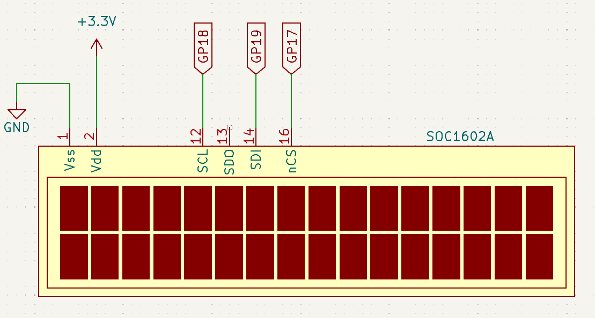
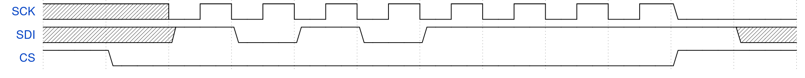

# Lab 6
## PIO and SPI

### Table of Contents
<br>

| Step | Description | Points |
|------|-------------|--------|
| 0.1 | Set up your environment |   |
| 0.2 | Wire and organize your breadboard |   |
| 1 | Read the datasheet | 30 |
| 2 | Bit-bang SPI | 20 |
| 3 | PIO SPI | 20 |
| 4 | Simply SPI on the seven-segment display | 5 |
| 4 | Simply SPI on the OLED | 5 |
| 5 | In-Lab Checkoff Step | 20* |
| &nbsp; | Total: | 100 |
<br>

\* - You must get your whole lab checked off before the end of your lab section to avoid a late penalty of 20%.

### Instructional Objectives

- To understand how to bit-bang a digital communication protocol.
- To understand the purpose of PIO on the Raspberry Pi Pico series, and how to use it to emulate a digital communication protocol.
- To understand the Serial Peripheral Interface packet format and how to use it to communicate with a peripheral device.
- To use DMA to automate the transfer of data between memory and a SPI-based device.


### Step 0.1: Set up your environment

Make sure to clone the code repository from GitHub Classroom.  Keep in mind to add, commit and push any changes you make so that your work is accessible from a lab machine. 

Open the template in VScode and with your Debug Probe connected to your Pico 2, click "Flash Project (SWD)".  Open the Serial Monitor to see the output of your program, and press the Reset button so that it prints out again.  You should now see the following:

```text
PIO/SPI Lab Test Suite for Pico 2
Type 'help' to learn commands.

> 
```

You can then type `help` to learn what commands you can use to test a certain subroutine.  You will use this to demo your implementation and wiring to the TAs.

### Step 0.2: Wire and organize your breadboard

In this lab, you'll use SPI to communicate with the seven-segment display you already had wired up since lab 3.  You'll also additionally use it for the **CFAL1602** 16x2 OLED character display in your kit.  Place the OLED display in the bottom right of your breadboard, and wire it up as shown in the schematic.



### Step 1: Read the datasheet

SPI, or Serial Peripheral Interface, is perhaps the simplest data transmission protocol you can use.  Two of the steps in this lab document explain how you can use other methods to **emulate** SPI, which is intended to show you how simple the protocol is.

The SPI protocol utilizes three signals:

- An enable signal called CS (Chip Select).
- A clock signal called SCK (Serial Clock).
- A data signal from the Pico 2 to the secondary device called SDI (Secondary Device In).
- An optional data signal from the secondary device to the Pico 2 called SDO (Secondary Device Out).
    - The OLED and seven-segment displays have no purpose for this signal, so you can leave it unconnected on both ends.

There are alternative terms for these signals, such as SS (Slave Select) for CS, MOSI (Master Out Slave In) for SDI, MISO (Master In Slave Out).  More modern hardware uses the former, but you may encounter older datasheets that use these terms.

The way SPI works is by first initiating a transmission by pulling the CS line low.  Since the signal is active-low, this means that the signal is active when it is low, which tells the secondary device that it is ready to send some data.  This is followed by setting the data signal to some value, and then **toggling** the clock.  Typically, a rising edge on the clock signal will **clock in** the bit of data into the secondary device's shift register.  If applicable, the secondary device will then respond with its own data, which you can read on the SDO line.

Here's an example of an 8-bit SPI transmission that sends `8'b10101111` most significant bit first:



Note that the SDI line is always set on the falling edge of the clock, to ensure that the data is ready to be transmitted when the rising edge of the clock arrives.  The CS line is low throughout the entire transmission, and is only raised when the transmission is complete.

In this lab, you'll bit-bang SPI, use PIO to emulate SPI, and then use the built-in SPI hardware to communicate with both the OLED and seven-segment displays.  For the PIO and SPI peripherals, read the datasheet and answer the following questions:

1. What are three protocols you can emulate with PIO that you have not yet covered in a lab?  (Perhaps you could use these for your project...)

2. At what clock speed does the PIO run?

3. 

4. 

> [!IMPORTANT]
> Show your answers for the questions asked above to your TA.  You must have **correct** answers to earn points for this step.  
> 
> Avoid the urge to ask others (AI/LLMs are included in "others") for answers.  

### Step 2: Bit-bang SPI on the seven-segment display

(they already did this, copy from lab 3, configure pins and loop in main.  But this is wasteful and slow, so we'll use PIO to do this instead)

### Step 3: Using PIO to implement SPI on the seven-segment display

PIO functionality falls one level above peripherals, and one level below a typical ARM/RISC-V CPU.  To elaborate:

- Peripherals can only perform one protocol.  The SPI controller, for example, can only transmit to or receive from, SPI devices.
- The PIO can do a range of protocols with the help of 9 instructions to implement a simple assembly program that performs the functionality needed.  However, these 9 instructions alone cannot be used to implement a full program, so the PIO is not a full CPU.
- The ARM/RISC-V CPU can do pretty much anything you tell it to, but of course we discuss peripherals and the PIO so that we free up the CPU from *menial* tasks like manipulating pin states to implement some protocol.

Therefore, the PIO is a very special peripheral that can be used to implement various different protocols for which there may not be a dedicated peripheral available on the RP2350.  It does this by having you write a simple assembly program using the 9 **instructions** that it provides:

- `JMP` - Jump to a label.
- `WAIT` - Wait for a condition to be true.
- `IN` - Read a value from a pin.
- `OUT` - Write a value to a pin.
- `PUSH` - Push a value onto the stack.
- `PULL` - Pull a value from the stack.
- `MOV` - Move a value from one register to another.
- `IRQ` - Trigger an interrupt.
- `SET` - Set a register to a value.

**Instructions** are singular operations that the PIO can perform, similar to a CPU instruction.  The PIO executes these instructions by fetching them from a program memory that you write to as part of initializing C code, decoding and executing them in the sequence that they appear.  Since you'll be learning a different type of assembly and don't want to cause any confusion, we'll provide you with an example that performs the same functionality as the bit-banged SPI code you wrote in the previous step, in `7seg.pio`.

### Step 4: Using the built-in SPI hardware to communicate with the OLED display