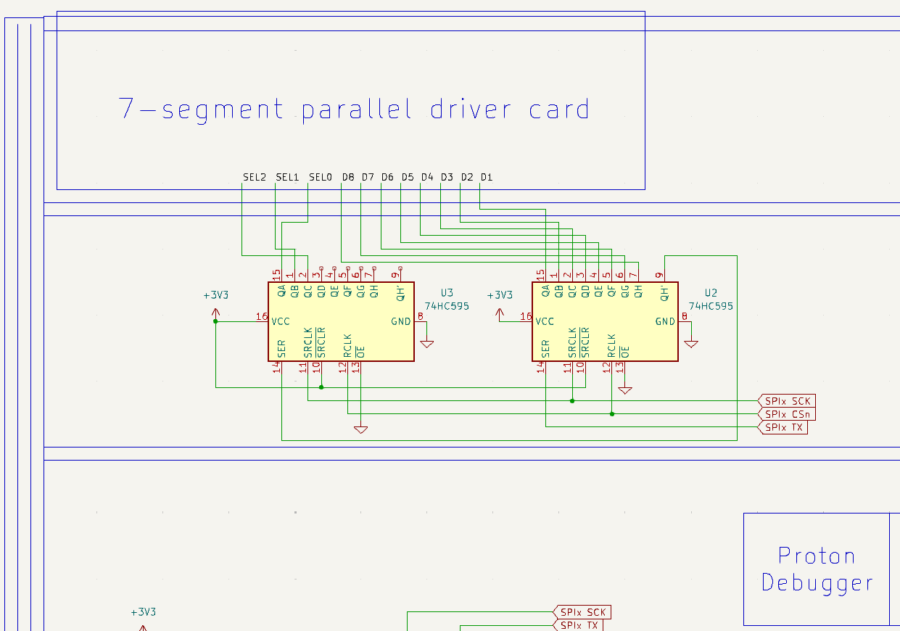

# Lab 6
## SPI

### Table of Contents
<br>

| Step | Description | Points |
|------|-------------|--------|
| 0.1 | Set up your environment |   |
| 0.2 | Wire and organize your breadboard |   |
| 1   | Read the datasheet | 20 |
| 2   | Bit-banging SPI with 7-segment displays | 20 |
| 3   | Use SPI to communicate with 7-segment display | 20 |
| 4   | Automate 7-segment display handling with SPI and DMA | 20 |
| 5   | Use SPI to communicate with LCD/OLED display | 20 |
| 6   | Confirm your checkoffs before leaving | * |
| 99  | Automate SPI transmits with PIO | ** |
| &nbsp; | Total: | 100 |
<br>

\* - You must get your whole lab checked off before the end of your lab section to avoid a late penalty of 20%.
\*\* - This is an optional step that introduces you to a very versatile peripheral that you can use with devices that do not typically interface with well-known peripherals.  E.g. your 7-segment displays, or a WS2812 LED strip.

### Instructional Objectives

- To understand what a Serial Peripheral Interface (SPI) is, and how it works.
- To understand how to configure and use the SPI peripheral on the RP2350.
- To implement SPI by bit-banging it with GPIO pins.
- To utilize SPI to communicate with 7-segment displays and LCD/OLED displays.

### Step 0.1: Set up your environment

Make sure to clone the code repository from GitHub Classroom.  Keep in mind to add, commit and push any changes you make so that your work is accessible from a lab machine. 

Open the template in VScode and with your Debug Probe connected to your Proton, click "Upload and Monitor".  Open the Serial Monitor to see the output of your program, and press the Reset button so that it prints out again.  You should now see the following:

```text
SPI Lab Test Suite
Type 'help' to learn commands.

> 
```

You can then type `help` to learn what commands you can use to test a certain subroutine.  You will use this to demo your implementation and wiring to the TAs.

If the text doesn't appear when you click "Upload and Monitor", ensure that `autotest()` is uncommented in `main.c`.

### Step 0.2: Wire and organize your breadboard

At this stage, it is important to identify the type of LCD in your kit.  As of Fall 2025, we shipped a new LCD display as a result of a **very** turbulent market for reasons that you may be already familiar with.  If you are reusing a kit from another student, it may also be that you have the older OLED display that you borrowed from a previous student in 362.  We include instructions on how to wire and use both types of displays in this lab.

Identify the type of display you have based on the picture below, and keep in mind which one you have for the rest of this lab.  **If you are not sure, ask a TA.**


On the LCD display, make sure that you have a bridge of solder that connects the two pads labeled SPI on the back, as shown in the same picture.  The two IIC (I2C) pads should not be connected.  If so, you can easily correct it yourself by taking a soldering iron, melting the I2C bridge solder on to a solder wick or into a solder sucker, and then soldering the two SPI bridge pads together.  

(If you want to use the display in the I2C configuration, reverse the procedure, and use the same SCL/SDA pins for I2C.)

As we go through the lab, look for the sections that are specific to your display type.

#### 0.2.1: Wire up your 7-segment displays

So far, we've been **directly** driving the 7-segment displays via the 3 decoder address pins to select the display, and the 8 segment pins to control the segments of the selected display.  However, this takes up 11 precious pins on our Proton board, which we can now reduce to 3 pins by using SPI.

The simplest way to explain how SPI works is with a shift register.  You may recall from ECE 270 that a shift register has three important ports: a clock, reset, 1-bit data input, an optional enable input, and an n-bit data output.  At the rising edge of the clock, the register shifts in the new data bit, and all the existing bits shift out to the left.

```
+---+---+---+---+---+---+---+---+
| 0 | 0 | 0 | 0 | 0 | 0 | 0 | 0 |  <-- data input
+---+---+---+---+---+---+---+---+
  ↑          <----            ↑
 MSB          dir             LSB
```

With SPI, we would make the following connections to our shift register:

- SPI SCK (clock) to the clock input of the shift register.
- SPI TX (data) to the data input of the shift register.
      - This may be called MOSI (Master Out Slave In) in some older documentation.
- SPI CS (chip select) to the enable input of the shift register.

We can also **chain** multiple shift registers by connecting the data output of one shift register to the data input of the next shift register.  This allows us to control multiple registers with a single SPI connection!

So if we happen to have two 8-bit shift registers, we could use 11 of those bits to act as the "pins" that we're now replacing.  

Now, let's go ahead and wire up the two 74HC595 shift registers in your kit.  Disconnect the wires between your Proton board and the 7-segment displays, and the USB-C cable to your debugger (as you need to route wires underneath it).  **Place the shift registers so that the side of pins 1-8 face the seven-segment display (the pin 1 dot is on the right side of the chip facing you), which is *opposite* to what you used to do with other 74-series chips.**  This is to make the wiring easier.  Then, follow this schematic to wire up your shift registers:



Note that we haven't connected the SPI SCK, CSn and TX pins to the Proton board.  With this lab, we'll have you figure out what pins you should use for SPI, and then you can connect them yourself to the shift registers.  There are two SPI peripherals on the RP2350, so make sure you are using three pins associated with the same SPI peripheral.  You can find the pin functions sheet [here](https://datasheets.raspberrypi.com/rp2350/rp2350-datasheet.pdf#_gpio_functions_bank_0).  Also note the function number associated with SPI for each pin.

Make sure to plug your USB-C cable back into the debugger.

Before you proceed, ensure you have identified the type of display you have.  If you do not know, ask a TA to help you identify it.

For both displays: place your display to the left of your audio jack from lab 5.  At this point, you should have a complete row of components on the bottom row of your breadboard.  Identify a set of three SPIx pins on the opposite side of your Proton board that you can use to connect to the display, but **make sure that you are using the second SPI peripheral**.  That means if you used SPI1 for the 7-segment display, you should use SPI0 for the LCD/OLED display.

#### 0.2.2: (LCD only) Wire up your SMH1602 LCD display

Follow this schematic to wire up your **LCD display**:


#### 0.2.2: (OLED only) Wire up your SEH1602 OLED display

Follow this schematic to wire up your **OLED display**:


#### 0.2.3: Specify your SPI pins in `main.c`

Finally, in your `main.c` file, set the following constants to the pin numbers you used for SPI SCK, CSn and TX for both the 7-segment display and the LCD/OLED display.  You'll find them underneath where you normally put your username:

```c
const int SPI_7SEG_SCK = 0; // Replace with your SCK pin number for the 7-segment display
const int SPI_7SEG_CSn = 0; // Replace with your CSn pin number for the 7-segment display
const int SPI_7SEG_TX = 0; // Replace with your TX pin number for the 7-segment display

const int SPI_DISP_SCK = 0; // Replace with your SCK pin number for the LCD/OLED display
const int SPI_DISP_CSn = 0; // Replace with your CSn pin number for the LCD/OLED display
const int SPI_DISP_TX = 0; // Replace with your TX pin number for the LCD/OLED display
```

> [!WARNING]
> When you are choosing pins, make sure that you do not use pins that are already being used for some purpose.  So far, you are using GP2-9 for the keypad, GP21-GP26 for the pushbuttons and onboard LEDs, GP36-39 for PWM, GP45 for the ADC.  Use pins on both sides of the board so that you can easily connect them to the SPI pins on the Proton board side facing each of them.

### Step 1: Read the datasheet

SPI stands for Serial Peripheral Interface, and it is by far one of the simplest and most widely used protocols for communicating with external devices.  It is a synchronous protocol, meaning that it uses a clock signal (SCK) to synchronize the transmission of data (TX to RX) between your Proton board TX and an external device's RX.  Conversely, UART, which we'll cover next lab, is an asynchronous protocol, meaning that it does not use a clock signal and instead relies on the timing of the data bits to determine when to read or write data.

> [!NOTE]
> In this datasheet, the terms "master" and "slave" are used to refer to the devices that control and respond to the communication, respectively.  The master device initiates the communication and controls the clock signal, while the slave device responds to the master's commands.
> 
> However, these terms are increasingly being replaced with "controller/peripheral", "initiator/responder", "primary/secondary", or "host/device".  The key thing to remember is that the primary device controls the communication by setting up the clock signal, and the secondary device responds to the primary's commands.

Go over [Section 12.3: SPI](https://datasheets.raspberrypi.com/rp2350/rp2350-datasheet.pdf#section_spi) of the RP2350 datasheet to understand what the pins do, as well as the SDK functions associated with SPI in the C/C++ SDK datasheet, and answer the following questions:

1. (5 points) What are the four signals used in SPI communication?  Which one are we not using?  Why would not use that pin for display communication?
2. (2 points) How many devices and their types can be connected to a single SPI bus?  (Hint: think about how you can use the CSn pin.)
3. (5 points) What is the maximum clock frequency for SPI on the RP2350?  
4. (3 points) Which SDK function initializes the SPI peripheral?  What are the parameters that you need to pass to it?
5. (3 points) What SDK function is used to set the parameters for SPI configuration, specifically the data format, CPOL/CPHA, endianness (bit order)?
6. (2 points) What SDK function is used to send 16-bit data through the SPI0 or SPI1 instance?

> [!IMPORTANT]
> Show your answers for the questions asked above to your TA.  You must have **correct** answers to earn points for this step.  
> 
> Avoid the urge to ask others (AI/LLMs are included in "others") for answers.  

### Step 2: Bit-banging SPI with 7-segment displays

"Bit-banging" is a technique where you manually control the GPIO pins yourself to implement SPI, rather than relying on the SPI peripheral.  We teach you this technique because you can use bit-banging for *any* digital protocol, e.g. PWM.  However, it is a last-resort measure when you have run out of peripherals but still have free GPIO pins to use.  We also teach you this technique because it is a great way to understand how SPI works at a low level.

In `display.c`, do the following:

Implement `display_init_bitbang` to initialize the 3 pins for communicating with the 7-segment display as GPIO outputs.  Set the CSn pin high and the SCK and TX pins low so that we don't accidentally send any data to the shift registers.

Implement `display_bitbang_spi` to perform the actual SPI communication bit-banging.  The message to be sent are the 8 11-bit elements of `msg`.  For each of the 8 elements, you will push out 3 bits that correspond to the 3 decoder address pins, and then 8 bits that correspond to the segments of the selected display.  **However, you must still send 16 bits at a time to make sure the bits reach the correct positions, so make sure to left-pad the 3 bits with 5 zeroes.**

How SPI works in a nutshell is as follows:
- When transmiting a new element from the eight in the `msg` buffer, CSn (chip select) is pulled low to select the device.  Sleep for 10 microseconds to allow the device to settle.
- TX (data) is set to the data to be sent, whether that's a logic 1 or 0.  Sleep for 1 microsecond to allow the data to propagate and satisfy any setup time requirements (remember those?).
- SCK (clock) is toggled high to shift the data out to the device.  Sleep for 5 microseconds, then toggle it low to complete the clock cycle, and sleep another 5 microseconds.
- The process of setting data, and toggling the clock, is repeated for each bit of data to be sent until the element is fully sent.
- After each element is sent, CSn is pulled high to deselect the device.  Sleep for 10 microseconds to allow the device to settle.

In `main.c`, make sure `STEP2` is defined.  This will call both functions for you in `main()`.  Upload your code and you should see the 7-segment displays light up with the numbers 0-7, each on a different display.  

When it doesn't work:
1. Check your wiring, carefully.  Use a multimeter to perform continuity checks from the SPI lines to the shift registers and from the shift registers to the 7-segment displays.
2. Check your pins in `main.c` to ensure you are using the correct pins for SPI SCK, CSn and TX.  Ensure that you are making them GPIO outputs, **not** SPI outputs.  SPI comes in the next step.
3. Use an oscilloscope's Serial function (literally just press the Serial button), or the Logic Analyzer on an AD2/3, to watch the SPI signals as the `display_bitbang_spi` function runs.  You are implementing bit-banging for 16-bit SPI, and you can consider a clock speed of 100 KHz.  Compare them to the signals below and ensure they look similar.


> [!IMPORTANT]
> Show your TA your working 7-segment displays and that you are bit-banging SPI.  Show them the code you wrote, and that it passes the `bitbang` test case.
> 
> Commit all your code and push it to your repository now.  Use a descriptive commit message that mentions the step number.

### Step 3: Use SPI to communicate with 7-segment display

Now, it's time for the real thing!

In `display.c`, implement `display_init_spi` to initialize the three GPIO pins to be used by the SPI peripheral associated with them.  **This means you have to set the function for the pin accordingly, and it is no longer GPIO output.**  It must also initialize the associated SPI peripheral with the following parameters:
- The clock frequency should be set to 125 KHz.
    - Start with 125, but you can experiment and see what frequency works.  We generally recommend a lower one to let the data bits propagate through the shift registers into the 7-segment displays.  Autotest will expect 125 KHz.
- The data format should be set to 16 bits.
    - We're only sending 11 bits at a time, but we need to send 16 at a time so that 1) the SPI peripheral can send the data in one go, and 2) the two 8-bit shift registers will receive the data correctly.
- The CPOL and CPHA should be set to 0, meaning that the clock is idle low, and data is sampled on the rising edge of the clock.
- The endianness (bit order) should be set to MSB first, meaning that the most significant bit is sent first, which is the A2 pin of the decoder on your 7-segment display.
    - While we were writing this lab, we discovered that the SPI isn't even capable of LSB-first transmission!  If you ever find yourself needing to use that, just flip the bits that you're transmitting.
- Finally, the SPI peripheral should be enabled.  (You may see something about DREQ signals being always enabled - that doesn't have to be done until the DMA step.)

In the same file, implement `display_print` to write each element of `msg` to the SPI peripheral data buffer, which triggers a "transaction".  The SPI peripheral, having received a new "datum" (our `msg` element), will automatically toggle the select/clock/data lines for us and transmit the datum we just gave it.  (Now that we're using SPI, things get a lot simpler!)  Notice that now there's no need to sleep between sending each element, as the SPI peripheral will handle the timing for us.  This can make our code more efficient as we rely on the SPI hardware to automatically handle character transmission as fast as possible with no sleeps.  Of course, we can still improve on that in the next step...

Uncomment STEP3, which calls both functions for you in `main`.  Upload and monitor, and you should see the same result as before, but now the 7-segment displays are being driven by the SPI peripheral instead of bit-banging.

When it doesn't work:
1. Check your pins in `main.c` to ensure you are using the correct pins for SPI SCK, CSn and TX.  Ensure that you are making them SPI outputs, **not** GPIO outputs.  GPIO was for manually bit-banging SPI.
2. Use an oscilloscope's Serial function (literally just press the Serial button), or the Logic Analyzer on an AD2/3, to watch the SPI signals as the `display_bitbang_spi` function runs.  You are implementing bit-banging for 16-bit SPI, and you are using a clock speed of 125 KHz.  Compare them to the signals below (should be the same as when you bit-banged SPI) and ensure they look similar.
3. Make sure you specified that you were using an LCD or OLED display at the top of the `main.c` file.


> [!IMPORTANT]
> Show your TA your working 7-segment displays and that you are using the SPI peripheral.  Show them the code you wrote, and that it passes the `spi` test case.
> 
> Commit all your code and push it to your repository now.  Use a descriptive commit message that mentions the step number.

### Step 4: Automate 7-segment display handling with SPI and DMA

In the past two steps, we used a loop to continually push out the bits to the 7-segment displays.  However, we like to ensure that whatever can be offloaded, should be offloaded to the hardware separate from the CPU.  

Thus we revisit the DMA peripheral from lab 4.  You may remember back in lab 4 that you used DMA to move sample data from the ADC to a variable in memory.  We'll now flip that around and use DMA to send data from the `msg` array to the SPI peripheral, which will then send it out to the 7-segment displays.  This frees up the CPU to do other things while the DMA handles the transmission to the SPI peripheral.

In the function `display_init_dma`, configure a free DMA channel by setting four things, which is generally the case for setting up any DMA transfer:
1. The source address, which is the address of the `msg` array.
2. The destination address, which is the SPI data register for the SPI peripheral associated with the 7-segment display.
3. The transfer count, which should set the DMA channel for TRIGGER_SELF mode, and will perform 8 transfers.

In a new temporary 32-bit integer (use `uint32_t`) variable, set the following parameters.  We'll then copy this variable to the DMA channel's control register to start the transfer:

4. The data size of each transfer will be the size of one element of `msg`, or 16 bits.
5. The read address should increment after every transfer.
6. The read address should wrap every X bytes.  (Figure out what X is.)
  - When you are in TRIGGER_SELF mode, the DMA will keep incrementing the source address by 16 bits (2 bytes) after each transfer in order to reach the next element of `msg`.  However, DMA doesn't understand that `msg` is only 8 elements long, so we need to tell it to wrap around to the first element's address after it has transferred the first element.  
  - The `msg` array is 8 elements long, and each element is 2 bytes (`uint16_t` or 16 bits) long.  
  - The value of X should therefore be the number of bits needed to represent the value after which the DMA read address should wrap around back to the start of the `msg` array.
  - Do not forget that you can try multiple values of X to see what works.  
7. Select SPI1 TX as the Data Request (DREQ) source.
    - When SPI finishes transmitting data, or has only just been configured, the data register will be empty, i.e. have a value of zero.  This is used to tell other peripherals, including DMA and IRQ, that the SPI transmit (TX) FIFO is empty, and ready to receive new data.  For DMA, that triggers a data request.
8. Finally, enable the DMA channel.

Set the DMA channel's **control trigger** register to the temporary variable you just set.  This will configure the DMA channel with the parameters you just set, and enable it to start transferring data from the `msg` array to the SPI peripheral.

If you didn't already enable DREQ signals from the SPI in the previous steps, do that before you configure DMA.

At the top of `main.c` in the username block, specify what DMA channel number you used.  We'll use this for `autotest`.

> [!NOTE]
> *Under `dma_hw->ch[CHANNEL]` is a `ctrl` register and a `ctrl_trig` register.  What's the difference?*
> 
> The `ctrl` register is used to configure the DMA channel, while the `ctrl_trig` register is used to configure **and** trigger the DMA channel and start the transfer.  This is very helpful if you want to restart the DMA transfer yourself by changing a few bits every time.  You could theoretically even use DMA to start a new DMA transfer, which could also be used to restart the first one!  That process is called "chaining" and can be extremely useful if you want to perform multiple different DMA transfers in a row without having to manually trigger each one.
> 
> Each of the four DMA registers have a trigger alias register associated with them.  That way, even if you set the `ctrl` register first with DMA enabled, the transfer will not start until the fourth register is written to via its alias register.  E.g. if you set the Control, Transfer Count and Read Address registers first, only writing to the Write Address alias register will allow the DMA channel to start the transfer.
> 
> Read [12.6.3.1 Aliases and Triggers](https://datasheets.raspberrypi.com/rp2350/rp2350-datasheet.pdf#section_dma_starting_channels) for different options on triggering a DMA channel to start - you can even write the `ctrl` register first and write to an *alias* register for the transfer count, read address or write address registers to do the DMA triggering instead.
> 
> The purpose of the temporary register is so that we set all our parameters first before writing to the `ctrl_trig` register, which would start the DMA transfer immediately.

Upload and monitor, and you should see the same result as before, but now the 7-segment displays are being driven by the SPI peripheral with DMA, while the CPU remains in a loop and can now be used for something else.

When it doesn't work:

1. Ensure that you set the correct DMA channel number in `main.c` at the top of the file in the variable `SEG7_DMA_CHANNEL`, and that you are using the same DMA channel in `display_init_dma`.
2. Debug your code, and go through the DMA Channel X registers in the RP2350 datasheet to ensure you are setting the correct parameters.  Make sure you are using the correct DMA channel throughout the code.  Check to see that the bits you want to set are being set properly in the `ctrl_trig`, `trans_count`, read and write address registers.
3. If not all digits are appearing, ensure you have the right value of X for the number of bits to wrap around after.

> [!IMPORTANT]
> Show your TA your working 7-segment displays and that you are using the SPI peripheral.  Show them the code you wrote, and that it passes the `dma` test case.
> 
> Commit all your code and push it to your repository now.  Use a descriptive commit message that mentions the step number.

### Step 5: Use SPI to communicate with LCD/OLED display

We'll now move on to the LCD/OLED display.  Make sure to look out for display-specific instructions in this step.

The display functions with an **internal controller** that interprets the commands sent to it.  We can do things like clear the display, set the cursor position, and write text at the point the cursor was set.  Therefore, before we can write text to the display, we need to initialize it and set the cursor position.  

We'll do our initialization in `chardisp.c` ("chardisp" is short for "character display").  The initialization is different for the two types of displays, so make sure to follow the instructions for your specific display type.

> [!NOTE]
> *How do we know how to communicate with this display and that it supports SPI?*  
> There is a datasheet for your display here: https://ece362-purdue.github.io/proton-labs/datasheets/
> 
> If you read it carefully, it describes what bits you need to send to the display to initialize it, set the cursor position, and write text to it.  

#### 5.1: `init_chardisp_pins`

Initialize the pins that you have connected to your LCD/OLED display in `init_chardisp_pins` as SPI-function pins.  Initialize the associated SPI peripheral with the following parameters:
- The clock frequency should be set to 10 KHz.
    - Having a very low clock frequency will make sure that the display has enough time to process the commands sent to it.
- The data format should be set to:
    - **9 bits for the LCD** OR; 
    - **10 bits for the OLED**.
- CPOL and CPHA should be set to 0, as usual.
- The endianness (bit order) should be set to MSB first, as usual.
    - While we were writing this lab, we discovered that the SPI isn't even capable of LSB-first transmission!  If you ever find yourself needing to use that, just flip the bits that you're transmitting.

#### 5.2: `send_spi_cmd`

In this function, wait until the SPI peripheral (whose associated object passed in as an argument) is not busy, and write the 16-bit value `value` into the SPI data register.  This will send the command to the display.

#### 5.3: (LCD only) `send_spi_data`

This function just calls `send_spi_cmd` but it ORs in **0x100** to the value.  The presence of this bit indicates that it is a data byte, not a command byte, to the display's controller.  Make sure to transmit the value with the SPI peripheral passed in as an argument - don't hardcode it!

#### 5.3: (OLED only) `send_spi_data`

This function just calls `send_spi_cmd` but it ORs in **0x200** to the value.  The presence of this bit indicates that it is a data byte, not a command byte, to the display's controller.  Make sure to transmit the value with the SPI peripheral passed in as an argument - don't hardcode it!

#### 5.4: (LCD only) `cd_init`

In this step, we're going to initialize the LCD display by transmitting commands via the SPI peripheral connected to it.  We'll give you the list of commands to send to the display to properly initialize it, but you need to go through the LCD datasheet to understand how to do this.  **Be prepared to explain to your TA what each command does and how you found it.**

1. Sleep 1 millisecond to let power to the display stabilize, in case we have only just plugged in the Proton.
2. Perform a Function Set command with the following parameters:
     - 8-bit interface
     - 2 line display mode
     - 11 dots per character (this doesn't really matter, but we'll state it to make sure it's consistent.)
3. Sleep 40 microseconds.
4. Perform a Display On/Off command where you turn on the display, turn off the cursor, and turn off the cursor blink.
5. Sleep 40 microseconds.
6. Perform a Clear Display command to clear the display.
7. Sleep 2 milliseconds.  (Clearing the display is relatively slow.)
8. Perform an Entry Mode Set command where you move the cursor to the right and increment the DDRAM address by 1 (the LCD's DDRAM is what holds your displayed characters when you send them), but do not shift the display.
9. Sleep 40 microseconds.

#### 5.4: (OLED only) `cd_init`

In this step, we're going to initialize the OLED display by transmitting commands via the SPI peripheral connected to it.  We'll give you the list of commands to send to the display to properly initialize it, but you need to go through the OLED datasheet to understand how to do this.  **Be prepared to explain to your TA what each command does and how you found it.**

1. Sleep 1 millisecond to let power to the display stabilize, in case we have only just plugged in the Proton.
2. Perform a Function Set command with the following parameters:
     - 8-bit length
     - English/Japanese character set
3. Perform a Display On/Off command where you turn on the display, turn off the cursor, and turn off the cursor blink.
4. Perform a Clear Display command to clear the display.
5. Sleep 2 milliseconds.  (Clearing the display is relatively slow.)
6. Perform an Entry Mode Set command where you move the cursor to the right and increment the DDRAM address by 1 (the OLED's DDRAM is what holds your displayed characters when you send them), but do not shift the display.
7. Perform a Return Home command to return the cursor to the home position (beginning of the top line).

#### 5.5: `cd_display1`

This function will send the first 16 characters of the string argument `str` to the first line of your display.  Send the command that moves the cursor to the first line using `send_spi_cmd`, and then send each character in `str` to the display using `send_spi_data`.  

#### 5.6: `cd_display2`

Same as `cd_display1`, but you send the 16 characters to the second line of your display.

Carefully check your code, and then head back to `main.c` and uncomment `STEP5`, which will call all the functions you just implemented.  Upload your code and you should see your display show a reaffirming message!

When it doesn't work:
1. Check your wiring, carefully.  Use a multimeter to perform continuity checks from the SPI lines to the display and from the display to the Proton board.
2. Check your pins in `main.c` to ensure you are using the correct pins for SPI SCK, CSn and TX, and that they are SPI outputs.
3. Ensure you are using the correct SPI peripheral associated with the pins you specified in `main.c`, and that you are consistently using that peripheral throughout your `chardisp.c` functions.
4. Use an oscilloscope's Serial function, or the Logic Analyzer on an AD2/3, to watch the SPI signals as the `cd_init` function runs.  You should see a series of commands being sent to the display, and then the text being displayed on it.  Configure the data size based on the display type you are using, and the clock speed to 10 KHz.  

> [!IMPORTANT]
> Show your TA your working display and that you are using the SPI peripheral.  Show them the code you wrote, and that it passes the `chardisp` test case.
> 
> Commit all your code and push it to your repository now.  Use a descriptive commit message that mentions the step number. 

### Step 6: Confirm your checkoffs before leaving

> [!CAUTION]
> Make sure you got checked off here: https://engineering.purdue.edu/ece362/checkoff/
> 
> Make sure to upload your confirmation code and verify that it is accepted by Gradescope.  You will know it is accepted if you get the points from Gradescope.
> 
> Before you leave, make sure your station is clean and that you have gathered your belongings, and then call a TA to confirm that you can leave.  Confirm that you have received your checkoffs and that your confirmation code was accepted on Gradescope before logging out and leaving for the day.

<hr>

### Step 99: (Optional) Automate SPI transmits with PIO 

PIO, or Programmable Input/Output, is a special peripheral unique to the Raspberry Pi microcontrollers, including the RP2350.  It goes one step up from bit-banging in that you can write **instructions** to implement whatever protocol you want, which takes away the need to worry about exact timing constraints, which can be difficult when manipulating pins.  

When you tackle projects, PIO can be incredibly useful as you can use it to implement data transmission protocols that are not natively supported by the RP2350, such as the ones needed to communicate with WS2812 LED strips, Adafruit LED matrices, etc. or even custom protocols that you may need for your project.  PIO has been successfully used to implement [Ethernet](https://www.raspberrypi.com/news/how-to-add-ethernet-to-raspberry-pi-pico/) and [DVI/HDMI](https://github.com/Wren6991/PicoDVI) protocols, as well as protocols with customized timing that may be used by interesting devices like [WS2812 LED strips](https://datasheets.raspberrypi.com/rp2350/rp2350-datasheet.pdf#pio-example-ws2812).

In this optional step, we'll show you how we can implement SPI using PIO, freeing up the SPI peripheral to be used with other pins.

#### An Overview


When we refer to PIO, we are referring to a complex system containing four state machines that can read/write data with FIFO queues (on the left) that go back to the main memory and CPU, and access to the GPIO pins (on the right).  

Unlike other peripherals where we had to just configure some registers to get the peripheral to do what we want, we have to write a specialized program that runs on the PIO state machine.  This program is written in a special assembly-like language called PIO ASM (ASM = assembly), which is compiled into a binary format and stored in the PIO Instruction Memory.

Each state machine can execute its own PIO program, which makes it really useful for implementing protocols across multiple pins.  In our example, we'll modify three pins at once, but you may have protocols like DVI where you need to manipulate a lot more pins at once, which is why there's four state machines for you to change all those pins.  

#### State Machine Internals

The state machine contains:
1. Two scratch registers X and Y that can be used to store temporary data by the assembly program.
2. A program counter (PC) that points to the next instruction to execute in the PIO program.  (We don't really need to worry about this from our perspective.)
3. A clock divider that controls the speed at which the PIO state machine executes instructions.  This is set to a fraction of the system clock, which is 150 MHz for our Proton board.
4. Two FIFO buffers for communicating with the CPU and main memory, one for reading data from the CPU (Out Shift) and one for writing data to the CPU (In Shift).  These are used to send data to and from the PIO program.
5. The control logic that will control all the above, as well as IRQ functions to do things like triggering DMA requests or CPU interrupts to fetch more data when it is ready, and GPIO pins so that they can be configured and driven by the state machines.


A PIO is similar to a CPU in that:
- It has a program memory from which it fetches, decodes and executes instructions.
- It has a "scratch memory" that can be used to temporarily store data, or exchange data with a CPU.
- It can configure and drive certain peripherals (only GPIO pins) and can trigger or handle DMA requests or fire interrupts.

A PIO is *very different* from a CPU in that:
- It has a very limited instruction set, which is designed to be simple and efficient for manipulating GPIO pins.
- It cannot communicate with the rest of the system except through FIFO buffers, which also can only be used to set pin values and scratch register values, or read them.

Read over [PIO Programs](https://datasheets.raspberrypi.com/rp2350/rp2350-datasheet.pdf#_pio_programs) and Control Flow (immediately after that) in the RP2350 datasheet to see some examples of PIO programs, and descriptions of how they operate.  

Then, read this program that we've given you to implement 16-bit SPI with the 7-segment display:

```
.program spi_7seg
.side_set 2

; This program reads one 16-bit half-word from FIFO 
; and implements SPI to send them out.
; CSn - side set 0
; SCK - side set 1
; MOSI - output pin

.wrap_target
    set x, 15 side 1      ; side-sets CSn low, SCK high
loop:
    out pins, 1 side 2    ; Output one bit to MOSI
    jmp x-- loop side 0   ; Decrement x, if not zero, jump to loop. 
                          ; side-set CSn high, SCK low
.wrap
```

Some things to explain:
- Comments start with a semicolon `;` and are ignored by the PIO assembler.
- The `.program` directive defines the name of the PIO program, which is `spi_7seg` in this case.
- The `.side_set` directive specifies that the program will use side-set instructions, which allow you to control GPIO pins in addition to the main instruction.  We specify 2 bits, corresponding to 2 pins that we will specify later.
- The concept of "side-set" is used to control GPIO pins as part of a given instruction.  So in the line `set x, 15 side 1`, the `side 1` part toggles the SCK pin high and the CSn pin low within the **same clock cycle** that the PIO sets the scratch register X's value to 15, to use it as a loop counter value, hence the term *side* set.  Side-sets can be used in any instruction, and are ideally suited to changing clock pin outputs without wasting an entire instruction on changing it (which can reduce your overall frequency).
- The `out pins, 1 side 2` instruction outputs one bit to the MOSI pin, and toggles the SCK pin low and CSn high at the same time.
- The `jmp x-- loop side 0` instruction is equivalent to "if x-- is not zero, jump to the line with "loop:" (called a label), otherwise continue operation.
- The `.wrap_target` and `.wrap` lines are used to specify that the program is a loop that will repeat forever until the PIO is stopped or reset.

Right below this would be an initialization function that sets up the PIO state machine to run this program, and configures the GPIO pins for SCK, CSn and MOSI.  The PIO program will then be loaded into the PIO instruction memory, and the state machine will start running it.

```c
% c-sdk {
static inline void spi_7seg_program_init(PIO pio, uint sm, uint offset, uint pin_sck, uint pin_csn, uint pin_mosi) {
    // CSn (13), SCK, TX (15)
    pio_sm_set_enabled(pio, sm, false);
    
    // Initialize GPIOs for SCK, CSn, and MOSI
    pio_gpio_init(pio, pin_sck);
    pio_gpio_init(pio, pin_csn);
    pio_gpio_init(pio, pin_mosi);

    // Set SCK and CSn as sideset pins (outputs), MOSI as OUT pin (output)
    pio_sm_set_consecutive_pindirs(pio, sm, pin_csn, 3, true); // SCK and CSn

    // Set pin values to CSn high and SCK/MOSI low
    pio_sm_set_pins_with_mask(pio, sm, (1u << pin_csn), (1u << pin_sck) | (1u << pin_csn) | (1u << pin_mosi));

    // Configure state machine and set clock divider
    pio_sm_config c = spi_7seg_program_get_default_config(offset);
    sm_config_set_clkdiv(&c, 150.0f);

    // Set output pin to MOSI
    sm_config_set_out_pin_base(&c, pin_mosi);
    sm_config_set_out_pin_count(&c, 1);
    sm_config_set_out_pins(&c, pin_mosi, 1);

    // 2 side-set pins - SCK and CSn (in that order)
    // CSn is at bit 0, SCK at bit 1
    sm_config_set_sideset_pins(&c, pin_csn);
    sm_config_set_sideset(&c, 2, false, false); 

    // Shift OSR to right, enable auto-pull, and set shift threshold to 16 bits
    sm_config_set_out_shift(&c, false, true, 16);

    // Initialize the state machine with the configuration
    pio_sm_init(pio, sm, offset, &c);
    pio_sm_set_enabled(pio, sm, true);
}
%}
```

This `init` program should get called by your `main` function to initialize the PIO with the compiled ASM.  Some things to explain about this as well:

- The surrounding `% c-sdk { ... %}` is a special syntax that allows us to write C code that will be compiled by the PIO assembler.  
- The PIO needs to know what pins to use for SCK, CSn and MOSI, so we pass those as parameters to the `spi_7seg_program_init` function, so that it configures them as PIO-specific outputs.
- We specify a clock divider of 150.0f, which means that the PIO state machine will run at 1 MHz, or 1 instruction per microsecond.  The effective 16-bit SPI communication was measured to be around 29.412 KHz (500 KHz / (16 data bits + CSn toggling)), with the clock signal frequency being around 500 KHz (a little lower since it turns off when CSn is being toggled).
- Specifying which pins have to be used is a little interesting.  PIO does not just take all the pin indices to use - instead, it needs to be provided the **mask** of all the pins to use.  See the `pio_sm_set_pins_with_mask/sm_config_set_out_pin_base/sm_config_set_out_pin_count/sm_config_set_sideset_pins/sm_config_set_sideset` function calls.  This is just due to the unique way it works.
- In the `sm_config_set_out_shift` call, we do three things:
    - We set the output shift register to shift towards the right.  When we transfer data to the FIFO, it gets copied in backwards, with the MSB first, so we need to shift it to the right to get the MSB out first, followed by MSB - 1, MSB - 2... until we reach LSB.  It's a little counterintuitive, but it works.
    - We enable auto-pull, which means that the PIO state machine will automatically pull data from the FIFO when it is ready, to be used for the OUT instruction.  If we don't want to use auto-pull, we can manually specify when to pull data from the FIFO using the `pull` instruction.
    - We set the shift threshold to 16 bits, meaning that the PIO state machine will wait until it has 16 bits of data in the FIFO before it starts shifting them out.  If the PIO doesn't have data for the `out` instruction, it will stall at that instruction until 16 bits of data arrives.

Now, take both the PIO program and the **entire** initialization function, and create a new file called `spi_7seg.pio` in your `src` directory and paste it in.

That PIO program gets compiled to a **binary format** with a program called `pioasm`, or PIO Assembler, into a binary format.  To make including it in your project easier, we've added code to detect if you have `.pio` files in your `src` directory, and use `pioasm` to compile them into `.pio.h` header files that will get automatically included in your project.  **Don't edit the header files directly!**

In your `main.c` file, at the top, include the header file generated by `pioasm`.

Then, down in the `main` function, add a new `#ifdef` section called `PIO_TESTING` below all the steps.  In it, add the following:

```c
// Use msg from display.c that we used earlier for regular SPI.
extern uint16_t msg[8];

// Define the 7-segment SPI bitbang pins for PIO.
// If you change these pins, make sure to change them in the PIO init program as well.
#define PIO_7SEG_SCK 14
#define PIO_7SEG_CSn 13
#define PIO_7SEG_TX 15

// Specify the PIO and state machine we want to use
PIO pio = pio0;
uint sm = 0; 

// Load and configure the PIO program
uint offset = pio_add_program(pio, &spi_7seg_program);
spi_7seg_program_init(pio, sm, offset, PIO_7SEG_SCK, PIO_7SEG_CSn, PIO_7SEG_TX);
```

This initializes the PIO state machine to run the `spi_7seg_program` that we defined earlier, and configures it to use the SCK, CSn and TX pins that we specified.  

For the actual transmission, we're going to create an infinite loop that sends each element of `msg` into the PIO state machine's FIFO.  It's a little interesting how we'll have to do it though:

```c
for (;;) {
    for (int i = 0; i < 8; ++i) {
        // Wait if TX FIFO is full (not likely, but this is good practice.)
        while (pio_sm_is_tx_fifo_full(pio, sm)) {
            tight_loop_contents();
        }

        // We tried this first.  It didn't work.
        // pio_sm_put(pio, sm, msg[i]);
        
        // After much trial and error, this did.
        *(io_wo_16 *) &pio->txf[sm] = msg[i];
    }
}
```

Breaking down the syntax of that last line:
- `pio->txf[sm]` is the TX FIFO for the state machine `sm` in the PIO `pio`.  This is thhe register that allows us to push values into the FIFO by writing to it.
- Normally, the function `pio_sm_put` would be used to push a value into the FIFO, but it didn't.  Our assumption is that it was trying to push a 32-bit value into the FIFO, but we specified the threshold as 16 bits, which is all we need.  We could have just specified 32 bits and transferred a padded 32-bit value, but then we would have to modify the PIO program to read 32 bits instead of 16 bits, which would waste quite a few clock cycles.  
- Since the threshold was technically never being met with the 32-bit assignment, we had to change the way we write values to the FIFO.  The `txf` register by default is 32 bits wide, but we can **cast** it as a 16-bit write-only register with the `io_wo_16` type (yes, you can do this on the left-hand side of an assignment), and then write our 16-bit value to it. 
- At the assembly (from your C code, not PIO) level, this is realized as a 16-bit write instruction to that peripheral's memory location.  When the PIO "sees" the 16-bit write, it satisfies the 16-bit threshold condition and pushes it into the FIFO, where the PIO assembly takes over and implements SPI to send out the data.

Upload your code now, and you should now see "01234567" on your 7-segment displays.  Connect a scope, and you'll see the SPI signals being generated by the PIO state machine, which will look similar to the ones you saw if you debugged SPI earlier.


When it doesn't work:
1. Ensure that you have the correct pins defined for SCK, CSn and TX in the `#ifdef` section, and that they match the pins you specified in the PIO program.  If you had to change it, make sure the `init` function matches those pins as well.
2. Go through the debugger and check the PIO registers to ensure the program was loaded, and that it is currently executing it.  You can't step through the PIO program since it is running in a hidden state machine, but you can check the registers to see if the program is running and if the FIFO is being filled.
3. Use the oscilloscope to check the SCK, CSn and TX signals.  You might want to try manually setting the pins in the PIO program to see if they are changing as expected.  The clock signal should be toggling, so try changing the assembly to at least get it to toggle before trying the SPI implementation.

#### Automate further with DMA

While the PIO state machine is great for handling SPI communication, you can also use DMA (Direct Memory Access) to automate the process even further. DMA is *very* awesome that way!

To use DMA with the PIO state machine, you'll need to configure a DMA channel to read data from the `msg` array and write it to the PIO state machine's FIFO.  Since you have to use DMA for a prior step, however, we won't provide the code, but it's fairly straightforward:

1. The read address should be the address of the `msg` array.
2. The write address should be the PIO state machine's TX FIFO register.
3. The transfer count should be set to 8, and the channel should be set to ENDLESS transfer mode so that it restarts.
4. Configure the control register as follows before enabling the DMA channel:
    - The data size of each transfer is 16 bits.
    - Increment the read address after each transfer.
    - Wrap the read address every X bytes, so that it wraps around at the end of the `msg` array.
      - This is the same X bytes you found in Step 4.
      - This ensures DMA starts reading from the beginning of the `msg` array after it has transferred all eight elements.
    - We noticed that we didn't have to do the casting that we did earlier, so our guess is that the DMA performs a 16-bit write for us already with each transfer.
    - Specify PIO0 TX as the Data Request (DREQ) source, so that the DMA channel will be triggered when the PIO state machine's TX FIFO is empty and ready to receive new data.
    - Enable the DMA channel.
  
Set the value in the control trigger register to start the DMA transfer, and you'll now see something odd.  It may vary from person to person, but you may see the 7-segment displays not show all the digits - instead, you'll see some corruption on the displays past 0, 1, and/or 2.

This is due to a hard-to-find bug that prevents the DMA from being able to access the `msg` array properly.  Even though it's defined globally, the DMA channel is not able to access it properly because it is not (we think) in the right memory region.  

What *does* work, is if we create a new array in heap memory and use that instead for the DMA read address source.  Create a 16-bit integer pointer variable called `msg_heap` in `main.c`, and allocate it with `malloc` to the size of `msg` (8 16-bit unsigned int elements).  Then, copy the contents of `msg` into `msg_heap` using `memcpy`.  Use `msg_heap` as the read address for the DMA channel instead of `msg`, and try uploading again - hopefully, you'll see all digits 0-7 on the 7-segment displays!

You can configure additional things like a different PIO clock speed to make it slower, the pins to be configured by the PIO, etc. before the PIO state machine starts running.

Using PIO to automate SPI is different from having DMA do it in that PIO can still make small adjustments to the data being sent, such as adding a delay between bits, or changing the data being sent based on some condition.  