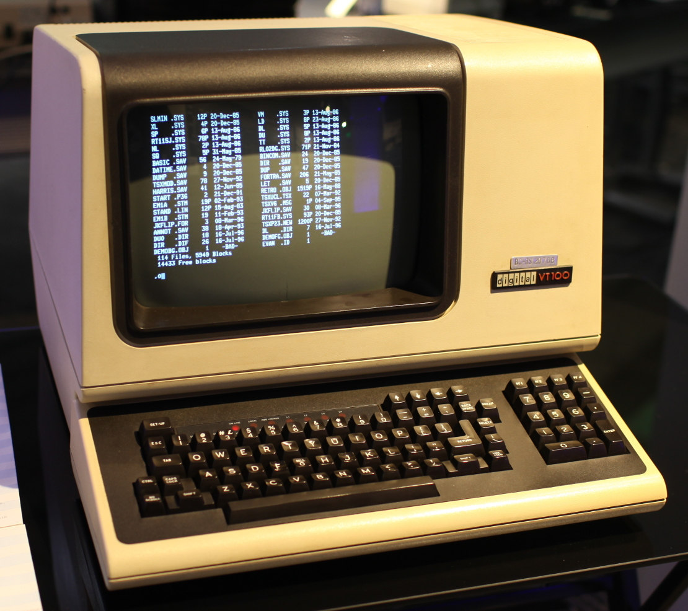
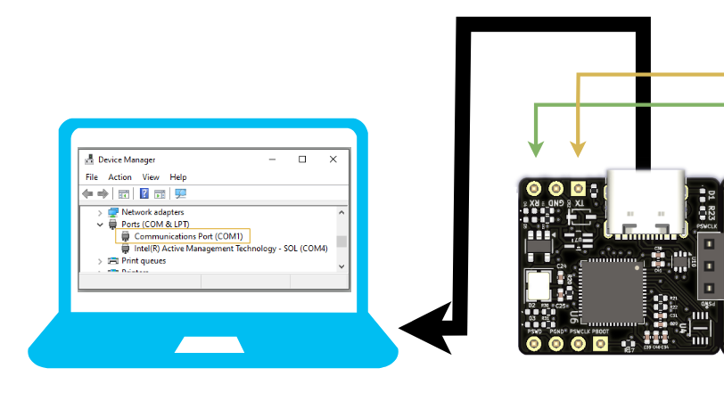
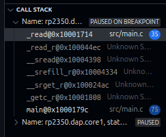
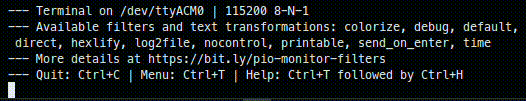

# Lab 7
## UART

### Table of Contents
<br>

| Step | Description | Points |
|------|-------------|--------|
| 0.1 | Set up your environment |   |
| 0.2 | Wire and organize your breadboard |   |
| 1   | Read the datasheet | 20 |
| 2   | Configure a UART to transmit and receive text | 10  |
| 3   | Link UART to C standard I/O library | 20  |
| 4   | Automate your new UART device driver | 20  |
| 5   | Design a Peripheral Configuration Shell | 30  |
| 6   | Confirm your checkoffs before leaving | * |
| &nbsp; | Total: | 100 |
<br>

\* - You must get your whole lab checked off before the end of your lab section to avoid a late penalty of 20%.

### Instructional Objectives

- To understand how to configure and use the UART peripheral on the RP2350.
- To learn how to interpret UART parameters like baud rate, data bits, stop bits, and parity.
- To design and implement a simple bidirectional UART communication system.

### Step 0.1: Set up your environment

For this lab, there is no autotest.  At this point, you will be expected to debug your code by reading the datasheet, identifying important registers, using the SDK functions to figure out what you need to do, and if something goes wrong, debugging and checking register values for the UART and/or associated peripherals.

By the end of the lab, you will have learned how to create your own command shell, in the same style as the one we provided you in previous labs with autotest.

No other wiring is needed other than ensuring your Debug Probe is still connected to your Proton board, via the debug and UART pins (which should have remained in place throughout the semester).

The structure of `main.c` is also quite different from previous labs.  Instead of having a single `main()` function, we have several steps that you will uncomment the top-level `#define` for as you complete them.  When you start a new step, make sure to comment out the previous step's `#define` so that you don't run into issues with **multiple definitions of the same function**.

### Step 1: Read the background and datasheet

Asynchronous serial communication using a Universal Asynchronous Receiver/Transmitter (UART) has been a staple of inter-computer communication since its introduction in the 1960s. Although asynchronous serial has been largely supplanted by more specialized communication protocols that are faster or more specially structured, it remains the only interface on your microcontroller that can be readily used for ad hoc interactive bidirectional communication. In this lab, you will use a UART to implement communication with an interactive program. You will examine the asynchronous serial protocol using an oscilloscope to identify the communication payload.

Decades ago, most mainframe computing equipment was large and was usually centralized in special rooms. Devices called serial terminals, like the one pictured below, were used to interact with the computers from a distance. The only function of these terminals was to take characters typed on a keyboard and send them through an asynchronous serial connection to the computer and receive characters back through the serial connection and display them on the screen. They were often called dumb terminals because they did not constitute a programmable computer system by themselves. All programmable computation happened on the remote computer.



It was very easy for a personal computer to do everything a dumb terminal could, and more. All that was needed was a program to connect the keyboard and text screen to the bidirectional serial port. This program was called a **terminal emulator**. There are several kinds available for any computer.

In lab 0, we had you connect your Debug Probe's UART pins (RX and TX) to those on your Proton board (GP0 and GP1).  With your Proton board, we've made UART very easy to use by including our custom Debug Probe as part of the board.  Your Debug Probe's firmware (from Raspberry Pi) implements a UART-to-USB bridge, presenting itself as a UART device to your computer.  



*This is Windows's Device Manager. Ports/visuals may differ based on your OS.*

We'll continue to use the same connections, but with this lab, we'll recreate the functionality of a terminal emulator on the Proton board, allowing you to send and receive text from your computer, and to implement a simple command shell that you can use to interact with your board.

When we type a key, say "A", into the Serial Monitor in PlatformIO, that key is sent as an ASCII-encoded byte (8 bits) across the wire.  It travels through the USB cable into the Debug Probe, which converts it into a UART data packet, and pushes it out through the TX pin of the Debug Probe, which reaches GP1 (UART0 RX) on the Proton board.  That transmission will look something like this:

```
Idle Bit | Start Bit | 8 Data Bits (MSB first)        | Stop Bit
    1    |     0     | 0 1 0 0 0 0 0 1 (0x41 = 'A')   |   1
```

The UART on your Proton will detect this transmission when the start bit arrives, shift the bits into its internal shift register, and when the stop bit arrives, it will make the data available to your program via a "data register", not unlike the one used by SPI.

Conversely, when you send a character from your program running on the Proton board, it will be transmitted through the TX pin (GP0) of the Proton board, to the RX pin on your Debug Probe.  The Debug Probe program will convert that into a USB packet and send it to your computer, where you will see it in the Serial Monitor.

UART typically has two other pins - RTS and CTS - which are used for hardware flow control.  These date back to a time when the UART was used to communicate with devices that were much slower than the computer, such as a printer.  The RTS (Request To Send) pin is used by the computer to indicate that it is ready to send data, and the CTS (Clear To Send) pin is used by the device to indicate that it is ready to receive data.  These days, you don't need these pins - you certainly didn't need them when we connected the Debug Probe to the Proton board.

Go over [12.1 UART](https://datasheets.raspberrypi.com/rp2350/rp2350-datasheet.pdf#section_uart) as well as the relevant [SDK functions](https://datasheets.raspberrypi.com/pico/raspberry-pi-pico-c-sdk.pdf#group_hardware_uart) for UART, and answer the following questions:

1. (4 points) In the code example under "hardware_uart" in the [C/C++ SDK datasheet](https://datasheets.raspberrypi.com/pico/raspberry-pi-pico-c-sdk.pdf), the function for GPIO is set using the macro "UART_FUNCSEL_NUM(uart0, N)" and not, as one would expect, "GPIO_FUNC_UART".  What does this macro do?  

2. (4 points) With the macro above, what would be the GPIO function selected for GP0 and GP1 (and by extension, any TX/RX pins) be?  What would be the GPIO function selected for GP2 and GP3 (and by extension, any RTS/CTS pins) be?  

3. (4 points) Which register holds parameters like word length, number of stop bits, parity, etc.?

4. (4 points) Identify what the frequency of the clock to the baud rate generator is, and calculate the value of the Baud Rate Divisor register for a baud rate of 115200 bps.  
- Hints: try out the SDK function that sets the baud rate in your `main.c` file.  The input clock to the baud rate generator is `clk_peri`.
- Even if you find the value for the register in the datasheet, you need to show the formula and how it's used.

5. (4 points) Identify the interrupt numbers associated with when the UART receives a character, and when it transmits a character.

> [!IMPORTANT]
> Show your answers for the questions asked above to your TA.  You must have **correct** answers to earn points for this step.  
> 
> Avoid the urge to ask others (AI/LLMs are included in "others") for answers.  

### Step 2: Configure a UART to transmit and receive text

In the function `init_uart`, using the SDK functions or by writing to the registers directly, configure the UART 0 peripheral to communicate at 115200 bps (bits per second), with 8 data bits, no parity, and 1 stop bit.

In `main`, we've provided code that calls `init_uart`, waits for a character to be received, and then transmits that character back.  

Uncomment STEP2 at the top of the file and upload and monitor.  Try typing characters into the terminal.  Instead of seeing the character you had just pressed, you see "You typed: " followed by the character you typed, instead of seeing the character echo back as soon as you press it.  Weird, right?

That's because, by default, **UART does not automatically echo characters back to the terminal**.  You have to write code to do that.  The code in `main` is a good start, but generally terminal emulators have more robust echoing capabilities, such as handling backspace and other control characters, which we'll do next.

> [!IMPORTANT]
> Show your TA that typing characters into the Serial Monitor does not echo them back directly, but instead shows "You typed: " followed by the character you typed.  Show them the code you wrote.  (Remember that there is no autotest.)
> 
> Commit all your code and push it to your repository now.  Use a descriptive commit message that mentions the step number.

### Step 3: Link UART to C standard I/O library

> [!NOTE]
> Comment out the STEP2 definition and uncomment STEP3.

In the first step, we directly used UART functions to read and write characters.  However, it can be a bit tedious to use these functions directly, especially when we want to read in strings or formatted data in ways that we're all more familiar with from typical C programs.

The function `stdio_init_all` does quite a bit of heavy lifting for us to allow the C standard I/O (stdio) functions like `putchar()`, `getchar()`, `scanf()`, `printf()`, etc. to work with the UART peripheral.  It sets up the UART peripheral to be used for standard input and output, allowing you to use these functions to read from and write to the UART.  

If you dive into that function, and go through `stdio_uart_init -> stdio_uart_init_full`, you'll find `stdio_set_driver_enabled`.  At this point, we arrive in the `stdio.c` from the Pico C/C++ SDK.  This file teaches us a lot about how Raspberry Pi's SDK connects the UART peripheral to the C standard library functions, which is by creating a "**driver**" that handles the reading and writing of characters via the UART peripheral when an associated C standard library function, like `printf` or `fgets` or `scanf`, is used.

These "drivers" are simplistic versions of the "device drivers" you may have heard of while using your computer on a regular basis, e.g. installing a *driver* for your printer or GPU.  They are pieces of software that allow the operating system to interact with those hardware devices in a standardized way.  In our case, the "operating system" is the C standard library, and the "hardware device" is the UART peripheral.

In this step, you will implement this driver yourself, so that you can understand how it works under the hood, and be able to apply it to *any* microcontroller, especially if they don't come with this sort of helper code, or if you wanted to use another UART entirely, or if you wanted to customize it further.  This is also intended to highlight how these functions can work across multiple platforms, from microcontrollers to desktop computers.

#### 3.1 Configure UART to handle one character at a time

The C standard library is implemented on the RP2350 with the help of a library called 'newlib', or rather, Raspberry Pi's version of it that they provide in the SDK.  If you dive into `PLATFORMIO_LOCATION/packages/framework-picosdk/src/rp2_common/pico_clib_interface/newlib_interface.c` (PLATFORMIO_LOCATION will be different by OS), you'll find that it defines some interesting functions like `_write` and `_read`, and "handles" (or pipes) for `stdin, stdout, stderr` that are prepended with "STDIO_HANDLE".

These functions are called "system calls", or syscalls for short.  System calls are different from regular functions in that they are typically used by an operating system to request services from the hardware, or in this case, interacting with the UART peripheral when a request to **read or write** data is made by the C standard library functions.  

On a more sophisticated computer with an OS like Windows/macOS/Linux, the syscalls are implemented in the kernel, and when programs need access to hardware resources like a hard drive, network, or display, they invoke the kernel's syscalls, which handles the interaction with the hardware on behalf of the requesting program.  This is how the C standard library functions like `printf`, `scanf`, and `fgets` are able to work on any computer, regardless of the underlying hardware.  

At the embedded level, however, there is no OS, so the layers of abstraction are much thinner.  When we use C standard library functons like `getchar()` or `putchar()`, they will call the `_read` and `_write` syscalls provided by `newlib`, respectively.  What we'll do now is rewrite those syscalls to directly interact with the UART peripheral, so that we can directly use the C standard library functions to read and write data to the UART.

Here's the portion of `newlib_interface.c` that defines these syscalls on the [Pico SDK GitHub](https://github.com/raspberrypi/pico-sdk/blob/ee68c78d0afae2b69c03ae1a72bf5cc267a2d94c/src/rp2_common/pico_clib_interface/newlib_interface.c):

```c
// DO NOT JUST COPY IN THIS CODE - THIS IS ALREADY ADDED.  
// READ THE COMMENTS TO UNDERSTAND WHAT IT DOES.

// The handle for standard input
#define STDIO_HANDLE_STDIN  0
// The handle for standard output
#define STDIO_HANDLE_STDOUT 1
// The handle for standard error output (unused in this lab)
#define STDIO_HANDLE_STDERR 2

........

// When a function like getchar/scanf/scanf/fgetc etc. are called, 
// they will call this _read syscall.

int __attribute__((weak)) _read(int handle, char *buffer, int length) {
    // Raspberry Pi adds their own code here to handle reading from the UART.
    // We will replace it with our own.
#if LIB_PICO_STDIO
    if (handle == STDIO_HANDLE_STDIN) {
        return stdio_get_until(buffer, length, at_the_end_of_time);
    }
#endif
    return -1;
}

// When a function like putchar/printf/fputs/fputc etc. are called,
// they will call this _write syscall.

int __attribute__((weak)) _write(int handle, char *buffer, int length) {
    // Raspberry Pi adds their own code here to handle writing the UART.
    // We will replace it with our own.
#if LIB_PICO_STDIO
    if (handle == STDIO_HANDLE_STDOUT || handle == STDIO_HANDLE_STDERR) {
        stdio_put_string(buffer, length, false, true);
        return length;
    }
#endif
    return -1;
}
```

Therefore, to implement reading/writing with the UART, we will implement our own versions of `_read` and `_write` that will use the UART peripheral to read and write data.  Our new function definitions will not conflict with the existing ones, because the newlib ones are defined as `weak` (see the attributes above), which means that if we define our own versions, they will override the existing ones.  We'll do this in `main.c`.

Below the `init_uart` function, implement the following two functions (which are now strongly defined, and will override the weak definitions we saw above):

```c
int _read(int handle, char *buffer, int length) {
    // Your code here to read from the UART and fill the buffer.
    // DO NOT USE THE STDIO_* FUNCTIONS FROM ABOVE.  Only UART ones.

    // The argument "handle" is unused.  This is meant for use with 
    // files, which are not very different from text streams.  However, 
    // we read from the UART, not the file specified by the handle.

    // handle is irrelevant since these functions will only ever be called 
    // by the correct functions.  No need for an if statement.

    // Instructions: Given the buffer and a specific length to read, read 1 
    // character at a time from the UART until the buffer is 
    // filled or the length is reached. 
}

int _write(int handle, char *buffer, int length) {
    // Your code here to write to the UART from the buffer.
    // DO NOT USE THE STDIO_* FUNCTIONS FROM ABOVE.  Only UART ones.

    // The argument "handle" is unused.  This is meant for use with 
    // files, which are not very different from text streams.  However, 
    // we write to the UART, not the file specified by the handle.

    // handle is irrelevant since these functions will only ever be called 
    // by the correct functions.  No need for an if statement.

    // Instructions: Given the buffer and a specific length to write, write 1
    // character at a time to the UART until the length is reached. 
}
```

Implementing these two system calls is how we implement a driver that links the C standard library functions to the UART peripheral.  

Once you've implemented these two, make sure STEP3 is uncommented at the top of the file.  Then, look at the `main` function to see that, in an infinite loop, we call `getchar()`, and its result is immediately put into `putchar()`.  Simply put - print out every character we receive from the UART.

Upload and monitor your code.  Try entering some characters into the Serial Monitor.  It won't work!

Time to debug.  Set a breakpoint in the `_read` function, and run the code.  When you hit the breakpoint, let's first take a look at the Call Stack, which shows us the flow of calls that lead to the `_read` syscall being called.  (It's okay if it says Unknown Sources - no need to dive into those functions.)



Now, look at Variables above.  Note that the length is 1024, even though we called `getchar()`, which should read only one character!  This is because the C standard library functions like `getchar()` and `putchar()` are designed to work with **buffers**, and they will call `_read` and `_write` with a buffer size of 1024 bytes by default.  Since we want `_read` to immediately return a character as soon as it arrives, we need to turn off the C standard library buffering.

The way to do this is by adding the following lines before the for loop in `main`:

```c
setbuf(stdout, NULL);  // Disable buffering for stdout
setbuf(stdin, NULL);   // Disable buffering for stdin
```

Upload and monitor again, and you should now be able to type into the Serial Monitor and see the characters echoed back immediately, one at a time!

#### 3.2 Add echo and backspace control

Right now, we're seeing the characters we type echoed back, but only because we're piping the output of `getchar()` directly to `putchar()`.  This doesn't help us when we need to be able to type a longer string and edit it.

In the `_read` syscall, add a line that prints out the character to the UART that was just read.  This removes the need to pipe `getchar()` into `putchar()`.  However, if you run this right now with both `putchar/getchar`, and the `_read` syscall printing out each character, you'll see the characters double up when you type one at a time.  Not a problem.  We'll fix that in step 3.4 by removing the `putchar/getchar` code in `main`, so only the `_read` syscall will print characters when receiving them.)

With the echo working from earlier, you might want to try more special keys, the simplest being Backspace.  You'll see that the cursor moves backward one space, but the character you typed is still there!  *Spooky!*



The Backspace key is actually meant to control the *cursor*.  The "erasure" of the character is added afterward.  It was automatically handled by your Pico's `stdio_init_all` function.  (See how much work that was hiding behind the scenes?)  

So, to reiterate, our algorithm is as follows:
- We type some characters and `getchar()` calls `_read()`, which reads them one at a time.
- The returned character is passed to `putchar()`, which calls `_write()`, which writes the character to the UART.

Therefore, we'll patch the `_read()` syscall again to insert a special case for Backspace.  In the function, just before the echo write, add an if-statement to check if the character to be written is a Backspace (ASCII value is 8).  If so, first write a backspace, followed by a space (ASCII 0x20 or 32), followed by another backspace.  

We also do not want a backspace character to be stored into the buffer, so if a backspace is detected, decrement your loop counter, print out the second backspace, and continue to the next iteration of the loop.  This way, we will not write the backspace character into the buffer.

The space will overwrite whatever character was there previously, and the second backspace will move the cursor back to the position before the character was written.  This way, it will look like the character was erased.

Upload and monitor again, and try typing some characters, including Backspace.  You should now see that the Backspace key works as expected, erasing the character you typed.


#### 3.3 Handling newlines

"Enter" is a combination of two ASCII control codes - the carriage return (CR) and the line feed (LF).  This goes back to the days of typewriters, where the carriage return would move the print head and paper to the beginning of the line, and the line feed would move the paper down one line.  

Since human beings who write left-to-right languages (like English) often start new lines from the left and one line down from the current one, computers implement the same behavior.  The CR is ASCII 0x0D (13) and the LF is ASCII 0x0A (10).  When you press "Enter" in the Serial Monitor, it sends both of these characters.

However, it seems that we don't have to do anything.  If you type some characters, and then press "Enter", you see that the cursor does get moved to the beginning of the line (CR) and then moved down to the new line (LF).  This is because the Serial Monitor is already handling this for us, and it does not send the CR and LF characters to the UART.  It only sends the LF character.

If you set breakpoints in `_read()` where the character has been received, and then debug, and press Enter into a serial monitor, you'll see the first character is 0x0D (CR).  Continue execution, and you'll then see the LF arrive.  **To clarify - this is not behavior implemented by the RP2350, but rather by the Serial Monitor program in PlatformIO.**  

If you try using a *proper* serial terminal, it'll send only an LF (on Linux - it still sends an CRLF on Windows).  For those cases, you might see the cursor move down but not left, in which case you need to implement the CR behavior yourself by printing a CR along with the LF (before or after doesn't matter).

**There's nothing much to do for this step** other than to demonstrate to your TA that pressing Enter results in both a CR and LF being sent to the UART in the debugger.

#### 3.4 Being able to use `scanf()`

Now, let's try reading in strings into variables.  If you don't remember using it in a previous course, `scanf` is a C standard library function that allows you to read **formatted** input from the standard input (stdin).  It can be used to parse strings, integers, and other data types.

Replace the code in `main`, except for the `init_uart()` call, with the following code:

```c
setbuf(stdout, NULL);  // Disable buffering for stdout
setbuf(stdin, NULL);   // Disable buffering for stdin
char name[8];
int age = 0;
for(;;) {
    printf("Enter your name and age: ");
    scanf("%s %d", name, &age);
    printf("Hello, %s! You are %d years old.\n", name, age);
    sleep_ms(100);  // in case the output loops and is too fast
}
```

Try entering your name, a space, and then your age as a number.  `scanf` will terminate when it reads a non-digit character after the number (including Backspace!).

However, we'd like to be able to handle the Backspace key in this case as well, so that we can edit our input before pressing Enter (as you would expect when you write a regular C program that uses `scanf`).  There's not a really good way to do this with what we have so far, because we're having our `_read()` function read one character at a time, and then return it to `scanf()`, which expects to read a whole string at once.  **This is why we need buffering.**

What we'll do in the next step is then implement a simple buffer that will allow us to read in a whole string.

A second consideration is that we don't want the CPU to be responsible for watching the UART for incoming characters.  If you look at how the `_read()` functions works currently, the CPU is **blocked** while waiting for a character to arrive, so we'll replace that with a sleep in our own implementation.  

We'll use interrupts in the next step to have the UART automatically store incoming characters into the buffer, using an interrupt handler to properly shift characters and account for things like newlines.

### Step 4: Automate your new UART device driver

> [!NOTE]
> Comment out the STEP3 definition at the top of the file, and uncomment STEP4.

In this step, we'll do a few things:

#### 4.1 Implement a simple buffer

We'll add a 32-byte buffer to store incoming characters from the UART, with minimal processing for newlines and backspaces.  This is done for you under STEP4, called `serbuf` (serial buffer).  

#### 4.2 Configure UART to fire interrupts on receive

In the function `init_uart_irq`, configure the same UART you configured in Step 2 (assuming we will call `init_uart` for you first) to do the following:
- Disable the internal FIFO, since we will now be handling the character buffering ourselves.
- Enable the necessary bits to mask the receive interrupt (not a typo - the datasheet says that "masking" is the correct term to enable the interrupt).
- Set up `uart_rx_handler` to be the exclusive handler for the overall UART interrupt, and enable the UART interrupt.

#### 4.3 Implement the UART receive interrupt handler

Take a look at some of the variables defined just underneath `#define STEP4`.  You have the `serbuf` buffer, and an associated index `seridx` that keeps track of where the next character should be written in the buffer.  `BUFSIZE` sets the size of the buffer to 32 bytes, which is more than enough for basic line editing.

There's a variable called `newline_seen` that will indicate later on that the user has pressed Enter, and so we should process the buffer.  In this case, we're treating the newline as a **delimiter character**, which indicates the end of the line.

The handler will get called as soon as a character is received on the UART.  In this handler, you must:

- Acknowledge the interrupt by setting the appropriate bit in the relevant UART register.
    - We've found that reading the data register is also sufficient, but we want you to always think "interrupt handler? acknowledge it!".  Better safe than sorry.
- If `seridx` reaches `BUFSIZE`, return immediately so we don't lose the data we have.
- Read the character directly from the UART data register into a new character variable `c`.  There's no need to use any SDK functions to do this since the very act of calling the handler indicates that a character is already available.
- If the character is a newline (ASCII 0x0A), set `newline_seen` to 1.
- If (NOT else if) the character is a backspace and some characters have already been received, write backspace-space-backspace to the UART to erase the last character, decrement `seridx` if higher than 0, set the character at `serbuf[seridx]` to '\0', so that we don't process it later, and return.
- Otherwise, if the character is not a backspace, print it out with the UART, and write it to `serbuf[seridx]` and increment `seridx`.

By itself, the handler should now properly handle strings, and `_read` can simply wait and transfer the data back when a newline is seen.

#### 4.4 Re-implement the `_read` syscall

Before we proceed, make sure to copy the `_write` syscall from Step 3.  It doesn't change much.

Copy the `_read` syscall function definition (not the body) from Step 3, and then implement it as follows:

- Until a newline is seen, sleep 5 milliseconds.
    - This provides valuable CPU time to the system to handle other tasks, such as the UART receive interrupt.
- Once seen, set `newline_seen` back to 0.
- Copy the contents of `serbuf` into `buffer`.  The number of characters to copy is `seridx`, which is the number of characters received so far.
    - This is only true as long as `length` is greater than or equal to `seridx`.  If `length` is less than `seridx`, copy only `length` characters.  However, since our `BUFSIZE` is 32, this should not be an issue.
- Reset `seridx` to 0.
- Return the passed argument `length`, and **not** `seridx`.  This is because the C standard library functions expect the length of the string to be returned, not the number of characters received.

#### 4.5 Test your implementation

In the `main` function, add the following:

```c
init_uart();
init_uart_irq();

setbuf(stdout, NULL); // Disable buffering for stdout

char name[8];
int age = 0;
for(;;) {
    printf("Enter your name and age: ");
    scanf("%s %d", name, &age);
    // THIS IS IMPORTANT.
    fflush(stdin);
    printf("Hello, %s! You are %d years old.\r\n", name, age);
    sleep_ms(100);  // in case the output loops and is too fast
}
```

Note the addition of a new line that flushes the input buffer after reading the name and age.  We found that without it, `scanf` wouldn't work properly, and would keep returning the same input over and over again.  This isn't normal behavior, but as long as you remember to add this line when using line-buffered input functions like `scanf/fgets`, you should be fine.

Try running the code, and entering your name and age.  You should be able to edit your input with Backspace, and see the output printed correctly.

There's still limitations to this approach that we can work around as needed:

- Input is limited to 32 characters.  If `serbuf` fills up because you typed 32 characters or more, the handler will always return and not process any more characters whatsoever.  You can fix this by either increasing `BUFSIZE` or by discarding characters when the buffer is full.

- `scanf` is still technically a blocking function, and perhaps you don't want the control code to be stuck here while you're waiting on the user to type something in.  That requires a completely different approach to how you will handle incoming characters - you still store characters in a buffer continuously with the UART interrupt, but instead of using `scanf` which blocks flow, just read the buffer manually when you need it.  

A common question that comes up is why we didn't use DMA to handle the UART receive.  DMA is purely a data transfer peripheral - it wouldn't be able to handle things like Backspace and newlines, which would have required CPU time anyway.  DMA is still useful if you're connecting UART to another device, where you know exactly the format of the data being received into the RP2350, and you don't have to do extra processing on the received data.

> [!IMPORTANT]
> Show your TA that you can read in a name and age using `scanf`, and that you can edit your input with Backspace.  Show them the code you wrote, and explain how it works.
>
> Commit all your code and push it to your repository now.  Use a descriptive commit message that mentions the step number.

### Step 5: Design a Peripheral Configuration Shell

> [!NOTE]
> Comment out the STEP4 definition at the top of the file, and uncomment STEP5.

Having a command shell is an incredibly powerful tool for interacting with your microcontroller, as you may have already noticed from the autotests in the previous labs.  In this last step before you go off and tackle your projects, we'll explain how to implement a simple command shell that allows you to configure peripherals on the RP2350, and then use it to configure the UART peripheral.

What if you could write the following:

```
gpio out 22
gpio set 22 1
```

And it would set GPIO 22 to output and then set it high?  We can do this with a bit of string parsing and tokenization, which we'll show as follows.  (Those same concepts apply when you run commands like `cp`, `ls`, `mv file newfile`, etc. in a Linux terminal.)

Under STEP5, implement `cmd_gpio` in `main.c`:

```c
void cmd_gpio(int argc, char **argv) {
    // This is the main command handler for the "gpio" command.
    // It will call either cmd_gpio_out or cmd_gpio_set based on the arguments.
    
    // Ensure that argc is at least 2, otherwise print an example use case and return.

    // If the second argument is "out":
    //      Ensure that argc is exactly 3, otherwise print an example use case and return.
    //      Convert the third argument to an integer pin number using atoi.
    //      Check if the pin number is valid (0-47), otherwise print an error and return.
    //      Set the pin to output using gpio_init and gpio_set_dir.
    //      Print a success message.
    
    // If the second argument is "set":
    //      Ensure that argc is exactly 4, otherwise print an example use case and return.
    //      Convert the third argument to an integer pin number using atoi.
    //      Check if the pin number is valid (0-47), otherwise print an error and return.
    //      Check if the pin has been initialized as a GPIO output, if not, return.
    //      Convert the fourth argument to an integer value (0 or 1) using atoi.
    //      Check if the value is valid (0 or 1), otherwise print an error and return.
    //      Set the pin to the specified value using gpio_put.
    //      Print a success message.
    
    // Else, print an unknown command error.
}
```

To implement these functions, you might find the following helpful:
- Use `atoi()` to convert a string to an integer.  This is useful for converting the pin number and value arguments.
- Use `strcmp()` to compare strings.  This is useful for checking the command and subcommand names.
- Use `printf()` to print messages as usual.

Copy in the `init_uart_irq`, `uart_rx_handler`, `_read` and `_write` functions, and the variables they depend upon, from Step 4 into Step 5.  

Next, create a `main` function (with no arguments as usual) such that:

- It calls `init_uart()` and `init_uart_irq()` to set up the UART peripheral and the receive interrupt.
- It turns off buffering for only `stdout`.
- It prints a nice welcome message, for which we'll give you the lines:

```c
printf("%s's Peripheral Command Shell (PCS)\n", username);
printf("Enter a command below.\n\n");
```

- It initializes the following variables:
    - `int argc` to hold the number of arguments.
    - `char *argv[10]` to hold the arguments for the command.
    - `char input[100]` to hold the command string to be modified by `fgets`.

- It starts an infinite loop, prints "\r\n> " with no newline after, and calls `fgets(input, sizeof(input), stdin)` to read a line of input from the user.
- It flushes the input buffer with `fflush(stdin)`.
- It removes the newline character by using `strcspn` to find the newline character in the input string and replace it with a null terminator ('\0').
- It uses `strtok` to tokenize the input string into arguments, using space as the delimiter.  It does this continually until no tokens are left, or until `argc` reaches 10.  Increment `argc` for each token found, and store the token in `argv[argc]`.
- It then calls `cmd_gpio(argc, argv)` to handle the command.  

Here are some examples from our end that you'll want to check your functionality against (the last one is a valid [test](https://news.ycombinator.com/item?id=25851770) for an unknown command).  Some of these commands are supposed to turn on/off LEDs on your Proton, so watch it carefully!

```
username's Peripheral Command Shell (PCS)
Enter a command below.

> gpio out -1
Invalid pin number: -1. Must be between 0 and 47.

> gpio out 99
Invalid pin number: 99. Must be between 0 and 47.

> gpio out 22
Initialized pin 22 as output.

> gpio set 22 1
Set pin 22 to 1.   (This should turn on the LED on pin 22.)

> gpio set 23 1
Pin 23 is not initialized as an output.

> gpio out 23
Initialized pin 23 as output.

> gpio set 23 0
Set pin 23 to 0.    (LED on pin 23 should already be off.)

> gpio set 23 1
Set pin 23 to 1.    (LED on pin 23 should now be on.)

> where's the bathroom?
Unknown command: where's
```

If it works, congratulations on making your first command shell!  You can now use this to configure *any* peripheral on the RP2350, and you can extend it to add more commands as needed.  

It doesn't have to be just GPIO pins.  Use this concept to quickly set up an SPI peripheral to communicate with a display, display some text, or change the text, all without having to recompile your code.  Scale upwards, and you can use the shell to quickly check the status of sensors, read/write files on SD cards, display graphics on the TFT LCD in your kit, etc.  The possibilities are endless.

It also doesn't have to be just peripherals - you can use these to automatically send commands to external devices like LCDs, or read sensors, or read/write to files on an SD card.  Debugging those methods can get quite time-consuming if you just use the debugger, so having a command shell to quickly test things will be very useful.

**And that's a wrap on the embedded labs! Congratulations on making it through!**  Don't forget to go through the "project guide" labs on the main Labs repository page to get some ideas on what you can use for your project.

### Step 6: Confirm your checkoffs before leaving

> [!CAUTION]
> Make sure you got checked off here: https://engineering.purdue.edu/ece362/checkoff/
> 
> Make sure to upload your confirmation code and verify that it is accepted by Gradescope.  You will know it is accepted if you get the points from Gradescope.
> 
> Before you leave, make sure your station is clean and that you have gathered your belongings, and then call a TA to confirm that you can leave.  Confirm that you have received your checkoffs and that your confirmation code was accepted on Gradescope before logging out and leaving for the day.
