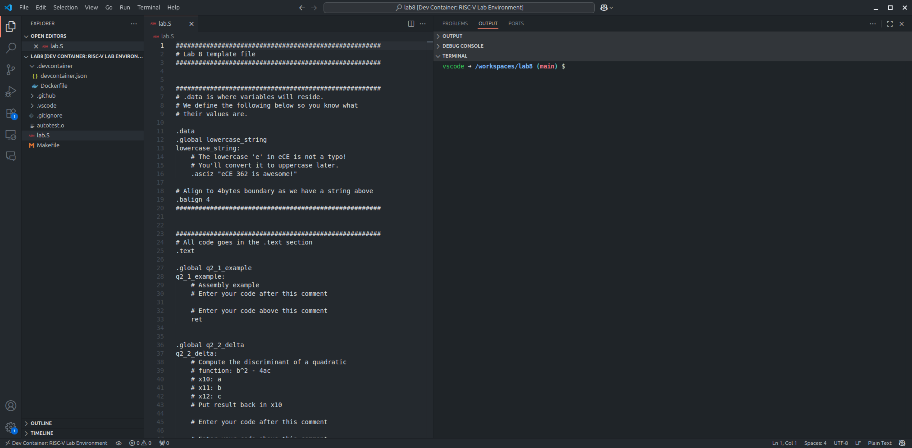
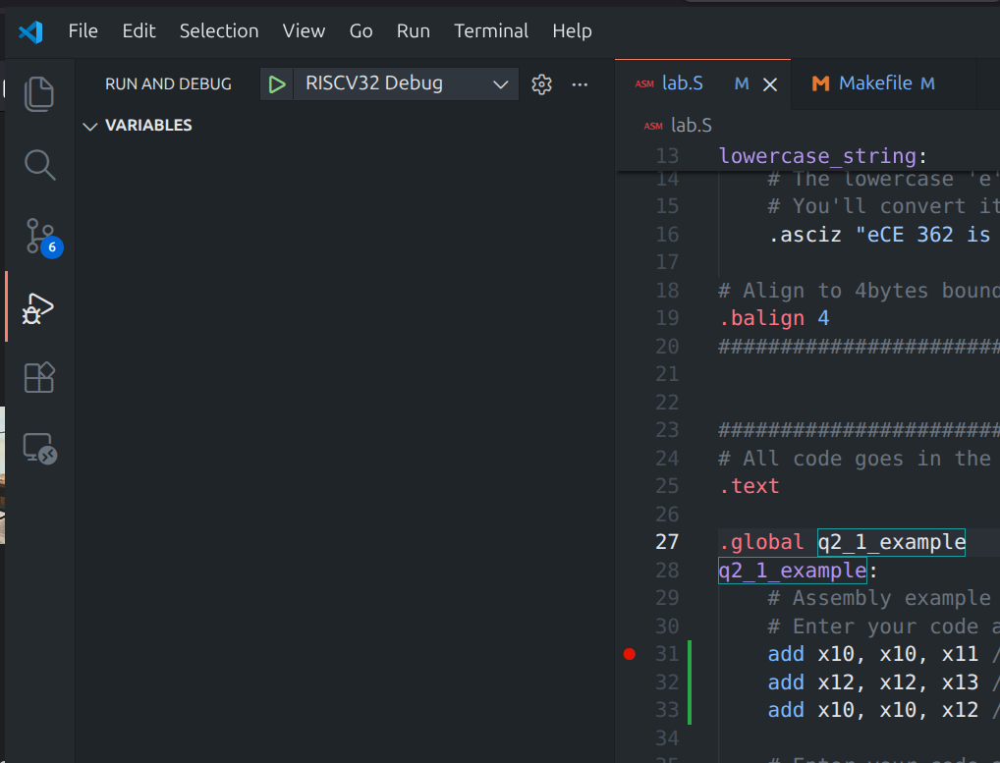
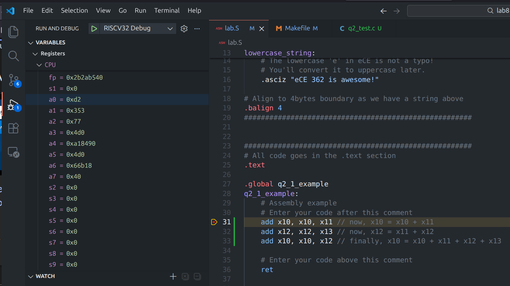

# Lab 8
## An Introduction to RISC-V Assembly

### Table of Contents
<br>

| Step | Description                           | Points |
|------|---------------------------------------|--------|
| 0    | Setting up Docker and VScode          |        |
| 1    | The flow from C to ASM                |        |
| 2    | Arithmetic Instructions               |        |
| 3    | Bitwise/logical Instructions          |        |
| 4    | Memory Instructions                   |        |
| &nbsp; | Total: | 100 |
<br>  
  
> [!NOTE]  
> The RISC-V labs will not have checkoffs.  The only requirement for your lab is that you submit your work to Gradescope before the end of your lab section.  

### Instructional Objectives

- To understand the basics of RISC-V assembly language and its instruction set.
- To learn how to translate C code into RISC-V assembly code.
- To gain hands-on experience with basic non-branching RISC-V assembly programming.

### Step 0.1: Set up your environment

For the assembly labs, we need to have compilers that can produce assembly and machine code specific to the RISC-V architecture.  This is fairly easy to obtain while you are on Linux or macOS (with some work on the latter), but to ensure that everyone has a consistent environment, we're going to have you use a Docker container to run the tools.

Docker is essentially a very stripped down version of a virtual machine, an application that allows you to run different operating systems within the active operating system.  Examples of such virtual machines are Windows Subsystem For Linux (WSL) which is how you run a Linux distribution within Windows, or third-party programs like VMware, Virtualbox, or Parallels for Mac.

In Spring 2026, we switched to Docker, away from the `eceprog` computing cluster, for the following reasons:
- Containerization is very common in modern software development.
- Given rising student enrollments, `eceprog` has often proved to be slow and often inaccessible at peak periods during the semester.  
- Docker allows you to run the compilers and other tools needed directly on your own machine.  This eliminates the need to rely on a remote server that could become inaccessible, and gives you more control over the tools.  
- The way we implemented the Docker infrastructure was done through VScode using a feature called **Dev Containers**.  This allows you to do the assembly labs in two ways:
    - You can clone the lab repository and open it in a Dev Container on your own machine.  This requires that you install Docker alongside VScode, but do not fret - you do not have to do much configuration beyond the initial install.  **This is the preferred method for you to do your RISC-V labs.**  Continue to Step 0.1.1.
    - OR, you can start a GitHub Codespace for your repository that lets you run VScode entirely within your browser, with the tools running on a cloud VM on GitHub servers.  While this offers the convenience of a one-click solution, it is prone to the same problems of latency and potential disconnection that using eceprog faces.  
        - GitHub Codespaces has a limit of 120 hours/month.  While we do not anticipate you hitting that limit, you should be aware that it may start charging you if you spend more than 120 hours in a codespace in a month.
        - If you choose to use GitHub Codespaces, you can skip Step 0.1.1 and go straight to Step 1, as the Codespace will already have the necessary tools installed for you.  When you accept the GitHub assignment, click the green Code button, click Codespaces, and click "Start codespace on main".

#### Step 0.1.1: Setting up Docker with VScode

> [!WARNING]
> Do not follow this step if you want to use GitHub Codespaces.  Go straight to Step 1.

Follow the official Docker installation guide for your operating system:
   - [Docker Desktop for Windows](https://docs.docker.com/desktop/install/windows-install/)
        - You will also need to have WSL installed for Docker to work with Linux containers.  Follow the instructions to install Ubuntu 24.04 WSL on your Windows computer: https://documentation.ubuntu.com/wsl/latest/howto/install-ubuntu-wsl2/
        - WSL is required because Linux containers on Windows still need an underlying Linux kernel to interface with Windows in order to run programs or interact with hardware.  It may also be possible to skip our container entirely by setting up the tools yourself by running the commands listed within the Dockerfile under the Linux instructions below.
   - [Docker Desktop for Mac](https://docs.docker.com/desktop/install/mac-install/)
   - [Docker Engine for Linux](https://docs.docker.com/engine/install/)
        - You don't necessarily have to use Docker for the labs while on Linux.  You can build and install the tools yourself by using the [Dockerfile](https://gist.github.com/norandomtechie/06a32cba6e762ae4e019fbfe793be324) we created to make the Docker image for this lab.  Just make sure to run the shell commands directly, and don't try to build it into a Docker image.

Once Docker (and WSL+Ubuntu if necessary) have been properly installed, accept the repository link on Piazza for lab 8, clone it to your own machine, and open it in VScode.

You should see a dialog asking you to open it in a Dev Container, but if you don't see it, press Ctrl-Shift-P, and type "Dev Containers: Reopen in Container". (Do NOT pick the option that says Rebuild!)

VScode will then refresh, download and set up the container, and you will be ready to start working on the lab.  Building the container can take a very long time, so give it a while.  If you have any issues with the container, ask course staff for help.

## Step 1: The flow from C to ASM

At this stage, whether you are working locally or using GitHub Codespaces, you should have this environment in front of you.  If so, continue. Otherwise, ask course staff for help.



> [!IMPORTANT]
> Before doing anything, we need to install an extension - this could not be done as part of the container setup.  In the terminal that says `vscode -> /workspaces/...`, run the following commands:
> ```bash
> code --install-extension ms-vscode.cpptools
> code --install-extension /opt/riscv/riscv-debug.vsix
> ```
> Once it's successfully installed, restart VScode by pressing Ctrl-Shift-P and typing "Reload Window".  This extension will allow us to debug RISC-V assembly code using VScode's default interface.

So, you might have written some programs in C or other languages like JavaScript or Python before (we *assume*), just like the one below:

```C
// HelloWorld.c
#include <stdio.h>

int main (int argc, char * argv[]) {
    printf("Hello World!");
    int x = 1 + 2;
    return 0;
}
```

With a click of button in an IDE or some terminal commands, *voila* - the program just **runs**.  But how does that happen?  

### 1.1 The Compilation

In order for a computer (a CPU) to execute a program written in a human-friendly language like C, we need to first translate it into machine code for the CPU to understand it.

Regular written programs are messy - they have comments, different spacing, special characters that may not affect execution, and are therefore infeasible for hardware to process.  Therefore, compilation can also be called the process of transforming this messy program into a strictly formatted list of instructions for the CPU to perform, step by step.  

That list of instructions will end up being machine code for a CPU to execute.  But there's a step in the middle where we can see the instructions for ourselves as **assembly language**.

Go back to the code sample we have above, copy it, create a new file in your lab folder called `HelloWorld.c`, and paste it in.  In a terminal, run the following:

```bash
riscv64-unknown-elf-gcc -S HelloWorld.c -o HelloWorld.S
```

And open the file `HelloWorld.S`.  You'll see roughly three sections.  The terms used are explained in the [RISC-V Assembly Language Manual](docs/riscv-asm.pdf).
- The top of the file, with different **attributes** above the `.text` line, is generated by the compiler to indicate what options were used to create the assembly code.  You can look up what the terms mean in the manual, but you won't need to write them yourself.
- Under `LC0`, the compiler has placed the string "Hello world", where it will be saved in a different part of memory to be eventually used by the program.
- Under `main` is the assembly code that corresponds to the `main` function in the C code.  

You may notice how there's quite a lot of lines for what seems like a simple program.  This is because each line of C code can translate to multiple lines of assembly code, as the compiler generates the necessary instructions for the CPU to execute.  A CPU only knows how to do things like add and subtract numbers, load and store data, and jump to a different part of a program.  It doesn't know that the effects of those operations are to print text to a console, open a file, or load a game!

You also might notice something interesting while trying to match the line of C code that adds 1 and 2 and assigns it to the variable `x`.  You won't see the numbers "1" or "2" in the assembly code under `main`, but you do see:

```asm
li a5,3
```

This is an example of a compiler optimization - if the compiler can determine the value of an expression at compile time, it can replace the entire expression with its value in the generated assembly code!  Nifty, right?

The assembly we have generated thus far is for a **64-bit RISC-V architecture**.  We didn't tell the compiler - which has `riscv64` in its name - to do otherwise, which is why it went for the default option.  We can also tell it produced 64-bit-specific assembly code by the presence of certain instructions - `sd`, which stands for Store Doubleword, an instruction that will store 64 bits of data into a location in memory.

However, we'll stick with a 32-bit architecture for the course, so let's tell the compiler to target a 32-bit RISC-V CPU.  We do that as follows:

```bash
riscv64-unknown-elf-gcc -march=rv32im -mabi=ilp32 -S HelloWorld.c -o HelloWorld.S
```

Notice how the `sd` instructions now disappear, and are replaced with `sw` instructions, which stands for Store Word, an instruction that will store 32 bits of data into a location in memory.  The "arch" attribute at the top of the file now says "rv32".

The key differences between saying 32-bits and 64-bits are the number of registers used, the sizes of the instructions, and most importantly, the size of the data that can be stored in memory.  It has its advantages and disadvantages - 64-bit architectures can handle more data and memory, but 32-bit architectures are more efficient for smaller programs.  

### 1.2 The Assembler

Now that we have the assembly code, we can turn it into machine code that the CPU can execute.  This is where the **assembler** comes in.  The assembler takes the assembly code and translates it into machine code, which is a binary representation of the instructions that the CPU can understand.

```bash
riscv64-unknown-elf-gcc -march=rv32im -mabi=ilp32 -c HelloWorld.c -o HelloWorld.o
```

This will produce an object file `HelloWorld.o`, which contains the machine code for our program.  However, this is not yet an executable file that we can run on a CPU.  It still needs to be linked with other necessary object files, such as those for the `printf` function and other standard library functions that we use in our program.  This is where the linker comes in.

You can see the same assembly within this object file if you run an object dump on this file:

```bash
riscv64-unknown-elf-objdump -D HelloWorld.o
```

We won't dive too much into it since you already saw most of it in the assembly file.  `objdump` just lets us convert the compiled machine code back into assembly for us to view.

### 1.3 The Linker

Now that we have the "list of instructions" for our CPU, we still need to turn it into machine code that the CPU can execute.  We also have function calls like `printf` within our own assembly for which we don't see the source code.  

This is where the **linker** comes in.  You may typically skip past this when you write regular programs, as you're very used to writing lines like `gcc HelloWorld.c -o HelloWorld` and just running the resulting executable `HelloWorld`.  However, it's really two lines:

```bash
# Compile the C code into an object file
riscv64-unknown-elf-gcc -march=rv32im -mabi=ilp32 -c HelloWorld.c -o HelloWorld.o

# Link the object file with other necessary object files into an executable, 
# along with object files for printf and other necessary functions
riscv64-unknown-elf-gcc -march=rv32im -mabi=ilp32 HelloWorld.o -o HelloWorld

# The resulting HelloWorld executable is now in machine code, and can be run on a RISC-V CPU
# But since we don't have a RISC-V CPU, we can run it on a RISC-V emulator like QEMU.
# (We don't explicitly have to invoke QEMU.)
./HelloWorld
```

> [!NOTE]
> *Wait, I thought you said I \*couldn't\* run RISC-V programs on my computer, but I just did! Explain yourself!*
> 
> Run `file HelloWorld`.  You'll see the following output:  
> 
> `HelloWorld: ELF 64-bit LSB executable, UCB RISC-V, RVC, double-float ABI, version 1 (SYSV), statically linked, not stripped`
> 
> This indicates that yes, you did just compile a RISC-V binary.  Yes, it did just execute, but no, it did not do so on your x86 processor.  It did so using the QEMU emulator we installed for you in this environment.  This is how you can run RISC-V binaries on your computer in the same manner as any x86-compiled program, but it is not running on your computer's hardware.

Now that you understand the process that goes into how C source code gets turned into an executable, we can dive a little further into the assembly code itself and understand what the instructions are doing.  This will be the focus of the rest of the lab.

```text
┌─────────────┐  Compiler   ┌──────────┐  Assembler  ┌─────────────┐
│ Source Code ├────────────►│ Assembly ├────────────►│ Object File │
└─────────────┘             └──────────┘             └──────┬──────┘
                                          Linker            │
                                 ┌──────────────────────────┘
                                 │
                          ┌──────▼───────┐
                          │  Executable  │
                          └──────────────┘
```

> [!IMPORTANT]
> Nothing to submit for this step.  Continue on to Step 2.

## Step 2: Arithmetic Instructions

At this point, you can clean out the HelloWorld files.  Open the `lab.S` file, which is a RISC-V assembly template which you'll fill out for this lab.  Get started with the example in 2.1 below.

### 2.1: Example

Fill in the subroutine body for `q2_1_example` with instructions that will set the value of `x10` to `x10 + x11 + x12 + x13`. For instance, if you set the values x10 through x13 like this:

<!-- ```asm
mov x0, #1
mov x1, #2
mov x2, #4
mov x3, #8 
``` -->  

```asm
li x10, 1
li x11, 2
li x12, 4
li x13, 8
```
You should expect that the x10 register will contain the value 15 when execution reaches the nop following the subroutine invocation. It does not matter what values are left in x11, x12, and x13 after the return from example. Remember to use only the registers x10 through x13 when you write your instructions.

#### Solution for the example

The operation cannot be implemented with a single instruction. You must compose multiple instructions to produce the result.

<!-- ```asm
.global q2_1_example
q2_1_example:
    /* Enter your code after this comment */
    
    add x1, x0, x1 // now, x1 = x0 + x1
    add x1, x1, x2 // now, x1 = x0 + x1 + x2
    add x1, x1, x3 // finally, x1 = x0 + x1 + x2 + x3
    mov x0, x1     // put the result into x0
    
    /* Enter your code above this comment */
    ret lr
``` -->

```asm
.global q2_1_example
q2_1_example:
    /* Enter your code after this comment */
    
    add x11, x10, x11 // now, x11 = x10 + x11
    add x11, x11, x12 // now, x11 = x10 + x11 + x12
    add x11, x11, x13 // finally, x11 = x10 + x11 + x12 + x13
    add x10, x11, 0 // Move the results to x10

    /* Enter your code above this comment */
    ret
```

You should copy this into the example subroutine in the file, and trace through the execution with the debugger to make sure you understand how it works.

#### Another solution for the example

There are usually many ways to write the same high-level operation in assembly language. The fewer instructions you can use, the faster the code will run to completion. Here is another solution for the previous problem that has fewer instructions:

<!-- ```asm
.global q2_1_example
q2_1_example:
    /* Enter your code after this comment */
    
    add x0, x0, x1 // now, x0 = x0 + x1
    add x2, x2, x3 // now, x2 = x2 + x3
    add x0, x0, x2 // finally, x0 = (x0 + x1) + (x2 + x3)

    /* Enter your code above this comment */
    ret lr
``` -->

```asm
.global q2_1_example
q2_1_example:
    /* Enter your code after this comment */
    
    add x10, x10, x11 // now, x10 = x10 + x11
    add x12, x12, x13 // now, x12 = x11 + x12
    add x10, x10, x12 // finally, x10 = x10 + x11 + x12 + x13

    /* Enter your code above this comment */
    ret
```

Since some registers are reused, it may be a little more difficult to understand.  You should study it to discover how it works. For this lab's exercises, it does not matter how slowly your solution works (within reason).  What does matter is that no registers other than x10, x11, x12, or x13 are
modified by the code.

> [!Note]
> For the purpose of this lab we refer to the registers with their x name. You can write your solution using the ABI names of the registers as well. To get the ABI names, see page 137, Table 25.1 in the reference manual.  
> 
> TL:DR; x10 - x17 maps to a0-a7.

#### How do I run this code?

Simply type `make` in the terminal to run the function against tests!  It will simply report if you passed or failed the test corresponding to this step.

In order to test your function with your own arguments, you will need to write your own wrapper.  Here is a one specific to the `q2_1_example` function, to be saved as `q2_test.c`:

```c
#include <stdio.h>

// Since the function takes four arguments (x10, x11, x12, x13), 
// and will return an integer in x10, we can define the function 
// prototype as follows.
int q2_1_example(int a, int b, int c, int d);

int main() {
    int a = 1;
    int b = 2;
    int c = 4;
    int d = 8;

    // Calls your function here.
    q2_1_example(a, b, c, d);

    // The result of the function will be in register x10, which is also the return value of the function.
    // So we can capture it by assigning the function call to a variable.
    int result = q2_1_example(a, b, c, d);

    printf("The result is: %d\n", result);
    return 0;
}
```

Then, you can compile and run this wrapper with the following commands:

```bash
riscv64-unknown-elf-gcc -march=rv32im -mabi=ilp32 q2_test.c lab.S -o q2_test
./q2_test
```

For each function to test, you can write a similar wrapper that calls the function with the appropriate number of arguments.  Just make sure to compile it with the assembly file so that it can link to your function, and that you provide the correct function definition before `main`.

#### How do I debug this code?

You can set breakpoints in the assembly code and step through it to see how the values in the registers change with each instruction.  This will help you understand how the instructions are working together to produce the final result.

Set a breakpoint at the first line of the assembly code for `q2_1_example`, and start the debugger by pressing F5, or clicking the Debug menu and then the "Play" button.



If you get errors saying "Configured debug type `cppdbg` is not supported", make sure you have installed the `cppdbg` and `riscv-debug` extensions as described in Step 0.1.1.  The command is as follows:

```bash
code --install-extension ms-vscode.cpptools
code --install-extension /opt/riscv/riscv-debug.vsix
``` 

And make sure to reload VScode after installing the extension by pressing Ctrl-Shift-P and typing "Reload Window".  This extension will allow you to debug RISC-V assembly code using VScode's default interface.

You should be able to inspect the CPU registers by expanding the Variables > Registers > CPU section in the Debug view.  You'll see the values of each register in hex.



Use this to confirm that values are changing as you expect, instruction by instruction.  If you want to run it with some custom code of yours, you'll have to edit the Makefile a little bit (but be careful not to override the provided Makefile code that runs the tests!).  You could add a new target for your custom code, and run it with `make <target-name>`.  Edit the `launch.json` in `.vscode` to add a second target that will run the debugger with your custom code.

### 2.2 Calculating the discriminant of a quadratic equation

Your turn, going forward!

For a quadratic equation $ax^2 + bx + c = 0$, its discriminant, commonly represented by the Greek symbol Delta, determines if the equation has any real roots:

$$
\begin{align*}
  \Delta &= b^2-4ac
\end{align*}
$$

If $\Delta = 0$, the equation has two identical real roots; if $\Delta > 0$, two distinct real roots exist; if $\Delta < 0$, no real roots exist.

Write the assembly function `q2_2_delta` to compute the discrminiant of a quadratic equation with the coefficents given in registers `x10-x12`.  You will need to put the final result back in `x10` when the function return.  Specifically, the coefficients and registers mapping is:

```C
// For the equation ax^2 + bx + c = 0
a: reg x10/a0
b: reg x11/a1
c: reg x12/a2

// Final result need to be put in register x10/a0 
delta: reg x10/a0
```

After completing the problem, you could build and run the `lab` executable. The autograder will grade your function by compared its result with the C equivalent function on random inputs.

> [!TIP]
> You might find the instructions `sub`, `li`, `mul` to be useful. A reference manual to the RISCV32 can be found [here](https://riscv.org/technical/specifications/). Use the unprivileged version of the manual. 
> 
> For a quicker reference, you can check out the [RISC-V Reference Card](RISCVGreenCardv8.pdf). 

### 2.3 Calculating the dot product of two 2-D vectors

For two vectors in $\mathbb{R}^2$ space, $\vec{A} = (a_1, a_2)$ and $\vec{B} = (b_1, b_2)$, the dot product between them is commonly defined as:

$$
\begin{align*}
  \vec{A} \cdot \vec{B} = a_1b_1 + a_2b_2 
\end{align*}
$$

In this problem, you will fill up the assembly function `q2_3_dot_product` to compute the dot product of two 2D integer vectors with their components specified in registers `x10-x13`. Similar to previous problem, you will need to put the result back in `x10` when the function return. The mapping of the arguments and registers mapping is:

```C
// For two vector A, B
// A = (a1, a2)
// B = (b1, b2)
a1: reg x10
a2: reg x11
b1: reg x12
b2: reg x13

// Final result
a1b1 + a2b2: reg x10
```

After completing the problem, you could build and run the lab1 executable. The autograder will grade your function by compared its result with the C equivalent function on random inputs.

> [!NOTE]
> You might find the instructions `add` and `mul` to be useful. 

> [!IMPORTANT]
> Run `make` to ensure you are passing the requisite tests.  Commit and push to your GitHub repository.

## Step 3: Assembly instruction: bit-wise/logical

In this section, we will use some of the logical/bit-wise instructions of RISC-V ISA and write some code with them.

### 3.1 Taking one byte from a 32-bit word

Often in embedded programming, you will need to extract one byte from a word and perform some operations on it.
In this problem, you will need to extract the MSB (most significant byte, the byte to the leftmost)
and the LSB (least significant byte, the byte at the rightmost position) of a **32-bit** word.
There are two functions you will need to implement: `q3_1_MSB` amd `q3_1_LSB`.
Both functions will be passed in with the word in register `x10`, and you will put the result back in `x10`.

For example: Suppose the given word is `0x11223344AABBCCDD`, its MSB will be `0x11` and its LSB will be `0xDD`.

> [!Note]
> Be careful to remember that the B in LSB and MSB is **byte**, not bit!
> 
> Hint: You will need to use logical shift operation and bit-wise AND operation to extract one byte from a 32-bit word. You might find the instructions `srli` and `and` useful. Also, you might also want to consider loading a register with value `0xFF`.

### 3.2 Turning a flag on/off

In embedded programming, usually you will need to configure the peripherals associated with the microcontroller. For instance, you might need to enable certain pins on the development board or configure the clock frequency of the CPU. A typical way to enable or disable them is by setting or resetting certain bits in control registers, which can hold a 32-bit or 64-bit value, with each bit corresponding to a different function. You can imagine each bit as a tiny switch to control one part of the microcontroller.

Another common name for these individual bits (tiny switches) is *flag*, which is a value with only one bit set to 1 and the rest to 0, like `0x1000000` or `0b0001 0000 0000 0000`.  

Keep in mind that the flag is not the actual bit position that you need to shift to - it is the already-shifted value.  Therefore, if you needed to turn on bit 17 in a specific control register, the flag value given to you will be `1 << 17`.

In this problem, you will implement 3 functions to:

1. Set the bit of a value `x10` corresponding to a flag `x11` to `1` (function `q3_2_flag_set`)
2. Set the bit of a value `x10` corresponding to a flag `x11` to `0` (function `q3_2_flag_reset`)
3. Toggle the bit of a value `x10` corresponding to a flag `x11` (function `q3_2_flag_toggle`)

For all three of them, the value will be passed in `x10` and the flag will be passed in `x11`. You will again save the modified value to `x10`.

> Hint: Instruction `or`,`xor`, `xori`, and `and` might come in handy. Also note that there is no special instruction for inversion in RISC-V. The developer made the decision to use xori with 0xFFFFFFFF to get the inverse instead in order to keep with the three-operand format of the instructions.

### 3.3 Swapping the LSB and MSB of a 32-bit word

> [!Note]
> You could reuse what you have in section 3.1 to extract LSB and MSB.

In this problem you will implement the function `q3_3_swap_byte` that swaps the LSB and MSB of a 32-bit word passed in from `x10` and stores the swapped word in `x10`.

You should only swap the LSB and MSB and leave the rest of the bytes intact.

> [!TIP]
> `slli` shifts to the left and `srli` shifts to the right, and both will pad the corresponding side with zeroes.  You also might want to review what you have done for [*3.2 Turning a flag on/off*](#32-turning-a-flag-onoff).

> [!IMPORTANT]
> Run `make` to ensure you are passing the requisite tests.  Commit and push to your GitHub repository.

## Step 4: Assembly instruction: memory

So far, you have only been manipulating the register values. However, as you might already know, there are simply not enough registers to hold all the variables within a program. This is where memory steps in.

With memory, we could store the values in our registers to memory and leave space to perform other calculations. When we are done, we could just loaded the values back from memory and continue doing our work. You can think of memory as a gigantic hash table or array with `address` as the key or index:

```C
// Pseudo-code for memory store and load

// Storing to memory, or writing
Mem[addr] = variable

// Loading from memory, or reading
variable = Mem[addr]
```

In this section, we will work with memory instructions to perform some simple stores and loads, but first, we will have a crash course on assembly directives that helps programs know where a variable is in memory and what size does it has.

### 4.0 Crash course on assembly directives

In this lab, you will only work with the `.global` and `.asciz` directives. You can safely ignore the others.

1. `.global SYMBOL`: make the symbol `SYMBOL` visible to other object files during linking, which could either be a variable or a function.
2. `.asciz`/`.string "SOME_STRING"`: specify a null-terminating C-string
   1. Null-terminating means that the assembler will append a `\0` char to the end of the string.
  
From a high-level point of view, these directives provide some meta-info beyond the actual instructions that both the assembler and linker can utilize to generate the executable.

### 4.1 Uppercase formatter
In this problem, you will implement the assembly function `q4_1_toupper` that will take in an address of a lowercase letter and save its uppercase form to the same address like the C program below:

```C
// Assume we have this function implemented
void toupper(char *c) {...}

char chr = 'a';
char *string = "hello";

toupper(&chr);
toupper(string);

// After the above function calls, we will have
  chr = 'A'
  string = "Hello"
```

The address will be passed in register `x10`, you will need to read the value at the address in `x10`, modify it, and then store back to the same address.

In addition, the autograder will use your function to modify the string at label `lowercase_string` and print it out! You could also change the string to whatever you like and observe the effect (autograder won't use this string for grading).

> [!Note]
> You can safely assume that the character at the address passed in will always be lowercase.   
> 
> Hint #1: You would want to look at instructions `lb`, `li`, `sub` and `sb` for this task.  
> 
> Hint #2: Check out the ASCII table (try `man ascii` on a Linux or Mac terminal) and find the relation between lowercase and uppercase letter!

### 4.2 Swapping two integers

> Swap: <br>
> &nbsp;&nbsp;&nbsp;&nbsp;&nbsp;&nbsp;take part in an exchange of <br>
> &nbsp;&nbsp;&nbsp;&nbsp;&nbsp;&nbsp;-- from Oxford dictionary

In this section, you will implement the assembly function `q4_2_swap` that will take two 32-bit integers addresses and swap the content, similar to the C program below:

```C
void swap(int32_t *a, int32_t *b) {...}

int32_t x = 362;
int32_t y = 270;

swap(&x, &y);

// After the above function call
x = 270
y = 362
```

The two addresses will be passed in register `x10` and `x11` respectively.

### 4.3 String cutter

> Sometimes, strings are just too long.

In this problem, you will implement the assembly function `q4_3_cutter` that will take two arguments, a C character string starting address and a cut position, passed in from `x10` and `x11`. The function will be similar to the C program below:

```C
void cutter(char * str, uint32_t pos) {
  *(str + pos) = '\0'
}

char string[50] = "Hello World!";
cutter(string, 5);
printf(string);

// After the above function call, printf will print
// 'Hello' instead of 'Hello World!' to the console
// since the bit at position 5 gets replaced with the 
// null character '\0'.
```

> Hint: You do not need to load the string.

### 4.4 Endianness: which side are you with?

> From *Gulliver's Travels* by **Jonathan Swift**
> 
> It is allowed on all hands, that the primitive way of breaking eggs before we eat them, was upon the larger end: but his present Majesty's grandfather, while he was a boy, going to eat an egg, and breaking it according to the ancient practice, happened to cut one of his fingers. Whereupon the Emperor his father published an edict, commanding all his subjects, upon great penalties, to break the smaller end of their eggs.
>
> [Reference](https://www.ling.upenn.edu/courses/Spring_2003/ling538/Lecnotes/ADfn1.htm)

Although there is not a physical egg within a computer, we did find a way to start a "war" on which end should we break the egg: the Big-Endian or the Little-Endian.

Before we actually explain these two vague terms, let's consider how does a computer store a 32-bit integer inside memory. 

We all know that (or know by now) that modern computer store data at byte (8 bits) granularity inside memory.  However, for a 32-bit integer like `0x11223344`, it has `4` bytes, in what order should we store it?  There are `4! = 24` ways to do so, and we could just store it randomly.  But to make our lives easier, and to make the computer's life easier, we should probably store them in consecutive order starting at a memory address.

Therefore, we store one byte at address `x`, and then store the next byte in order at `x + 1`, and continue until we finish all `4` bytes.  However, there exist two ways to do this - we store the MSB first, or the LSB first.

|address  |   `x`  | `x + 1` | `x + 2` | `x + 3` |
|:--      |  :--:  |  :--:   |  :--:   |  :--:   |
|LSB first| `0x44` | `0x33`  | `0x22`  | `0x11`  |
|MSB first| `0x11` | `0x22`  | `0x33`  | `0x44`  |

> [!Note]
> MSB refers to most significant byte and LSB refers to least significant byte, check [3.1](#31-taking-one-byte-from-a-32-bit-word) for more explanation on them.

If we store the MSB first, it is Big-Endian; if we store the LSB first, it is Little-Endian.

<!-- Now back to `section 4.1`, using `ldr` instead of `ldrb` will work is because when we read using `ldr`, it will load 8 bytes (or 4, depends on whether you use `xn` or `wn`) to the register. Since the architecture we use is `ARMv8-A`, which is Little-Endian by default, the LSB of the register will hold the character at the memory address, which is the one we want to modify. If you convert the lower case character to upper case by modifying it at the bottom 8 bits of the register, you will see that `ldr` and `str` will work. -->

In this part you will need to implement the function `q4_4_cvt_endian` that will take in a 32-bit integer and reverse its endianness. That is, if it is little-endian, we want it to be big-endian, and vice-versa.

Again like the previous problem, the integer will be passed by reference with its address passed in register `x10`. You will have to store the reversed endianness integer back the same address.

> [!TIP]
> You might find yourself copy pasting a lot, which is normal, as we won't cover loops until next lab. 

> [!IMPORTANT]
> Run `make` to ensure you are passing the requisite tests.  Commit and push to your GitHub repository.
> 
> There are no checkoffs for RISC-V labs, but the lab code is still due by the end of the lab session.  Make sure to commit and push your code to your GitHub repository and submit it to Gradescope before the end of the lab session.

<hr>

*The following tidbit is more relevant to computer architecture if you're curious.*

It may seem tedious to do this step without loops, but implementing a function like this is actually a common compiler optimization called [loop-unrolling](https://en.wikipedia.org/wiki/Loop_unrolling) that is actually faster compared to a loop.  

Loops are typically implemented with instructions called **branches**.  These are instructions that tell the CPU to jump to a different part of the program, either with no conditions, or based on the result of a condition (branch-if-equal, branch-if-less-than, etc.).

Modern CPUs are implemented with a component called **branch predictors**.  These try to predict the next instruction to execute when it arrives at the beginning of an if/else structure, marked by a **branch** instruction.  The CPU may start loading the instructions at the part of the program indicated by the predictor, even while the branch/compare instruction itself is being executed.  

With a correct prediction, a CPU can execute instructions much faster than if it had to wait on the result of the branch instruction.  

However, if the prediction is wrong, the CPU will have to "flush its pipeline" of instructions and start over.  This is called a branch mispredict, and can reduce the efficiency of a program.  Loop unrolling reduces the number of branches and therefore reduces the number of branch mispredictions.  This is why compilers will often unroll loops for you if the limits of the loop are known at compile-time.