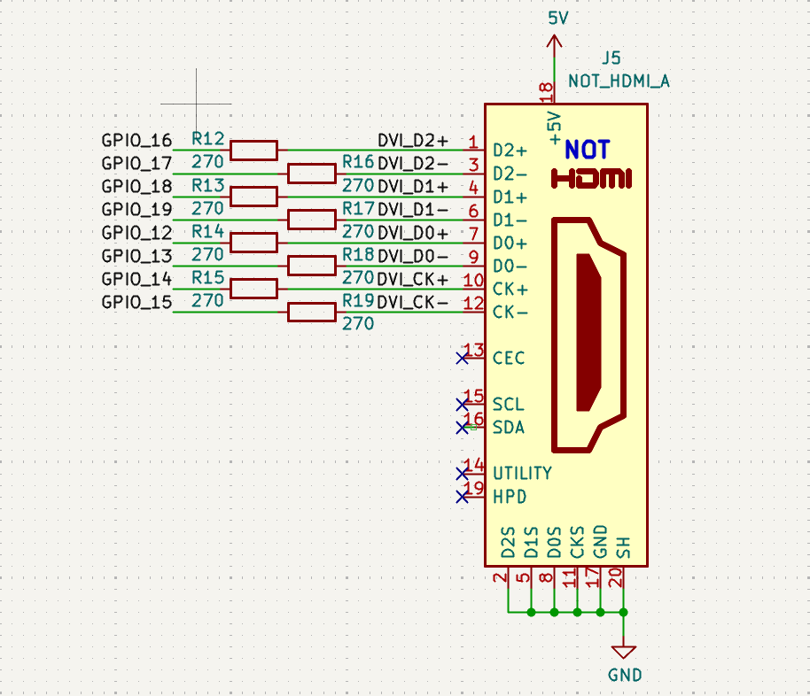

# High-Speed Serial Transmit (HSTX)

> Written by **Nandan Uppalapati**
> Spring 2026

Your Proton board features a lot of unexplored potential that we'll explore with these "project guides".

High-Speed Serial Transmit (HSTX) is a powerful output-only peripheral that can be used to generate high-speed serial signals for applications like video output.  This guide goes over how to put out an image to an HDMI/DVI display using HSTX.  See Section 12.11 of the RP2350 datasheet for more details.

This [ZIP file](hstx.zip) provides the firmware and asset generation required to output a 640x480 DVI video signal using the RP2350's HSTX peripheral on the custom Proton board. 

The project guide below, and the codebase above, was written by **Nandan Uppalapati**.  Nandan was a UTA in Spring 2026 semester.

---

## Table of Contents
- [Proton Board HSTX DVI Driver](#proton-board-hstx-dvi-driver)
  - [Table of Contents](#table-of-contents)
  - [Prerequisites](#prerequisites)
  - [Step 1: Asset Generation](#step-1-asset-generation)
  - [Step 2: Code Confirmation](#step-2-code-confirmation)
  - [Step 3: Build \& Flash](#step-3-build--flash)

---

## Prerequisites
1. **Python Environment:** Python 3.10+ is required for the image conversion pipeline. If you do not have Python installed on your machine, install it using your respective package manager:
   * **Windows:** `winget install Python.Python.3.11`
   * **Linux (Debian/Ubuntu):** `sudo apt update && sudo apt install python3 python3-pip`
   * **macOS:** `brew install python`

   Once Python is installed, install the required Pillow library:
   ```bash
   pip install Pillow
   ```
   
2. **Hardware Display Target:** The timing macros in include/hstx.h are hardcoded for standard 640x480 VESA timings. Changing the resolution requires updating the Front Porch, Back Porch, and Sync Width parameters.

3. **Wiring**: The wiring diagram for the HDMI Breakout Board is provided below. The rest of the Proton Board such as power and debug probe connections are the defaults used in lab.
   

## Step 1: Asset Generation

The HSTX DMA requires pixel data formatted as a flat 1D array in RGB332 format. The included img_to_array.py script automates this conversion, handling letterboxing and C-header generation.

* Place your target image (PNG/JPG) into `assets/raw_images/*`

* Run the conversion script from the project root:
`python3 tools/img_to_array.py assets/raw_images/hstx_test.png 640 480 assets`

    Verify that `hstx_test.h` has been generated in the `assets/*` directory.

> [!Note]
> If no resolution arguments are passed, the script defaults to 640x480.

## Step 2: Code Confirmation

The DMA and HSTX subsystems are fully configured in `src/main.c`. To change the active display image, you only need to update the asset definitions.

* Open `src/main.c`.
* Locate the Asset Configuration block near the top of the file.
* Update the include path and the framebuf macro to match the C variable name generated by your Python script.

```bash
// [ ASSET CONFIGURATION ] 
// Update this block to swap the active image on the display.
#include "../assets/hstx_test.h
#define framebuf hstx_test
```

## Step 3: Build & Flash

* After running the following Python command:
    `python3 tools/img_to_array.py assets/raw_images/hstx_test.png 640 480 assets`
* Upload & Monitor as usual.

### How to expand on this

Video output is just a matter of changing the framebuffer to a new frame, but you may find yourself capped to a low frame rate.  Explore optimizations to the image conversion pipeline, or consider writing a custom asset generator that produces delta frames instead of full frames (so you're processing less data to update fewer pixels).  You can also experiment with different resolutions and timings by modifying the hstx.h timing macros and the image conversion script.

This project heavily derived from the [Pico SDK example](https://github.com/raspberrypi/pico-examples/blob/master/hstx/dvi_out_hstx_encoder/dvi_out_hstx_encoder.c) that shows how to implement the DVI/HDMI output, so you may want to see other examples in that folder for more ideas on how to use the HSTX peripheral.  The RP2350 datasheet also has more details on the HSTX peripheral and its capabilities.
