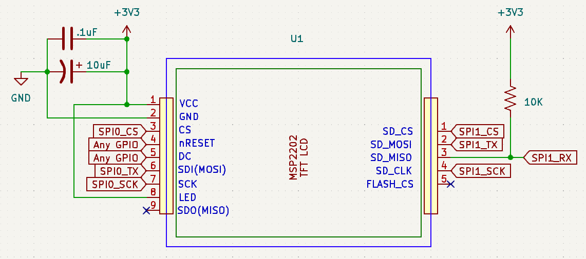

# A Guide To The MSP2202 TFT LCD Display

Your lab kit contains a variety of components intended to *supercharge* your project ideas.  We create these guides to examine these components in detail, and give you supporting code to help you get started.  

Unlike the lab experiments, the code for these will be given to you as a ZIP file, within the same folder as this README file.  We'll also give you some supporting knowledge and helper scripts that you may find useful in creating your own content to be used with these devices.

## The MSP2202 TFT LCD Display

The TFT LCD in your kit is actually a combination of two devices - the TFT LCD itself, and an SD card reader.  In this document, we'll only focus on the TFT LCD.

The TFT LCD is best used as a unidirection SPI device like the LCD/OLED character display you used previously.  Data will only be sent to it. There is a complex initialization procedure, provided for you, that must be used before the display will be useful. A code library is also provided for you that can be used to draw objects and pictures on the display. Once it is initialized, and subroutines are set up to send SPI data to it, along with helper functions to draw pixels, lines, shapes and even entire pictures, the TFT LCD is easy to use.

You may wonder how we're going to display pictures with such little RAM (520 KB) on the RP2350.  Putting aside the fact that we could make use of the external RAM feature, we'll explore techniques you can employ to store a lot of data at once on your Proton board, making it easier to display pictures and other graphics on the TFT LCD (potentially for games).

### Wiring up the display

Obtain a set of 10 male-to-female ended wires (also called Dupont wires) that you can use to connect the LCD directly to the Proton board headers, saving pin space for the oscilloscope probes if you need them.  (See why we have double-sided headers?)  You can get them from the lab if you ask a TA, or from the ECE shop.

Wire the TFT LCD as shown below. Note that, although the SD card's SPI interface is separate from the SPI interface for the LCD, it is still powered by the VDD and VSS pins for the display. There are five pins on the SD card SPI interface, but pin 5 is for an on-board SPI Flash memory chip (which is not populated). Pin 5 is not used.

If you're not using the SD card interface, you can ignore the pins on the right hand side of the display.

Be sure to put the capacitors as close as possible to the power and ground pins of the TFT LCD assembly - these are called **decoupling capacitors**.  The 10 uF one ensures that enough current is immediately available when the TFT LCD first powers on, and the 0.1uF smooths out disturbances in the power supply.  Placing it closer to the power supply minimizes their time constant, ensuring they charge up quickly when the display is powered on.

If you are unable to get the TFT LCD initialization routine to work, consider using an external power supply to verify if it's a power issue from your Proton board.  The TFT LCD can draw a lot of current, especially when the backlight is on.

Choose the GPIO pins on the Proton board that you will use for your TFT LCD SPI interface carefully.  The CS, TX and SCK pins should all belong to the same SPI interface.  The nRESET and DC pins can technically be any GPIO pin, but keep them close to the SPI pins if possible.  

### Using the TFT LCD

If you haven't already, download [this ZIP file](lcd.zip) and extract it to a folder of your choosing, preferably one that is easy to find.  The ZIP file contains a PlatformIO project with all the files you need.  We'll go through what you need to do to get started quickly:

#### Drawing a simulation 

The first thing you want to do in this file is define the GPIO pins you will use with your TFT LCD.  You must ensure that:

- The SPI pins you use do not conflict with anything else you've connected so far, or GP21/GP26, which have debouncing circuitry for the pushbuttons on your board.  That circuitry would significantly limit your effective speed/baudrate for the TFT LCD.  The highest SPI speed we were able to squeeze out of the board to communicate with the LCD display was 100 MHz, but you'll try lower rates first to ensure it works at the default speeds.

- The CS, TX and SCK pins are all part of the same SPI interface.  The nRESET and DC pins can be any GPIO pin, but should be close to the SPI pins if possible.

You will have to set the GPIO pins associated with SPI, CS, DC and nRESET in `main.c`.  In `lcd.c`, you need to set the SPI peripheral you are using (SPI0 or SPI1), and the CS, DC and nRESET pins you will use.

Once you set pin definitions in both files, fill out the `init_spi_lcd` function to do the following:
- Set the GPIO pins associated with CS, DC, nRESET to output mode.
- Set the CS pin high (inactive).
- Set the nRESET pin high (inactive).
- Set the DC pin low (command mode).
- Configure the SPI peripheral you are using (SPI0 or SPI1) to use the GPIO pins you defined, set the baudrate to 12 MHz and the data size to 8 bits.

Upload and monitor, and you should see the TFT LCD initialize and display a simulation of the [three-body problem](https://en.wikipedia.org/wiki/Three-body_problem)!  If it doesn't, check your wiring and pin definitions.

https://github.com/user-attachments/assets/797cb4c4-0b1c-419d-ace3-683e4e8fa5f2

#### Displaying a series of images like a GIF

If the simulation works similar to the video above, great job!  We have an additional surprise for you that you can easily run by uncommenting the line `// #define ANIMATION` at the top of the `main.c` file.  

In this part of your code, we'll load images, frame by frame, into a struct that will be parsed by the function `LCD_DrawPicture` to display them on the TFT LCD.  The images are stored in a C array called `mystery_frames`, which is defined in `lcd.c`.  Each frame is a 240x240 pixel image, and the array contains multiple frames that can be displayed in sequence to create an animation effect.  

You should not have to make more changes beyond uncommenting the `#define ANIMATION` line - try uploading your code and watching the TFT LCD display, which should display a very familiar GIF!

### An explanation of the code

The TFT LCD is programmed using a library provided for you in the `lcd.h/lcd.c` files.  The initialization sequence is based on the datasheet for the ILI9341 controller used in the TFT LCD, for which you can find the datasheet [here]()

Once `init_lcd_spi` gets called, the GPIO pins will be configured for use by the TFT LCD library provided.  The function `LCD_Setup` proceeds to reset the display, and send a series of commands to configure it for use.  

We then clear the display with `LCD_Clear`, and from that point on, you can write whatever code you like to interact with the display, and color specific pixels or draw entire shapes, lines, text and as you noticed above, pictures.

Here is a full list of the functions available to you via the `lcd.c` library:

- `LCD_DrawPoint`
- `LCD_DrawLine`
- `LCD_DrawRectangle`
- `LCD_DrawFillRectangle`
- `LCD_Circle`
- `LCD_DrawTriangle`
- `LCD_DrawFillTriangle`
- `LCD_DrawChar`
- `LCD_DrawString`
- `LCD_DrawPicture`

Always consider that updating less pixels overall can make your display feel much more responsive.  Redrawing images and pictures is an expensive process, and the display's refresh rate from showing the animation we provided above is only about 15 FPS.

For games where you have a few moving objects, such as "sprites", the `LCD_DrawPicture` function can be used to draw a picture at a specific location on the display.  If the sprite is small enough, the refresh rate will be fast enough to make it feel responsive.  If you have a lot of sprites, you may want to consider using a technique called "double buffering", where you draw the next frame in memory, and then copy it to the display all at once, instead of drawing each sprite one by one.

Here are two past projects that have implemented graphically demanding games on the TFT LCD display (and the bugs they encountered):

https://github.com/user-attachments/assets/1c4d4f3d-abbb-4efb-a75c-61940df41fba

https://github.com/user-attachments/assets/49f374b1-18e7-4351-a4ce-57cae8506bc2

Good luck with your project, and we hope you enjoy using the TFT LCD display!  If you have any questions, feel free to ask a TA or your lab coordinator.
