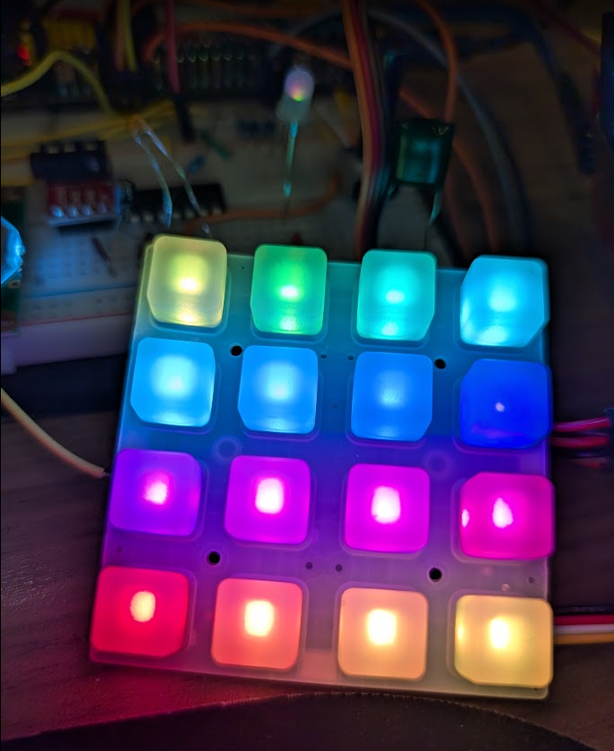

# AdaFruit NeoTrellis
## Reverse-engineering a device and creating your own API

Your Proton board features a lot of unexplored potential that we'll explore with these "project guides".  In this guide, we'll make use of the NeoTrellis board from Adafruit, which is a 4x4 grid of RGB LEDs with a capacitive touch sensor on each tile.

The NeoTrellis is one of those very complex devices that doesn't have very clear documentation on how you can use it, so the purpose of this guide is to showcase how you can reverse-engineer the device and create your own API to use it.  

The main reason that you might want to do this is if the existing libraries (particularly the Adafruit library) cannot be directly used for the Proton board with PlatformIO support without Arduino support, which we haven't covered, and which would make it far more difficult to debug.

The NeoTrellis PCB we'll suggest using makes use of **I2C** with an additional **INT**errupt pin that can be used to signal when a button has been pressed.  

## Getting Started

You can obtain a NeoTrellis board from Adafruit's [website](https://www.adafruit.com/product/3954), or from [Digikey](https://www.digikey.com/en/products/detail/adafruit-industries-llc/3954/9658070) if it's out of stock on the former.  You want to obtain the "Adafruit NeoTrellis RGB Driver PCB for 4x4 Keypad".  You may also want to obtain the suggested accessories to make it easier to press and hold buttons:

Button Membrane: https://www.adafruit.com/product/1611
Enclosure Kit (can also be 3D printed if you have a 3D printer): https://www.adafruit.com/product/4339

*NeoTrellis PCB from Adafruit's website:*

The NeoTrellis hardware is based on a chip called the **Adafruit seesaw**, which is its own special microcontroller that implements the I2C protocol and provides an API for controlling the keypad and the NeoPixel LEDs that make up the Neotrellis.  Keep the datasheet, containing descriptions of the registers that it has, handy: https://cdn-learn.adafruit.com/downloads/pdf/adafruit-seesaw-atsamd09-breakout.pdf

## Finding A "Known Good Configuration"

Debugging and reverse-engineering both rely on the concept of finding the "known good configuration".  The intended use case of the NeoTrellis - and all Adafruit devices - is to use an Arduino board with the Adafruit libraries.  This is a good starting point to see how the device works, and to get a feel for how it should behave.

In writing this guide, we used an Arduino Nano board with the SCL, SDA, 3.3V and GND wires connected to the NeoTrellis board via its Grove connector.  

We start from Adafruit's documentation for the NeoTrellis here: https://learn.adafruit.com/adafruit-neotrellis.  We ran the provided code in both the Arduino IDE and PlatformIO by creating a new project for the Nano board, and using the example under "adafruit seesaw > neotrellis > basic OR interrupt" in the Arduino IDE.

We ran this code and confirmed that the NeoTrellis board was working as expected, which tells us two things:

- The NeoTrellis board, the **hardware**, is working correctly.
    - If it doesn't work, you might have hardware issues, such as a bad board, a bad connection, or a bad solder joint (if you're using the outer pins, like the interrupt pins).
- The Adafruit library is working correctly, which means that the **software** that implements the **I2C** communication is working correctly.
    - If it doesn't work and it seems like a software issue, you might need to check the library versions, the code for any mistakes, or the PlatformIO configuration.

Either way, if you already have issues at this point, talk with your instructor and/or other teams who are also using the NeoTrellis to confirm if it's a software issue or if your board just isn't working.

## Reverse-Engineering The NeoTrellis

Once we have a known good configuration, we need to figure out what code is needed to make the NeoTrellis work on our own.  We can't use the Adafruit library directly in our project, but what we can do is figure out what the library does at the lowest level, because that is what we need to implement in our own code.

Arduino code is very abstracted, and you won't be able to see the source code for the functions they use in that example code.  You can look it up on their [GitHub](https://github.com/adafruit/Adafruit_Seesaw/blob/master/Adafruit_NeoTrellis.cpp), however.

We're lucky to have the source code available, but for some devices, it may not be available.  What you might want to consider doing is obtaining an Analog Discovery 2 or some other device capable of capturing I2C communication, and using that to listen on the SDA/SCL wires to record what the Arduino and the device you're using are "saying".  You can then reproduce those same commands from your Proton board and see if the board responds as expected.

As you go through the source code, and/or record the protocol communication, identify the commands being sent to the NeoTrellis board and what function they perform.  Specifically for this board, you want to identify sets of commands that do things like:

- How to initialize the board, which may be some kind of "software reset" command.
- How to select an LED, to turn it on or off with a specific color, and what brightness to set it at.
- How to read the state of a button, which may be a "read" command that returns the state of all buttons, or a "read" command that returns the state of a specific button.
- How to make the NeoTrellis notify us when a button is pressed, which may be an "enable interrupt" command that sets the INT pin to high when a button is pressed.

Remember that the NeoTrellis board is primarily a **seesaw** microcontroller that handles the keypad and NeoPixel LEDs for you.  As you obtain each command transmitted over the wire, compare the address bits to the values in the [datasheet](https://cdn-learn.adafruit.com/downloads/pdf/adafruit-seesaw-atsamd09-breakout.pdf) to see what registers on the seesaw are being read or written to.  This will help you understand what the commands are doing and how to implement them in your own code.

## Reproducing the commands on your Proton board

### The NeoPixels

Now that we know what commands we need to perform some function on the NeoTrellis, start writing code to reproduce those commands on your Proton board.  

Confirm that your code is as close to the original library as possible, and very carefully transplant the NeoTrellis wiring from the Arduino to your Proton.  You don't need to add any pull-up resistors since the NeoTrellis board already has them built-in.  **For I2C communication, do not attempt to share the same SDA/SCL wires between the Arduino and the Proton, as this can cause damage to one or both of the boards.**  Ensure that the pins you use belong to the same I2Cx peripheral on the Proton board.

Here's a summary of **some** steps we found necessary to get the NeoTrellis working on the Proton board:

- Wait 50 ms after power-up to allow the NeoTrellis to initialize.
- Perform a software reset on the NeoTrellis board by writing to the relevant register.
- Perform a status check - this does not seem critical, but it was part of the original code and it doesn't seem to work without it.  (Hardware like this can have weird quirks like that.)
- Since we have 16 LEDs, we set the buffer length to 48 bytes (16 LEDs * 3 bytes per LED for RGB).
- Set the NeoPixel pin on the seesaw to pin 3.  (This is the **internal** pin that the seesaw uses to control the NeoPixels, **not** any pin associated with your Proton board.)
- Perform another status check.
- Write the correct set of values to the seesaw's NeoPixel buffer register to set the colors of the LEDs.
- Perform a SHOW command to tell the seesaw to update the NeoPixels with the new colors, so that they become visible to you.

You may find more commands, or commands to be in a different order than specified, but the golden rule is that if it works, and **it's not broken, don't fix it!**

### The Keypad

The keypad is a bit more complex as we need to repeatedly poll the NeoTrellis board/seesaw microcontroller to see if any buttons have been pressed.  The NeoTrellis board can also notify us when a button is pressed by setting the INT pin high, which we can use to avoid polling the board all the time.  We don't have to do anything extra to configure this interrupt pin, from what we've discovered - it will go low when a button is pressed, and high when no buttons have been pressed.

The way the NeoTrellis expects the keypad to be configured is:
- Tell the seesaw to notify us when a button has been pressed (a rising edge) and released (a falling edge).  
- Then, depending on whether you are using the interrupt pin or not:
    - If you are using the interrupt pin, you can wait for the pin to go low (it should be high by default), and then read the state of all buttons at once.
    - If you are not using it, you have to poll a keypad's COUNT register to see if there have been any keypad events, and then read the state of all buttons.

The events are stored in a FIFO register that stores up to 8 events.  The purpose of the COUNT register is to tell us how many events are in the FIFO register, so we can read out that many bytes from the NeoTrellis's FIFO.

With the interrupt pin, there's no need to read the COUNT register since the pin going low indicates at least one event has occurred.  You can then read the FIFO register directly to get the state of all buttons.

Some hints:
- The buttons are **not** numbered 0-15 directly.  The array of numbers used to represent the buttons is very funky, so we'll just give it to you: `{0, 1, 2, 3, 8, 9, 10, 11, 16, 17, 18, 19, 24, 25, 26, 27};`  Therefore, to read button 16, you would send the value "27" as the button number, and the events in the FIFO will use these numbers as well.  **If this doesn't work, test the FIFO register to see what numbers it returns when you press buttons.**
- The format of the event returned by the FIFO register is as follows:
    - Every event is 4 bytes long, but the important stuff is in the first byte.
    - The key number will be this event byte shifted to the right by 2.
    - The "edge" that indicates if a rising/falling edge occurred is the first two bits of the byte, which can be extracted by ANDing the byte with `0x3`.

## Applications of a NeoTrellis

The NeoTrellis employs I2C communication and makes it especially easy to "tile" multiple NeoTrellis boards together to create larger grids of buttons and LEDs.  Just make sure to set the I2C address of each board to a different value, and you can use them all together in your code with a single I2C cable.

Regardless of the size of the NeoTrellis, you can use it to create a simple game controller, a audio MIDI controller, or a simple drum machine that can record patterns and play them back.  

Don't forget that there is an INTerrupt pin on the NeoTrellis that you have solder separately if you want the board to "ping" you when a button is pressed, having your Proton board respond much faster than if you had to poll the NeoTrellis(es) at once.