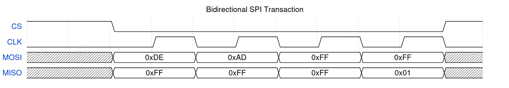
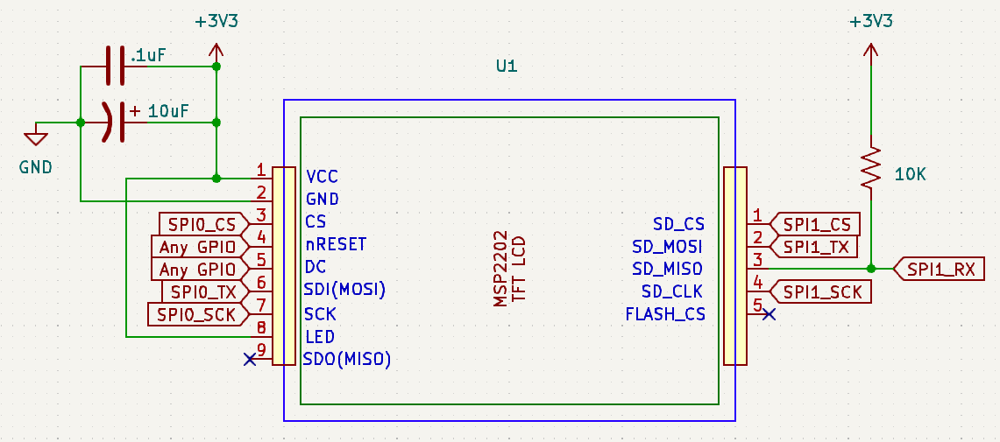

# A Guide To The ILI9341 TFT LCD Display's SD Card Reader

Your lab kit contains a variety of components intended to *supercharge* your project ideas.  We create these guides to examine these components in detail, and give you supporting code to help you get started.  

Unlike the lab experiments, the code for these will be given to you as a ZIP file, within the same folder as this README file.  We'll also give you some supporting knowledge and helper scripts that you may find useful in creating your own content to be used with these devices.

## The ILI9341 TFT LCD Display's SD Card Reader

The TFT LCD in your kit is actually a combination of two devices - the TFT LCD itself, and an SD card reader.  In this document, we'll only focus on the SD card reader.

Unlike the OLED display you used previously, the TFT LCD's SD card reader is what's called a **full-duplex SPI device**, which means it both receives and sends data (for obvious reasons!).  The reader uses the SPI interface, which means that we will now make use of the SPI RX line on our Proton board, alongside SCK, TX and CSn.  With both RX and TX lines, our SPI will be bidirectional.

Recall that an SPI transaction is one where a parallel word on the primary (formerly master) device is exchanged with a parallel word on a secondary (formerly slave) device through the TX (MOSI) and RX (MISO) pins. When we only do writes to a secondary device, like our OLED/LCD/TFT display, the RX pin on the Proton's side is not needed.  

When doing reads, however, the primary device must first tell the secondary device what it expects to read. In doing that, it reads back a word through the SDI pin.  The secondary device cannot respond to a read request before it has received information on what must be read, so this word read from the secondary device is considered junk.



In this example, 0xDE and 0xAD form the "request" we're sending to the secondary device.  In that time, the secondary device sends back junk (0xFF, but it can vary with device, or if a pull-up resistor is used).  After that, there's a "processing cycle" where both the primary device (your Proton) and your secondary device sends junk (0xFF) until it receives the response to that request (0x01).  Once it receives the data it expects, the transaction is complete.  Therefore, every SPI transaction becomes a write followed by a read.

We use 0xFF because it's unique to how the SD card will communicate over SPI.  If the SD card is still processing or is otherwise not ready to issue a response, it will "release" the RX line, which is pulled high by an external pull-up resistor.  This is why you should see 0xFF as junk data in many SPI transactions, and within our code, we'll loop until we *don't* see 0xFF.

An SD card uses this "write command/read junk" and "write junk/read data" protocol to send and receive blocks of data. Historically, these blocks have been 512 ( 2 9 ) bytes in size, and that is what we'll use.

### Protocol 

An SD card has a native interface protocol that is similar to SPI, but not quite the same. It can be forced into "SPI mode" by holding the NSS and MOSI signals high, and completing at least 74 oscillations of the SCK signal at a rate between 100 kHz and 400 kHz. This can be accomplished by using the SPI hardware to send ten repetitions of 0xff for 80 clock oscillations. An SD card does not need to have transactions bounded by asserting and deasserting NSS, and the words sent and received are expected to be much longer than can be supported by the SPI peripheral in the STM32. This is similar to how you set up the MSP2202 TFT LCD display to work. A GPIO pin will be used to assert NSS for the duration of a an entire SD card command or block transfer. Enabling and disabling NSS is helpful when using a protocol analyzer to figure out why the SD card protocol is not working.

After forcing an SD card into SPI mode and sending some initialization commands, it is ready for block transfer. It can also run at a much higher rate. The SD card electrical interface recommends a 10 kΩ pull-up resistor on the MISO pin, but there is not such a pull-up built in to the MSP2202 display assembly. You should add one. The interface will not work without a pull-up resistor. In that regard, the MISO pin of the SD card interface is similar to I2C. An SD card should be able to run with a 24 MHz SPI clock, but certain conditions like long wires may require using a slower communication rate.

### Wiring up the SD card reader

Obtain a set of 10 male-to-female ended wires (also called Dupont wires) that you can use to connect the SD card reader directly to the Proton board headers, saving pin space for the oscilloscope probes if you need them.  (See why we have double-sided headers?)  You can get them from the lab if you ask a TA, or from the ECE shop.

Wire the TFT LCD as shown below. Note that, although the SD card's SPI interface is separate from the SPI interface for the LCD, it is still powered by the VDD and VSS pins for the display. There are five pins on the SD card SPI interface, but pin 5 is for an on-board SPI Flash memory chip (which is not populated). Pin 5 is not used.

If you're not using the TFT display, you can ignore the pins on the right hand side of the display, but make sure to connect VCC and GND.



Be sure to put the capacitors as close as possible to the power and ground pins of the TFT LCD assembly - these are called **decoupling capacitors**.  The 10 uF one ensures that enough current is immediately available when the TFT LCD first powers on, and the 0.1uF smooths out disturbances in the power supply.  Placing it closer to the power supply minimizes their time constant, ensuring they charge up quickly when the display is powered on.

Choose the GPIO pins on the Proton board that you will use for your SD card SPI interface carefully.  The CS, TX, RX and SCK pins should all belong to the same SPI interface.  

### Using the SD Card Reader

Download this [ZIP file](sdcard.zip) and extract it to a folder of your choosing, preferably one that is easy to find.  The ZIP file contains a PlatformIO project with all the files you need.  You'll need to fill out some functions in order to get it working.

Open `main.c` and specify the pins you used for SD_MISO (which is connected to your Proton's RX pin), SD_MOSI (which is connected to your Proton's TX pin), SD_SCK and SD_CS.  Make sure that the SPI pins you use do not conflict with anything else you've connected so far, or GP21/GP26, which have debouncing circuitry for the pushbuttons on your board.  That circuitry would significantly limit your effective speed/baudrate for the SD card reader.

#### 1. `init_spi_sdcard`

In this function, configure SCK, MOSI, MISO as SPI pins, **but configure CS as a regular GPIO pin controlled by SIO**.  The way the SD card works is by expecting CS to be held low for the entire duration of a command or block transfer, which can be longer than a standard 8-bit SPI transaction.  Therefore, we will manually control CS using GPIO control.

Set CS to be high (inactive).

Configure the SPI peripheral you are using (SPI0 or SPI1) to run with a 400 KHz baudrate, 8-bit data size, CPOL = 0 and CPHA = 0.

#### 2. `disable_sdcard`

When we're done sending some data to the SD card, we should put it back into an inactive state.  To do this, set CS high (inactive), and send 0xFF over SPI to give the SD card some clock cycles to finish up what it's doing.

We also need to "temporarily" make the MOSI pin a GPIO pin and force it high.  This is described as "releasing" the MOSI line, and is necessary because some SD card specifications expect MOSI to be high when it's not being used.  If we don't do this, the SD card may misinterpret any noise on the MOSI line as a command, which can put it into an unknown state.

#### 3. `enable_sdcard`

When we want to start sending a command or block transfer to the SD card, we need to set CS low (active).  This tells the SD card that it should pay attention to the SPI traffic.

You should also "take control" of the MOSI line by making it an SPI pin again.  This is the opposite of what we did in `disable_sdcard`.

#### 4. `sdcard_io_high_speed`

Here, change the baudrate of the SPI peripheral you're using to 12 MHz.  You can experiment with this to see how fast your SD card can go, but 12 MHz is a good starting point.  Recall that we started with 400 KHz for initialization.

#### 5. `init_sdcard_io`

In this function, simply call `init_spi_sdcard` and `disable_sdcard` to fully initialize the pins for communicating with the SD card.

#### 6. Copy in UART functions from lab 7 into `uart.c`

This should be from the very last step you did in lab 7, to implement a command shell over UART.  You will use this command shell to interact with the SD card.

We've already given you a `main` function for reasons we'll explain below.

#### Understanding how the code works

The initialization and block read/write subroutines for SD card access are provided for you in the diskio.c and diskio.h files. Reading and writing simple 512-byte blocks would force an embedded system designer to come up with allocation and organization mechanisms for coordinating storage — a daunting task. Instead, these subroutines are meant to work with the FatFs filesystem module. FatFs provides a higher-level file system view of the SD card.  This is generally what you think of when you work with an SD card - or any storage medium.  It also allows you to move the SD card between the STM32 and your computer to share these files. All that is necessary is a program on the RP2350 that uses the FatFs subroutines to read and write the files.

The code we've given you sets up a command shell, like a terminal, in which you can list, create or remove files from an SD card.  **When you design your project, you'll invoke those functions directly**, but you can use the command shell to quickly test your SD card functionality.

> [!NOTE]
> While debugging, you should expect to dive into the `diskio.c` and `ff.c` files to see how they work.  Identify what lines you're getting stuck at, and look them up.  The project is the one assignment you can use AI/LLM tools to help identify what may be going wrong, so please do use it, but make sure to understand what it's telling you, and compare what it generates to human responses on StackOverflow or other forums.

The command shell is implemented in `uart.c`, which you should copy in from the last step of lab 7.  The functions that implement the commands that will interact with the SD card are in `sdcard.c`.  The SD card interface functions are in `diskio.c` and `diskio.h`.  The FatFs module is in the `ff.c` and `ff.h` files.  You do not need to modify any of these files, but you should read through them to understand how they work.

At this point, you should be ready to go, so upload and monitor.  Reset the microcontroller once the terminal appears, and you should see this:

```
Enter current date 20250701120000
```

with the cursor at the end of the line.  This is a way to "pre-populate" the input date/time for the FAT filesystem, so it knows the date/time for creating or editing files.  We achieve this with the `insert_echo_string` function, which we give you in `uart.c`.  You can directly press Enter if you really don't care about the date/time, or you can press Backspace and enter your own date/time.

Once that's in place, you'll see a command shell.  The very first thing to do is type `mount`.  This is where most of the issues occur for people, so if you get stuck here, there are a number of things to do.

1. First and foremost, start debugging.  Run the code and step through the "mount" function until you reach the block of code where it's hanging.  If it's hanging in `disk_initialize` in `diskio.c`, then the issue is with your SPI configuration or wiring, or your SD card might not be formatted correctly.  Check the wiring again, and/or ensure that the SD card is formatted as FAT/FAT32 (depending on what OS you have).  

2. If you're not sure what a certain part of the code is supposed to do, look it up.  Here are some useful articles that helped us out:

- Flowchart of SPI initialization of an SD card that is implemented in `disk_initialize`:


- Insights into how the SD card protocol can differ for some cards: https://electronics.stackexchange.com/questions/77417/what-is-the-correct-command-sequence-for-microsd-card-initialization-in-spi

- Another set of such insights: https://electronics.stackexchange.com/questions/602105/how-can-i-initialize-use-sd-cards-with-spi

- The format SD card specification - pick the Physical Layer Simplified Specification: https://www.sdcard.org/downloads/pls/

- The FatFs module is well-documented, and you can find the documentation [here](https://elm-chan.org/fsw/ff/).  

3. Try multiple Proton boards (your teammates'), SD cards, SD card readers, and computers to format the SD card.  Sometimes, certain SD cards just don't work well with certain readers, and it's not always clear why.  

4. If you have access to a logic analyzer or protocol analyzer such as the one on an AD2, use it to see what the SPI traffic looks like.  You can check one out from the ECE Shop at any time if they have it in stock - make sure to return it when you are done with it ASAP.  You can also use an oscilloscope to verify that the SCK, MOSI, MISO and CS signals are all behaving as expected.  Compare it to the commands that should be sent according to the SD card specification in `diskio.c`.

5. Thoroughly document what you have tried, and what you think is going wrong.  If you need to ask for help, take all this information to a TA.  **Your TA will not be able to help you effectively if you just say "it doesn't work"**.  You must show them what you've tried, and where you think the issue is.

If you see, or once you see, no text appear after you type "mount", your SD card will have been successfully recognized!

You can now try the following commands.  
- Filenames in FAT32 should have a length of up to 8 characters, so try to stick with that where possible.
- FAT32 is case-insensitive, so `ABC.TXT` and `abc.txt` are the same file.

```bash
> ls -l

> input abc.txt
To end input, enter a line with a single '.'
Fred Again.. - Rooftop Live (Arun's Roof, London)
https://www.youtube.com/watch?v=6MAzUT1YhWE
.

> cat abc.txt
Fred Again.. - Rooftop Live (Arun's Roof, London)
https://www.youtube.com/watch?v=6MAzUT1YhWE

> ls -l
2025-Jul-01 12:00:00     50 ----A ABC.TXT
```

We also add a "restart" command for you that will reset the microcontroller, in case you want to start over without having to press the reset button.  Changes to the SD card should be persistent.

Good luck with your project, and we hope you enjoy using the SD card display!  If you have any questions, feel free to ask a TA or your lab coordinator.
