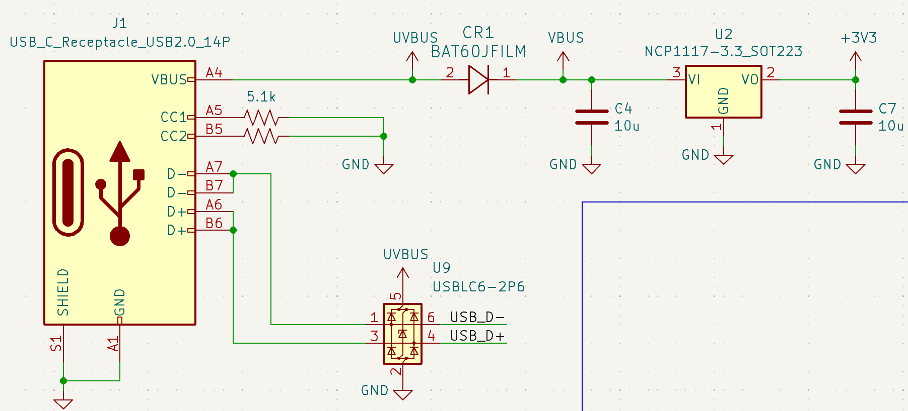
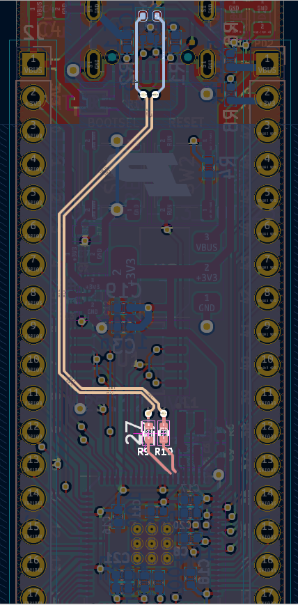
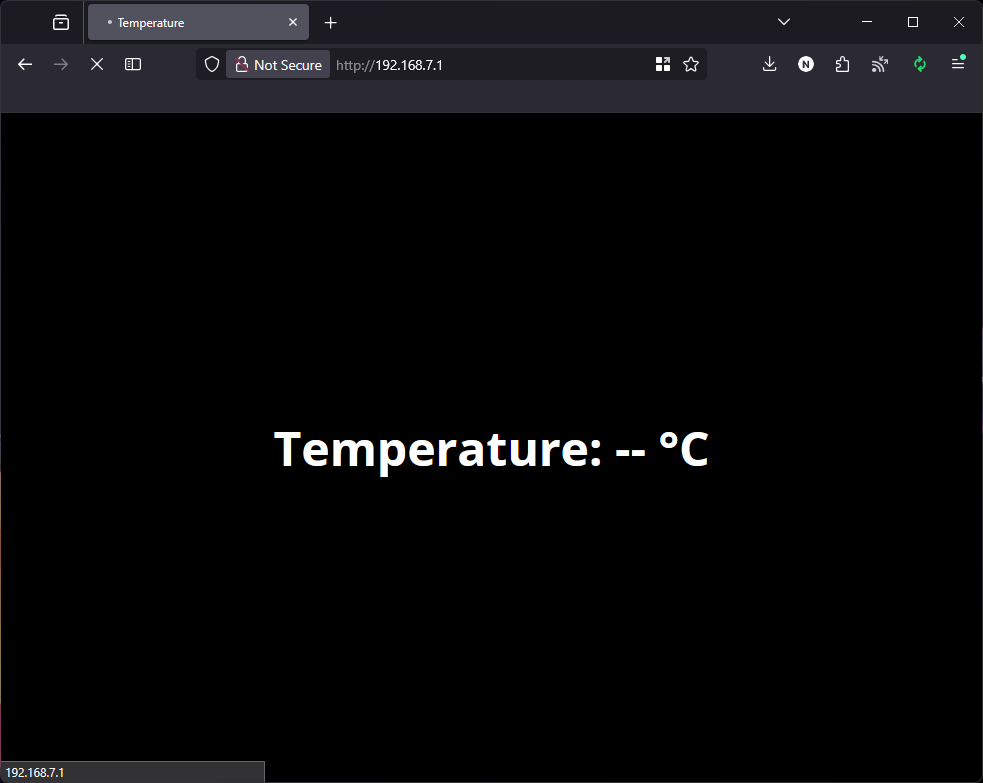

# Universal Serial Bus (USB) and Networking on the RP2350
## Making a USB web server to read a temperature sensor

Your Proton board features a lot of unexplored potential that we'll explore with these "project guides".  In this guide, we'll present an example of a project that creates a web server accessible over USB on your RP2350.  The project uses TinyUSB and LWIP to implement the USB communication layer, the TCP/IP stack, and the HTTP web server with the files it will serve.

There's a *lot* of applications for USB that TinyUSB has examples for, but this one may be of particular interest in implementing a "display" for your Proton board aside from the 7-segment displays, LCDs and OLEDs.  This offers a versatile application that allows you to access the microcontroller's resources and peripherals by simply plugging it into a computer and opening a web browser.  You could go one step further and add wireless connectivity, but that's perhaps a bit too much for this course.  

In the example you'll build in this lab, you'll create a USB tethering application so that your Proton appears as a network interface on your computer, offering a web server at a specific IP address that you can access from your web browser.  That webpage will display the current temperature by merely reading the temperature sensor on the board via a special HTTP request.  This is a great way to learn about USB, networking, and web development in a single project.

## Wiring your Proton board

The great thing about USB is that there's no additional wiring required!  Just plug your Proton board into your computer with a USB cable, and you're ready to go.

The USB port on your Proton board functions entirely separately from the Debug Probe USB port.  For all the labs we've done so far, the purpose of the Proton USB port was merely to provide power to the board and allow you to upload code to it.

Another application of that port that you may have noticed is to be able to use the bootloader mode to upload UF2 files directly to the board without the Debug Probe.  You can access this mode by holding down the BOOTSEL button on the board while plugging it into your computer, or pressing the Reset button if the board is already plugged in.  This will make your computer recognize the board as a USB mass storage device, and you can drag and drop UF2 files to it to upload them.  PlatformIO makes the UF2 files for your projects available in the `.pio/build/proton` directory after running Build, and you can drag and drop them to the board when it is in bootloader mode.  

When a program is running on the board, the USB port will not offer any functionality unless the program implements it.  

## Understanding USB port usage and routing

The USB-C port on your Proton board offers USB 2.0 functionality, since the RP2350 only supports USB 2.0.  This means that the maximum data transfer rate is 12 Mbps (Full Speed rate), which is more than enough for most applications.  

The port offers five important pins that are used for USB communication:
- **VBUS**: This pin provides power to the board when it is plugged into a USB port.  It is 5V (in our case), and can provide up to 500mA of current.
- **D+ and D-**: These are called **differential data lines**, and they are used to transmit data between the board and the computer.  The differential signaling scheme they implement means that they transmit data by sending a voltage difference between the two lines.  This allows for faster data transfer rates and reduces noise in the signal, but it means that you have to carefully route the D+ and D- lines to avoid interference and crosstalk - see your Proton's PCB routing screenshot below.
- **CC1 and CC2**: These pins are unique to USB-C ports, and they are used to detect the orientation of the USB-C connector.  They are typically used to negotiate the power delivery capabilities of the board.  Since our board does not implement power delivery, they are both tied to ground via 5.1kΩ resistors, to tell host devices like our computer that the board is just a USB device and not a power source.  Having individual resistors for each pin allows the board to be plugged in either way, since the CC pins will always be connected to ground regardless of the orientation of the USB-C connector.

On our board, we also have an ESD protection diode on the VBUS line, which protects the board from voltage spikes and surges that can occur when plugging in or unplugging the USB cable.  This is a common practice in USB designs to ensure the safety of the board and its components.

The diagram below shows how the D+/D- lines are routed from the USB-C connector to the USB_DP and USB_DM pins on the RP2350.  The routing is done in a way that minimizes interference and crosstalk by keeping them parallel and close together.

<div style="display: flex; flex-direction: row; justify-content: center; align-items: center;">
  
  
</div>

## (Optional) Understanding the USB stack

We make this section optional because USB is **very** complex.  The [specification](https://www.usb.org/document-library/usb-20-specification) alone is 650 pages!  It also helps immensely to have an entire library dedicated to making USB simply work on any microcontroller - the TinyUSB library.  In this section, we'll instead just give you a list of resources that may help understand terminology and generally how USB works.

A highly simplified outlook on how USB works is described [here](https://darwinsdata.com/how-does-a-usb-work-for-dummies/).  (Contrary to what this page is titled, it is not for dummies, but it is certainly more helpful than some other pages.)

We also recommend [USB Made Simple](https://web.archive.org/web/20240523024501/https://usbmadesimple.co.uk/), which is a great introduction to USB with a bit more detail and how it works.  Your RP2350 datasheet suggests the same thing.

After reading that page, go over how the RP2350 implements USB [in the datasheet](https://datasheets.raspberrypi.com/rp2350/rp2350-datasheet.pdf#section_usb).

## (Optional) Understanding the networking stack

When the USB handshake between the computer and the Proton board is complete, the computer will recognize your Proton board as a network interface.  

This is where the networking stack library - Lightweight IP (LWIP) - comes in.  Once initialized, LWIP will implement a network interface for the computer to use.  

For the computer to obtain an IP address on this network interface so that it can connect to the Proton board via its IP address, LWIP will offer a feature called Dynamic Host Configuration Protocol (DHCP), which tells the host PC that the Proton board "network interface" will allow the host PC to obtain an IP address from it.  DHCP is what assigns IP address to connecting devices on Wi-Fi/Ethernet routers, and so using it here will remove the need to manually configure the IP address of the host PC.  

LWIP will then implement a TCP/IP stack with HTTP support, which is how the host PC will be able to connect to the Proton board's web server.  

## Understanding the application

You have most likely heard of the concept of "USB tethering", or at least the concept of a "hotspot", which is just wireless tethering.  USB tethering is the same concept, but over a USB connection instead of a wireless one.  It allows you to share your computer's internet connection with another device, such as your mobile phone, by plugging it in with a USB cable.

The way that your phone does this is by implementing a special application "Ethernet over USB".  On Windows, this is called "RNDIS" (Remote Network Driver Interface Specification), and on macOS/Linux, it is called "CDC-ECM" (Communications Device Class - Ethernet Control Model). 

When you first plug in any USB device to your computer, it sends what's called a "[class code](https://en.wikipedia.org/wiki/USB#Device_classes)" to the computer, which tells it what kind of device it is.  When we implement our Ethernet-over-USB application, we'll send the class code for CDC.  Your Proton board also uses the same protocol to implement a UART serial port over USB, if you called `stdio_init_usb` instead of `stdio_init_all` in your `main.c` file (the latter of which we configured to initialize the UART instead of USB).  

Once that USB class code is sent, the computer will recognize the device as a USB Ethernet device and will install the necessary drivers to communicate with it.  At this point, TinyUSB and LWIP will take over and implement the USB communication layer, the TCP/IP stack, and the HTTP web server, as we explained above.

## Trying it out

Let's get started.  Since USB and networking can be highly complex topics, we'll provide you with a working project that already implements both features and offers a website available at 192.168.7.1 when you upload the compiled program to your Proton board.  The only thing you need to figure out is the temperature sensor, which is part of the onboard ADC, for the sake of our example.  

There'll be a lot of licenses and attributions at the top of each file, mainly because with such licenses, we are required to re-include them in any re-distribution, but also because credit is due where credit is due - none of this would have been possible without the hard work of the TinyUSB and LWIP communities and their authors in making these libraries free and open-source.

Download [this ZIP file](voltserver.zip) and extract it to a location of your choice.  Build and upload the provided code, and if your Proton board is connected to your computer, you should hear/see some indication that a USB device was connected and that a new network interface has been created.  

Try navigating to http://192.168.7.1/ and you should see a simple black webpage that displays "Temperature: -- °C".  Since configuring and using the ADC is something we expect you to have figured out at this point, we'll have you do it!



We'll give you a overview of the code in your project:

### The `src` directory

The `main.c` file has some code for you to fill out that requires the temperature sensor initialization and reading code, under a section starting with `// TODO...`.  You can fill out these two functions `initialize_adc` and `adc_cgi_handler`, upload again, and you should now see the temperature displayed on the webpage if you wait a few seconds and refresh the page.

The first is rather self-explanatory - just initialize the ADC to select the channel associated with the temperature sensor, and make sure the sensor is enabled, or you may get readings that are very far off, or remain the same throughout even with changes in the temperature.  

The second is similar to an interrupt handler - it gets called when LWIP receives an HTTP request for the `/sample.cgi` URL.  You'll write code to read the temperature from the ADC, scale it to degrees Celsius with the given formula, and convert the result to a string to be stored in the `adc_val_str` global variable.  This variable will get read by a function further down called `ssi_handler`, which will return it as the HTTP response to the `/sample.cgi` request.  You can use the `sprintf` function to convert the temperature reading to a string.

There's also some important files that you shouldn't have to change, but understand how they work:
- `lwip.c`: This file contains the initialization code for LWIP, such as setting up the network interface and starting the DHCP server.  It also fills out some handlers that TinyUSB will call when it receives an HTTP request, such as the `ssi_handler` function that returns the contents of the `/sample.cgi` URL.
- `dhserver.c`: This file contains the code for the DHCP server that assigns IP addresses to the host PC.  You can change the IP address range if you want to use a different range of IP addresses.
- `dnserver.c`: This file contains the code for the DNS server that resolves the hostname of the Proton board to its IP address.  You can change the hostname if you want to use a different one.
- `usb_descriptors.c`: This file contains the USB descriptors that describe the USB device to the host PC.  You can change the product and vendor names if you want to use different ones - it's how we get it to say "Purdue Proton Network Interface" in the Windows Device Manager!
- The `arch` folder: these are a bunch of glue code files that are required for TinyUSB to compile properly.

### The `include` directory
The `include` directory contains the header files for the project, such as `lwipopts.h`, `tusb_config.h`, and `dhserver.h`.  These files contain the configuration options for LWIP and TinyUSB, as well as the function prototypes for the functions defined in the `src` directory.

- `lwipopts.h`: This file contains the configuration options for LWIP, such as the IP address, subnet mask, and gateway.  You can change these if you want to use a different IP address or network configuration.
- `tusb_config.h`: This file contains the configuration options for TinyUSB, such as the USB class code and vendor ID.  You can change these if you want to use a different USB class or vendor ID.

### The `makefsdata` directory
The `makefsdata` directory contains the code for the `makefsdata` tool, which is used to generate the filesystem data for the web server.  This tool takes a directory of files, `fs`, which contains the HTML files we want to serve from our web server.  The Linux executable 'htmlgen', compiled from `makefsdata.c`, will generate a C source file for each HTML file so that it can be included as part of the program and stored in the onboard flash memory.  The generated C source file from this program should go in `lib/lwip/src/apps/httpd/fsdata.c`, which is where LWIP will look for the files to serve.  

**If you make changes to the HTML files in the `fs` directory, you will need to run the `htmlgen` tool again to regenerate the C source file.**   If you're on another operating system like Windows/macOS, make sure to recompile that `makefsdata.c` file to create an `htmlgen` for your specific OS.  Once we have it compiled, we invoke it as follows:

```bash
./htmlgen fs -f:../lib/lwip/src/apps/http/fsdata.c -ssi
```

At the web server level, the SSI (Server Side Includes) feature is needed to allow the web server to dynamically include the contents of the `/sample.cgi` URL in the HTML files.  This is the flow of code when you access the `/sample.cgi` URL:

1. The web server receives the HTTP request for the `/sample.cgi` URL.  This is a way of invoking a CGI (Common Gateway Interface) handler, which is a way of executing code **on the server side** to generate dynamic content.
2. The CGI interface calls `adc_cgi_handler`, which reads the temperature from the ADC and converts it to a string.
3. LWIP then calls the `ssi_handler` function, which returns the contents of the updated `adc_val_str` variable as the HTTP response to the `/sample.cgi` request.

### The `lib` directory

The `lib` directory is where the LWIP and TinyUSB libraries are stored.  There's nothing to change in this directory except the `lib/lwip/src/apps/http/fsdata.c` file generated by the `htmlgen` tool, which we mentioned above.