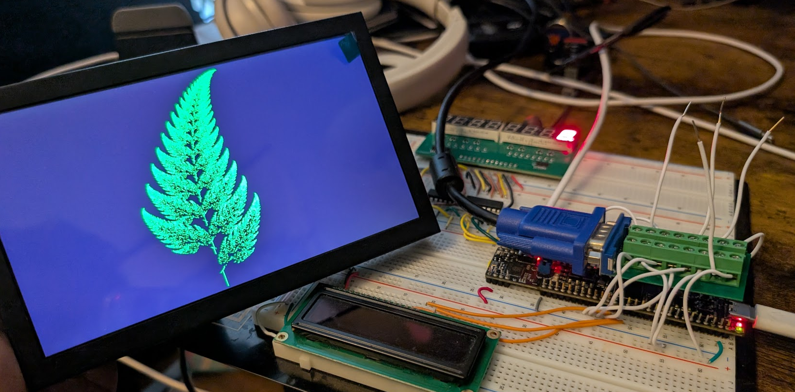

# Video Graphics Array (VGA)

Your Proton board features a lot of unexplored potential that we'll explore with these "project guides".  

This file actually does not have much to offer, except a glowing recommendation for one website: https://vanhunteradams.com/Pico/VGA/VGA.html.

The folks over at Cornell implemented a VGA driver originally for the Raspberry Pi Pico, which debuted in 2021.  Therefore, the code examples and explanations provided on that website will work (with some tweaks) on our Proton board.  With a few tweaks to the GPIO pins and project structure, we were able to run pretty much the same example code given on that site.  



In order to try out this project yourself:

- Obtain a VGA monitor and a breakout board so you can connect it to your Proton board.  The one we're using in this picture is [here](https://www.amazon.com/Portable-1024%C3%97600-Speakers-Multi-Function-Raspberry/dp/B0D53RRHMD) and we're using a VGA breakout adapter to split it into its constituent pins.  Ensure that the LO_GRN, HI_GRN, BLUE_PIN, RED_PIN are consecutively placed with LO_GRN having the lowest GPIO number, as the pins will be used with the PIO which requires a consectutive bit mask to address each of the pins.

- Find the code here: https://github.com/vha3/Hunter-Adams-RP2040-Demos/tree/master/VGA_Graphics

- Pick a project, and copy in all the C and header files into your PlatformIO project, into the `src` and `include` directories.  All code, including a main function, is already provided.

- In the file `vga16_graphics_v2.h`, make sure to update the GPIO pin definitions to match the ones you use on your Proton board.  In our test of the Barnsley Fern, we used:

```c
enum vga_pins {
    HSYNC=16, 
    VSYNC=17, 
    // these 4 must be consecutive pins
    // and LO_GRN must be the lowest pin.
    LO_GRN=29, HI_GRN=30, BLUE_PIN=31, RED_PIN=32 
};
```

- In the `main` function in one of the files (name is unique to the project you choose), remove the line that changes the clock speed to 150 MHz - this is already done on the RP2350, and only needed to be done the previous-generation RP2040.  